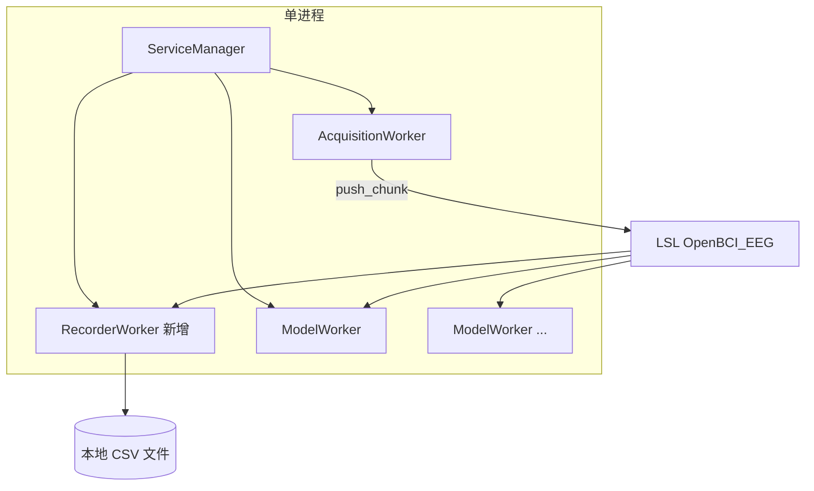

# CSV 本地录制功能 — 扩展方案报告

> **文档版本**：v1.0（方案评审稿，尚未实现）  
> **需求来源**：[项目需求分析与技术概要.md](./项目需求分析与技术概要.md) **FR-31**、选修第 B 课  
> **关联文档**：[项目框架-数据缓存与LSL协议.md](./项目框架-数据缓存与LSL协议.md) §3.3 C_rec、[轻量UI技术方案.md](./轻量UI技术方案.md)  
> **读者**：项目负责人 / 程序员 / 实验室管理员

---

## 1. 背景与目标

### 1.1 现状

当前系统数据流为：

```text
BrainFlow 板卡 → 预处理（µV）→ LSL Outlet（OpenBCI_EEG / OpenBCI_Accel）
                                      ↓
                              ModelWorker / 外部 LabRecorder
```

- **采集**由 `AcquisitionWorker` 完成，数据只推送到 LSL，**进程内不落盘**。
- **模型**通过 LSL Inlet 订阅，与 GUI/LabRecorder 对称。
- 需求文档已预留 **`RecorderWorker`** 与 CLI 命令 `record start [path]`，**代码尚未实现**。
- 轻量 UI 已有「开始/停止采集、保存配置」等控件，**尚无「录制到 CSV」**。

### 1.2 用户诉求

> 希望加入新功能：**可选择将采集的数据直接保存在本地电脑的 CSV 文件**。

解读为：

| 维度 | 期望 |
|------|------|
| **格式** | CSV（易用 Excel / pandas / MNE 二次分析） |
| **位置** | 本机磁盘，路径可配置或可每次选择 |
| **可控** | 操作员能**选择是否录制**（开关），而非每次采集强制写盘 |
| **内容** | 至少包含 **EEG 各通道 + 时间戳**；加速度可选 |
| **与现有功能关系** | 不破坏「单进程独占串口 + LSL 广播」；与模型并行 |

### 1.3 非目标（第一版建议不做）

| 非目标 | 说明 |
|--------|------|
| 替代 LabRecorder / XDF | XDF 仍适合多流同步；CSV 面向轻量本地备份 |
| 实时写 EDF/BDF | 格式复杂，可列为 P2 |
| 云端上传 | 超出 FR-31 |
| 在采集线程内跑深度学习 | 仍走 ModelWorker |

---

## 2. 架构选型

### 2.1 两种实现路径

| 方案 | 做法 | 优点 | 缺点 |
|------|------|------|------|
| **A. LSL Inlet 录制（推荐）** | 独立 `RecorderWorker` 订阅 `OpenBCI_EEG`，`pull_chunk` 后追加写 CSV | 与 ModelWorker **同构**；不碰采集关键路径；录到的与模型/GUI **完全一致**（含滤波后 µV） | 多一次 LSL 拷贝；极端情况下与 Outlet 有微小延迟 |
| **B. 采集线程旁路写盘** | 在 `AcquisitionWorker._run_loop` 内 `push_eeg_chunk` 同时写文件 | 零 LSL 延迟；实现短 | **污染实时路径**；与模型输入需严格约定「录 raw 还是 filtered」；停采集时文件句柄与线程耦合 |

**推荐：方案 A（RecorderWorker + LSL Inlet）**，与需求文档 §5.2、框架文档 **C_rec** 一致。



### 2.2 设计原则

1. **录制是非关键路径**：写盘慢时丢 chunk 或阻塞 Recorder 线程，**不得**阻塞 `AcquisitionWorker`。
2. **与采集生命周期解耦**：允许「采集中单独开/关录制」；也允许「开始采集时自动录制」（配置项）。
3. **配置驱动 + UI/CLI 双入口**：与 `gui推流`、`滤波` 扩展方式一致。
4. **文件即契约**：CSV 列名、单位、采样率在文件头或 companion `.json` 中写清，便于方向想象等后续标注对齐。

---

## 3. 功能规格

### 3.1 操作员可见行为

| 场景 | 行为 |
|------|------|
| 未开始采集 | 可配置默认保存目录；**不可**单独启动录制（无 LSL 流） |
| RUNNING + 未录制 | 点击「开始录制」→ 创建 CSV，追加写入 |
| RUNNING + 录制中 | 状态栏/日志显示路径、已写样本数；点击「停止录制」→ 关闭文件 |
| stop 采集 | **自动 flush 并关闭**正在进行的录制（可配置是否自动停录） |
| 磁盘满 / 无写权限 | Recorder 报错 → EventBus 日志 + UI 提示；**采集与 LSL 继续** |

### 3.2 录制内容范围（分阶段）

| 阶段 | 内容 | 说明 |
|------|------|------|
| **P0（MVP）** | EEG：`lsl_timestamp` + 8 通道 µV | 与 LSL 流一致，**滤波后**数据 |
| **P1** | 可选第二文件或同文件追加列：Accel X/Y/Z | 订阅 `OpenBCI_Accel` 或单 Worker 双 Inlet |
| **P2** | 可选 raw counts 第二套 CSV | 需方案 B 或双 Outlet，一般不必 |

默认 **P0 仅 EEG**；加速度与需求文档 Accel 流一致，列为可选。

### 3.3 CSV 文件格式（建议）

**命名**（自动生成，避免覆盖）：

```text
{保存目录}/{前缀}_{YYYYMMDD_HHMMSS}.csv
```

示例：`data/recordings/eeg_20260526_143052.csv`

**表头**（第一行）：

```csv
lsl_time,Fp1,Fp2,C3,C4,P7,P8,O1,O2
```

- 列名来自 `LslStreamConfig.eeg_labels`（默认与 `lsl_streams.DEFAULT_EEG_LABELS` 一致）。
- `lsl_time`：LSL 时间戳（秒，`local_clock` 轴，与 `push_eeg_chunk` 一致）。
- 数值单位：**µV**，与 ModelWorker 输入一致。
- 编码：**UTF-8**；小数用 `.`；无 BOM 或带 BOM 二选一（实现时固定，建议 **UTF-8 无 BOM** 便于 pandas）。

**可选元数据 sidecar**（P1）：同目录 `{同名}.meta.json`

```json
{
  "sample_rate_hz": 250,
  "channel_count": 8,
  "channel_labels": ["Fp1", "Fp2", "C3", "C4", "P7", "P8", "O1", "O2"],
  "unit": "uV",
  "filtered": true,
  "use_synthetic": false,
  "serial_port": "COM10",
  "started_at_local": "2026-05-26T14:30:52",
  "stopped_at_local": "2026-05-26T14:45:01",
  "samples_written": 125430,
  "quality": {
    "samples_written": 125430,
    "samples_pushed_during_recording": 125500,
    "missing_vs_lsl": 70,
    "drop_rate_pct": 0.056,
    "estimated_gap_samples": 12,
    "duration_sec": 501.7,
    "expected_by_duration": 125425,
    "sample_rate_hz": 250,
    "severity": "ok"
  }
}
```

停录时 `ServiceManager` 对比「录制时段 Outlet 推送量」与 CSV 行数，写入 `quality`；UI / CLI 弹窗或打印 `summary_message()`（`severity`: `ok` → 信息框，`warn`/`bad` → 警告框）。

### 3.4 性能与磁盘估算

| 项目 | 估算 |
|------|------|
| 行大小 | ≈ 8 通道 × 8 字节 + 时间戳 ≈ **80～120 字节/行** |
| 250 Hz | ≈ **25～30 KB/s** ≈ **90～110 MB/小时** |
| 10 分钟（T5 压测） | ≈ **15～18 MB** |
| 写策略 | 每 `pull_chunk` 批量 `writerows`；每 N 秒或每 M 行 **`flush`** |

---

## 4. 配置扩展（`config/default.yaml`）

在现有 `default.yaml` 增加 **`录制`** 段（中文键与项目一致）：

```yaml
# =============================================================================
# 本地 CSV 录制（FR-31）
# =============================================================================
录制:
  启用: false                    # 是否在「开始采集」时自动开始录制
  保存目录: data/recordings      # 相对项目根或绝对路径
  文件前缀: eeg                  # 文件名前缀
  包含加速度: false              # P1：是否另存 accel CSV
  停止采集时自动停录: true       # stop 采集时关闭文件
  flush间隔秒: 2.0               # 周期性 flush，降低断电丢数
```

| 字段 | 默认值 | 说明 |
|------|--------|------|
| `启用` | `false` | `true` = start 采集后自动 `record start` |
| `保存目录` | `data/recordings` | 不存在则尝试创建 |
| `文件前缀` | `eeg` | 见 §3.3 命名 |
| `包含加速度` | `false` | P1 |
| `停止采集时自动停录` | `true` | 防止忘记关文件 |
| `flush间隔秒` | `2.0` | 平衡安全与 IO |

**与「保存配置」**：UI 已有 `save_default_config()`，扩展时需把 `录制.*` 一并写回 yaml（与 `gui推流` 同级）。

---

## 5. 模块与代码改动清单

### 5.1 新增文件（建议）

| 路径 | 职责 |
|------|------|
| `lsl_connect/recorder_worker.py` | `RecorderWorker`：Inlet、`CsvRecordingSession`、start/stop/get_stats |
| `lsl_connect/recording_config.py` | `RecordingConfig` dataclass；路径解析、文件名生成 |
| `scripts/test_recorder_lessonB.py` | 选修 B 课验收：合成板采 30s → 检查 CSV 行数 ≈ 7500 |

### 5.2 修改文件

| 路径 | 改动要点 |
|------|----------|
| `lsl_connect/config_loader.py` | 解析 `录制` 段；`save_default_config` 写回 |
| `lsl_connect/service_manager.py` | `start_recording` / `stop_recording` / `get_recording_status`；`stop_acquisition` 时联动停录 |
| `lsl_connect/cli.py` | `record start [path]`、`record stop`、`status` 增加录制行 |
| `lsl_connect/ui/widgets/acquisition_bar.py` | 「开始录制 / 停止录制」按钮或复选框 + 目录展示 |
| `lsl_connect/ui/controllers/app_controller.py` | `on_start_recording` / `on_stop_recording` |
| `lsl_connect/ui/widgets/status_bar.py` | 可选：录制中显示 🔴 REC |
| `config/default.example.yaml` | 增加 `录制` 模板 |
| `.gitignore` | 忽略 `data/recordings/*.csv`（可选） |

### 5.3 `RecorderWorker` 接口草案

```python
@dataclass
class RecordingConfig:
    output_dir: Path
    file_prefix: str = "eeg"
    include_accel: bool = False
    flush_interval_sec: float = 2.0
    stream_name: str = EEG_STREAM_NAME

class RecorderWorker:
    def start(self, path: Optional[Path] = None) -> None: ...
    def stop(self) -> None: ...
    def is_running(self) -> bool: ...
    def get_stats(self) -> dict:  # path, samples_written, bytes_approx
        ...
```

**`ServiceManager` 封装**：

```python
def start_recording(self, path: Optional[str] = None) -> tuple[bool, str]: ...
def stop_recording(self) -> tuple[bool, str]: ...
def get_recording_status(self) -> dict: ...
```

**状态约束**：

| 操作 | 前置条件 |
|------|----------|
| `start_recording` | `ServiceState.RUNNING` 且 LSL 流存在 |
| `stop_recording` | 当前正在录制 |
| `start` 采集且 `录制.启用=true` | 采集进入 RUNNING 后自动 `start_recording()` |
| `stop` 采集 | 若 `停止采集时自动停录` → 先 `stop_recording()` |

---

## 6. UI 扩展方案

与现有 **AcquisitionBar** 布局对齐，建议 **第一行或第三行** 增加录制区：

```text
[▶ 开始采集] [■ 停止] [重置]  …  [● 开始录制] [■ 停录]  [📁 保存目录…]
```

| 控件 | 行为 |
|------|------|
| **开始录制** | RUNNING 且未录时可用；调用 `start_recording()` |
| **停止录制** | 录制中可用 |
| **保存目录** | IDLE 可改（写入内存 config，点「保存配置」持久化）；或弹窗选文件夹（P1） |
| **自动录制** | 复选框 ↔ `录制.启用`（IDLE 可改） |

**状态栏补充**（`get_status` / poll）：

```text
RUNNING  |  合成板  |  250 Hz · 8 ch · 已推送 125430 · 滤波 ON · GUI推流 OFF · REC → eeg_20260526_143052.csv (45200)
```

**EventBus 日志示例**：

```text
[14:30:52] 录制已开始 → data/recordings/eeg_20260526_143052.csv
[14:45:01] 录制已停止，共 125430 行
```

**无需新板块**：录制是采集侧能力，与 `models.yaml` 无关。

---

## 7. CLI 扩展

与需求文档 §6.2 对齐：

| 命令 | 说明 |
|------|------|
| `record start` | 使用 `default.yaml` 中 `保存目录` + 自动文件名 |
| `record start D:\lab\session01.csv` | 指定完整路径（可选） |
| `record stop` | 关闭当前文件，并打印丢包率等质量摘要 |
| `record status` | 是否录制中、路径、样本数 |
| `status` | 增加一行 `[录制] ON \| path \| samples=...` |

**help** 文本同步更新。

---

## 8. 与 LabRecorder / 方向想象实验的关系

| 工具 | 角色 |
|------|------|
| **本功能 CSV** | 项目内置、零额外安装；适合教学、快速导出、pandas 训练脚本 |
| **LabRecorder** | 多 LSL 流 + Marker 同步 → XDF；适合正式实验归档 |
| **方向想象标注** | CSV 提供连续 EEG；trial 标签仍依赖 Marker 流（FR-30）或外部试次表按 `lsl_time` 对齐切窗 |

建议实验流程：

1. 采集 + 可选 **CSV 连续录制**；
2. 若有 Marker，另开 LabRecorder 录 XDF；或 Phase 2 增加 **events.csv**（P2：Recorder 订阅 Marker 流写一列 `marker`）。

---

## 9. 风险与对策

| 风险 | 对策 |
|------|------|
| 磁盘写慢阻塞 Recorder | 仅 Recorder 线程阻塞；chunk 缓冲上限 + 丢包计数告警 |
| 采集 stop 后文件未关闭 | `停止采集时自动停录` + `finally` 关文件 |
| 路径含中文/空格 | `pathlib`；Windows 测试 |
| 重复 start_recording | ServiceManager 返回「已在录制」 |
| CSV 被 Excel 科学计数法误读 | 文档说明用 pandas；可选引号包裹（一般不必） |
| 滤波开关变更 | 元数据 `filtered` 记录启动时状态；不在同一文件混 raw/filtered |

---

## 10. 实施分期

| 阶段 | 交付 | 预估工作量 |
|------|------|------------|
| **P0** | `RecorderWorker` + EEG CSV + `ServiceManager` + CLI + `default.yaml` | 1～2 天 |
| **P1** | UI 按钮 + 状态栏 + `save_default_config` + 选修 B 验收脚本 | 1 天 |
| **P2** | Accel CSV、`.meta.json`、目录选择对话框、与 Marker 对齐 | 按需 |

**建议实现顺序**：P0 后端 → CLI 验收 → P1 UI → 文档更新（教学计划选修 B 勾选）。

---

## 11. 验收标准

### 11.1 功能验收

- [ ] 合成板 `start` → `record start` → 运行 ≥ 60s → `record stop` → CSV 存在且可读  
- [ ] 行数 ≈ `采样率 × 秒数`（允许 ±2% 网络/调度误差）  
- [ ] 列数 = 1 + 通道数；通道名与 LSL `StreamInfo` 一致  
- [ ] `stop` 采集后文件可立即用 pandas 打开，无「文件被占用」  
- [ ] 录制中 `model start demo` 仍正常；采集 stop 后模型规则不变  
- [ ] UI：RUNNING 下可开/停录制；IDLE 下录制按钮禁用  
- [ ] `save_default_config` 后重启，`录制.保存目录` 等仍生效  

### 11.2 脚本验收（建议）

```powershell
$env:PYTHONPATH="."
.\.venv\Scripts\python.exe scripts\test_recorder_lessonB.py
```

---

## 12. 待你确认的产品选项

实现前建议确认以下选择（可在评审后定稿）：

| # | 问题 | 建议默认 |
|---|------|----------|
| 1 | 录制数据用 **滤波后 µV** 还是 **原始 counts**？ | **滤波后 µV**（与 LSL/模型一致） |
| 2 | 自动录制：`start` 采集即录，还是仅手动点「开始录制」？ | 默认 **手动**；配置可开自动 |
| 3 | 保存目录：固定 yaml 路径 vs 每次弹窗选择 | 默认 **yaml 路径**；P1 加「浏览…」 |
| 4 | 单文件 vs 按 stop 分段多个文件 | **每次 start_recording 一个新文件** |
| 5 | 是否纳入 `git` | `data/recordings/` 加入 `.gitignore` |

---

## 13. 文档与教学计划更新（实现后）

| 文档 | 更新内容 |
|------|----------|
| `docs/项目需求分析与技术概要.md` | FR-31 标为已实现；§6.2 命令说明 |
| `docs/项目框架-数据缓存与LSL协议.md` | C_rec 补充 RecorderWorker 实现说明 |
| `docs/轻量UI技术方案.md` | 采集栏增加录制控件示意图 |
| `docs/教学计划.md` | 选修 B 课验收项与脚本名 |
| `docs/模型接入配置教程.md` | 可选：说明 CSV 与模型训练数据关系 |

---

## 14. 小结

本功能在**不改变「采集 → LSL → 消费者」主架构**的前提下，新增与 `ModelWorker` 同级的 **`RecorderWorker`**，把 LSL 上的 EEG 流**追加写入本地 CSV**。配置写入 `default.yaml` 的 **`录制`** 段，通过 **CLI + 轻量 UI** 控制启停，并与「停止采集」联动关文件。第一版聚焦 **EEG + 时间戳 + 可配置目录**，满足本地备份与后续方向想象离线训练的数据来源需求。

**下一步**：你确认 §12 选项后，可按 P0 → P1 顺序提交代码实现。
