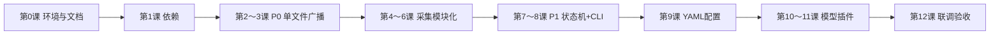

# OpenBCI + LSL 控制面板 — 分阶段教学计划

> **配套文档**：[项目需求分析与技术概要.md](./项目需求分析与技术概要.md)（下称「需求文档」）、[项目框架-数据缓存与LSL协议.md](./项目框架-数据缓存与LSL协议.md)  
> **学习方式**：按课次自行创建/修改文件；**每课代码由助教在对话中提供，不一次性写入仓库**  
> **建议节奏**：每课 2～4 小时；共 **12 课 + 1 课选修**

---

## 0. 如何使用本教学计划

### 0.1 你的角色


| 步骤  | 你做                                      | 助教做                       |
| --- | --------------------------------------- | ------------------------- |
| 1   | 阅读本课「学习目标」「需求对应」                        | —                         |
| 2   | 按「文件清单」在项目中**新建或打开**文件                  | —                         |
| 3   | 在对话中说：**「请给出第 N 课代码」**（或「第 N 课代码 + 讲解」） | 发出**本课完整可复制代码块**（仍由你粘贴保存） |
| 4   | **自己**复制到对应路径，保存                        | 不自动 `Write` 进仓库（除非你明确要求）  |
| 5   | 完成「自检清单」「验收命令」                          | 答疑、帮你对 diff               |
| 6   | 勾选文末**进度表**，进入下一课                       | —                         |


### 0.2 代码获取口令（复制即用）

```text
请根据 docs/教学计划.md 给出【第 N 课】的完整代码，我自行添加到项目。
```

可选追加：

```text
请同时给出本课与需求文档 §X 的对应说明，以及常见报错的排查步骤。
```

### 0.3 完成后项目结构（总览）

全部课结束后，目录应接近需求文档 §7.2：

```text
LSL_connect_model/
├── config/
│   ├── default.yaml          # 第 9 课由 example 复制并填写
│   └── models.yaml           # 第 10 课
├── docs/
│   ├── 项目需求分析与技术概要.md
│   └── 教学计划.md           # 本文件
├── lsl_connect/
│   ├── __init__.py           # 第 4 课起
│   ├── board.py              # 第 4 课
│   ├── preprocessing.py      # 第 5 课
│   ├── lsl_streams.py        # 第 5 课
│   ├── acquisition_worker.py # 第 6 课
│   ├── state.py              # 第 7 课
│   ├── service_manager.py    # 第 7～8 课
│   ├── model_worker.py       # 第 10 课
│   ├── config_loader.py      # 第 9 课
│   └── cli.py                # 第 8 课
├── models/
│   ├── __init__.py           # 第 10 课
│   ├── base.py               # 第 10 课
│   └── demo_stats.py         # 第 10 课
├── eeg_broadcaster.py        # 第 2～3 课（单文件版，保留）
├── eeg_control_panel.py      # 第 8 课入口
└── requirements.txt          # 第 1 课
```

---

## 1. 学习路线总图




| 阶段     | 课次   | 对应需求文档            | 交付能力                       |
| ------ | ---- | ----------------- | -------------------------- |
| 准备     | 0～1  | §1、环境             | 能跑通 import                 |
| **P0** | 2～3  | FR-01～06、§7.6     | 单脚本独占串口 + LSL，GUI 能看波形     |
| 模块化    | 4～6  | §7.2、§7.3         | 代码拆到 `lsl_connect/`，采集线程可测 |
| **P1** | 7～8  | §5.3～5.4、FR-10～14 | 控制面板 `start/stop/status`   |
| **P2** | 9～11 | §13、FR-20～23      | YAML + `model start demo`  |
| 验收     | 12   | §9 测试表            | 全链路 T2～T5                  |


---

## 第 0 课：读文档与硬件确认（无代码）

**学习目标**

- 说清「串口独占 + LSL 广播 + 多消费者」架构（需求文档 §1、§5.1）。
- 在设备管理器中确认 COM 号；关闭会占用串口的 OpenBCI GUI 直连模式。

**阅读章节**

- 需求文档：§1、§2、§5.1、§7.5、§13.1～13.3

**实践**

- 画出一张自己的数据流草图（板子 → 脚本 → LSL → GUI/模型）
- 记录本机 COM 号：**COM10**

**无代码课**，不需向助教要代码。

> **进度**：第 0 课已完成（2026-05-25）。

---

## 第 1 课：项目依赖与目录骨架

**学习目标**

- 建立 `requirements.txt` 与虚拟环境。
- 创建空包目录（可先只有 `__init__.py`）。

**需求对应**：§7.1、附录 B

**你要创建/修改的文件**


| 操作  | 路径                                                             |
| --- | -------------------------------------------------------------- |
| 新建  | `requirements.txt`                                             |
| 新建  | `lsl_connect/__init__.py`（可为空）                                 |
| 新建  | `models/__init__.py`（可为空）                                      |
| 确认  | `config/models.example.yaml`、`config/default.example.yaml` 已存在 |


**向助教索取**：`请给出第 1 课代码`

**验收**

```bash
.venv\Scripts\activate
pip install -r requirements.txt
python -c "import brainflow; import pylsl; import numpy; print('ok')"
```

**自检**

- `pip install` 无报错
- 能打印 `ok`

---

## 第 2 课：修复并补全 `eeg_broadcaster.py`（一）板卡 + LSL

**学习目标**

- 封装 BrainFlow 连接与通道索引。
- 正确创建 LSL `StreamInfo`（修复 `channels` 元数据、`O1/O2` 标签）。

**需求对应**：FR-01、FR-03、§7.6

**你要修改的文件**


| 操作  | 路径                                                                                    |
| --- | ------------------------------------------------------------------------------------- |
| 修改  | `eeg_broadcaster.py`（函数：`get_channel_indices`、`setup_lsl_streams`、`initialize_board`） |


**向助教索取**：`请给出第 2 课代码`（仅板卡 + LSL 部分，`main` 仍简短）

**验收**

- 运行脚本后能打印「LSL 数据流已创建」；**尚未要求**连续推流。

**自检**

- `info_egg` 笔误已改为 `info_eeg`
- `append_child("channels")` 结构正确
- 电极标签为 `O1`、`O2` 而非 `01`、`02`

---

## 第 3 课：补全采集主循环（P0 收官）

**学习目标**

- 完成 `while` 循环：`get_current_board_data` → 缩放 → 可选滤波 → `push_chunk`。
- 实现 Ctrl+C 优雅释放串口。

**需求对应**：FR-02、FR-05、FR-06、P0 路线图

**你要修改的文件**


| 操作  | 路径                                            |
| --- | --------------------------------------------- |
| 修改  | `eeg_broadcaster.py`（补全 `main` 循环与 `finally`） |


**向助教索取**：`请给出第 3 课代码`（完整可运行的 `eeg_broadcaster.py`）

**验收**

```bash
python eeg_broadcaster.py
```

- 终端样本计数持续增加
- OpenBCI GUI：Networking → LSL → 能看到 8 通道波形（需求文档 §7.5）
- `Ctrl+C` 后无「port busy」可再次启动

**自检**：对照需求文档 §9 的 **T2、T3**（单脚本版）

---

## 第 4 课：模块 `board.py` — BrainFlow 封装

**学习目标**

- 把板卡逻辑从单文件抽到 `lsl_connect/board.py`。
- 理解「配置对象」传入串口、板卡 ID。

**需求对应**：§7.2、`board.py`

**你要创建的文件**


| 操作  | 路径                              |
| --- | ------------------------------- |
| 新建  | `lsl_connect/board.py`          |
| 修改  | `lsl_connect/__init__.py`（可选导出） |


**向助教索取**：`请给出第 4 课代码`

**验收**

```bash
python -c "from lsl_connect.board import CytonBoard; b=CytonBoard('COM10'); b.connect(); b.disconnect()"
```

（COM 改成你的；无硬件可问助教要「合成板」测试写法）

**自检**

- 连接/断开成对出现，不泄漏会话

---

## 第 5 课：`preprocessing.py` + `lsl_streams.py`

**学习目标**

- 缩放系数、带通/陷波函数独立。
- LSL Outlet 工厂函数，供采集线程复用。

**需求对应**：FR-02、FR-03、FR-04、§7.4

**你要创建的文件**


| 操作  | 路径                             |
| --- | ------------------------------ |
| 新建  | `lsl_connect/preprocessing.py` |
| 新建  | `lsl_connect/lsl_streams.py`   |


**向助教索取**：`请给出第 5 课代码`

**验收**

- 写 5～10 行临时脚本调用 `create_eeg_outlet()`，运行无异常（可向助教要「第 5 课测通脚本」）。

**自检**

- EEG 与 Accel 流名称与需求文档 §7.4 一致

---

## 第 6 课：`acquisition_worker.py` 采集线程

**学习目标**

- 用 `threading.Thread` 跑采集循环。
- 使用 `stop_event` 结束线程；统计 `samples_pushed`。

**需求对应**：FR-10、§7.3、§5.2

**你要创建的文件**


| 操作  | 路径                                        |
| --- | ----------------------------------------- |
| 新建  | `lsl_connect/acquisition_worker.py`       |
| 新建  | `scripts/test_acquisition.py`（仅用于本课测试，可选） |


**向助教索取**：`请给出第 6 课代码`

**验收**

- 运行测试脚本 10～20 秒，`samples_pushed` 持续增加；`stop` 后线程结束。

**自检**

- 主线程未被 `while` 堵死（测试脚本里主线程可 `sleep`）

---

## 第 7 课：状态机 `state.py` + `service_manager.py`（上）

**学习目标**

- 实现 `ServiceState` 枚举与转移规则（需求文档 §5.4.2）。
- `ServiceManager` 能 `start_acquisition` / `stop_acquisition`。

**需求对应**：§5.3～5.4、§8.2

**你要创建的文件**


| 操作  | 路径                                          |
| --- | ------------------------------------------- |
| 新建  | `lsl_connect/state.py`                      |
| 新建  | `lsl_connect/service_manager.py`（第一版，无 CLI） |


**向助教索取**：`请给出第 7 课代码`

**验收**

- 小脚本：`manager.start_acquisition()` → `get_status()` 为 RUNNING → `stop` → IDLE。

**自检**

- 非法状态下调 `start` 会被拒绝（见 §5.4.3）

---

## 第 8 课：CLI 控制面板 `cli.py` + 入口 `eeg_control_panel.py`（P1 核心）

**学习目标**

- 主线程 REPL：`start` / `stop` / `status` / `quit` / `gui hint`。
- 入口仅负责启动 CLI。

**需求对应**：FR-11～14、§6

**你要创建的文件**


| 操作  | 路径                                       |
| --- | ---------------------------------------- |
| 新建  | `lsl_connect/cli.py`                     |
| 新建  | `eeg_control_panel.py`                   |
| 修改  | `lsl_connect/service_manager.py`（接入 CLI） |


**向助教索取**：`请给出第 8 课代码`

**验收**

```bash
python eeg_control_panel.py
```

```text
> start
> status
> gui hint
> stop
> quit
```

- GUI 在 `start` 后能通过 LSL 看波形
- 对照需求文档 §6.3 的 `status` 示例格式（可略有不同）

**自检**：§9 的 **T2、T3、T6**（控制面板版）

---

## 第 9 课：读取 YAML 配置 `config_loader.py`

**学习目标**

- 理解 YAML（需求文档 §13.4）。
- 从 `config/default.yaml` 读串口、滤波；缺文件时回退到 example 或默认值。

**需求对应**：FR-32、§13.5、`default.example.yaml`

**你要创建/修改的文件**


| 操作  | 路径                                                           |
| --- | ------------------------------------------------------------ |
| 复制  | `config/default.example.yaml` → `config/default.yaml`（改 COM） |
| 新建  | `lsl_connect/config_loader.py`                               |
| 修改  | `service_manager.py`、`cli.py`（`config port` 或启动读配置）          |


**向助教索取**：`请给出第 9 课代码`

**验收**

- 只改 `default.yaml` 的串口，不改 Python，重启后 `status` 显示新 COM。

**自检**

- 能口头解释「键: 值」与缩进规则（§13.4.1）

---

## 第 10 课：模型插件 `models/base.py`、`demo_stats.py`、`model_worker.py`

**学习目标**

- 实现 `ModelPlugin` 与演示模型。
- `ModelWorker` 从 LSL 拉 chunk → `predict`。
- CLI：`model list` / `model start demo` / `model stop demo`。

**需求对应**：FR-20～23、§8.1、§13

**你要创建的文件**


| 操作  | 路径                            |
| --- | ----------------------------- |
| 新建  | `models/base.py`              |
| 新建  | `models/demo_stats.py`        |
| 新建  | `lsl_connect/model_worker.py` |
| 修改  | `service_manager.py`、`cli.py` |


**向助教索取**：`请给出第 10 课代码`

**验收**

```text
> start
> model list
> model start demo
```

- 终端周期性打印均值/方差类输出
- GUI 仍可同时看波形（§9 **T4**）

**自检**

- 未 `start` 时 `model start` 被拒绝并提示

---

## 第 11 课：从 `models.yaml` 加载插件（非程序员路径）

**学习目标**

- `config_loader` 解析 `models.yaml`（需求文档 §13.5）。
- `importlib` 按「模块 + 类名/入口」加载，无需改主程序即可登记新模型名。

**你要创建/修改的文件**


| 操作  | 路径                                                            |
| --- | ------------------------------------------------------------- |
| 复制  | `config/models.example.yaml` → `config/models.yaml`           |
| 修改  | `config_loader.py`、`model_worker.py` 或新建 `models/registry.py` |


**向助教索取**：`请给出第 11 课代码`

**验收**

- 在 `models.yaml` 只改 `demo` 的 `说明` 或 `窗口采样点数`，`model list` 反映变化。
- 向同学演示：操作员只需 `model start demo`（§13.3 速查表）

**自检**

- 能说明「操作员 / 管理员 / 程序员」分工（§13.2）

---

## 第 12 课：联调、排错与验收（整合课）

**学习目标**

- 完成需求文档 §9 全部适用项。
- 整理个人 README（启动顺序、COM、GUI 设置截图说明）。

**你要做的**


| 操作  | 说明                                                         |
| --- | ---------------------------------------------------------- |
| 自测  | T2～T5、T6 checklist                                         |
| 可选  | `filter on/off`、`config port` 在 RUNNING/IDLE 行为与 §5.4.3 一致 |
| 文档  | 在 `docs/` 或根目录写 `我的实验笔记.md`（启动三步、常见错误）                     |


**向助教索取**（按需）

```text
请给出第 12 课【验收检查表】和【常见报错对照表】，不重复前面课的代码。
```

**毕业标准**

- 单进程 `eeg_control_panel`：采集 + GUI + 至少 1 个模型同时运行 10 分钟稳定
- 能向非程序员解释：只需 `start` + `model start 名字`（§13.3）

---

## 选修第 A 课：LSL Marker 流（需求 FR-30）

**向助教索取**：`请给出选修 A 课代码`  
**前置**：第 8 课完成。

---

## 选修第 B 课：CSV 录制线程（需求 FR-31）

**向助教索取**：`请给出选修 B 课代码`  
**前置**：第 10 课完成。

---

## 2. 每课向助教索取时的推荐话术


| 场景      | 话术                                           |
| ------- | -------------------------------------------- |
| 只要代码    | `请根据 docs/教学计划.md 给出第 N 课完整代码，我自行添加。`        |
| 代码 + 讲解 | `请给出第 N 课代码，并说明与需求文档 §X 的对应关系。`              |
| 对不上     | `我按第 N 课粘贴后出现 XXX 报错，我的 COM 是 COM10，请帮我排查。`  |
| 想对照     | `请给出第 N 课完成后【文件名列表】的 diff 要点，不要全文重复第 N-1 课。` |


**说明**：若你希望助教**直接写入项目文件**，需明确说：「请将第 N 课代码写入仓库」；否则默认只发对话代码块，由你粘贴。

---

## 3. 与需求文档章节对照索引


| 课次   | 需求文档章节                    |
| ---- | ------------------------- |
| 0    | §1、§2、§5.1、§13.1          |
| 1～3  | §3.1、§7.4～7.6、§9 T2/T3、P0 |
| 4～6  | §7.2、§7.3、§5.2            |
| 7～8  | §5.3～5.4、§6、§8.2、FR-10～14 |
| 9～11 | §13、§8.1、FR-20～23、FR-32   |
| 12   | §9 全部、§11                 |
| 选修   | §3.4 FR-30、FR-31          |


---

## 4. 学习进度勾选表


| 课次  | 标题                          | 已索取代码 | 已粘贴保存 | 验收通过 | 日期         |
| --- | --------------------------- | ----- | ----- | ---- | ---------- |
| 0   | 环境与文档                       | —     | —     | ☑    | 2026-05-25 |
| 1   | 依赖与骨架                       | ☑     | ☐     | ☐    |            |
| 2   | broadcaster 板卡+LSL          | ☐     | ☐     | ☐    |            |
| 3   | broadcaster 主循环 P0          | ☐     | ☐     | ☐    |            |
| 4   | board.py                    | ☐     | ☐     | ☐    |            |
| 5   | preprocessing + lsl_streams | ☐     | ☐     | ☐    |            |
| 6   | acquisition_worker          | ☐     | ☐     | ☐    |            |
| 7   | state + service_manager     | ☐     | ☐     | ☐    |            |
| 8   | CLI 控制面板 P1                 | ☐     | ☐     | ☐    |            |
| 9   | YAML default                | ☐     | ☐     | ☐    |            |
| 10  | 模型插件 demo                   | ☐     | ☐     | ☐    |            |
| 11  | models.yaml 加载              | ☐     | ☐     | ☐    |            |
| 12  | 联调验收                        | ☐     | ☐     | ☐    |            |
| A   | Marker 选修                   | ☐     | ☐     | ☐    |            |
| B   | 录制选修                        | ☐     | ☐     | ☐    |            |


---

## 5. 常见问题（教学用）

**Q：可以从第 8 课直接开始吗？**  
不建议。第 2～3 课能跑通 LSL，后面模块化才有对照；否则排错难度很大。

**Q：没有 OpenBCI 硬件能学吗？**  
第 1～5 课可以；第 3 课起可向助教要 `SYNTHETIC_BOARD` 或跳过实机验收，但第 12 课毕业标准需实机。

**Q：和旧的 `eeg_broadcaster.py` 关系？**  
第 3 课后保留它作「最小版」；第 8 课后日常使用 `eeg_control_panel.py`。

**Q：一节课代码量太大记不住怎么办？**  
先跑通验收再回看；要求助教「拆成 6a/6b 两小段」即可。

---

## 6. 下一步

**第 0 课已完成。** 请自行创建第 1 课文件（见上文代码），验收通过后勾选进度表「已粘贴保存」「验收通过」。

第 1 课验收通过后，在对话发送：

```text
请根据 docs/教学计划.md 给出【第 2 课】的完整代码，我自行添加到项目。
```

---

*教学计划版本：v1.0 | 与需求文档 v0.3 对齐*