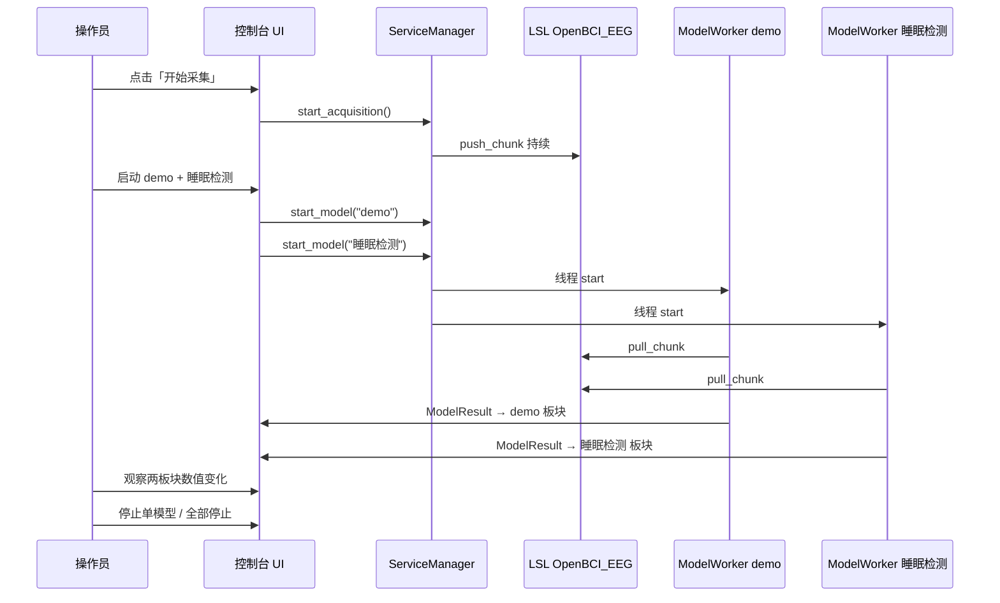

# 轻量 UI 技术框架与实施方案

> **文档版本**：v1.0  
> **状态**：已实现（入口 `eeg_control_ui.py`）  
> **前置**：第 7～12 课已完成（`ServiceManager`、LSL、`models.yaml`）  
> **关联文档**：[模型接入配置教程.md](./模型接入配置教程.md)、[项目框架-数据缓存与LSL协议.md](./项目框架-数据缓存与LSL协议.md)

---

## 1. 文档目的

本文定义 **轻量图形界面（下称「控制台 UI」）** 的技术框架，用于：

1. **替代/并列** 现有命令行 `eeg_control_panel.py`，降低操作门槛；  
2. **同时运行多个模型**，每个模型在**独立板块**展示实时反馈；  
3. **配置驱动**：用户（管理员）只改 YAML，即可接入新模型、完成「脑电 → 模型 → 结果」链路，**无需改 UI 代码**。

---

## 2. 产品目标与非目标

### 2.1 目标

| ID | 目标 | 验收 |
|----|------|------|
| G1 | 一键开始/停止采集与 LSL 广播 | 状态栏 RUNNING，样本计数递增 |
| G2 | 从 `models.yaml` 自动生成模型板块 | 新增 yaml 段 + 重启 → 出现新板块 |
| G3 | **多模型并行** 启停，结果分区显示 | 同时 `demo` + 其它模型，各板块独立刷新 |
| G4 | 系统日志与模型输出分离 | 连接错误、采集统计不淹没模型结果 |
| G5 | 简单配置即可用 | 操作员零代码；管理员只维护 2 个 yaml |
| G6 | 保留 CLI | `eeg_control_panel.py` 仍可调试 |

### 2.2 非目标（第一版不做）

- 不做 OpenBCI GUI 内嵌（仍用 STREAMING / LabRecorder 旁路）  
- 不做复杂图表（频谱、拓扑图）—— 预留扩展点即可  
- 不做远程 Web 多用户（先做本机 tkinter）  
- 不做模型训练 / 标注工具  

---

## 3. 用户与配置路径（「简单配置就能用」）

### 3.1 三类用户

| 角色 | 界面里做什么 | 配置文件 |
|------|--------------|----------|
| **操作员** | 点开始采集 → 勾选/启动模型 → 看各板块结果 | 无 |
| **管理员** | 首次部署复制 yaml、改 COM/合成板 | `default.yaml`、`models.yaml` |
| **程序员** | 新增 `models/*.py` | `models.yaml` 一段 |

### 3.2 最小可用配置（管理员 5 分钟）

```text
1. 复制 config/default.example.yaml  → config/default.yaml
2. 复制 config/models.example.yaml   → config/models.yaml
3. 编辑 default.yaml：
     使用合成板: true    # 无硬件
     # 或 使用合成板: false + 串口: COM10
     gui推流.启用: true  # 若要用 OpenBCI GUI 看波形
4. 编辑 models.yaml：保留 demo，或追加新模型段
5. 双击 / 运行 eeg_control_ui.py
```

### 3.3 数据「传输」在软件内的含义

对用户而言 **不需要手传数据**：

```text
板卡/合成板
    → AcquisitionWorker（采集线程）
    → LSL 流 OpenBCI_EEG（自动广播）
    → 各 ModelWorker（每个模型一个线程，自动 pull_chunk）
    → predict → 结果写入「该模型板块」
```

操作员只需：**开始采集 + 启动模型**；LSL 是进程内/本机自动完成的「传输总线」。

---

## 4. 总体架构

### 4.1 分层图

```text
┌─────────────────────────────────────────────────────────────┐
│  Presentation  控制台 UI（tkinter，主线程）                   │
│  - 状态栏 / 采集控制 / 模型板块网格 / 系统日志                 │
└───────────────────────────┬─────────────────────────────────┘
                            │ 只调用 ServiceManager + 读 EventBus
┌───────────────────────────▼─────────────────────────────────┐
│  Application   ServiceManager（已有，小幅扩展）               │
│  - 采集状态机 / 模型 worker 字典 / start_model / stop_model    │
└───────────────┬─────────────────────────┬───────────────────┘
                │                         │
┌───────────────▼────────────┐  ┌─────────▼──────────────────┐
│  Domain                     │  │  Infrastructure            │
│  ModelPlugin / registry     │  │  BrainFlow / pylsl / yaml  │
│  AcquisitionWorker          │  │  config_loader             │
│  ModelWorker（扩展回调）     │  │  LogBus / ModelResultStore │
└─────────────────────────────┘  └────────────────────────────┘
```

### 4.2 与现有 CLI 的关系

```text
eeg_control_ui.py  ──┐
                     ├──► ServiceManager(config)  ◄── build_service_manager_config()
eeg_control_panel.py ┘
```

**业务逻辑零复制**：UI 是新的 Presentation 层，不重写采集/LSL/模型。

### 4.3 双出口（可视化 vs 模型）

| 消费者 | 协议 | 配置 | UI 是否管理 |
|--------|------|------|:-----------:|
| OpenBCI GUI 7 | BrainFlow UDP STREAMING | `default.yaml` → `gui推流` | 只读展示 + 帮助按钮 |
| 内置模型 | LSL `OpenBCI_EEG` | `models.yaml` | 板块启停 + 结果显示 |
| LabRecorder（可选） | LSL | 外部软件 | 帮助文字 |

---

## 5. 核心设计：多模型分区展示

### 5.1 界面线框（推荐布局）

```text
┌─ OpenBCI 实验控制台 ─────────────────────────────────────────────┐
│ ● RUNNING │ 合成板 │ 250Hz │ 8ch │ 已推送 12,345 │ 滤波 ON      │
│ [开始采集] [停止采集] [重置]  串口:[COM10▼] 滤波:[ON/OFF] [帮助] │
├─────────────────────────────────────────────────────────────────┤
│  模型监测区（根据 models.yaml 动态生成，2 列网格或可滚动）        │
│ ┌─ demo ──────────────┐  ┌─ 睡眠检测 ────────────┐              │
│ │ ● 运行中  [停止]     │  │ ○ 已停止   [启动]     │              │
│ │ 窗口 250  步长 125   │  │ 窗口 250  步长 125    │              │
│ │ mean: 0.73 uV        │  │ label: N2  score:0.91 │  ← 最新一行  │
│ │ std:  0.92 uV        │  │ 更新: 12:45:03        │              │
│ │ 更新: 12:45:03       │  │ [展开历史 ▼]          │              │
│ └─────────────────────┘  └───────────────────────┘              │
│ [全部启动] [全部停止]                                              │
├─────────────────────────────────────────────────────────────────┤
│  系统日志                                                        │
│  [12:44:01] 采集已启动 RUNNING                                   │
│  [12:44:02] GUI STREAMING 推流 225.1.1.1:6677                   │
└─────────────────────────────────────────────────────────────────┘
```

### 5.2 「一模型一板块」规则

| 规则 | 说明 |
|------|------|
| 板块 ID | = `models.yaml` 顶层键名（如 `demo`） |
| 板块标题 | 键名 + `说明` 字段 |
| 板块控件 | 启动 / 停止、运行指示灯、窗口/步长只读 |
| 结果区 | 只显示**该模型**最新一条结构化结果 + 可选最近 N 条 |
| 动态数量 | yaml 有 N 个模型 → UI 生成 N 个板块，**不写死 demo** |

### 5.3 板块内结果如何渲染（配置驱动，不改 UI）

定义统一 **模型结果包** `ModelResult`（内存结构，非 yaml）：

```python
@dataclass
class ModelResult:
    model_name: str
    timestamp: float          # local time
    raw: Any                  # predict 原始返回值
    summary: str              # 一行摘要，给大字显示
    fields: dict[str, str]    # 键值对，给板块明细区
```

**渲染管道（ResultRenderer）** — 按 `predict` 返回类型自动格式化：

| predict 返回 | summary 示例 | fields 示例 |
|--------------|--------------|-------------|
| `dict` 含 `mean_uv`,`std_uv` | `mean=0.73 uV` | `std_uv → 0.92 uV` |
| `dict` 含 `label`,`score` | `N2 (0.91)` | `label, score, ...` |
| 其它 `dict` | 第一个 key 或 `OK` | 全部 key 转字符串 |
| `str` / 标量 | 直接显示 | `{}` |

可选：在 `models.yaml` 增加**可选**字段 `显示模板`（P2），如 `"{label} {score:.2f}"`；第一版用内置规则即可。

---

## 6. 事件与线程模型

### 6.1 线程一览

| 线程 | 职责 | 禁止 |
|------|------|------|
| **UI 主线程** | 按钮、定时刷新、读队列 | pull LSL、predict、阻塞 IO |
| **AcquisitionWorker** | 板卡 → 预处理 → LSL | 模型推理 |
| **ModelWorker × N** | LSL → 窗口 → predict → 推送结果 | 直接操作 tkinter |

### 6.2 EventBus（建议新增模块）

```text
lsl_connect/ui/event_bus.py

  LogBus          → 系统日志（INFO/WARN/ERROR）
  ModelResultStore → model_name → deque[ModelResult]（每模型保留最近 50 条）
```

生产者：

- `ServiceManager` / `AcquisitionWorker` → `LogBus.info(...)`  
- `ModelWorker` → `ModelResultStore.push(name, result)`（**不再 print**）

消费者：

- UI 每 **200ms** `after()` 轮询队列，批量更新板块（防刷屏卡 UI）

### 6.3 停止模型（解决 CLI 痛点）

| 措施 | 说明 |
|------|------|
| UI 停止按钮 | 主线程调 `stop_model(name)`，不依赖终端输入 |
| `pull_chunk timeout` | 0.2～0.5s，便于快速响应 stop |
| 内层循环 | 每处理若干 sample 检查 `_stop_event` |
| `stop()` | 可选 `inlet.close_stream()` |

---

## 7. ServiceManager 扩展点（小幅）

现有 API **已够用**；建议仅增加：

| 方法 | 用途 |
|------|------|
| `start_models(names: list[str])` | 「全部启动」批量 |
| `stop_all_models()` | 已有，UI 绑定按钮 |
| `get_model_results(name) -> list` | 从 ModelResultStore 读（或 UI 直读 Store） |
| `reload_models_config()` | P2：热加载 yaml（第一版仍重启） |

**ModelWorker 构造** 增加可选参数：

```python
on_result: Callable[[str, Any], None] | None = None
```

回调内写入 `ModelResultStore`，替代 `_print_result`。

---

## 8. 模块与文件结构

```text
LSL_connect_model/
├── eeg_control_ui.py              # 新入口：python eeg_control_ui.py
├── eeg_control_panel.py           # 保留 CLI
├── config/
│   ├── default.yaml
│   └── models.yaml
├── lsl_connect/
│   ├── service_manager.py         # 小改：可选批量启停
│   ├── model_worker.py            # 改：回调 + 快速 stop
│   └── ui/
│       ├── __init__.py
│       ├── app.py                 # 主窗口、菜单、关闭时 shutdown
│       ├── event_bus.py           # LogBus + ModelResultStore
│       ├── result_renderer.py     # predict → ModelResult
│       ├── widgets/
│       │   ├── status_bar.py      # 顶栏状态
│       │   ├── acquisition_bar.py # 采集/串口/滤波
│       │   ├── model_panel.py     # 单模型卡片（可复用）
│       │   ├── model_grid.py      # 动态布局 N 个 model_panel
│       │   └── log_panel.py       # 系统日志 Text
│       └── controllers/
│           └── app_controller.py  # 连接 ServiceManager 与 widgets
└── docs/
    ├── 模型接入配置教程.md
    └── 轻量UI技术方案.md          # 本文
```

---

## 9. 控制器职责（AppController）

避免在 `app.py` 里堆逻辑，单独 `AppController`：

```python
class AppController:
    def __init__(self, mgr: ServiceManager, bus: EventBus): ...

    def on_start_acquisition(self) -> None: ...
    def on_stop_acquisition(self) -> None: ...
    def on_start_model(self, name: str) -> None: ...
    def on_stop_model(self, name: str) -> None: ...
    def on_start_all_models(self) -> None: ...
    def on_stop_all_models(self) -> None: ...
    def poll(self) -> Snapshot: ...   # UI 定时器调用，返回状态快照
```

`Snapshot` 含：服务状态、`samples_pushed`、各模型运行态、各模型最新 `ModelResult`、待显示日志行。

**按钮 enable/disable** 由 `ServiceState` 驱动（与 CLI 规则一致）：

| 状态 | 开始采集 | 停止采集 | 启模型 | 改串口 | 改滤波 |
|------|:--------:|:--------:|:------:|:------:|:------:|
| IDLE | ✓ | | | ✓ | |
| RUNNING | | ✓ | ✓ | | ✓ |
| ERROR | | ✓ | | | reset |

---

## 10. 配置 → UI 映射表

| 配置项 | 文件 | UI 表现 |
|--------|------|---------|
| 串口 / 合成板 | `default.yaml` | 状态栏「合成板」或 COM10 |
| 采样率 / 通道 | `default.yaml` | 状态栏 250Hz 8ch |
| 滤波开关 | `default.yaml` 初值 + 运行时 toggle | 状态栏 + 开关 |
| GUI 推流 | `default.yaml` `gui推流` | 系统日志提示 + 帮助弹窗 |
| 模型列表 | `models.yaml` | 模型板块数量与标题 |
| 窗口 / 步长 | `models.yaml` | 各板块副标题 |
| 权重 | `models.yaml` | 不在 UI 显示（仅 load 时用） |

**新增模型零 UI 改动**：重启后 `ModelGrid.build_from_specs(get_model_specs())` 重建板块。

---

## 11. 典型用户流程

### 11.1 操作员：多模型对比测试



### 11.2 管理员：接入第三个模型

1. 程序员提交 `models/new_algo.py`  
2. 管理员在 `models.yaml` 追加 `新算法:` 段  
3. 重启 UI → 第三块面板出现  
4. 操作员采集 RUNNING 后点「启动」  

---

## 12. 技术选型

| 项 | 选择 | 理由 |
|----|------|------|
| UI 框架 | **tkinter** + `ttk` | 零额外依赖、Windows 自带、够轻 |
| 布局 | `ttk.Frame` 网格 + `Canvas` 滚动 | 模型多时可滚动 |
| 配置 | 现有 PyYAML + `config_loader` | 不引入新格式 |
| 并发 | `threading` + 队列 | 与现架构一致 |
| 打包（可选） | PyInstaller 单文件 exe | 给非程序员分发 |

备选（二期）：本地 Flask + 浏览器，适合远程看结果；第一版不建议。

---

## 13. 实施阶段

| 阶段 | 交付 | 工期估计 |
|------|------|----------|
| **P0** | `event_bus` + `ModelWorker` 回调 + 快速 stop | 1～2 天 |
| **P1** | 主窗口 + 状态栏 + 采集启停 + 单模型板块 | 2～3 天 |
| **P2** | 多模型网格 + 全部启停 + 系统日志区 | 2 天 |
| **P3** | 串口/滤波/帮助/GUI 说明 | 1 天 |
| **P4** | 板块历史折叠、简单导出 CSV 结果 log | 可选 |

**MVP 定义（可演示）**：P0 + P1 + P2。

---

## 14. 模型结果板块 UI 规范

### 14.1 ModelPanel 组件接口

```python
class ModelPanel(ttk.LabelFrame):
    def __init__(self, parent, spec: ModelSpec, controller: AppController): ...

    def set_running(self, running: bool) -> None: ...
    def update_result(self, result: ModelResult | None) -> None: ...
    def append_history(self, result: ModelResult) -> None: ...  # P4
```

### 14.2 视觉状态

| 状态 | 边框/指示灯 |
|------|-------------|
| 未运行 | 灰灯，仅「启动」可点 |
| 运行中 | 绿灯，「停止」可点，结果区每 200ms 刷新 |
| 启动失败 | 红字显示 `last_error`（来自 start_model 返回值） |
| 采集未 RUNNING | 启动按钮禁用 +  tooltip「请先开始采集」 |

### 14.3 多模型同时运行的性能

- 每个模型独立线程，共享一条 LSL 流（与 FR-22 一致）  
- 板块刷新：**合并 tick**，一次 `poll()` 更新所有面板，避免 N 个独立定时器  
- 重模型（Torch）：建议 yaml 加大 `步长采样点数` 降低 predict 频率  

---

## 15. 对外「简单配置」检查清单

给管理员的一页纸：

```text
□ Python 3.10+ 与 .venv 已安装依赖（brainflow numpy pylsl pyyaml）
□ config/default.yaml 存在且 COM / 合成板 正确
□ config/models.yaml 存在且至少有一个可运行模型（如 demo）
□ 程序员已为 yaml 中每个模型提供 models/*.py
□ 运行 eeg_control_ui.py
□ 点「开始采集」→ 状态 RUNNING
□ 各模型板块点「启动」→ 结果区有数
□ （可选）OpenBCI GUI STREAMING 225.1.1.1:6677
```

---

## 16. 风险与对策

| 风险 | 对策 |
|------|------|
| 模型 print 刷屏导致 UI 卡 | 禁止 print，统一 EventBus |
| stop 无响应 | 短 timeout + stop 按钮 + P0 修复 |
| yaml 改后不生效 | UI 标题栏提示「改配置请重启」；P2 加热加载 |
| 某模型 predict 抛异常 | worker 捕获 → LogBus.error + 板块显示错误，不影响其它模型 |
| LSL 未启动就启模型 | `start_model` 返回失败，板块显示原因 |
| 8 个模型同时跑 CPU 高 | 文档建议实验时启 1～3 个；yaml 调大步长 |

---

## 17. 与需求文档的对应

| 需求 | 本方案 |
|------|--------|
| FR-10～14 CLI 控制 | UI 等价实现 + 保留 CLI |
| FR-20～23 模型 worker | 多 worker + 分区展示 |
| §13 非程序员 yaml 登记 | `models.yaml` 驱动板块 |
| §9 T4/T5 多模型 + GUI | 全部启动 + 外部 GUI 旁路 |
| NFR 实时性 | 采集线程不跑 predict |

---

## 18. 下一步行动

1. 阅读 [模型接入配置教程.md](./模型接入配置教程.md)，确认 yaml 流程  
2. 实现 **P0**：`event_bus.py` + 改 `model_worker.py` 回调  
3. 实现 **P1/P2**：`eeg_control_ui.py` + `model_grid.py`  
4. 用 `demo` + 第二个占位模型做双板块联调  
5. 更新 `教学计划.md` 增加「选修 C：轻量 UI」课次（可选）  

---

## 附录 A：`models.yaml` 可选扩展（P2）

```yaml
demo:
  说明: 演示统计
  窗口采样点数: 250
  步长采样点数: 125
  模块: models.demo_stats
  类名: DemoStatsModel
  # 可选：UI 显示偏好
  ui:
    摘要字段: mean_uv          # ResultRenderer 优先用这个 key 做 summary
    显示单位: uV
    历史条数: 20
```

第一版可忽略 `ui:` 段，用默认渲染规则即可。

---

## 附录 B：入口代码骨架（示意）

```python
# eeg_control_ui.py
from lsl_connect.config_loader import build_service_manager_config
from lsl_connect.service_manager import ServiceManager
from lsl_connect.ui.app import ControlUIApp

def main():
    cfg, msg = build_service_manager_config()
    mgr = ServiceManager(cfg)
    app = ControlUIApp(mgr, config_message=msg)
    app.run()  # tkinter mainloop；关闭时 mgr.shutdown()

if __name__ == "__main__":
    main()
```

---

**维护者**：项目作者  
**变更记录**：v1.0 初稿
