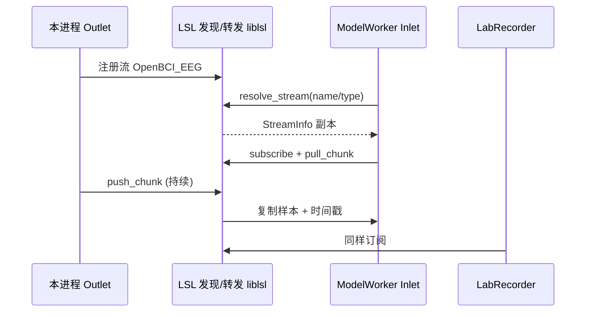
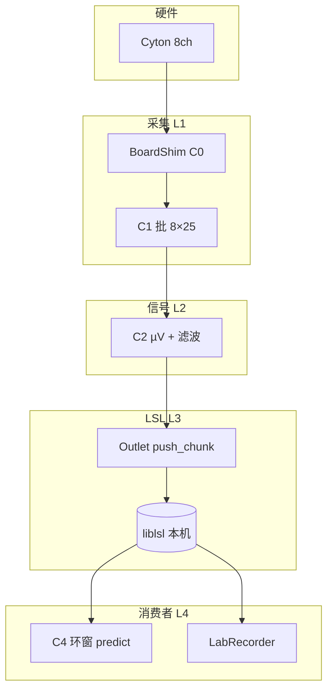

# 项目框架文档：数据缓存设计与 LSL 网络协议

> **文档版本**：v1.0  
> **关联文档**：[项目需求分析与技术概要.md](./项目需求分析与技术概要.md)、[教学计划.md](./教学计划.md)  
> **适用范围**：OpenBCI Cyton 8ch @ 250Hz，Windows，单进程 `eeg_control_panel` / `eeg_broadcaster`

---

## 1. 文档目的与阅读对象

本文档描述本项目的**逻辑框架**，重点说明：

1. **数据在何处缓存、以什么形状流动、谁生产谁消费**；
2. **LSL（Lab Streaming Layer）在本项目中的角色、报文语义与发现机制**；
3. 与 **BrainFlow 板卡缓冲**、**OpenBCI GUI 7「STREAMING」** 的边界区分。

实现细节（类名、代码）以需求文档 §7.2 模块划分为准；本文偏**架构与数据契约**。

---

## 2. 系统框架总览

### 2.1 分层模型

```text
┌─────────────────────────────────────────────────────────────────┐
│  L4 消费者层（独立进程，可多开）                                    │
│  ModelWorker / LabRecorder / pylsl 示例 / 未来 GUI 旁路          │
└───────────────────────────────┬─────────────────────────────────┘
                                │ LSL Inlet（订阅）
┌───────────────────────────────▼─────────────────────────────────┐
│  L3 分发层 — LSL Outlet（本进程）                                 │
│  StreamInfo 元数据 + push_chunk / push_sample                    │
└───────────────────────────────┬─────────────────────────────────┘
                                │ 内存数组（已预处理 µV）
┌───────────────────────────────▼─────────────────────────────────┐
│  L2 信号层 — 缩放、带通、陷波（可选）                              │
│  批缓冲 BUFFER_SIZE × 8ch                                        │
└───────────────────────────────┬─────────────────────────────────┘
                                │ BrainFlow 二维数组 (rows=通道, cols=样本)
┌───────────────────────────────▼─────────────────────────────────┐
│  L1 采集层 — BoardShim 串口独占 COM10                             │
│  BrainFlow 内部环形缓冲 + get_current_board_data                 │
└───────────────────────────────┬─────────────────────────────────┘
                                │ USB Dongle
┌───────────────────────────────▼─────────────────────────────────┐
│  L0 硬件 — OpenBCI Cyton                                         │
└─────────────────────────────────────────────────────────────────┘
```

### 2.2 进程与线程（目标态）

| 组件 | 线程 | 是否持有串口 | 是否持有 LSL Outlet |
|------|------|:------------:|:-------------------:|
| CLI 主线程 | Main | 否 | 否 |
| ServiceManager | Main | 否 | 否 |
| AcquisitionWorker | 后台 | 是（经 BoardShim） | 是（创建并 push） |
| ModelWorker × N | 后台 | 否 | 否（仅 Inlet） |
| RecorderWorker（可选） | 后台 | 否 | 否（仅 Inlet） |

**原则**：实时关键路径（L1→L3）在 **AcquisitionWorker 单线程**内完成，避免与模型推理争用 GIL；模型只从 LSL 拉数据（需求文档 §5.2、§7.3）。

### 2.3 与 GUI 7 的两种「外部可视化」路径（勿混）

| 路径 | 协议 | GUI 配置 | Python 侧额外工作 |
|------|------|----------|-------------------|
| **本项目主路径** | **LSL** | 不依赖 GUI 收 LSL；可用 `ReceiveAndPlot` / LabRecorder | `StreamOutlet` → `OpenBCI_EEG` |
| **GUI STREAMING 旁路** | **BrainFlow UDP 组播** | `STREAMING (from external)`，IP `225.1.1.1`，PORT `6677` | `board.add_streamer("streaming_board://225.1.1.1:6677", ...)` |

LSL 与 BrainFlow Streaming **并行不互斥**，但缓存与协议栈**完全独立**；下文 **§4** 专讲 LSL，**§5** 简述 BrainFlow 旁路缓冲。

---

## 3. 数据缓存设计（核心）

### 3.1 设计目标

| 目标 | 手段 |
|------|------|
| 稳定 250 Hz 有效输出 | 批读取 + `push_chunk`；采集循环自适应 sleep |
| 低延迟到 LSL | 默认不增加「采集→推送」无界队列；单线程直连 |
| 模型窗口 1s（可调） | ModelWorker 内**滑动窗口环形缓冲**，与采集解耦 |
| 线程安全 | `stop_event`、`config_lock`、`stats` 锁；缓冲区分「单生产者/单消费者」 |
| 可观测 | `stats`：已推送样本数、批次数、上次错误 |

### 3.2 五级缓存结构


#### 缓存 C0：BrainFlow 板卡缓冲（L1）

| 属性 | 说明 |
|------|------|
| **所有者** | `BoardShim`（C++ 内部） |
| **写入** | `start_stream()` 后固件→串口→BrainFlow 持续写入 |
| **读取 API** | `get_current_board_data(num_samples)` |
| **形状** | `(num_rows, num_samples)`，`num_rows` 为板卡全部行（含 EEG、Accel、Timestamp 等） |
| **容量** | 由 `start_stream(buffer_size)` 决定；实现时建议 `max(BUFFER_SIZE×4, 45000)` 量级 |
| **本项目用法** | 每次拉取 `BUFFER_SIZE`（默认 **25**，约 100ms @ 250Hz） |

**注意**：C0 存的是**原始计数**（及时间戳等），不是 µV。

#### 缓存 C1：采集批缓冲（L2 输入）

| 属性 | 说明 |
|------|------|
| **形态** | `numpy.ndarray`，`float32` 或 `float64` |
| **切片** | `eeg_rows = BoardShim.get_eeg_channels(board_id)` → `data[eeg_rows, :]` |
| **生命周期** | 每轮循环新建或复用预分配 `(8, BUFFER_SIZE)` |
| **大小建议** | `BUFFER_SIZE = 25`（可调）；过大增加滤波延迟，过小增加 LSL 调用次数 |

#### 缓存 C2：预处理工作区（L2 原地）

| 属性 | 说明 |
|------|------|
| **操作** | `eeg_batch *= SCALE_EEG`；逐通道 `DataFilter` 带通/陷波 |
| **是否另开缓冲** | 默认**原地**修改 C1 切片，省内存；需要 A/B 对比时可 `copy()` |
| **开关** | `config/default.yaml` → `滤波.启用`；CLI `filter on/off` |

#### 缓存 C3：LSL 推送（L3）

| 属性 | 说明 |
|------|------|
| **接口** | `StreamOutlet.push_chunk(samples, timestamps)` 优先 |
| **samples 布局** | `[n_channels][n_samples]` 或 C 连续二维 `(8, n)`，与 pylsl 版本一致 |
| **时间戳** | 每样本一个 `float64`，推荐 `pylsl.local_clock()` 或板卡时间戳列换算（二期） |
| **库内缓冲** | liblsl 维护出站队列；消费者慢时 Outlet 可丢弃或积压（见 §4.4） |

**不推荐**在 C2 与 C3 之间再加无界 `queue.Queue`，除非要做背压测试；默认 **C1→C2→C3 同线程**（需求文档 §7.3）。

#### 缓存 C4：模型滑动窗口（L4 消费者内）

| 属性 | 说明 |
|------|------|
| **所有者** | `ModelWorker` |
| **数据来源** | `StreamInlet.pull_chunk()` / `pull_sample()` |
| **结构** | 环形缓冲或 `deque` + 长度 `window_size`（默认 250） |
| **步长** | `hop_size`（默认 125，50% 重叠） |
| **输出形状** | `predict(data)`，`data.shape == (8, window_size)`，单位 µV |
| **与 C0–C3 关系** | **完全独立**；只通过 LSL 复制流，不共享内存 |

```text
时间轴 →  …  s[n-249] … s[n]  …
              └──── window ────┘
                    hop →
```

### 3.3 可选扩展缓存（P2+）

| 名称 | 用途 | 结构 |
|------|------|------|
| **Q_pub** | 采集与推送拆线程 | `queue.Queue(maxsize=8)`，元素为 `(8, BUFFER_SIZE)` + 时间戳 |
| **C_rec** | CSV 录制 | Inlet 拉 chunk 追加写盘，或从 Q_pub 旁路 |
| **C_marker** | 事件标记 | 独立 `Marker` Outlet，无环缓冲，事件触发 `push_sample` |

### 3.4 缓存参数缺省表（与配置对齐）

| 参数 | 默认值 | 配置键 | 说明 |
|------|--------|--------|------|
| `SAMPLE_RATE` | 250 | `default.yaml` 采样率 | Cyton 标称率 |
| `CHANNELS_COUNT` | 8 | 通道数 | EEG |
| `BUFFER_SIZE` | 25 | 代码常量 / 后续 yaml | 每轮 BrainFlow 拉取样本数 |
| `window_size` | 250 | `models.yaml` | 模型 1 秒窗 |
| `hop_size` | 125 | `models.yaml` | 滑动步长 |
| `SCALE_EEG` | 见需求文档 | 固定公式 | ADC → µV |

### 3.5 延迟粗算（便于验收）

| 阶段 | 量级 |
|------|------|
| C0 批等待 | ≤ `BUFFER_SIZE / 250` ≈ **0.1s**（最坏整批新数据） |
| 滤波 8ch×25点 | 数 ms～数十 ms（视 CPU） |
| LSL 本机 | 通常 **&lt; 20ms** |
| 模型窗 | 额外 **≤ window_size/250**（凑满窗才 `predict`） |

需求 NFR：端到 LSL **&lt; 50ms（典型）** — 靠小 `BUFFER_SIZE` + `push_chunk` 保障。

---

## 4. LSL 网络协议在本项目中的用法

### 4.1 LSL 是什么（一句话）

**LSL** 是在局域网内做**时间序列流**的发布/订阅中间件：一个 **Outlet** 发布命名流，多个 **Inlet** 通过**服务发现**订阅同一流，带统一时间基（`lsl_clock`）。

本项目：**Python 进程 = 唯一 EEG Outlet 生产者**；GUI（若用 LSL 工具）、模型、录波 = 消费者。

### 4.2 逻辑组件



| 组件 | Python API | 职责 |
|------|------------|------|
| `StreamInfo` | `pylsl.StreamInfo(...)` | 流的**静态元数据**（名、类型、通道数、采样率、channel_format） |
| `StreamOutlet` | `StreamOutlet(info)` | **生产者**，`push_sample` / `push_chunk` |
| `resolve_stream` | `resolve_stream('name', 'OpenBCI_EEG')` 等 | **发现**网络上匹配的流 |
| `StreamInlet` | `StreamInlet(info)` | **消费者**，`pull_sample` / `pull_chunk` |

### 4.3 本项目的流契约（StreamInfo）

与需求文档 §7.4 一致：

#### 主流：EEG

| 字段 | 值 |
|------|-----|
| `name` | `OpenBCI_EEG` |
| `type` | `EEG` |
| `channel_count` | `8` |
| `nominal_srate` | `250` |
| `channel_format` | `float32` |
| `source_id` | `openbci_cyton_8ch` |

**XML 元数据（channels）**：每个通道 `label`（Fp1…O2）、`unit=microvolts`、`type=EEG`。消费者可用于画图图例，**不改变数值**。

#### 辅流：加速度（可选）

| 字段 | 值 |
|------|-----|
| `name` | `OpenBCI_Accel` |
| `type` | `ACC` |
| `channel_count` | `3` |
| `nominal_srate` | `250` |
| `source_id` | `openbci_cyton_accel` |

#### 事件流（P2 可选）

| 字段 | 值 |
|------|-----|
| `name` | `OpenBCI_Markers` |
| `type` | `Markers` |
| `channel_format` | `int32` |
| `nominal_srate` | `0`（不规则采样） |

### 4.4 传输语义：sample vs chunk

| 方法 | 数据 | 适用 |
|------|------|------|
| `push_sample(vec)` | 单时刻 8 维向量 | 简单原型；Python 调用次数多 |
| `push_chunk(matrix, timestamps)` | `(8, N)` + 长度 N 时间戳数组 | **推荐**；与 C1 批缓冲对齐 |

**chunk 布局约定（本项目）**：

```python
# samples: list of channels 或 2D array shape (n_channels, n_samples)
# timestamps: 长度 n_samples 的 float64，单调递增
outlet.push_chunk(eeg_batch, timestamps)
```

### 4.5 发现机制与网络（Windows）

| 项 | 说明 |
|----|------|
| **发现** | liblsl 默认 UDP 组播/广播在**局域网**宣告 `StreamInfo`；同机多进程一般可直接 `resolve_stream` |
| **防火墙** | 若 `resolve_stream` 超时，检查 Windows 防火墙是否放行 **专网** 上的 Python |
| **匹配** | `resolve_stream('name', 'OpenBCI_EEG')` 或 `resolve_byprop('type','EEG', 1, 0)` |
| **多流** | 每个 `StreamOutlet` 独立注册；消费者按 `name` / `type` / `source_id` 区分 |
| **同机多订阅** | 多个 Inlet 可同时拉同一 Outlet — **一拖多**，无需额外配置 |

**验证命令**（Outlet 已启动后）：

```bash
python -c "from pylsl import resolve_streams; print([(s.name(),s.type(),s.channel_count(),s.nominal_srate()) for s in resolve_streams(2)])"
```

### 4.6 时间戳策略

| 策略 | 说明 | 阶段 |
|------|------|------|
| **LSL 本地钟** | `local_clock()` 每个 chunk 生成单调时间戳 | P0/P1 默认 |
| **板卡时间戳列** | 用 `get_timestamp_channel` 对齐硬件时钟 | P2 优化 |
| **Inlet 校正** | `inlet.time_correction()` 多机同步 | 跨机实验时 |

模型侧：`pull_chunk` 返回的 timestamp 用于日志显示；**窗口对齐**以样本序号为主、时间戳为辅。

### 4.7 背压与丢包

| 现象 | 原因 | 处理 |
|------|------|------|
| Inlet 阻塞 | 消费者 `pull` 慢 | 模型减小窗口或降频 `predict`；勿在采集线程推理 |
| Outlet 积压 | liblsl 内部队列 | 减小 BATCH、检查滤波耗时 |
| `resolve` 失败 | Outlet 未起 / 防火墙 | 先 `start` 采集；放行 UDP |
| 样本时间戳空洞 | 无线丢包 | BrainFlow 插值；LSL 仍推连续 chunk（与 GUI CSV 说明类似） |

### 4.8 数据类型与物理单位（契约）

| 项目 | 约定 |
|------|------|
| 采样值类型 | `float32` |
| 单位 | **微伏 µV**（已在 C2 缩放） |
| 消费者假设 | 不应再对 LSL 数据做 ADC 换算 |
| 预处理 | 默认带通 0.5–45Hz + 50Hz 陷波；消费者若再滤需显式配置（见需求 §13） |

### 4.9 ModelWorker 与 LSL 的衔接（C4 详述）

```text
1. resolve_stream → 等待 OpenBCI_EEG（timeout 5s）
2. StreamInlet(info, max_buflen=360, max_chunklen=BUFFER_SIZE)
3. loop until stop_event:
       chunk, ts = inlet.pull_chunk(timeout=0.2)
       写入环形缓冲 ring[8, window_size]
       if 满窗: predict(ring) → 输出
       ring 前进 hop_size
```

| 参数 | 推荐 |
|------|------|
| `max_buflen` | 360s 量级，防长时间推理阻塞导致溢出 |
| `max_chunklen` | 与 Outlet `push_chunk` 长度同级 |
| `timeout` | 0.2～1.0s，便于响应 `stop` |

---

## 5. BrainFlow Streaming 旁路（非 LSL）

供 OpenBCI GUI 7 **STREAMING (from external)** 使用，**不替代** LSL 主路径。

| 项 | 值 |
|----|-----|
| URL | `streaming_board://225.1.1.1:6677` |
| API | `board.add_streamer(url, BrainFlowPresets.DEFAULT_PRESET)` |
| GUI | IP `225.1.1.1`，PORT `6677`，BOARD `Cyton` |
| 缓冲 | BrainFlow 内部 UDP 环；与 C3 **无共享** |

```text
        ┌─── LSL OpenBCI_EEG ───► 模型 / 录波
COM10 ──┤
        └─── UDP 225.1.1.1:6677 ───► OpenBCI GUI STREAMING
```

是否在 P1 启用旁路：**可选**；教学计划 P0/P1 以 LSL 为准。

---

## 6. 模块与缓存/LSL 映射

| 模块 | 缓存层级 | LSL 角色 |
|------|----------|----------|
| `board.py` | C0 | 无 |
| `preprocessing.py` | C1→C2 | 无 |
| `lsl_streams.py` | 创建 Outlet | 定义 StreamInfo |
| `acquisition_worker.py` | C0→C1→C2→C3 | `push_chunk` |
| `model_worker.py` | C4 | Inlet `pull_chunk` |
| `service_manager.py` | 统计 `stats` | 生命周期管理 Outlet |
| `config_loader.py` | — | 读 yaml 影响 BUFFER/window |

---

## 7. 端到端数据流（单图）



---

## 8. 配置与文档交叉索引

| 主题 | 文档位置 |
|------|----------|
| 功能需求 FR-01～06、FR-20～23 | 需求文档 §3 |
| 线程与状态机 | 需求文档 §5.2～5.4 |
| 模块目录 | 需求文档 §7.2 |
| 流名称表 | 需求文档 §7.4、本文 §4.3 |
| 模型 yaml | 需求文档 §13.5、`config/models.example.yaml` |
| 分课实现 | `教学计划.md` 第 2～11 课 |

---

## 9. 修订记录

| 版本 | 日期 | 说明 |
|------|------|------|
| v1.0 | 2026-05-25 | 初版：五级缓存 + LSL 契约 + GUI7 STREAMING 区分 |

---

*实现时若 `BUFFER_SIZE`、流名与本文不一致，以 `config/default.yaml` 与代码常量为准，并回写本节参数表。*
