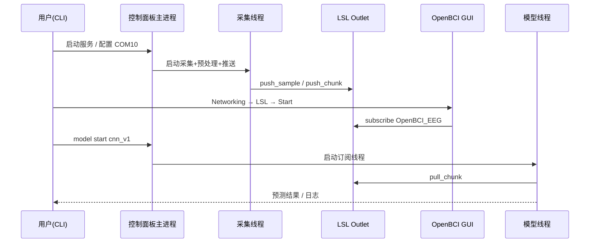
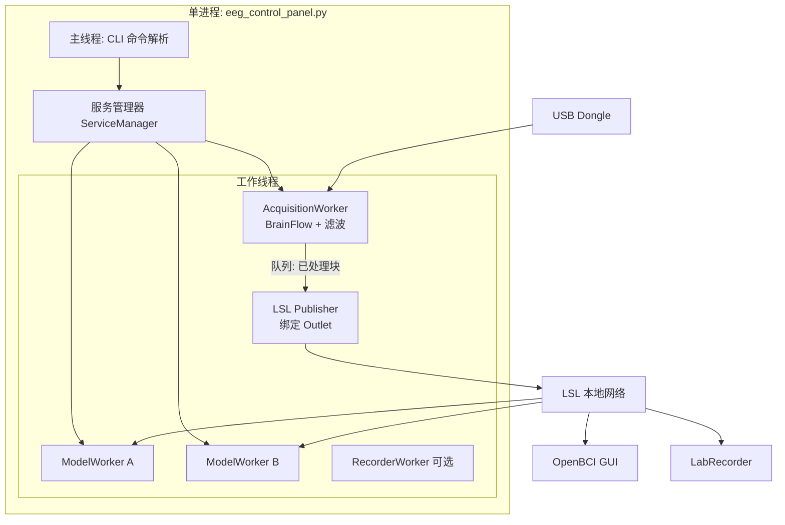
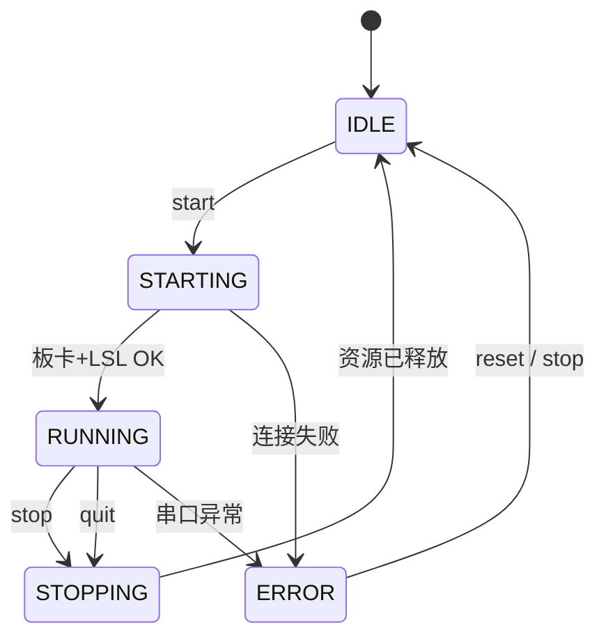
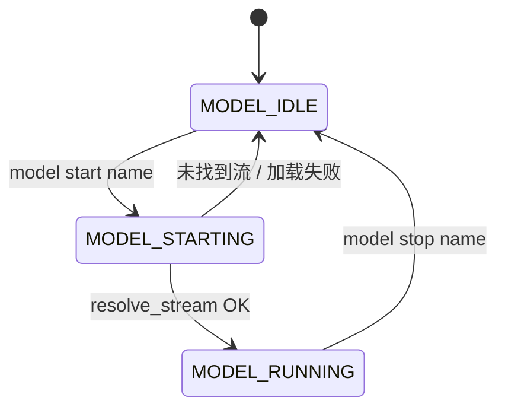

# OpenBCI Cyton + LSL 脑电实时系统 — 项目需求分析与技术概要

> **文档版本**：v0.3  
> **目标平台**：Windows 10/11 + OpenBCI Cyton 8 通道 + USB Dongle  
> **当前基线**：`eeg_broadcaster.py`（单进程、单线程主循环，LSL 广播 + BrainFlow 采集）  
> **分步实现**：见 [教学计划.md](./教学计划.md)（按课次自行添加代码，每课向助教索取对应片段）  
> **框架与缓存/LSL**：见 [项目框架-数据缓存与LSL协议.md](./项目框架-数据缓存与LSL协议.md)

---

## 1. 项目背景与动机

### 1.1 现状

已有方案通过 **BrainFlow 独占串口** 采集 Cyton 数据，经预处理后由 **LSL Outlet** 广播。OpenBCI GUI、深度学习模型、LabRecorder 等作为 **LSL 消费者** 订阅同一条数据流，实现「一拖多」。

当前实现为 **单一 Python 脚本 + 单线程 `while True` 循环**，存在以下局限：

| 局限 | 影响 |
|------|------|
| 采集、滤波、LSL 推送、日志、模型推理挤在同一线程 | 模型推理或磁盘 I/O 阻塞会拖慢实时推送 |
| 无运行时控制界面 | 改串口、开关滤波、启停模型需改代码或重启进程 |
| 模型需另开终端跑 `model_subscriber.py` | 运维分散，状态不可统一观测 |
| 主循环尚未完整（`eeg_broadcaster.py` 缺少采集循环体） | 无法稳定交付 |

### 1.2 升级目标

将系统升级为 **多线程、可交互的命令行控制面板（CLI Control Panel）**，在同一进程内：

1. **持续** 占有串口并广播 LSL（供 OpenBCI GUI 等外部消费者使用）；
2. **可选** 内置一个或多个模型订阅线程，从本机 LSL 拉流推理；
3. **统一** 通过命令行菜单/指令启停各子系统、查看状态与指标；
4. **解耦** 实时路径与重计算路径，保证 GUI/LSL 延迟可控。

---

## 2. 利益相关方与使用场景

| 角色 | 需求 |
|------|------|
| 实验操作员 | 一条命令启动服务；菜单里改 COM 口、看连接/采样率/丢包；一键提示「请打开 GUI → LSL」 |
| 算法工程师 | 注册/切换模型插件；配置窗口长度、重叠率；不重启采集即可启停推理 |
| 可视化用户 | OpenBCI GUI 仅作 LSL 消费者，与脚本无串口冲突 |
| 数据管理员 | 可选 CSV/XDF 录制线程；与广播并行 |

**典型会话流程**：



---

## 3. 功能需求（FR）

### 3.1 核心服务（必须）

| ID | 需求描述 | 验收标准 |
|----|----------|----------|
| FR-01 | BrainFlow 连接 Cyton（8ch，250Hz） | `prepare_session` + `start_stream` 成功，可配置 `SERIAL_PORT` |
| FR-02 | 实时预处理 | 支持带通 0.5–45Hz、50Hz 陷波；可通过 CLI 开关 |
| FR-03 | LSL 广播 EEG 流 | 流名 `OpenBCI_EEG`，8 通道 float32，元数据含电极 label |
| FR-04 | LSL 广播加速度流（可选） | 流名 `OpenBCI_Accel`，3 通道 |
| FR-05 | 串口独占与释放 | 退出或 `stop` 命令时 `stop_stream` + `release_session` |
| FR-06 | 与 OpenBCI GUI 并存 | GUI 不占用串口；LSL 模式下 GUI 能发现流并出波形 |

### 3.2 多线程控制面板（必须）

| ID | 需求描述 | 验收标准 |
|----|----------|----------|
| FR-10 | 独立采集线程 | 主线程阻塞在 CLI；采集循环在后台线程，崩溃可上报状态 |
| FR-11 | 交互式命令行 | 支持 `status`、`start`、`stop`、`config port COMx`、`filter on/off` 等 |
| FR-12 | 状态面板 | 显示：运行状态、COM、采样计数、LSL 推送速率、最近错误 |
| FR-13 | 优雅退出 | Ctrl+C 或 `quit`：按序停止模型线程 → 采集 → 释放硬件 |
| FR-14 | 线程安全共享状态 | 使用 `threading.Event` / 队列传递命令与指标，避免裸共享可变全局 |

### 3.3 模型接入（应该）

| ID | 需求描述 | 验收标准 |
|----|----------|----------|
| FR-20 | 内置模型 worker 线程 | `model start <id>` 从 LSL `resolve_stream('name','OpenBCI_EEG')` 拉流 |
| FR-21 | 可插拔模型接口 | 约定 `load_model()` / `predict(window: np.ndarray) -> Any` |
| FR-22 | 多模型并行 | 多个 worker 同时订阅同一 LSL 流（与多终端脚本行为一致） |
| FR-23 | 滑动窗口配置 | 默认 1s@250Hz，50% 重叠；CLI 可改 `window`、`hop` |

### 3.4 扩展（可选 / 后续迭代）

| ID | 需求描述 |
|----|----------|
| FR-30 | LSL Marker 流（实验事件标记） |
| FR-31 | 录制线程写 CSV / 配合 LabRecorder |
| FR-32 | 配置文件 `config.yaml`（串口、滤波、模型路径） |
| FR-33 | 简易 TUI（`rich`/`curses`）替代纯文本菜单 |

---

## 4. 非功能需求（NFR）

| 类别 | 指标 | 说明 |
|------|------|------|
| 实时性 | EEG 端到 LSL 延迟 &lt; 50ms（典型） | 采集线程内避免重模型推理；推送优先 `push_chunk` 批量 |
| 吞吐量 | 稳定 250 sample/s × 8 ch | 采集线程 sleep 策略可自适应（有数据则少睡） |
| 可靠性 | 串口断开可检测并提示 | BrainFlow 异常捕获 + 状态机 `ERROR` |
| 可维护性 | 模块边界清晰 | `acquisition` / `lsl_outlet` / `cli` / `models` 分包 |
| 兼容性 | Windows + Python 3.10+ | 依赖：brainflow, numpy, pylsl；可选 torch/onnx |
| 安全性 | 单进程单串口 | 禁止第二实例同时 `prepare_session` 同一 COM |

---

## 5. 系统架构（目标态）

### 5.1 逻辑架构



**设计要点**：

- **GUI 不内嵌在 Python 进程内**：仍为独立应用，通过 LSL 订阅；控制面板只负责「提示 + 确认流已发布」。
- **模型线程订阅本机 LSL**，与 GUI 对称，避免在采集线程里直接 `import torch`。
- **采集与推送可合并为一线程**（降低队列延迟），或拆为「采集 → 队列 → 推送」两线程（便于测速）；默认建议 **单 AcquisitionWorker 内完成滤波+push**，模型单独线程。

### 5.2 线程模型

| 线程 | 职责 | 启停 |
|------|------|------|
| Main | `input()` / `cmdloop` 解析命令、打印状态 | 进程生命周期 |
| AcquisitionWorker | `get_current_board_data` → 缩放 → 滤波 → `push_sample/chunk` | `start` / `stop` |
| ModelWorker × N | `resolve_stream` → `pull_chunk` → `predict` → 输出 | `model start/stop` |
| RecorderWorker | 订阅 LSL 或从队列写盘 | `record start/stop` |
| Monitor（可选） | 每秒汇总 sample 计数、LSL 有效采样率 | 随服务启动 |

**同步原语**：

- `stop_event: threading.Event` — 全局停止；
- `config_lock: threading.Lock` — 运行时改 COM/滤波参数（改后下一缓冲生效）；
- `stats: dict` + `Lock` — 供 `status` 命令读取。

### 5.3 状态机入门

**状态机（State Machine）** 用「当前处于哪一种模式」来描述系统，并规定：**在什么事件下，允许从模式 A 变成模式 B**。任意时刻系统只属于有限个状态之一，不能同时既是「未连接」又是「正在采集」。

#### 5.3.1 三个核心概念

| 概念 | 在本项目中的例子 |
|------|------------------|
| **状态（State）** | `IDLE`（空闲）、`RUNNING`（采集中）、`ERROR`（异常） |
| **事件（Event）** | 用户输入 `start`、BrainFlow 连接成功、串口断开、用户输入 `stop` |
| **转移（Transition）** | `IDLE` + 事件 `start` → `STARTING`；`STARTING` + 连接成功 → `RUNNING` |

可类比交通灯：只有红 / 黄 / 绿三种状态；计时到或按钮按下是事件；不能从红灯直接跳到黄灯，必须按规则走。

#### 5.3.2 为什么要用状态机（而不是几个布尔变量）

若只用 `is_running = True/False`、`has_error = True/False`，容易出现非法组合，例如「标为未运行但采集线程仍在跑」「报错后仍能改 COM 口并 start」。状态机把合法组合写进一张**转移表**，`ServiceManager` 在改状态前查表，不合法则拒绝并提示用户。

| 好处 | 说明 |
|------|------|
| 防止非法操作 | 仅 `IDLE` 可 `config port`；仅 `RUNNING` 可 `model start`（采集流已存在） |
| 逻辑集中 | 所有「能不能 start/stop」在一处维护，CLI 与线程启停一致 |
| 便于观测 | `status` 直接打印当前状态名，排错时一眼可知卡在哪一步 |

#### 5.3.3 与多线程的关系（易混淆点）

- **状态机**：管「服务**允许**处于什么模式、下一步**合法**是什么」——通常由主线程 / `ServiceManager` 持有。
- **工作线程**：管「启动之后**具体干活**」（读串口、推 LSL、跑模型）。

典型分工：`start` 命令先把状态设为 `STARTING`，再启动 `AcquisitionWorker`；只有线程报告「板卡 + LSL 就绪」后，才转为 `RUNNING`。`stop` 时先进入 `STOPPING`，等线程退出、串口释放，再回到 `IDLE`。

#### 5.3.4 服务级状态一览

| 状态 | 含义 | 此时用户可做什么 |
|------|------|------------------|
| `IDLE` | 未连接板卡，无采集线程 | `config port`、`start`、`quit` |
| `STARTING` | 正在 `prepare_session` / 创建 LSL Outlet / 启动采集线程 | 等待；不宜改 COM |
| `RUNNING` | 采集 + LSL 广播正常 | `stop`、`status`、`filter on/off`、`model start`、`gui hint` |
| `STOPPING` | 正在停线程、释放串口 | 等待完成 |
| `ERROR` | 连接失败或运行中异常（如串口掉线） | `status` 看错误信息；`stop` 或 `reset` 回 `IDLE` 后再 `start` |

### 5.4 服务级状态机（ServiceManager）

#### 5.4.1 状态图



#### 5.4.2 状态转移表（实现时可照此编码）

下表每一行：**当前状态** + **触发事件** → **下一状态** + **动作（副作用）**。

| 当前状态 | 事件 / 条件 | 下一状态 | 动作（进入下一状态前后执行） |
|----------|-------------|----------|------------------------------|
| `IDLE` | 用户 `start` | `STARTING` | 校验 COM 已配置；启动 `AcquisitionWorker` |
| `STARTING` | 板卡连接且 LSL Outlet 创建成功 | `RUNNING` | 更新 `stats`；CLI 提示可开 GUI |
| `STARTING` | `prepare_session` 失败或超时 | `ERROR` | 记录错误信息；不启动采集循环 |
| `RUNNING` | 用户 `stop` | `STOPPING` | 置位 `stop_event`；等待采集线程结束 |
| `RUNNING` | 用户 `quit` | `STOPPING` | 同上，并标记「进程即将退出」 |
| `RUNNING` | 采集线程上报异常（串口断开等） | `ERROR` | 尝试安全停流；保留最后错误 |
| `STOPPING` | 线程已 join、串口已 `release_session` | `IDLE` | 清零运行计数（可选保留历史） |
| `ERROR` | 用户 `stop` 或 `reset` | `IDLE` | 确保无残留线程；清空错误（可选） |
| `ERROR` | 用户再次 `start` | `STARTING` | 同 `IDLE` → `STARTING`（需先回到 `IDLE` 或文档约定允许直连） |

**建议实现约束**：从 `ERROR` 到 `STARTING` 必须经过 `IDLE`（先 `reset` 再 `start`），避免半初始化资源。

#### 5.4.3 各状态下 CLI 命令是否允许

| 命令 | IDLE | STARTING | RUNNING | STOPPING | ERROR |
|------|:----:|:--------:|:-------:|:--------:|:-----:|
| `start` | ✓ | ✗ | ✗ | ✗ | ✗（应先 `reset`） |
| `stop` | ✗ | ✗（可强制取消连接） | ✓ | ✗ | ✓ |
| `config port` | ✓ | ✗ | ✗ | ✗ | ✗ |
| `config filter` | ✗ | ✗ | ✓ | ✗ | ✗ |
| `model start` | ✗ | ✗ | ✓ | ✗ | ✗ |
| `model stop` | ✗ | ✗ | ✓ | ✗ | ✗ |
| `status` | ✓ | ✓ | ✓ | ✓ | ✓ |
| `quit` | ✓ | ✓（触发停止） | ✓（→ STOPPING） | 等待 | ✓ |

#### 5.4.4 模型子状态（与采集状态独立）

模型 worker 有**自己的**小状态机，不替代服务主状态，但依赖主状态为 `RUNNING`（LSL 流存在）：



| 模型状态 | 说明 |
|----------|------|
| `MODEL_IDLE` | 未订阅 LSL |
| `MODEL_STARTING` | 正在 `resolve_stream`、加载权重 |
| `MODEL_RUNNING` | 循环 `pull_chunk` → `predict` |

主服务处于 `STOPPING` / `IDLE` 时，`ServiceManager` 应自动对所有 `MODEL_RUNNING` 发停止，避免孤立线程。

#### 5.4.5 伪代码示意（ServiceManager）

```python
class ServiceState(Enum):
    IDLE = "IDLE"
    STARTING = "STARTING"
    RUNNING = "RUNNING"
    STOPPING = "STOPPING"
    ERROR = "ERROR"

def on_command_start(self):
    if self.state != ServiceState.IDLE:
        return "当前状态不允许 start，请先 stop 或 reset"
    self.state = ServiceState.STARTING
    ok = self._start_acquisition_worker()
    if ok:
        self.state = ServiceState.RUNNING
    else:
        self.state = ServiceState.ERROR
```

生产代码中 `STARTING → RUNNING` 也可由采集线程回调触发，避免主线程阻塞在连接上。

---

## 6. 命令行控制面板 — 交互设计（草案）

### 6.1 启动方式

```bash
python eeg_control_panel.py
# 或
python -m lsl_connect.panel --port COM10
```

### 6.2 命令一览（建议）

| 命令 | 说明 |
|------|------|
| `help` | 显示帮助 |
| `status` | 服务/线程/采样率/已推送样本数/已连接 LSL 消费者提示 |
| `start` | 启动采集 + LSL 广播 |
| `stop` | 停止采集，保持 CLI |
| `config port COM10` | 设置串口（仅 IDLE 可改） |
| `config filter on\|off` | 运行时开关滤波 |
| `model list` | 已注册模型插件 |
| `model start <name>` | 启动模型线程 |
| `model stop <name>` | 停止指定模型 |
| `gui hint` | 打印 OpenBCI GUI 连接步骤 |
| `record start [path]` | 启动录制（可选） |
| `quit` / `exit` | 退出进程 |

### 6.3 `status` 输出示例

```
[服务] RUNNING  |  COM10  |  250 Hz  |  8 ch EEG
[采集] 样本已推送: 125430  |  循环: 198 Hz  |  滤波: ON
[LSL]  OpenBCI_EEG (Outlet 活跃)  |  OpenBCI_Accel (ON)
[模型] cnn_v1: RUNNING (窗口 250, hop 125)  |  最近预测: class=2 @ 12:01:03
[提示] GUI: Networking → LSL → Start LSL Stream
```

---

## 7. 技术概要

### 7.1 技术栈

| 层次 | 技术选型 | 理由 |
|------|----------|------|
| 硬件接入 | BrainFlow `BoardShim` | 官方维护 Cyton；通道索引 API 稳定 |
| 信号处理 | BrainFlow `DataFilter` | 与采集栈一致，C++ 后端性能可接受 |
| 分发总线 | Lab Streaming Layer (`pylsl`) | 业界标准；GUI/Recorder/自研模型统一协议 |
| 并发 | `threading`（标准库） | Windows 友好；I/O 与 GIL 场景足够；避免多进程抢串口 |
| CLI | 标准库 `cmd.Cmd` 或自研 REPL | 无额外依赖；后续可换 `rich` |
| 数值 | `numpy` | 窗口缓冲与模型输入 |

### 7.2 模块划分（建议目录结构）

```
LSL_connect_model/
├── docs/
│   └── 项目需求分析与技术概要.md    # 本文档
├── config/
│   └── default.yaml                 # 串口、滤波、LSL 流名（后续）
├── lsl_connect/
│   ├── __init__.py
│   ├── board.py                     # BrainFlow 封装
│   ├── preprocessing.py             # 缩放 + 滤波
│   ├── lsl_streams.py               # StreamInfo / Outlet 工厂
│   ├── acquisition_worker.py        # 采集线程
│   ├── model_worker.py              # LSL 订阅 + 推理循环
│   ├── service_manager.py           # 启停、状态机、线程池
│   └── cli.py                       # 命令解析与面板
├── models/
│   ├── __init__.py
│   ├── base.py                      # ModelPlugin 抽象基类
│   └── demo_stats.py                # 示例：仅打印均值/方差
├── eeg_broadcaster.py               # 保留：极简单文件版（兼容）
└── eeg_control_panel.py             # 入口：多线程控制面板
```

### 7.3 数据路径与性能策略

1. **批处理推送**：优先 `push_chunk`（例如每次 25 点），降低 Python↔LSL 调用次数；GUI 兼容 chunk。
2. **滤波**：对每通道每批数据调用 `DataFilter`；若 CPU 占用过高，可降为仅陷波或移至可选离线。
3. **模型**：使用 `pull_chunk` + 环形缓冲，禁止在采集线程调用深度学习框架。
4. **时间戳**：LSL 推送时使用 `local_clock()` 或板卡 `timestamp_channel` 对齐（二期优化）。

### 7.4 LSL 流规范（与现网一致）

| 流名称 | 类型 | 通道 | 采样率 | source_id |
|--------|------|------|--------|-----------|
| OpenBCI_EEG | EEG | 8 | 250 | openbci_cyton_8ch |
| OpenBCI_Accel | ACC | 3 | 250 | openbci_cyton_accel |
| OpenBCI_Markers | Markers | 1 | 0（不规则） | openbci_markers（可选） |

### 7.5 与 OpenBCI GUI 的协作说明

- Python 进程 **唯一** 打开串口；GUI 必须选择 **Networking → LSL**，不得再选 Serial/Cyton 直连。
- 启动顺序建议：**先 `start` 控制面板 → 再开 GUI → 再 `model start`**。
- 防火墙若阻挡 LSL 发现，需放行本地 UDP（见原方案 Q4）。

### 7.6 已知问题与修复项（基线代码）

| 项 | 说明 | 处理 |
|----|------|------|
| `eeg_broadcaster.py` 主循环缺失 | 文件在 BUFFER 定义后结束 | 合并到 `AcquisitionWorker` 或补全循环 |
| `info_egg` / `append_child("channel")` | 元数据节点命名与 XDF 惯例可能不符 | 对照 pylsl 示例改为 `channels` 容器 |
| 电极 label `01`/`02` | 应为 `O1`/`O2` | 配置化 |
| 单线程滤波+逐点 push | 延迟与 CPU 压力大 | 控制面板版采用 chunk + 可选滤波开关 |

---

## 8. 接口约定

### 8.1 模型插件接口（Python）

```python
class ModelPlugin:
    name: str
    window_size: int = 250
    hop_size: int = 125

    def load(self) -> None: ...
    def predict(self, data: np.ndarray) -> object:
        """data shape: (n_channels, n_samples)"""
        ...
```

注册表示例：`MODEL_REGISTRY = {"demo": DemoStatsModel, "cnn_v1": ...}`。  
**非程序员如何登记模型、如何切换模型**：见 **§13**。

### 8.2 服务管理器 API（内部）

```python
class ServiceManager:
    def start_acquisition(self) -> bool: ...
    def stop_acquisition(self) -> None: ...
    def start_model(self, name: str) -> bool: ...
    def stop_model(self, name: str) -> None: ...
    def get_status(self) -> dict: ...
    def shutdown(self) -> None: ...
```

---

## 9. 测试与验收计划

| 阶段 | 内容 | 通过条件 |
|------|------|----------|
| T1 单元 | LSL 流创建、缩放系数、通道索引 | 无硬件时用 `SYNTHETIC_BOARD` 或 mock |
| T2 集成 | 实机 Cyton 启动 `start` | `status` 显示 RUNNING，样本计数递增 |
| T3 GUI | OpenBCI GUI LSL 模式 | 8 通道波形连续无冻结 |
| T4 模型 | `model start demo` + GUI 同时开 | 预测日志持续；GUI 无肉眼卡顿 |
| T5 压力 | 双模型 + GUI + 录制 10 分钟 | 无串口掉线；推送速率≈250Hz |
| T6 恢复 | 运行中 `stop` 再 `start` | 可重连，无 “port busy” |

---

## 10. 实施路线图

| 阶段 | 交付物 | 优先级 |
|------|--------|--------|
| **P0** | 补全采集主循环；修复 LSL 元数据；`eeg_broadcaster.py` 可独立运行 | 高 |
| **P1** | `ServiceManager` + `AcquisitionWorker` + 基础 CLI（start/stop/status/quit） | 高 |
| **P1** | `ModelWorker` + `demo_stats` 插件 + `model start/stop` | 高 |
| **P2** | `config.yaml`、滤波/GUI 提示命令、错误恢复 | 中 |
| **P2** | Marker 流、录制线程 | 中 |
| **P3** | TUI、性能 profiling、ONNX/Torch 示例插件 | 低 |

---

## 11. 风险与对策

| 风险 | 对策 |
|------|------|
| 串口被 GUI 占用 | 文档与 CLI 明确提示；启动前检测端口占用（可选 `serial.tools.list_ports`） |
| GIL 导致模型卡顿采集 | 模型独立线程；重推理用 `torch.inference_mode` + 小 batch；必要时进程隔离模型 |
| LSL 发现失败 | `status` 中打印 hostname/source_id；支持手动指定 inlet 名 |
| 滤波边界效应 | 使用足够 `BUFFER_SIZE`；零相位滤波仅在有整段数据时调用 |
| Windows 控制台编码 | 打印避免仅依赖 Unicode 符号；`chcp 65001` 说明写入 README |

---

## 12. 总结

本项目的核心演进方向是：在保持 **「单进程独占串口 + LSL 广播」** 架构不变的前提下，引入 **多线程 + 命令行控制面板**，把 **采集/广播（实时关键路径）** 与 **模型推理/录制（非关键路径）** 分离，使用户在同一终端内即可同时服务 **OpenBCI GUI（外部 LSL 消费者）** 与 **一个或多个内置模型 worker**，并具备运行时观测与控制能力。

下一步实现建议按 **第十章路线图 P0 → P1** 顺序推进：先保证广播稳定，再交付 `eeg_control_panel.py` 与模块化包结构。

---

## 13. 模型接入指南：非程序员使用说明与 YAML 配置

本章说明：**在线脑电如何自动进模型**、**不同模型如何切换**、**YAML 是什么**、以及 **`models.yaml` 填表模板**（可复制到 `config/models.yaml`）。

### 13.1 数据怎么「传」进模型（不用手传）

```text
板子 → 采集脚本 start → LSL 流 OpenBCI_EEG（持续推送）
                              ↓
                    model start <模型名>
                              ↓
                    后台自动拉取 → 凑满一个时间窗 → 调用该模型的 predict
                              ↓
                    终端打印预测结果（或写日志）
```

操作员**不需要**写 `pull_sample`、不需要读串口。只要：

1. 先 `start`（水管开始流）；  
2. 再 `model start 睡眠检测`（接上一个已登记的水龙头）。

「适配」= 模型在登记时声明自己要多长窗口；程序按声明自动切片并调用。

### 13.2 三类人分别做什么

| 角色 | 会不会编程 | 要做的事 |
|------|------------|----------|
| **日常操作员** | 否 | 只输入 `start`、`model start 名字`、`model stop`；可选开 OpenBCI GUI |
| **实验室管理员** | 会改记事本 | 复制 `models.example.yaml` → `models.yaml`，按表填模型名、窗口、权重路径 |
| **程序员（一次性）** | 是 | 新增 `models/xxx.py` 实现 `predict`；在 yaml 里加一段登记 |

新模型**第一次**接入需要程序员；接入之后，操作员永远用**同一个命令**切换模型。

### 13.3 日常操作员速查（可打印）

```text
【开机】
1. 插上 OpenBCI Dongle（串口由管理员在 default.yaml 里配好）
2. 运行：python eeg_control_panel.py
3. 输入：start
4. 看到「运行中 / RUNNING」后再进行下一步

【接一个模型做在线分析】
5. 输入：model list          ← 看有哪些已登记的名字
6. 输入：model start 睡眠检测   ← 名字必须与 list 里完全一致
7. 看窗口里滚动的预测结果

【换模型】
8. 输入：model stop 睡眠检测
9. 输入：model start 运动想象

【看波形（可选）】
10. 打开 OpenBCI GUI → Networking → LSL → Start LSL Stream

【结束】
11. 输入：model stop …（若在跑）
12. 输入：stop
13. 输入：quit

【禁止】
× 同时用 GUI 的「串口直连」模式（会抢 COM 口）
× 未 start 就 model start（没有 LSL 数据流）
```

### 13.4 YAML 是什么？

**YAML**（读作「雅梅尔」）是一种**用纯文本写配置**的格式，文件扩展名通常是 `.yaml` 或 `.yml`。

可以把它当成**比 Excel 更简单、比 Python 更安全**的「设置表」：

| 对比 | 说明 |
|------|------|
| 与 `.py` 代码 | YAML **不能**写循环、联网逻辑，只存「叫什么、用哪个文件、窗口多长」，改错了也不会执行危险代码 |
| 与 `.json` | 语法更省符号，允许 `# 注释`，适合人手编辑 |
| 与 `.ini` | 层次更清晰，适合「多个模型，每个下面几行参数」 |

**本项目中常见两个文件**：

| 文件 | 谁改 | 内容 |
|------|------|------|
| `config/default.yaml` | 管理员 | 串口号 COM10、是否滤波、LSL 流名称 |
| `config/models.yaml` | 管理员 | **模型登记表**：显示名 → 插件文件、窗口长度、权重路径 |

程序启动时用 Python 库 **`PyYAML`**（`pip install pyyaml`）读取文件，变成内存里的字典，再按名字加载对应模型。

#### 13.4.1 YAML 书写规则（够用版）

```yaml
# 井号开头表示注释，程序会忽略

睡眠检测:                    # 「键」：模型显示名（操作员 model start 用这个名字）
  说明: 夜间值班筛查          # 「键: 值」，冒号后有一个空格
  窗口采样点数: 250           # 数字不要加引号
  步长采样点数: 125
  模块: models.sleep_model    # 文本字符串；含特殊字符时可加引号
  类名: SleepModel
  权重文件: checkpoints/sleep.pt

运动想象:
  窗口采样点数: 500
  模块: models.mi_model
  入口: predict              # 也可只写函数名，不必写「类」
```

注意：

- **缩进用空格**（建议 2 个），不要用 Tab，否则可能报错。  
- **冒号后面要有空格**：`窗口: 250` ✓，`窗口:250` 有时会被误解析。  
- **中文名可以做键**，但操作员输入时要与 yaml 里完全一致。  
- 路径用正斜杠 `/` 或双反斜杠 `\\`，Windows 下 `checkpoints\a.pt` 也可。

#### 13.4.2 和「适配不同模型」的关系

| 模型差异 | 在 YAML 里改什么 | 操作员命令变吗 |
|----------|------------------|----------------|
| 换了一个已登记的模型 | 不用改 yaml，只换 `model start` 的名字 | 变（换名字） |
| 同一模型要更长窗口 | 改 `窗口采样点数`，重启控制面板 | 不变 |
| 换权重文件 | 改 `权重文件` 路径 | 不变 |
| 输入要通道在最后 | 改 `输入格式: channels_last`（程序员先支持） | 不变 |
| 全新算法 | 程序员加 `.py` + yaml 新一段 | 多一个新名字 |

### 13.5 `models.yaml` 填表模板

项目提供示例：`config/models.example.yaml`。管理员操作：

```text
复制  models.example.yaml  →  models.yaml
用记事本 / VS Code 打开 models.yaml，按下面说明改
保存后重启控制面板；用 model list 检查是否出现新名字
```

**填表说明（每一列含义）**：

| 字段 | 必填 | 谁填 | 含义 |
|------|:----:|------|------|
| （顶层键名） | ✓ | 管理员 | 操作员用的名字，如 `睡眠检测`、`demo` |
| `说明` | | 管理员 | 备注，给人看，程序可忽略 |
| `窗口采样点数` | ✓ | 管理员/程序员 | 每次推理用多少点；250≈1秒@250Hz |
| `步长采样点数` | | 管理员 | 滑动步长；默认窗口的一半（重叠 50%） |
| `模块` | ✓ | 程序员 | Python 文件路径，如 `models.demo_stats` |
| `类名` | * | 程序员 | 类插件时填，如 `DemoStatsModel` |
| `入口` | * | 程序员 | 函数插件时填，如 `predict`（与类名二选一） |
| `权重文件` | | 管理员 | `.pt` / `.onnx` 路径，无权重可省略 |
| `输入格式` | | 程序员 | 默认 `channels_samples`；特殊模型再改 |

**示例文件全文**见仓库 `config/models.example.yaml`（与下表一致，可直接复制）。

```yaml
# config/models.yaml — 模型登记表（示例内容）
# 操作员命令: model start <顶层键名>

demo:
  说明: 内置演示，打印均值方差，无需权重
  窗口采样点数: 250
  步长采样点数: 125
  模块: models.demo_stats
  类名: DemoStatsModel

睡眠检测:
  说明: 示例：睡眠分期（需程序员提供 models/sleep_model.py）
  窗口采样点数: 250
  步长采样点数: 125
  模块: models.sleep_model
  类名: SleepModel
  权重文件: checkpoints/sleep.pt

运动想象:
  说明: 示例：2 秒窗口 MI 解码
  窗口采样点数: 500
  步长采样点数: 250
  模块: models.mi_model
  入口: predict
  权重文件: checkpoints/mi.onnx
  输入格式: channels_samples
```

### 13.6 在线数据「形状」合同（给程序员看，操作员可跳过）

无论哪个模型，框架传入 `predict` 的默认约定：

| 项目 | 值 |
|------|-----|
| `data` 形状 | `(8, 窗口采样点数)` |
| 单位 | 微伏 µV |
| 采样率 | 250 Hz（与 Cyton 一致） |

若模型训练时用的是别的排布，在插件或 `输入格式` 里**转一次**，不要让操作员改数据。

### 13.7 常见问题

| 问题 | 原因 | 处理 |
|------|------|------|
| `model list` 没有某个名字 | yaml 没保存、路径错、YAML 缩进错 | 检查 `config/models.yaml`；用在线 YAML 校验器 |
| `model start` 报找不到流 | 未 `start` 采集 | 先 `start`，等 RUNNING |
| 改了 yaml 不生效 | 程序已启动 | 保存后 `quit` 再重新打开控制面板 |
| 名字输入报错 | 中文全角符号、多空格 | 从 `model list` 复制名字 |
| 预测很慢 | 窗口太大或 GPU 模型 | 减小窗口或换轻量模型；采集线程不受影响 |

### 13.8 与 §8 插件接口的对应关系

```text
models.yaml 里「模块 + 类名/入口」
        ↓  PyYAML 读取
ServiceManager 按名加载插件
        ↓
ModelWorker：LSL pull_chunk → 凑窗口 → predict(data)
        ↓
结果打印 / 写日志
```

---

## 附录 A：术语表

| 术语 | 含义 |
|------|------|
| Outlet | LSL 数据发布端（本项目的采集服务） |
| Inlet | LSL 数据订阅端（GUI、模型、Recorder） |
| Cyton | OpenBCI 8/16 通道板卡，本方案为 8 通道 |
| BrainFlow | 跨平台 BIOS 信号采集库 |
| 滑动窗口 | 模型每次推理使用的连续样本段，可重叠 |
| 状态机 | 用有限状态 + 事件转移描述系统模式；见 **§5.3–5.4** |
| IDLE / RUNNING 等 | 本项目中 `ServiceManager` 的服务级状态名 |
| YAML | 文本配置格式；本项目的 `config/*.yaml`；见 **§13.4** |
| models.yaml | 模型登记表：名字 → 窗口、插件路径、权重；见 **§13.5** |

## 附录 B：参考依赖版本

```
brainflow >= 5.0
numpy >= 1.20
pylsl >= 1.16
```

（可选）`pyyaml`、`rich`、`torch` — 按阶段引入。
