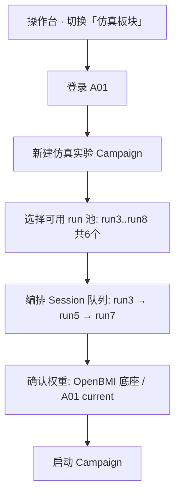

# 仿真板块 · BCI2a 回放 v3 探针 — 设计方案

> 日期：2026-08-27 · 状态：**M1–M5 已实现（回放 · sim_v3 · Campaign · FT · summary）**  
> 定位：与现有 **实验板块** 并列的第三工作模式；用 **BCI2a Training（T.mat）真实 EEG** 驱动与 fnz 真机 **同构** 的 v3 OpenBMI-Align 会话，支持 **逐 run 当 session**、**被试内 FT 链**、**Run 不重复** 约束。  
> 相关：[`fnz实验与微调采集方案_20260827.md`](fnz实验与微调采集方案_20260827.md) · [`范式对齐_OpenBMI与fnz_v3_20260827.md`](范式对齐_OpenBMI与fnz_v3_20260827.md) · [`被试登录与按session微调方案_20260827.md`](被试登录与按session微调方案_20260827.md) · [`实验29_bci2a_replay验证_20260827.md`](实验29_bci2a_replay验证_20260827.md) · `code/preprocess_lab/config/bci2a_3s_hop100.yaml`

---

## 0. 一句话

**实验板块** = 真机采集 + 真 LSL；**仿真板块** = 选定 BCI2a 被试的一个 **run** 当作一场 **session**（trial 数 **6–48 可选**），按 OpenBMI-Align v3 在线回放判定、落盘、采后 FT；**省略** session 30s 基线与块间休息（真机默认 30s；仿真跳过），静息校准用 Cue 前 Rest；同一场仿真实验 **只服务一个被试**，**run 可选序但不可重复**，权重链与真机一致。

---

## 1. 两板块对比（唯一差异在数据源）

| 维度 | 实验板块（现状） | 仿真板块（目标） |
|------|------------------|------------------|
| **入口** | 操作台 · 模式 `v3_session` / `v2_session` | 操作台 · 模式 **`sim_v3_session`**（或 `v3_session` + `sim_mode=true`） |
| **被试** | 登录英文缩写（`fnz`、`cyy`…） | 登录 **BCI2a 九被试目录** `A01`…`A09`（与 Exp29 一致） |
| **Session 单位** | 一次真机采集 ≈ 36 trial（2×18，可配） | **1 个 BCI2a 带标签 run = 1 场 session**；**trial 总数可选 6–48** |
| **EEG 来源** | Cyton / synthetic LSL | **`AxxT.mat` 中指定 run** 的连续 EEG |
| **采集** | `acq_enabled`，写 `eeg.csv` | **回放写盘**：按实时序重采样/对齐后仍产出 `eeg.csv` + `events.jsonl`（便于 FT/对齐） |
| **在线推理** | 冻结或 v2 增量 | **全程冻结**（同 v3 探针） |
| **块结构 / 时序 / 计分** | OpenBMI-Align v1 | **单 trial 时序相同**；**跳过** 开场 30s 基线、块间休息（真机默认 block_gap_s=30；见 §3.3、§4.5） |
| **采后 FT** | `ft_subject_from_v3` + promote `current` | **相同工具链**；训练窗来自仿真 session 落盘 |
| **权重选择** | OpenBMI 底座 **或** 本被试 `current`/`ft_runs`（谱系见被试方案 §3.5） | **同规则**；禁止跨被试 |
| **不可用** | — | BCI2a **E.gdf**（评估集、未接入） |

> 原则：**除「EEG 从哪来」外，会话状态机、操作台监控、alignment、FT SOP 不重写**；仿真是一层 **Replay Acquisition Adapter**。

---

## 2. BCI2a 数据与 run 语义

### 2.1 原始数据（已具备）

| 项 | 内容 |
|----|------|
| 路径 | `D:/MI/DATA/bci2a/A01T.mat` … `A09T.mat` |
| 被试 | **A01–A09**（9 人） |
| 带标签 run | 每人 **6 个**（A01 等多为 mat 内 run3–8；A04 为 run1–6） |
| 每 run | **48 trial**（左/右手；脚/舌 label 3/4 **丢弃**） |
| 范式 | **Cue 后 0–4 s MI**（与 OpenBMI / fnz Align **同构**） |
| Rest | **Cue 前 ≤4 s** 静息窗；v1 起 **label=0 计入 session 试次**（见 §4.2） |

### 2.2 预处理（已具备 · Exp29）

```bash
cd code/preprocess_lab
python -m src.datasets.bci2a.batch_3s_hop100 --glob "D:/MI/DATA/bci2a/A0*T.mat"
```

输出：`code/preprocess_lab/out/bci2a_3s_hop100/shards/A01_run3/…`  
窗协议：3 s / hop 100 ms · CAR 8–30 Hz · 与 fnz FT **同构**。

### 2.3 run ↔ session 命名

| 仿真 session_id | 含义 | 示例 |
|-----------------|------|------|
| `run3` | 来自 `A01T.mat` 内第 3 个带标签 run | `A01/run3` |
| 落盘目录 | `data/sim_subjects/A01/sessions/A01_run3_20260827_153012/` | 与真机 `subject_id/session_id_timestamp` 同构 |

**约束（用户要求）：** 同一场 **仿真实验 campaign** 内，**同一 run 只能进入一次**（全局已用 run 集合写入 campaign manifest）。

---

## 3. 具体被试采集流程 · 以 **A01** 为例

### 3.1 场景设定

- 操作员要为 **A01** 做「多 session 微调链」仿真，验证 Exp27/Exp29 策略在 **完整 v3 UI + FT 面板** 下是否跑通。  
- 计划跑 **3 场 session**，对应 run **3 → 5 → 7**（顺序自选，不重复）。

### 3.2 Campaign 级（仿真实验开始前）



**Campaign manifest（新建，`data/sim_subjects/A01/campaigns/sim_20260827_001/manifest.json`）：**

```json
{
  "campaign_id": "sim_20260827_001",
  "subject_id": "A01",
  "source_mat": "D:/MI/DATA/bci2a/A01T.mat",
  "phase_mode": "sim_v3_session",
  "session_queue": ["run3", "run5", "run7"],
  "session_trials_total": 36,
  "runs_consumed": [],
  "weights_at_start": "openbmi_base",
  "protocol": "openbmi_align_v1"
}
```

### 3.3 单场 session · Session 1（run3）

| 阶段 | 真机 v3 | 仿真 run3 | 说明 |
|------|---------|-------------|------|
| **0 自检** | 模型 + LSL | 模型 + **mat/run 可读** + shard 存在 | 无 LSL 硬依赖 |
| **1 开场基线 30s** | 真静息 · 写 `session_baseline` | **跳过**（不播连续 30s、不 prepended 静音） | 静息/ERD 校准改用 **各 trial Cue 前 Rest**（§4.5） |
| **2 块 1 · N₁ trial** | guided 或 no_guide | **从 run3 按时间序取前 N₁ 个 L/R trial**（块内 L/R 均衡重排） | 默认 N₁=18；总数见 §4.2 |
| **3 块间休息（真机默认 30s）** | 真休息 · `block_gap` | **跳过**（不播 ITI+Rest 拼接、不黑屏计时） | 块 1 结束 **直接进入** 块 2 |
| **4 块 2 · N₂ trial** | 另一条件 | **run3 接下来 N₂ 个 trial** | 默认 N₂=18；N₁+N₂ ≤ 48 |
| **5 报告** | v3_report | 同报告模板 + **`sim_source_run=3`** | |

> **仿真与真机两处刻意省略：** 仅省略 **session 级** 30s 基线与 **块间休息**（真机默认 30s）；**单 trial 内** 专用 Rest 4s → prep → Cue/MI → ITI 仍完整回放（`schedule_align`）。

**单场时序（单 trial · 与 Align 一致）：**

```text
专用 Rest 4s → prep 2s → Cue 先行 1s → MI 4s → ITI 3s  （合计约 14s；判定/切窗相对 MI `[0,4)`，锚 `mi_start`）
```

**在线：** 3 s/hop100，判相对 MI 窗尾 3.0…4.0 s，**因果平滑 + 多数票**；试次分 MI +1 / Rest +0.5（满分 54）；操作台 **本场得分** 累计。

**落盘（与真机同目录结构）：**

```text
data/sim_subjects/A01/sessions/A01_run3_20260827_153012/
├── session.meta.json      # sim_mode=true, source_run=3, campaign_id=...
├── run_config.json
├── events.jsonl           # 由回放状态机写入（含 rest_start/rest_end）
├── eeg.csv                # 250Hz×8ch，与 events 时间对齐
├── eeg.meta.json
├── alignment/trial_table.csv
├── v3_trial_features.jsonl
└── v3_report.md
```

### 3.4 Session 1 结束 · 采后 FT（与真机相同）

1. 摘要页 → **被试微调** 面板  
2. 勾选 `A01_run3_…` session（+ 可选历史仿真 session）  
3. 跑 `ft_subject_from_v3`（openbmi_align 切窗 · T0 replay 0.10）  
4. 写入 `data/sim_subjects/A01/models/ft_runs/<ts>/`  
5. 门控后 **默认自动晋升 current**（`ft_policy`：`auto_promote_after_ft` + `force_promote_on_gate_fail`；FAIL 时落盘 `force_promote_warning.json`，冻结 **F8**）

### 3.5 Session 2（run5）· 权重继承

| 项 | 值 |
|----|-----|
| 登录 | 仍 **A01**（同 campaign） |
| run 选择 | **run5**（run3 已在 `runs_consumed`，不可再选） |
| 权重 preset | **`A01 最新 current`**（Session1 FT 后） |
| 期望 | 在线 trial acc / 本场得分 **高于** Session1 零样本（定性验证链） |

### 3.6 Session 3（run7）· Campaign 结束

- 队列为空或操作员点「结束 Campaign」  
- 汇总：`campaigns/sim_20260827_001/summary.md`（各 run 的 acc、得分、FT 门控、权重版本）  
- 与 Exp29 Leave-Next **可对照**：R1=run3, R2=run3+5 训练窗 FT → 在线 run7

### 3.7 A01 完整时间线（示意）

```text
Campaign sim_20260827_001 · 被试 A01
────────────────────────────────────────────────────────
[底座 OpenBMI] 
    → Sim-Session run3  (默认 36 trial·2块，可配 6–48) → FT? → current_v1
    → Sim-Session run5  (weights=current_v1) → FT? → current_v2  
    → Sim-Session run7  (weights=current_v2) → FT? → current_v3
────────────────────────────────────────────────────────
Runs 已用: {3,5,7} · 剩余可用: {4,6,8}（若 mat 内存在）
```

---

## 4. run（48 trial）↔ v3 session 映射规则

### 4.1 问题

- fnz **v3 探针**：默认 2 块 × **18 trial** = **36 trial / session**（`trials_per_block` 可配 **6–36**）  
- BCI2a **1 run**：**48 trial**  
- 仿真需在「不伪造 trial」前提下，支持 **可选 session 长度**，且与真机 **下限一致**、**上限用满 run**。

### 4.2 推荐方案（冻结为 v1）

| 规则 | 说明 |
|------|------|
| **Session trial 总数** | Campaign / 单场 Setup 可选 **`session_trials_total`**，**默认 36**；**Rest(0)+Left(1)+Right(2) 均计 1 试次** |
| **取值范围** | **最小 6** · **最大 48**；且 **≤ 当前 run 可用 Rest+L+R 合计**（如 A01 run3 ≈ **46**，非旧版仅 L/R 的 23） |
| **块划分** | 沿用真机 `blocks`（1–4）× `trials_per_block`（6–36），约束 **`blocks × trials_per_block = session_trials_total`**；默认 **2×18** |
| **Trial 选取** | **Rest**：每个 L/R cue 前 Rest 槽位各 1 个；**L/R**：run 内按时间序取前 N_L / N_R 个 MI trial；块内 **`allocate_three_class_counts` 尽量均衡** 后随机排列 |
| **块 1 / 块 2** | 依次切分全局标签序列（非按 mat 时间块切） |
| **余量 trial** | 未入选的 L/R mat trial 写入 `trials_unused`；Rest 槽位仅计数已用数量 |
| **块条件标签** | 仿真不操纵 guided/no_guide：`block1_cond=sim`, `block2_cond=sim` |
| **块间** | **无 gap**（仿真跳过 `block_gap_s`，见 §4.5） |
| **FT** | 采后微调默认 **`balanced_batch=True`**，三分类窗含 Rest(0) |

**示例：**

| `session_trials_total` | 典型块配置 | `trials_unused` |
|------------------------|------------|-------------------|
| 36（默认） | 2×18 | 约 Rest13+L12+R11（run3 右类仅 11 个时无法 12/12/12） |
| 48 | 2×24 | 受 run 容量上限约束（run3 最多 46） |
| 12 | 2×6 或 1×12 | trial 13–48 |
| 6 | 1×6 | trial 7–48 |

校验（后端 + 操作台）：与 `v3_config.verify_errors()` 相同下限；仿真额外 **`session_trials_total ≤ n_total_available`**（Rest+L+R 合计，见 catalog 的 `n_total_trials`）。

### 4.3 备选（高级 · v1.1）

- **子采样 seed**：当 N&lt;48 且需分层抽样（非「取前 N 个」）时，seed 写入 meta，可复现  
- **非整除块**：如 N=20 且 blocks=2 → 10+10（自动均分，奇数时块 1 多 1）

**v1 实现优先 4.2**（顺序截取 + 可配总数；默认仍为 36）。

### 4.4 事件与 EEG 对齐

对每个入选 trial，从 mat 读取：

| 字段 | 来源 |
|------|------|
| `t_cue` | BCI2a cue 事件（sample → LSL 时间轴） |
| `t_rest_start/end` | cue 前 4 s（Align 打点，供 FT `[rest_start,rest_end)`） |
| MI 段 | `[t_cue, t_cue+4s)` |
| 通道 | 22→8 子集，顺序 **Cz,C3,C4,CP3,FC4,FC3,CP4,CPz** |

### 4.4 回放对齐模式：`schedule_align` vs `timing_align`

BCI2a mat 里相邻 trial 的 **物理间隔**（Cue 到 Cue）往往 **长于或短于** fnz OpenBMI-Align 的 **13 s/trial** 网格（Rest 4s + prep 2s + MI 4s + ITI 3s）。回放器在把 mat 波形灌进 RingBuffer 时，需在「**尊重原始 EEG 时间轴**」与「**尊重操作台状态机计时**」之间二选一。

| 维度 | **`schedule_align`（推荐默认）** | **`timing_align`** |
|------|----------------------------------|---------------------|
| **核心目标** | 与 fnz 操作台 **trial 状态机、进度条、打点** 严格同构 | 与 BCI2a mat **原始 trial 间隔** 尽量同构 |
| **单 trial 时长** | 固定 **13 s**（Align 网格） | **变长**：由 mat 中相邻 cue 实际间隔决定 |
| **Rest 4 s** | 从 mat **cue 前 4 s** 截取，对齐网格起点 | 同上，但 Rest 后 **等待真实间隔** 才进 prep |
| **prep 2 s / ITI 3 s** | 按 Align **占位时序** 推进；波形可取 cue 邻域 EEG 或低幅填充 | 使用 trial 间 **真实连续 EEG**（含 ITI+试次间 Rest） |
| **块间 / session 级** | 仍遵守 §4.5（仿真跳过 30s baseline、block_gap） | 同左 |
| **events.jsonl 打点** | `rest_start`/`t_cue`/`iti_end` 与 **操作台计时一致** | 打点反映 **mat 物理时间**；操作台进度条可能 **与墙钟不同步** |
| **在线推理 MI 段** | `[t_cue, t_cue+4s)` 从 mat 对齐截取 | 同左（**判定 label 相同**） |
| **FT 切窗** | `[t_rest_start,t_rest_end)` + MI 段与 Align 一致 | 若 events 按物理时间，切窗仍可读 table；**与操作台对齐弱** |
| **适用场景** | **工程回归**、操作员培训、对照真机 UI、Campaign 多场链 | **生理 fidelity** 分析、对照 mat 原范式间隔 |
| **Exp29 离线** | 仍用 mat 原 cue（不受此开关影响） | 同左 |

**示意（两场 trial 之间）：**

```text
schedule_align（13s 网格，trial 墙钟固定）：
  |← Rest 4s →|← prep 2s →|← MI 4s →|← ITI 3s →|
  trial k 结束 ──立即── trial k+1 开始（无额外垫长）

timing_align（mat 物理间隔）：
  |← Rest →|← prep →|← MI 4s →|← ITI →|····真实试次间 EEG····|
  trial k 结束 ──等待 mat 间隔── trial k+1 开始（总时长 > 13s 常见）
```

**冻结默认：** Campaign 级选 **`schedule_align`**；`timing_align` 供高级对照。**回放速度**（1×/4×/最快）只改墙钟，**不改变** 上述分段语义与多数票 label（§8 Q3）。

### 4.5 仿真省略段 vs 真机（冻结）

| 真机段 | 仿真行为 | 静息 / 校准替代 |
|--------|----------|-----------------|
| **开场 `baseline_rest_s` 30s** | **跳过** · 不写 `session_baseline` 长段 · 不 prepended 静音 | 在线 ERD / 特征探针的 Rest 基线改用 **每个 trial 的 Cue 前 Rest 4s**（`inter_trial_rest_s` 段真实 EEG）；FT 切窗仍用 `[t_rest_start, t_rest_end)` |
| **块间 `block_gap_s`（真机默认 30s）** | **跳过** · 状态机 **块 1 末 trial 结束 → 立即块 2 首 trial** | 无替代；操作台块间进度条 **隐藏或显示「仿真跳过」** |
| **单 trial 内 Rest 4s** | **保留** · 正常回放 cue 前波形 | 与真机 Align 一致，供在线窗与 FT |

```text
真机：  [30s baseline] → Block1(18t) → [30s gap] → Block2(18t)
仿真：  (无 baseline)  → Block1(N₁t) → (无 gap)  → Block2(N₂t)
         单 trial 仍为：Cue前 Rest 4s → prep 2s → Cue/MI 4s → ITI 3s
```

---

## 5. 仿真板块 · 系统升级方案

### 5.1 架构总览

```text
┌─────────────────────────────────────────────────────────────┐
│  操作台 operator.html                                        │
│  ┌──────────────┐  ┌──────────────┐  ┌──────────────────┐ │
│  │ 实验板块      │  │ 仿真板块      │  │ 登录 / FT / 摘要  │ │
│  │ v2/v3/v4     │  │ sim_v3       │  │ （共享）          │ │
│  └──────┬───────┘  └──────┬───────┘  └────────┬─────────┘ │
└─────────┼─────────────────┼────────────────────┼───────────┘
          │                 │                    │
          v                 v                    v
   orchestrator.py    orchestrator.py      ft_subject_from_v3
          │                 │                    │
   acquisition/       sim_replay/                │
   service (LSL)       Bci2aReplaySource          │
          │                 │                    │
          └────────┬────────┘                    │
                   v                              │
            session_v3.py  ←── 同一 run_v3_session()
                   │
            events + eeg.csv + v3_report
```

### 5.2 新增模块（实现阶段 · 清单）

| 优先级 | 模块 | 职责 |
|--------|------|------|
| **P0** | `experiment/sim/bci2a_catalog.py` | 扫描 `AxxT.mat`；列出 6 run；校验 shard 存在 |
| **P0** | `experiment/sim/bci2a_replay_source.py` | 实现 `RingBuffer` 同源接口：按 session 脚本推 250Hz×8ch |
| **P0** | `experiment/sim/run_to_session_map.py` | run→session：可选 **6–48** trial 顺序截取；cue/rest 时间轴；写 `SimTrialScript` |
| **P0** | `orchestrator.start_sim_v3_campaign()` | Campaign manifest；run 去重；队列调度 |
| **P0** | `web/operator.html` + `operator.js` | Tab「实验 \| 仿真」；run 多选排序；**权重下拉（§3.5 被试方案）** |
| **P1** | `data/sim_subjects/` 目录规范 | 与 `data/subjects/` 平行；`models/current` 分离 |
| **P1** | `session.meta.json` 扩展 | `sim_mode`, `source_mat`, `source_run`, `campaign_id`, `session_trials_total`, `trials_unused`, `skip_session_baseline`, `skip_block_gap` |
| **P1** | 登录页 | 模式切换：真人缩写 **或** BCI2a `A01`–`A09` 下拉 |
| **P2** | 与 Exp29 对照导出 | Campaign summary 自动生成 Leave-Next 对照表 |
| **P2** | `board_mode=bci2a_replay` | 替代 synthetic；与 v4 帽检 **互斥**（仿真跳过 v4） |

### 5.3 操作台 UI（仿真专属）

#### 5.3.1 登录 / 模式

```
┌─────────────────────────────────────────┐
│  工作模式：  ○ 实验（真机）  ● 仿真（BCI2a） │
│  被试：      [ A01 ▼ ]  （A01…A09）       │
│  [ 进入操作台 ]                            │
└─────────────────────────────────────────┘
```

#### 5.3.2 Campaign 编排页（Setup · 仿真）

```
仿真实验 · 被试 A01
─────────────────────────────────────────
可用 run（A01T.mat）     已在本 Campaign 使用
 ☑ run3  (48t)           run3 ✓
 ☐ run4  (48t)
 ☑ run5  (48t)           （拖拽排序）
 ☐ run6
 ☑ run7  (48t)
 ☐ run8

Session 队列：  run3 → run5 → run7   （3 场）

每场 trial 数：  [ 36 ▼ ]  （6–48，默认 36；2 块 × 18）
                  块配置：blocks=2  trials_per_block=18  （随总数联动）

权重：  [ A01 · current · run3 · FT 08-27 15:36 · PASS ▼ ]
         ├ OpenBMI 底座（零样本 · run_20260822_094942）
         ├ A01 · current · run3 · FT 08-27 15:36 · promote 15:40 · PASS   ← 默认
         └ A01 · ft_runs/20260827_153612 · run3 · FT 08-27 15:36 · FAIL  （高级）
        ※ 仅 OpenBMI 底座 + **本被试 A01** 权重；禁止选 fnz 等他人权重（§3.5 被试登录方案）

回放：  ● schedule_align   ○ timing_align
        （见 §4.4：schedule=13s 网格对齐操作台；timing=mat 物理 trial 间隔）

速度：  ○ 1×  ● 4×  ○ 最快   （仅影响墙钟；见 §8 Q3）

[ 开始第一场 ]   [ 加载未完成 Campaign ]
```

**校验规则（前端 + 后端）：**

- 同一 `campaign_id` 内 `session_queue` **无重复 run**  
- 单 Campaign **仅 1 个 subject_id**  
- run 必须属于当前登录被试 mat  
- 至少 1 场 session 入队  

#### 5.3.3 Run 面板（复用 v3 监控）

- 与真机 v3 **同一面板**（EEG 波形、特征卡、本场得分、块累计）  
- 顶栏增加：`仿真 · A01 · run5 · Campaign 2/3`  
- 采集状态：`replay`（非 `cyton` / `synthetic`）

### 5.4 后端会话逻辑

```python
# 伪代码 · 不实现
def run_sim_v3_session(campaign, run_id, weights, cfg):
    n = cfg.session_trials_total  # 6–48，默认 36
    script = build_sim_script(mat_path, run_id, trials=n)  # §4.2
    replay = Bci2aReplaySource(
        script,
        speed=cfg.replay_speed,
        skip_session_baseline=True,   # §4.5
        skip_block_gap=True,
    )
    buf = replay.ring_buffer  # 替代 LSL
    infer = InferenceService(weights, frozen=True)
    return run_v3_session(..., buf=buf, infer=infer, sim_meta={...})
```

**关键：复用 `session_v3.run_v3_session`**，注入 `buf`/`infer` 依赖，避免 fork 状态机。

### 5.5 目录与 manifest 规范

与真机 **同构**（详见 [`被试登录与按session微调方案_20260827.md`](被试登录与按session微调方案_20260827.md) §3.1、§3.5）：每被试独立根目录，含 **sessions（实验内容）**、**models（权重）**、**records（实验记录）**、**analysis（实验分析）**。

```text
data/sim_subjects/
└── A01/
    ├── subject.json                 # display_name, source_mat: A01T.mat
    ├── index.json                   # session 列表 + current 权重谱系（run3+run5…）
    ├── sessions/                    # 【实验内容】
    │   ├── A01_run3_20260827_153012/
    │   └── A01_run5_20260827_160421/
    ├── models/                      # 【权重】仅 A01 可用
    │   ├── current/
    │   │   ├── best_task.pt · best_three.pt · meta.json · promote_log.json
    │   └── ft_runs/20260827_153612/
    │       ├── … · sessions_used.json   # 合并 run3 session 目录
    ├── records/                     # 【实验记录】
    │   └── campaigns/sim_20260827_001/
    │       ├── manifest.json        # queue, runs_consumed, weights_at_start lineage
    │       └── operator_notes.md
    └── analysis/                    # 【实验分析】
        ├── campaign_summary.md      # 各 run acc、得分、FT、权重版本
        └── exp29_compare.json       # 可选：Leave-Next 对照
```

**与真人被试隔离：** `A01` 仿真 **勿** 与真人 `a01` / `fnz` 混目录；权重下拉 **禁止跨被试**（与实验板块同一规则）。

### 5.6 FT 与权重链（与真机一致）

| 步骤 | 仿真 |
|------|------|
| 切窗 | `openbmi_align` · `[t_rest_start,t_rest_end)` + `[t_cue,t_cue+4s)` |
| 合并 | 仅 **本 A01** 仿真 session 目录 |
| Replay | T0-36 · ratio=0.10 |
| Promote | 人工确认 → `sim_subjects/A01/models/current/` |
| 下一场 | preset 默认 **A01 current**（下拉展示 **run 谱系 + FT 时间**，见被试登录方案 §3.5） |
| 权重可选范围 | **OpenBMI 底座** 或 **A01 自有** `current` / `ft_runs/*`；**不可** 选 fnz 等他人权重 |

**Run 不重复的意义：** 避免同一段 EEG 既进 FT 又当在线评估，保证 Leave-Next 语义干净。

**Campaign manifest 权重字段示例：**

```json
{
  "weights_at_start": {
    "preset_id": "subject_A01_current",
    "lineage_session_ids": ["run3"],
    "trained_at": "2026-08-27T15:36:12",
    "task_ckpt": "experiment_game/data/sim_subjects/A01/models/current/best_task.pt"
  }
}
```

### 5.7 与 Exp29 的关系

| Exp29（离线脚本） | 仿真板块（在线 UI） |
|-------------------|---------------------|
| Leave-Next 网格 | Campaign 队列 + 人工选 run 序 |
| 无操作台 | **完整 v3 操作台体验** |
| 批量 JSON 报告 | 每场 `v3_report.md` + Campaign summary |
| 验证 FT 策略 | 验证 **FT + UI + 权重链 + 对齐落盘** |

仿真 **不替代** Exp29 统计；二者互补：Exp29 出论文级曲线，仿真出 **工程回归** 与 **培训操作员**。

---

## 6. 约束与边界

| 项 | 说明 |
|----|------|
| **不做** | E.gdf 评估集；Stieger 反馈段；v2 标定/游戏仿真（v1 仅 **sim_v3**） |
| **不做** | 同 Campaign 跨被试（A01 run + A02 run） |
| **不做** | 同 run 重复进入 Campaign |
| **不做** | 仿真 session 内在线 FT（与 v3 相同，仅采后 FT） |
| **谨慎** | BCI2a 无 fnz 式 guided/no_guide；块条件统一标 `sim` |
| **谨慎** | N&lt;48 时余量 trial 进 `trials_unused`；Campaign 报告需列出 |
| **仿真专用** | 跳过 session 30s 基线与块间休息；静息校准仅依赖 trial 内 Cue 前 Rest |

---

## 7. 实施路线图（建议）

| 阶段 | 交付 | 验收 |
|------|------|------|
| **M0 设计** | 本文档 | 评审通过 |
| **M1 回放内核** | `Bci2aReplaySource` + 单场 run3 回放写 `eeg.csv` | 与 mat cue 对齐误差 <50ms |
| **M2 接入 v3** | `sim_v3_session` 跑通 1 场 | 操作台监控与真机一致；默认 36 trial；无 baseline/gap 段 |
| **M3 Campaign** | 队列 + run 去重 + 3 场链 | A01 run3→5→7 promote 后 acc 可观测提升 |
| **M4 FT 闭环** | 摘要页 FT + current | `ft_subject_from_v3` 读仿真目录成功 |
| **M5 对照** | Campaign summary vs Exp29 | R2/R3 趋势同向 |

---

## 8. 设计决议（已确认）

| # | 问题 | 决议 |
|---|------|------|
| Q1 | 余量 trial 是否进 FT 池？ | **不进**；仅本场 **`session_trials_total`** 内 trial 参与在线与 FT |
| Q2 | 块间休息（真机默认 30s）/ 仿真块间？ | 真机仍 **黑屏计时**；**仿真整段跳过**（§4.5） |
| Q3 | 回放速度是否影响在线 acc？ | **不影响**；判定只依赖 MI 段波形与 label，墙钟加速不改变多数票结果 |
| Q4 | 仿真被试 ID 大小写 | 统一 **`A01` 大写**（与 Exp29 / shard 一致） |
| Q5 | 是否允许「只跑在线不 FT」？ | **允许**（与真机相同，跳过 FT） |
| Q6 | 开场 30s 基线（仿真）？ | **跳过**；静息校准用 **Cue 前 Rest**（§4.5） |
| Q7 | 每场 session trial 数？ | **可选 6–48**（默认 36）；下限同真机，上限用满单 run（§4.2） |

---

## 9. 文档修订

| 日期 | 变更 |
|------|------|
| 2026-08-27 | 初稿：A01 三 session 流程 + 仿真板块升级方案 + run↔session 映射 |
| 2026-08-27 | 修订：仿真跳过 session 30s/块间休息；trial 可选 6–48；冻结 Q1–Q7 |
| 2026-08-27 | **实现 M1–M5**：Campaign manifest/summary、`timing_align`、sim FT/promote、`sim_subjects` 索引 |

---

**验收：** `open_operator.bat` → 登录仿真 A01 → 模式「仿真 v3」→ 勾选 run 创建 Campaign → 启用队列 → 开始；采后在摘要页 FT → promote → 查看 `records/campaigns/<id>/summary.md`。
