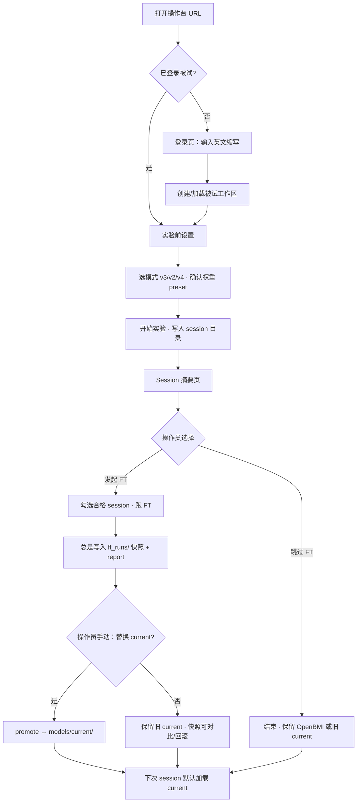

# 被试登录 · 按被试目录 · Session 后可选微调 — 需求方案

> 日期：2026-08-27 · 状态：**已落地（P0 登录/目录/采后 FT 面板）**  
> 背景：fnz 三次会话已验证「OpenBMI 底座 + 本被试 session 合并 FT + T0 replay」可行，但当前操作台仍靠手填 `subject_id` / `session_id`，FT 需另开终端跑 `ft_subject_from_v3.py`。下一版希望：**登录即建档、采完即选是否微调、下次 session 自动用最新权重**。  
> 相关：`fnz实验与微调采集方案_20260827.md` · `ft_subject_from_v3.py` · `openbmi_replay_pool.py` · `operator.html` · `run_config.py`

---

## 0. 文档目的

定义一套**以被试英文缩写为中心**的采集 + 离线微调工作流需求，供操作员日常实验与后续开发对齐。本文**只写需求与 SOP**，不含实现细节代码。

---

## 1. 核心目标

| # | 目标 | 说明 |
|---|------|------|
| G1 | **登录即身份** | 打开操作台前先输入被试英文缩写（如 `fnz`），系统识别/创建该被试工作区 |
| G2 | **目录按人隔离** | 同一缩写下：session 原始数据、权重、FT 报告、验收记录集中存放，互不串人 |
| G3 | **Session 后可选 FT** | 每次 v2/v3 采集结束，操作员在摘要页**主动选择**是否微调、合并哪些历史 session |
| G4 | **下次自动带权重** | 若该被试已有通过验收的 `best_*.pt`，新建 session 时模型 preset 默认指向该被试最新权重 |
| G5 | **与 fnz 策略一致** | FT：OpenBMI 底座 + T0-36 replay(0.10) + 全模型双头；**不在 session 内在线 FT**（v3 权重只读） |
| G6 | **门控仅建议、人工晋升** | FT 完成**必存** `ft_runs/`；是否替换 `current/` **仅操作员确认** |

---

## 2. 用户流程（操作员视角）

### 2.1 总览



### 2.2 登录页（新增，在「实验前设置」之前）

| 项 | 需求 |
|----|------|
| **入口** | 操作台首屏；未登录时**不可**进入 setup/run（可保留「仅调试 · 跳过登录」隐藏入口，默认关闭） |
| **输入** | 单行：**被试英文缩写**（必填） |
| **格式** | `^[a-z][a-z0-9_]{1,15}$`，小写；首字符字母；禁止空格与中文（与现有 `subject_id` 校验一致） |
| **示例** | `fnz`、`zhang_ws`、`sub01` |
| **展示名（可选）** | 第二行可选填「备注/全名」，仅写入 `subject.json`，**不参与路径** |
| **记住** | 浏览器 localStorage 记「上次登录缩写」；同机多人时可一键切换 |
| **确认** | 点「进入操作台」→ 后端/前端加载该被试 manifest |

**登录后顶部状态条（常驻）：**

```
当前被试：fnz · 第 3 次 session (ws03) · 权重：fnz 专用 v2 (ws01+ws02 FT)
```

### 2.3 实验前设置（相对现状的变更）

| 现状 | 新需求 |
|------|--------|
| 手填 `subject_id` + `session_id` | **subject_id 由登录锁定**，setup 页只读展示 |
| `session_id` 手填 `ws01` | **系统自动递增**：读取该被试已有 session 数 → 建议 `ws{N+1}`；允许操作员改（需二次确认） |
| `save_root` 全局平铺 | 默认 `data/subjects/{subject_id}/sessions/`；全局 `data/sessions/` 仅作迁移兼容 |
| 模型 preset 手选 fnz 路径 | **权重下拉框**（见 **§3.5**）：默认 **OpenBMI 底座**；有被试 `current` 时默认选 **本被试 current** |

**权重下拉框（实验 · 仿真同一组件，见 §3.5）：**

- 除 **OpenBMI 底座** 外，列表项 **必须属于当前登录被试**（禁止跨人加载权重）  
- 每项展示：**谱系**（合并了哪些 session/run）+ **FT 生成时间** + **gate 状态**（current 另含 promote 时间）

### 2.4 Session 摘要页 · 微调面板（新增）

采集正常结束后，在现有摘要信息下方增加 **「被试微调」** 区块：

#### 2.4.1 前置条件提示（自动）

| 检查 | 不通过时 |
|------|----------|
| 本次 `acq_enabled=true` 且存在 `eeg.csv` | 灰显 FT 按钮：「未采集 EEG，不可微调」 |
| v4 质量 session | 仅提示「请先跑 v3」；不提供 FT |
| 电极质量（若已接 v4 指标） | 警告「Cz/CPz 平线 · 建议不并入 FT」 |
| 有效试次 ≥ 阈值（默认 12） | 警告仍可强制，但默认不勾选本次 |

#### 2.4.2 操作员选择项

| 控件 | 说明 |
|------|------|
| **是否微调** | 单选：`跳过` / `立即微调`（默认：**跳过**） |
| **合并 session** | 多选列表；每条显示：日期、**全试次窗 acc**、**valid 试次 primary acc**（两列并排）、电极告警 |
| **排除 invalid 试次** | 勾选框，默认 **关**（与 exp27 grid / 拍板配方一致：协议 cue 监督、含 invalid） |
| **epochs / replay** | 高级折叠，默认冻结：epochs=5, replay_ratio=0.10, pool=T0-36 |
| **替换 current** | FT 完成后**单独一步**：「替换为 current / 保留旧 current」；非自动 |
| **强制替换** | 高级：门控 FAIL 仍可 promote，须勾选 + 填写原因 |

#### 2.4.3 执行与反馈

| 步骤 | 行为 |
|------|------|
| 点「开始微调」 | 后端异步调用 `ft_subject_from_v3`；摘要页进度条 |
| 完成 | **始终**写入 `models/ft_runs/{timestamp}/`（best_task.pt、best_three.pt、meta.json、report.md、release_gate.json） |
| 门控展示 | **仅 three 头** G1/G2/G3/G4 作参考（见 §4.3）；task 头 heldout **仅展示、不作判据** |
| 操作员确认 | 按钮「**替换 current**」/「保留旧 current」；默认**不替换** |
| 取消 | 不写入 ft_runs（或仅写 partial 时标记 aborted） |

#### 2.4.4 摘要页快捷动作

| 按钮 | 作用 |
|------|------|
| **再采一场** | 保持登录 → 回到 setup，`session_id` 自动 +1 |
| **换被试** | 退出登录 → 登录页 |
| **打开报告** | 链接 `subjects/{id}/models/current/report.md` |
| **复制 FT 命令** | 供高级用户终端复现 |

---

## 3. 目录与数据模型

### 3.1 推荐目录树（实验 · 仿真同构）

**原则：** 每个被试 **单独一个根目录**，其下集中存放 **实验内容**、**实验记录**、**实验分析** 与 **权重**；实验板块用 `data/subjects/{subject_id}/`，仿真板块用 `data/sim_subjects/{subject_id}/`（如 `A01`），**子目录语义相同**。

```
experiment_game/data/subjects/          # 真机被试（小写缩写，如 fnz）
└── {subject_id}/
    ├── subject.json                 # 被试档案（创建时间、备注、session 计数）
    ├── index.json                   # 快速索引：session 列表、current 权重谱系、统计
    │
    ├── sessions/                    # 【实验内容】原始采集落盘
    │   ├── fnz_ws01_20260826_164149/
    │   │   ├── eeg.csv · events.jsonl · session.meta.json · run_config.json
    │   │   ├── alignment/ · v3_report.md · v3_trial_features.jsonl
    │   │   └── ...
    │   └── fnz_ws02_20260826_171537/
    │
    ├── models/                      # 【权重】
    │   ├── current/                 # 线上下一轮默认加载
    │   │   ├── best_task.pt · best_three.pt
    │   │   ├── meta.json            # FT 谱系（合并 session、训练时间、gate）
    │   │   ├── report.md · release_gate.json
    │   │   └── promote_log.json     # 晋升 current 的时间与来源 ft_run
    │   └── ft_runs/                 # 每次 FT 历史快照（可回滚、可重新 promote）
    │       └── 20260827_105712/
    │           ├── best_task.pt · best_three.pt · meta.json · report.md
    │           └── sessions_used.json   # 本次 FT 合并了哪些 session 目录
    │
    ├── records/                     # 【实验记录】操作与编排留痕
    │   ├── operator_log.jsonl       # 可选：登录、开 session、选权重、FT job
    │   └── campaigns/               # 可选： longitudinal / 仿真 Campaign manifest
    │       └── sim_20260827_001/manifest.json
    │
    └── analysis/                    # 【实验分析】跨 session 汇总（非单 session 原始数据）
        ├── summary.md               # 被试级进展摘要
        ├── session_compare.json     # 各场 acc、得分、电极、权重版本对照
        └── ft_lineage.md            # 权重链可视化（可选生成）
```

**仿真被试示例（`data/sim_subjects/A01/`）：**

```
sim_subjects/A01/
├── subject.json                     # source_mat: A01T.mat
├── sessions/A01_run3_20260827_153012/   # 实验内容：1 run = 1 session
├── models/current/                  # A01 专用权重（与 fnz 目录隔离）
├── records/campaigns/sim_.../       # run 队列、runs_consumed
└── analysis/campaign_summary.md     # Leave-Next / 得分链对照
```

**与现网兼容：**

- 已有 `data/sessions/fnz_ws*` 可通过一次性迁移脚本挂到 `subjects/fnz/sessions/`（或 symlink）
- 已有 `data/models/fnz/` 映射为 `subjects/fnz/models/current/`
- `create_session_dir` 的命名规则 **不变**：真机 `{subject_id}_{session_id}_{timestamp}`；仿真 `{subject_id}_run{N}_{timestamp}`

### 3.2 `subject.json`（被试档案）

```json
{
  "subject_id": "fnz",
  "display_name": "方某某",
  "created_at": "2026-08-26T16:00:00",
  "last_login_at": "2026-08-27T10:00:00",
  "session_count": 2,
  "next_session_suggest": "ws03",
  "notes": ""
}
```

### 3.3 `index.json`（被试索引，可由工具自动生成）

```json
{
  "subject_id": "fnz",
  "sessions": [
    {
      "dir": "sessions/fnz_ws01_20260826_164149",
      "session_id": "ws01",
      "started_at": "2026-08-26T16:41:49",
      "phase_mode": "v3_session",
      "n_trials": 36,
      "valid_rate": 0.33,
      "primary_acc": 0.33,
      "electrode_ok": true,
      "ft_eligible": true
    }
  ],
  "current_model": {
    "path": "models/current",
    "source_sessions": ["ws01", "ws02"],
    "source_session_dirs": ["sessions/fnz_ws01_20260826_164149", "sessions/fnz_ws02_20260826_171537"],
    "ft_run_id": "20260827_105712",
    "trained_at": "2026-08-27T10:57:12",
    "promoted_at": "2026-08-27T11:02:00",
    "release_pass": true,
    "label": "fnz · current · ws01+ws02 · FT 2026-08-27 10:57 · gate PASS"
  }
}
```

### 3.5 权重下拉框与谱系展示（实验 · 仿真共用）

操作台 Setup 页与 Campaign 编排页使用 **同一套权重选择器**。登录被试为 `fnz` 或 `A01` 时，下拉项 **仅两类来源**：

| 类型 | 是否可选 | 说明 |
|------|----------|------|
| **OpenBMI 底座** | ✅ 全局唯一 | 零样本；**不归属任何被试**；底座 run `run_20260822_094942` |
| **本被试 `models/current/`** | ✅ 默认（若存在） | 当前线上下一轮默认权重 |
| **本被试 `models/ft_runs/{ts}/`** | ✅ 高级折叠 | 历史 FT 快照；可手动选旧版对比 |
| **其他被试权重** | ❌ **禁止** | UI 不展示；后端校验 `meta.subject_id == 登录 subject_id` |

**下拉项展示格式（单行 label + 展开详情）：**

```text
OpenBMI 底座（零样本 · run_20260822_094942）

fnz · current · ws01+ws02 · FT 2026-08-27 10:57 · promote 11:02 · gate PASS

fnz · ft_runs/20260827_105712 · ws01+ws02 · FT 2026-08-27 10:57 · gate PASS

A01 · current · run3+run5 · FT 2026-08-27 15:36 · promote 15:40 · gate PASS
```

| 展示字段 | 来源 | 含义 |
|----------|------|------|
| **谱系 · session/run** | `meta.json` → `session` 或 `sessions[]`；仿真为 `run3+run5` | 该权重 **合并训练** 了哪些场采集 |
| **FT 生成时间** | `ft_runs/{ts}/` 目录名或 `meta.json` 写入时间 | 微调完成时刻 |
| **promote 时间** | `models/current/promote_log.json` → `promoted_at` | 操作员确认替换 current 的时刻（仅 current 项） |
| **gate** | `release_gate.json` → `pass` | PASS / FAIL（FAIL 仍可作参考，默认不自动选） |
| **底座** | `meta.json` → `base_*_ckpt` | 始终自 OpenBMI 底座 FT 起 |

**`models/current/meta.json` 必备谱系字段（FT 脚本写入 + promote 时刷新）：**

```json
{
  "subject_id": "fnz",
  "session": "ws01+ws02",
  "sessions": ["fnz_ws01_20260826_164149", "fnz_ws02_20260826_171537"],
  "session_ids": ["ws01", "ws02"],
  "trained_at": "2026-08-27T10:57:12",
  "ft_run_dir": "experiment_game/data/subjects/fnz/models/ft_runs/20260827_105712",
  "release_gate": { "pass": true },
  "base_task_ckpt": "…/openbmi_…/best_task.pt",
  "base_three_ckpt": "…/openbmi_…/best_three.pt"
}
```

**仿真 `A01` 示例：** `session_ids` 写 `["run3","run5"]`，`sessions` 写对应 `A01_run3_*` 目录名；Campaign manifest 的 `runs_consumed` 与权重谱系 **交叉引用**。

**默认选择规则：**

1. 无本被试 `current` → **OpenBMI 底座**  
2. 有 `current` 且 `release_gate.pass=true` → **本被试 current**  
3. `current` 为 FAIL → 仍默认 current，顶栏 **黄色警告**；操作员可改选底座或旧 `ft_runs`

**后端校验（开 session 前）：**

- `s3_task_ckpt` / `s3_three_ckpt` 路径中 `subjects/{登录id}/` 或 `sim_subjects/{登录id}/` 须与登录一致  
- 选 OpenBMI 底座时跳过被试校验  
- 写入 `run_config.json` → `experiment.active_weights`：含 `preset_id`、`lineage`、`trained_at`

**顶栏状态条（登录后常驻，与 §2.2 一致）：**

```text
当前被试：fnz · 第 3 次 session (ws03) · 权重：fnz current · ws01+ws02 · FT 2026-08-27 10:57
```

仿真：

```text
当前被试：A01 · Campaign 2/3 (run5) · 权重：A01 current · run3 · FT 2026-08-27 15:36
```

### 3.4 `run_config.json` 扩展

登录态写入：

```json
{
  "subject": {
    "subject_id": "fnz",
    "session_id": "ws03",
    "login_at": "2026-08-27T10:00:00"
  },
  "storage": {
    "save_root": "experiment_game/data/subjects/fnz/sessions",
    "subject_root": "experiment_game/data/subjects/fnz"
  },
  "experiment": {
    "active_weights": {
      "preset_id": "subject_fnz_current",
      "label": "fnz · current · ws01+ws02 · FT 2026-08-27 10:57 · gate PASS",
      "lineage_session_ids": ["ws01", "ws02"],
      "trained_at": "2026-08-27T10:57:12",
      "promoted_at": "2026-08-27T11:02:00",
      "release_pass": true
    },
    "v3_overrides": {
      "s3_task_ckpt": "experiment_game/data/subjects/fnz/models/current/best_task.pt",
      "s3_three_ckpt": "experiment_game/data/subjects/fnz/models/current/best_three.pt"
    }
  }
}
```

---

## 4. 微调策略（与 fnz 方案对齐）

Session 后触发的 FT **必须**与 `fnz实验与微调采集方案_20260827.md` §2 一致，此处只强调**操作员可控点**：

| 固定项 | 值 |
|--------|-----|
| 底座 | OpenBMI `run_20260822_094942` |
| 训练数据 | **仅**勾选的该被试 session |
| Replay | T0-36，ratio=0.10；three + task 双头同策略 |
| 划分 | 按试次 70/30 heldout（heldout 不含 replay） |
| 默认含 invalid | **是**（协议 cue 标签；与 exp27 grid 一致） |

### 4.3 发布门控（仅 three · 参考项 · 不自动晋升）

门控**不阻止保存**、**不自动替换 current**；面板展示供操作员判断。

| # | 检查项 | 阈值 | 说明 |
|---|--------|------|------|
| G1 | three heldout acc | ≥ 0.40 | 与 exp27 预注册一致 |
| G2 | three heldout 任一类 pred 占比 | < 60% | 防 Left/Right 塌缩 |
| G3 | three heldout 三类均有 pred | 是 | 与 G2 互补 |
| G4 | train − heldout acc | < 0.35 | **exp27 回测 26/26 ok 臂全过**；B2 双轨 gap=−0.011 / 0.191 |

**task 头：** 同配方 FT 后报告 heldout acc 与 Rest/MI pred 分布，UI 标「**参考**」——**不作发布判据**（二分类无法反映 Left/Right 塌缩；fnz task heldout 常虚高 ~70%）。

**工具现状（2026-08-27）：** `ft_subject_from_v3.py` 已接 T0 replay（three + task）；CLI 仍将门控 FAIL 时 exit(1)——**P1 改为始终写 `ft_runs/` + 人工 promote**。

### 4.4 task 串行门控（在线推理 · 实验 27 延伸）

脚本：`experiment_game/tools/exp27_serial_gating_eval.py`  
报告：`experiment_game/data/models/fnz/exp27/serial_gating_eval.md`

| 场景 | three only (task_p_on=0) | 最佳 gated | 最佳 task_p_on | 结论 |
|------|--------------------------|------------|----------------|------|
| S 轨 → ws02（B2/B3/A1） | 0.450 | 0.450 | **0.0** | **无收益**；开闸 Rest 增多、**Right→0** |
| M 轨 → ws03（B2/B1/CURRENT） | 0.417–0.444 | 0.444–0.472 | **0.3** | **+2.8pp**，绝对仍 ~47%；可选试验 |
| OpenBMI 底座 → ws02 | 0.250 | 0.300 | 0.3 | 略升但高阈值全 Rest |

**拍板：v3 探针默认 `task_p_on=0`（纯 three）**；若合并 FT 后在 ws03 类仍偏 Left，可在操作台高级项试 **0.3**（勿用 0.6+，易 Rest 塌缩）。

### 4.5 操作员决策树（采完后）

```
本次 session 结束
    │
    ├─ 电极/采集不合格 → 不勾选本次 · 不 FT（或仅合并历史）
    │
    ├─ 第 1 场合格 session → 可选 FT，UI 提示「建议 ≥2 场再 FT」
    │
    ├─ 第 2+ 场 → 默认勾选 electrode_ok 的历史 + 本次
    │
    └─ FT 完成 → 必存 ft_runs/ → 操作员手动选是否 promote current
```

### 4.6 与 v2 轮间 FT 的边界

| 模式 | Session 内 | Session 后（本方案） |
|------|------------|----------------------|
| **v3 探针** | 权重只读 | ✅ 操作员可选离线 FT |
| **v2 游戏** | 轮间 FT 产物**仅**存会话目录 | ✅ Session 后全量 FT → 经门控参考 + **人工** promote |
| **v4 质量** | 无模型 | ❌ 不提供 FT |

**硬规则：** v2 轮间权重 **不得直接写入 `models/current/`**；只有 Session 后 FT + 操作员确认可 promote。

---

## 5. 后端 / API 需求（概要）

| 接口 | 方法 | 作用 |
|------|------|------|
| `/api/subject/login` | POST | `{subject_id}` → 创建目录 + 返回 `subject.json` / `index.json` |
| `/api/subject/current` | GET | 当前登录被试（WS 会话绑定） |
| `/api/subject/{id}/sessions` | GET | 列表 + 每条 ft_eligible 摘要 |
| `/api/subject/{id}/suggest-session-id` | GET | 返回 `ws03` 等 |
| `/api/subject/{id}/finetune` | POST | `{session_dirs[], exclude_invalid, force_publish}` → 异步 job |
| `/api/finetune/{job_id}` | GET | 进度 / 结果 / report |

实现可阶段落地：**P0** 仅 CLI 包装 + 操作台发 shell job；**P1** 独立 Python worker + WS 推送进度。

**FT 实现复用：**

```bash
python experiment_game/tools/ft_subject_from_v3.py \
  --session experiment_game/data/subjects/fnz/sessions/fnz_ws01_... \
  --session experiment_game/data/subjects/fnz/sessions/fnz_ws02_... \
  --out-dir experiment_game/data/subjects/fnz/models/ft_runs/{ts}
# 操作员在 UI 确认后再 promote → models/current/（非脚本自动）
```

**并发：** 被试级 FT job 单锁；FT 进行中禁用「再采一场」或提示 GPU 占用。

---

## 6. UI 线框（登录 + 摘要 FT）

### 6.1 登录页

```
┌─────────────────────────────────────────┐
│  操作台 · 被试登录                        │
├─────────────────────────────────────────┤
│  英文缩写  [ fnz____________ ]            │
│  备注（可选）[ 方某某 · 右利手 ]           │
│                                         │
│  [ 进入操作台 ]                            │
│  上次：fnz · 2026-08-27                  │
└─────────────────────────────────────────┘
```

### 6.2 Setup · 权重下拉（实验 · 仿真共用）

```
┌─ 模型权重 ────────────────────────────────────────────────┐
│ 权重  [ fnz · current · ws01+ws02 · FT 08-27 10:57 ▼ ]   │
│       ├ OpenBMI 底座（零样本 · run_20260822_094942）      │
│       ├ fnz · current · ws01+ws02 · FT 08-27 10:57 · PASS │  ← 默认
│       └ fnz · ft_runs/20260826_183012 · ws01 · FAIL       │  （高级）
│ 详情  谱系 ws01+ws02 · promote 08-27 11:02 · 底座 OpenBMI  │
└───────────────────────────────────────────────────────────┘
```

仿真 Campaign Setup 同组件，谱系显示 `run3+run5` 等（见 [`仿真板块_BCI2a_v3_20260827.md`](仿真板块_BCI2a_v3_20260827.md) §5.3.2）。

### 6.3 Session 摘要 · 微调区

```
┌─ 被试微调 ────────────────────────────────┐
│ 当前权重：fnz ws01+ws02 (gate PASS)        │
│                                           │
│ ☑ fnz_ws01  valid 33%  acc 33%  电极 OK   │
│ ☑ fnz_ws02  valid 30%  acc 30%  电极 OK   │
│ ☑ fnz_ws03（本次） valid 44%  ⚠ Cz 平线   │
│                                           │
┌─ 被试微调 ────────────────────────────────┐
│ 当前 current：fnz ws01+ws02 · t0+0.10      │
│                                           │
│ ☑ ws01  窗acc 33%  valid-primary 33%  OK  │
│ ☑ ws02  窗acc 30%  valid-primary 30%  OK  │
│ ☐ ws03  窗acc 36%  valid-primary 36%  ⚠Cz │
│                                           │
│ ☐ 排除 invalid（默认关）                    │
│ ○ 跳过微调   ● 立即微调                    │
│ [ 开始微调 ]                               │
│ ── FT 完成 ──                              │
│ three ho 43% · task ho 69%(参考) · G1–G4   │
│ [ 替换 current ]  [ 保留旧 current ]        │
│ [ 再采 ws04 ]  [ 换被试 ]                  │
└───────────────────────────────────────────┘
```

---

## 7. Session 合格性 · 自动标注规则

| 字段 | 规则 | 来源 | P0 前置 |
|------|------|------|---------|
| `electrode_ok` | Cz/CPz 非全程 flat | `tools/scan_session_electrode.py` / `session_electrode.py` | ✅ |
| `window_acc` | 全试次 argmax(p_three) vs cue | events.jsonl / 离线回放 | P1 |
| `primary_acc` | valid 试次 MI 多数票 | v3 report（**有偏**，仅辅） | 已有 |
| `ft_eligible` | `electrode_ok` ∧ 三类 cue 出现 | index 服务 | 依赖 electrode 工具 |
| 默认勾选 | `ft_eligible=true` 的 session | 无 electrode 工具前 **默认不自动勾选** | — |

操作员**始终可手动取消勾选**（ws03 Cz/CPz dead 为典型反例）。

---

## 8. P0 前置与迁移（开工前必做）

| # | 项 | 状态 / 动作 |
|---|-----|-------------|
| 1 | 登记表与 docs 实验27 **决策同步** | ✅ 见 `资料/.../结果登记表.md` 决策日志 |
| 2 | `ft_subject_from_v3.py` T0 replay | ✅ 已接（three + task） |
| 3 | 门控 G4 回测 | ✅ exp27 26 ok 臂 0 失败 |
| 4 | 电极平线检测小工具 | ✅ `tools/scan_session_electrode.py` |
| 7 | CLI 改「必存 ft_runs + 人工 promote」 | ✅ 已实现（门控仅建议，不 exit） |

**迁移映射（fnz）：**

```
data/sessions/fnz_ws*     → data/subjects/fnz/sessions/   （或 symlink）
data/models/fnz/          → data/subjects/fnz/models/current/  （确认已是 t0+0.10 重训版）
```

---

## 9. 待拍板项

| # | 议题 | 建议默认 |
|---|------|----------|
| 1 | 目录根 | **新被试 `subjects/{id}/`**；fnz 迁移可选 |
| 2 | 第 1 场 FT | **允许 + 强提示** |
| 3 | 门控 FAIL | **不自动 promote**；ft_runs 仍保留 |
| 4 | v2 轮间 → current | **禁止直连**；仅 Session 后 FT + 人工 promote |
| 5 | 登录 PIN | **否**（二期） |
| 6 | session_id | **`wsNN`** |
| 7 | 微调默认 | **跳过** |
| 8 | 多机 NAS | 无本地目录时 **新建或从 NAS 同步** subject 树 |
| 9 | task_p_on | **0**（v3）；M 轨可试 **0.3** |

---

## 10. 实施分期

| 阶段 | 内容 | 产出 |
|------|------|------|
| **P0 前** | 电极平线工具 + current 确认 t0+0.10 | 合并列表可信 |
| **P0** | 登录页 + subject 目录 + session_id 递增 | 建档 |
| **P1** | FT 面板：必存 ft_runs + 人工 promote + 门控参考 | 采完微调闭环 |
| **P1** | `index.json`（窗 acc + primary 双列） | 列表不误导 |
| **P1** | `ft_subject_from_v3` 去掉 FAIL exit(1) | 与 UI 一致 |
| **P2** | fnz 迁移 + v2 轮间隔离 + FT job 锁 | 完整运维 |

---

## 11. 与现有文档关系

| 文档 | 关系 |
|------|------|
| `fnz实验与微调采集方案_20260827.md` | §2 微调算法与门控 **不变**；本文补 **操作流 + 目录 + UI** |
| `实验27_fnz_replay方案对比_20260827.md` | replay 参数 + 在线 leaderboard |
| `exp27/serial_gating_eval.md` | task 串行门控 vs 纯 three |
| `v3零样本探针会话设计_20260824.md` | v3 采集中不在线 FT |
| `仿真板块_BCI2a_v3_20260827.md` | 仿真被试 `sim_subjects/A01` 目录同构；权重规则 **共用 §3.5** |

---

## 12. 修订记录

| 日期 | 说明 |
|------|------|
| 2026-08-27 | 初稿：登录缩写建档 + subjects 目录 + Session 摘要页可选 FT |
| 2026-08-27 | 评审修订：门控仅参考/人工 promote、exclude_invalid 默认关、task 头不作判据、P0 前置清单、串行门控结论 |
| 2026-08-27 | **代码落地**：subject_registry、登录页、摘要 FT 面板、ft_runs 必存、电极扫描工具 |
| 2026-08-27 | §3.1 扩展 sessions/models/**records/analysis** 四象限；§3.5 权重下拉谱系（实验·仿真共用）；§6.2 Setup 权重 UI |
