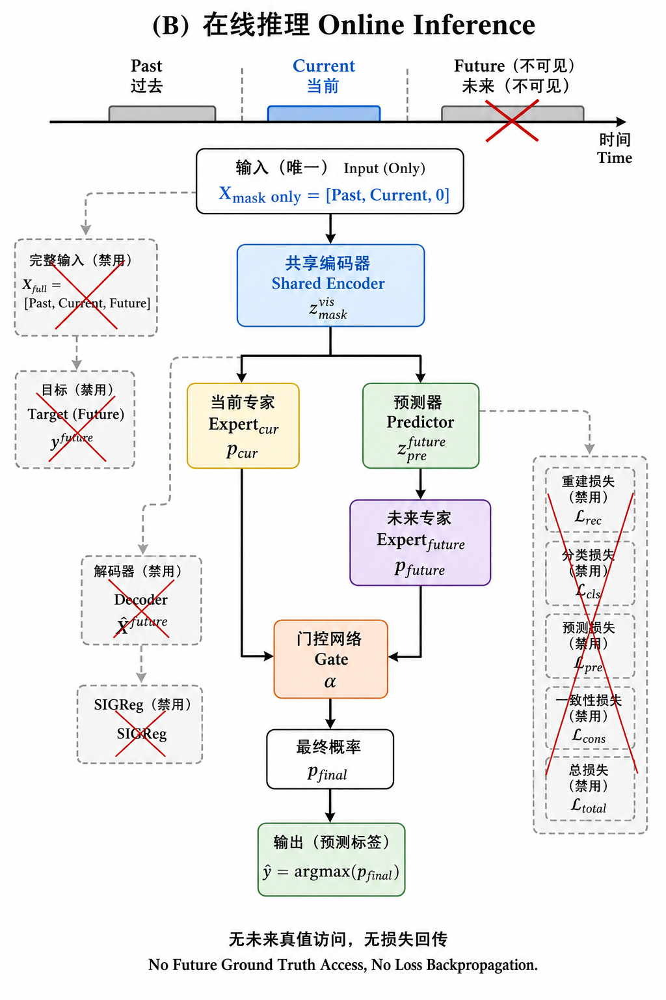

# 基于掩码未来表征预测与双专家门控融合的在线 MI-EEG 分类定稿方案

> 版本：v1.11（v1.10 方法冻结 + **5090 B/C 实证回填** + v2 迭代方向）  
> 日期：2026-08-20  
> 定位：面向在线流式推理的窗级运动想象分类；训练可访问未来真值，推理严格无未来泄漏。  
> **主数据：OpenBMI**（`openbmi_2s_hop100`，sess01+02；250 Hz / 8 导 / 当前窗 2 s / hop 100 ms），在此基础上扩展 past/future 切片。  
> 排版说明：独立公式一律使用双美元定界符；行内符号尽量用代码记号（如 `X_mask`）。  
> **配置立场**：方法默认已冻结（见 §3 / §10）；对照、消融、扫描**全部必做**，见 `实验方案/`；选模口径见 [`协议_滑窗投票与Acc_paper.md`](./实验方案/协议_滑窗投票与Acc_paper.md)。

---

## 0. 方案摘要

本方案采用**等长双路输入 + 共享编码器 + 停梯度未来目标 + 隐空间未来预测 + μ/β 生理约束 + 双专家概率门控融合**：

1. 构造 1000 点完整样本 `X_full = [X_past, X_cur, X_future]`；
2. 构造等长掩码输入 `X_mask = [X_past, X_cur, 0_future]`（训练与推理统一）；
3. 共享 Encoder 分别编码两路；`X_full` 路 **no_grad** 截取未来段作目标，监督 Predictor 输出 `z_pre^future`；
4. Decoder + PSD/μ/β 约束预测表征的生理有效性（**P2，必做**）；
5. `Expert_cur` / `Expert_future` + Gate 融合得到 `p_final`；
6. SIGReg 约束 `z_mask` 可见段表征，抑制多任务坍塌。

**5090 实证摘要（2026-08，见 §16）**：主线 **A1 仍是 Acc_paper 主增益**（+3 pp vs A0）；`L_pred` 与 `CE(p_final)` 为 P1 必要组件（B1/B7 各 −1 pp）；双专家在 5090 上 **P1≈A1**（5060 上 P1&lt;A1）；**可学习 Gate ≈ 固定 α=0.5**（B5b）；P2 完整 Decoder **对均值贡献有限**（C1≈P2），但 **时域 MSE 关键**（C2c −0.48 pp）；**去 PSD 的 C2a 为 5090 最高非 oracle 配置**（0.5758，附报）。主表仍报 **P2**（两机定稿 + 5060 最稳 std）。

**明确不采用**：独立 Target-Encoder 吃 400 点短序列；同窗随机块掩码 JEPA（可作为远期对照，非主线）。

---

## 1. 问题设定与设计目标

### 1.1 任务

- 数据集：**OpenBMI**（`openbmi_2s_hop100`，sess01+02；与仓库 OpenBMI Acc_paper 臂一致）。
- 通道：8 导（与 OpenBMI 预处理通道序一致）。
- 采样率：250 Hz。
- 类别：按现有 OpenBMI `label_map` / Rest 设定（实现时与 `openbmi_2s_hop100` 标签体系统一）。
- 评估主指标：试次 **Acc_paper**（见协议）；论文宣称“在线”时补充流式推理延迟说明。

### 1.2 要解决的痛点

| 痛点 | 对策 |
|------|------|
| 单 2 s 窗时序上下文不足 | past 0.4 s 缓存 + 隐空间外推 future 1.6 s |
| 在线不可见未来 | 训练用 `X_full` 当老师；推理只跑 `X_mask` |
| 多任务表征坍塌 | stop-grad 目标 + SIGReg |
| 隐表征缺乏生理意义 | Decoder + PSD/μ/β（P2） |
| 噪声/漂移下单路不稳 | 双专家 + 可学习 Gate |

### 1.3 训练–推理契约（硬约束）

| 项目 | 训练 | 在线推理 |
|------|------|----------|
| `X_mask` | ✅ | ✅（唯一输入） |
| `X_full` | ✅（仅 target 支路） | ❌ |
| Decoder / `L_dec` | ✅ **仅 P2** | ❌ |
| 全部损失 / SIGReg 损失 | ✅（按方案开关） | ❌ |
| Predictor / 双专家 / Gate | ✅（P1/P2；P0/A2 无双专家） | ✅（同左，无损失） |
| 未来真实波形 | 可读 | 不可读 |

---

## 2. 时序数据构造规范

### 2.1 三段划分（相对当前窗起点 t = 0）

| 区间 | 符号 | 点数 | 时间 | 维度 | 可见性 |
|------|------|------|------|------|--------|
| 历史缓存 | `X_past` | 100 | [-0.4, 0] s | R^{8×100} | 训练+推理 |
| 当前观测 | `X_cur` | 500 | [0, 2] s | R^{8×500} | 训练+推理 |
| 未来未知 | `X_future` | 400 | [2, 3.6] s | R^{8×400} | **仅训练** |

总跨度：从 t−0.4 到 t+3.6，共 **4.0 s / 1000 点**。  
（注：时间轴以当前窗为锚点，写作 [-0.4, 3.6] s，避免与“0～4 s”混淆。）

### 2.2 双路等长输入（核心数据结构）

$$
X_{\mathrm{full}}=[X_{\mathrm{past}},X_{\mathrm{cur}},X_{\mathrm{future}}]\in\mathbb{R}^{8\times 1000}
$$

$$
X_{\mathrm{mask}}=[X_{\mathrm{past}},X_{\mathrm{cur}},M_{\mathrm{future}}]\in\mathbb{R}^{8\times 1000}
$$

**掩码填充（定稿默认）**：

- `M_future = 0`（全零，形状 8×400）。
- 消融对照：可学习 mask token 广播填充。
- 不采用高斯噪声填充（训练/推理分布更难点对齐）。

**可见上下文**（概念量，用于叙述）：

$$
X_{\mathrm{vis}}=[X_{\mathrm{past}},X_{\mathrm{cur}}]\in\mathbb{R}^{8\times 600}
$$

实现上不必单独喂 600 点网络；统一喂 1000 点 `X_mask`，由编码后的时间维池化区分可见段。

### 2.3 与现有 `openbmi_2s_hop100` 对齐规则

现有协议：窗长 2.0 s，步长 100 ms，样本核心为 `X_cur`（500 点）；数据为 OpenBMI sess01+02。

本方案每个样本索引 t（当前窗起点）需额外读取：

- past：`[t − 0.4 s, t)`
- future：`(t + 2.0 s, t + 3.6 s]`

**边界与滑窗策略（冻结）**：

- **锚点**：与 `openbmi_2s_hop100` 相同——以当前窗 `X_cur`（500 点）为锚、**hop=100 ms** 滑窗；**不是**按 future 400 当步长去跳步。
- **训练必须有真 future（冻结）**：每个进入训练的样本，在该 **trial 内**必须能取满 past100+cur500+future400。实现上把滑窗范围裁到「向后仍够 1.6 s future」的锚点集合；**禁止**用零填 future 冒充 `X_full`；**禁止**对无 future 样本只训 CE、再 mask `L_pred`（本臂不做半监督尾窗）。这样每个 trial 上用于训练的窗**都有 future**，`L_pred`/`L_dec` 始终有真目标。
- **推理 / Acc_paper**：在线只需 past+cur（`X_mask`）；trial 尾部无 future 的锚点仍可评估（与训练窗集相比，评估可多出尾窗——属预期）。冷启动：可见 &lt;600 不预测；满 600 后每个 hop 均够（协议 §5）。
- 标签 y：**绑定当前窗** `X_cur`，与现有 2 s 窗标签一致。

### 2.4 张量约定（实现，冻结）

DataLoader / 模型输入与仓库 Shallow 一致，**不用** `(B,1,8,T)`：

| 字段 | 形状 | 说明 |
|------|------|------|
| `X_mask` | **(B, 8, 1000)** | 后 400 点已置零 |
| `X_full` | **(B, 8, 1000)** | 仅训练需要 |
| `y` | (B,) | 当前窗标签 |
| meta | — | subject / fold / trial_id / t0 等 |

- **A0**：`n_times=500`，输入 `(B, 8, 500)`。  
- **A1+ / P\***：上下文 `n_times=1000`；A0 与新方法 **分建模型**（`final_conv_length` 依赖 `n_times`），禁止共用按 500 初始化的分类头去跑 1000。  
- 推理只构造 `X_mask`。

---

## 3. 网络模块定稿

### 3.0 实现源与工程冻结（相对仓库代码）

| # | 项 | 冻结约定 |
|---|----|----------|
| 1 | 输入布局 | **`(B, 8, T)`**（见 §2.4） |
| 2 | 窗长 | 基线 500；新方法 1000；分建 Encoder |
| 3 | 分类头 | **弃用** Shallow 自带 `FinalClassifier`；只用 `forward_features` → 本方案 Expert / Gate |
| 4 | 特征时间索引 | 见 §3.2.1（**已采纳**解析映射 + 扰动单测） |
| 5 | 表征维 D | **开跑默认 D=40**；**必做消融** `Linear(40→128)`（L1 / 结果表比 Acc_paper，谁好用谁回填 P1） |
| 6 | batch | **256 / 512**（协议）；OOM 阶梯见 §3.0.1 |
| 7 | patience | **20**（OpenBMI Acc_paper；不用 self_model 的 18） |
| 8 | L1 骨干 | EEGNet / Deep4 同要求：必须能拿出 **带 T′ 的特征图** 再 segment 读出（禁止只接库版全局 logits） |
| 9 | SIGReg | 见 §3.7：实现对齐 LeJEPA 官方，非自创公式 |
| 10 | 双前向显存 | 见 §3.0.1 |
| 11 | 训练窗 | 同 hop100 锚点；**仅 past+cur+future 齐全的窗进训练**（保证每窗/每 trial 训练段有真 future） |
| 12 | 在线不足不预测 | 见协议 §5：**仅冷启动**（可见&lt;600）；之后每 hop 均够 |

#### 3.0.1 双路前向与显存（#10 冻结）

- mask 路：`Z_mask = Encoder(X_mask)`，**保留梯度**（分类 / `L_pred` / SIGReg 反传进 Encoder）。  
- full 路：`with torch.no_grad(): Z_full = Encoder(X_full)`，再 `Pool` 得 `z_target^future`（与对 target **sg** 等价，且省激活显存）。  
- 开跑 batch 仍 **256/512**；OOM 时按 **128/256 → 64/128** 降，并在 meta 写明；优先开 AMP（与 OpenBMI 正式臂一致）。  
- **禁止**为省事把 `X_full` 误接到可反传的分类 CE 上。

### 3.1 模块清单与启停

> **P1（主结果，无 Decoder）** 与 **P2（+Decoder，必做）** 分开；下表「完整/P2」含 Decoder。流程图训练图按完整/P2 示意。

| 模块 | P1 训练 | P2 训练 | 推理 | 参数更新 | 功能 |
|------|---------|---------|------|----------|------|
| Shared Encoder | ✅ | ✅ | ✅ | ✅（仅经 mask 路径及分类/预测反传） | 时空特征 → **时间维**表征序列 |
| Future Predictor | ✅ | ✅ | ✅ | ✅ | `z_mask^vis` → `z_pre^future` |
| Decoder | ❌ | ✅ | ❌ | ✅（仅 P2） | `z_pre^future` → `X̂_future` |
| SIGReg | ✅（损失） | ✅ | ❌ | 无参 | 约束可见表征分布 |
| `Expert_cur` | ✅ | ✅ | ✅ | ✅ | `z_mask^vis` → `p_cur` |
| `Expert_future` | ✅ | ✅ | ✅ | ✅ | `z_pre^future` → `p_future` |
| Gate | ✅ | ✅ | ✅ | ✅ | 输出 α ∈ (0, 1) |
| Target 支路（`X_full` 前向） | ✅ | ✅ | ❌ | **no_grad / sg，不经此路更新** | 提供 `z_target^future` |

### 3.2 Shared Encoder（必须保留时间维）

**实现源（冻结）**：

| 方案 | Encoder 代码源 | 说明 |
|------|----------------|------|
| **A0** | `braindecode.models.ShallowFBCSPNet` | 与 OpenBMI Acc_paper 正式臂一致，公平对照 |
| **A1+ / P0+** | [`self_model/shallowfbcsp.py`](../../../../self_model/shallowfbcsp.py) | **自写**、结构对齐 braindecode 默认；用 `forward_features` 取 `(B, D, T', 1)`；**禁止**与 braindecode 权重混载 |

**硬性要求（凡含 `L_pred`）**：必须经 `forward_features` 得到时间维特征，再 segment mean；**禁止** Encoder 只输出单一全局向量后做预测；**禁止**再接 Shallow 原 `final_layer` 当本方案分类头。

记（实现上先 `squeeze` 掉末维 1）：

$$
Z=\mathrm{forward\_features}(X)\in\mathbb{R}^{B\times D\times T'},\quad D=40
$$

#### 3.2.1 特征时间索引 `I_vis` / `I_future`（#4 冻结默认）

**问题**：输入上 past/cur/future = 100/500/400，但 Shallow 有 `ConvTime(k=25)` + `AvgPool(75, stride=15)`，**原始点数比例 ≠ 特征 T′ 下标**。

**冻结做法（解析映射，开跑即用）**：

1. 对输入时间下标 `t∈{0,…,999}`，用与实现一致的公式得到特征下标（与 `pool` 对齐；实现时写死同一函数）：
   - 卷积后长度 `T1 = n_times - (filter_time_length - 1)`（默认 `n_times=1000` → `T1=976`）；
   - 池化后 `T' = ⌊(T1 - pool_time_length)/pool_time_stride⌋ + 1`（默认 75/15）；
   - 将 raw 边界映射到特征轴：对边界 `t_b ∈ {0, 100, 600, 1000}`，取落在该 raw 时刻的特征格（可用格中心反推或线性 `round(t/(n_times-1)*(T'-1))`，**全仓统一一种**并单测锁定）。
2. `I_vis` = 覆盖 raw `[0, 600)` 的特征下标；`I_future` = 覆盖 raw `[600, 1000)` 的特征下标。若边界格重叠，**划给 future**（避免可见段吃到未来泄漏）。
3. **必做单测**：只扰动 `X_full` 的 future 400 点（可见段不动）→ `Z[I_future]` 变化应显著大于 `Z[I_vis]`；反之只扰动 past+cur → 主要动 `I_vis`。

L1 允许改为「感受野表精标定」替换线性映射，但须通过同一单测。

池化读出：

$$
z_{\mathrm{mask}}^{\mathrm{vis}}=\mathrm{mean}\big(Z_{\mathrm{mask}}[I_{\mathrm{vis}}]\big)\in\mathbb{R}^{B\times D}
$$

$$
z_{\mathrm{target}}^{\mathrm{future}}=\mathrm{mean}\big(Z_{\mathrm{full}}[I_{\mathrm{future}}]\big)\in\mathbb{R}^{B\times D}
$$

$$
z_{\mathrm{pre}}^{\mathrm{future}}=\mathrm{Predictor}\big(z_{\mathrm{mask}}^{\mathrm{vis}}\big)
$$

骨干：**P0 起**落地自写 Shallow；EEGNet / Deep4 为 **L1 必做**对照（同样要 feature 时间维，见 §3.0 #8）。

### 3.3 Target 策略（冻结默认）

**冻结：共享权重 + stop-gradient**

$$
L_{\mathrm{pred}}=\big\|z_{\mathrm{pre}}^{\mathrm{future}}-\mathrm{sg}\big(z_{\mathrm{target}}^{\mathrm{future}}\big)\big\|_{2}^{2}
$$

- `X_full` 与 `X_mask` 共用同一 Encoder 权重；
- target 路径只前向，对 `z_target^future` 施加停梯度算子 sg(·)；
- **不**使用随机初始化后永久冻结的第二套 Encoder。

**必做消融**：无 sg（B2）；EMA target（B10）。

### 3.4 Future Predictor

- 输入：`z_mask^vis`，形状 (B, D)
- 输出：`z_pre^future`，形状 (B, D)（与 target 同维）
- 结构：2～3 层 MLP（开跑锚点见 P1）；保持参数量远小于 Encoder。

### 3.5 Decoder（仅 P2；P2 为必做）

$$
\hat{X}_{\mathrm{future}}=\mathrm{Decoder}\big(z_{\mathrm{pre}}^{\mathrm{future}}\big)\in\mathbb{R}^{B\times 8\times 400}
$$

仅训练使用；用于 PSD/μ/β（**必做含**轻量时域 MSE，权重见 §4.2；C 系列再拆子项）。开跑：`Linear(D → 8*400)` 再 `view(B,8,400)`。

**5090 C 系列实证**：C1（无 Decoder）与 P2 均值差 **0.1 pp**；C2c（去 time MSE）−0.48 pp → **时域波形对齐是 Decoder 主贡献**；C2a（去 PSD 项）**0.5758 ≈ A1**，提示 PSD 项可能与其它子项冲突——**附报 C2a**，5060 复现前 **不替换 P2 定稿**（见 §16.3）。

### 3.6 双专家与 Gate

$$
p_{\mathrm{cur}}=\mathrm{Softmax}\big(\mathrm{Expert}_{\mathrm{cur}}(z_{\mathrm{mask}}^{\mathrm{vis}})\big)
$$

$$
p_{\mathrm{future}}=\mathrm{Softmax}\big(\mathrm{Expert}_{\mathrm{future}}(z_{\mathrm{pre}}^{\mathrm{future}})\big)
$$

**冻结默认（P1/P2）**：Gate **仅吃两个表征**（不含概率）：

$$
\alpha=\sigma\Big(\mathrm{Gate}\big([z_{\mathrm{mask}}^{\mathrm{vis}},\,z_{\mathrm{pre}}^{\mathrm{future}}]\big)\Big)
$$

**必做变体（L1）**：Gate 输入改为 `[z_{\mathrm{mask}}^{\mathrm{vis}}, z_{\mathrm{pre}}^{\mathrm{future}}, p_{\mathrm{cur}}, p_{\mathrm{future}}]`。

$$
p_{\mathrm{final}}=\alpha\,p_{\mathrm{cur}}+(1-\alpha)\,p_{\mathrm{future}}
$$

- 两专家结构对称（同宽度 MLP），**不共享**分类头权重；输入维 **D=40**（#5）。
- Gate：小 MLP，最后经 Sigmoid 得到标量 α。

### 3.7 SIGReg（#9，对齐论文实现）

**文献与代码（必须引用，禁止按名字自创）**：

- 论文：Balestriero & LeCun, *LeJEPA: Provable and Scalable Self-Supervised Learning Without the Heuristics*, **arXiv:2511.08544**
- 官方实现：[`rbalestr-lab/lejepa`](https://github.com/rbalestr-lab/lejepa)（包名 `lejepa`）

**本方案用法（冻结开跑）**：

$$
L_{\mathrm{SIGReg}}=\mathrm{SIGReg}\big(z_{\mathrm{mask}}^{\mathrm{vis}}\big),\quad z_{\mathrm{mask}}^{\mathrm{vis}}\in\mathbb{R}^{B\times D}
$$

| 项 | 取值 |
|----|------|
| 调用形态 | `SlicingUnivariateTest(univariate_test=EppsPulley(...), num_slices=…)` 或官方等价 API |
| `num_slices` | **1024**（论文常用量级；若显存/耗时过大可在 meta 改为 512 并记录） |
| Epps–Pulley `num_points` | 跟官方默认（常见 17） |
| 作用对象 | 仅 `z_mask^vis`（batch 维当样本） |
| 可学习参数 | 无 |

**与 LeJEPA 全文的差异（写进论文 Methods）**：本方法**保留**共享 Encoder + **stop-grad / no_grad 未来目标**；只借用 **SIGReg 实现与超参习惯**，**不**宣称复现 LeJEPA（LeJEPA 主张去掉 stop-grad 等启发式）。

仅训练计算。

---

## 4. 多任务损失（完整公式）

### 4.1 隐表征预测损失

$$
L_{\mathrm{pred}}=\frac{1}{BD}\sum_{b=1}^{B}\sum_{d=1}^{D}\Big(z_{\mathrm{pre}}^{\mathrm{future}}-\mathrm{sg}\big(z_{\mathrm{target}}^{\mathrm{future}}\big)\Big)_{b,d}^{2}
$$

### 4.2 生理重构损失（P2）

对 `X̂_future` 与 `X_future`：

1. 按通道或通道均值估计功率谱密度 PSD(·)；
2. 频带能量：μ 节律为 8–13 Hz，β 节律为 13–30 Hz。

$$
L_{\mathrm{psd}}=\big\|\mathrm{PSD}(\hat{X}_{\mathrm{future}})-\mathrm{PSD}(X_{\mathrm{future}})\big\|_{1}
$$

$$
L_{\mu}=\big\|\hat{P}_{\mu}-P_{\mu}\big\|_{1}
$$

$$
L_{\beta}=\big\|\hat{P}_{\beta}-P_{\beta}\big\|_{1}
$$

$$
L_{\mathrm{time}}=\big\|\hat{X}_{\mathrm{future}}-X_{\mathrm{future}}\big\|_{2}^{2}
$$

（`L_time` **必做纳入** P2，小权重；是否去掉由 C2c 必做消融。）

$$
L_{\mathrm{dec}}=\lambda_{\mathrm{psd}}L_{\mathrm{psd}}+\lambda_{\mu}L_{\mu}+\lambda_{\beta}L_{\beta}+\lambda_{\mathrm{time}}L_{\mathrm{time}}
$$

**`L_dec` 内冻结比例（P2）**：

$$
\lambda_{\mathrm{psd}}:\lambda_{\mu}:\lambda_{\beta}:\lambda_{\mathrm{time}}=1:1:1:0.1
$$

### 4.3 分类损失

**P1/P2 冻结默认**（两项）：

$$
L_{\mathrm{cls}}=L_{\mathrm{CE}}(p_{\mathrm{cur}},y)+L_{\mathrm{CE}}(p_{\mathrm{final}},y)
$$

**完整三项形式**（必做变体 B6 / L1）：

$$
L_{\mathrm{cls}}^{\mathrm{(3)}}=L_{\mathrm{CE}}(p_{\mathrm{cur}},y)+L_{\mathrm{CE}}(p_{\mathrm{future}},y)+L_{\mathrm{CE}}(p_{\mathrm{final}},y)
$$

说明：`p_future` 使用当前窗标签，隐含“短时意图稳定”假设；**不得**把三项误写成 P1 默认。

### 4.4 总损失

$$
L_{\mathrm{total}}=\lambda_{\mathrm{pred}}L_{\mathrm{pred}}+\lambda_{\mathrm{dec}}L_{\mathrm{dec}}+\lambda_{\mathrm{sig}}L_{\mathrm{SIGReg}}+\lambda_{\mathrm{cls}}L_{\mathrm{cls}}
$$

**冻结起步权重**：

| 权重 | P1 | P2 | 备注 |
|------|----|----|------|
| `λ_cls` | 1.0 | 1.0 | 主任务 |
| `λ_pred` | 1.0 | 1.0 | 与分类同量级起步 |
| `λ_sig` | 0.05 | 0.05 | 过强会伤判别；L1 必扫 |
| `λ_dec` | **0**（无 Decoder） | **0.2** | 仅 P2 |

P0/A2：`λ_dec=0`，无 Gate / `Expert_future`（见第 6 节与实验方案）。

---

## 5. 训练与推理流程

### 5.1 离线训练（一个 iteration）

1. 取一个 batch：掩码输入 `X_mask`、完整输入 `X_full`、标签 y。
2. 编码掩码支路：

$$
Z_{\mathrm{mask}}=\mathrm{Encoder}(X_{\mathrm{mask}})
$$

$$
z_{\mathrm{mask}}^{\mathrm{vis}}=\mathrm{Pool}\big(Z_{\mathrm{mask}}[I_{\mathrm{vis}}]\big)
$$

并计算 `L_SIGReg`。

3. 编码目标支路（**整段 no_grad**，等价 sg）：

$$
Z_{\mathrm{full}}=\mathrm{Encoder}(X_{\mathrm{full}})\quad(\texttt{torch.no\_grad})
$$

$$
z_{\mathrm{target}}^{\mathrm{future}}=\mathrm{mean}\big(Z_{\mathrm{full}}[I_{\mathrm{future}}]\big)
$$

4. 未来表征预测：

$$
z_{\mathrm{pre}}^{\mathrm{future}}=\mathrm{Predictor}\big(z_{\mathrm{mask}}^{\mathrm{vis}}\big)
$$

$$
L_{\mathrm{pred}}=\big\|z_{\mathrm{pre}}^{\mathrm{future}}-z_{\mathrm{target}}^{\mathrm{future}}\big\|_{2}^{2}
$$

5. （P2）解码并计算生理损失：

$$
\hat{X}_{\mathrm{future}}=\mathrm{Decoder}\big(z_{\mathrm{pre}}^{\mathrm{future}}\big)
$$

随后计算 `L_dec`。

6. 双专家与门控：由 `p_cur`、`p_future` 经 Gate 得到 α，再得到 `p_final`，并计算 `L_cls`。
7. 由 `L_total` 反向传播，更新 Encoder、Predictor、（P2 时）Decoder、双专家与 Gate。  
   **注意**：第 3 步不得让梯度流入 target 路径。

### 5.2 在线推理

1. 实时缓冲拼出 `X_past`、`X_cur`，未来段填零，得到 `X_mask`。
2. Encoder 提取 `z_mask^vis`。
3. `Expert_cur` 得到 `p_cur`；Predictor → `Expert_future` 得到 `p_future`。
4. Gate 融合得到 `p_final`，预测类别为

$$
\hat{y}=\arg\max_{c}\,p_{\mathrm{final}}^{(c)}
$$

5. 不使用 `X_full`、Decoder，也不计算任何损失。

### 5.3 流程图（定稿可视化）

预览中直接显示下方图片（不再使用 Mermaid 源码）。浏览器可交互版本见同目录 [`framework_flowchart_train_infer.html`](./framework_flowchart_train_infer.html)。

> 图注：图 X 掩码未来表征预测与双专家门控框架。(A) **完整/P2 示意**离线训练：等长 `X_mask` / `X_full` 共享编码；对 `z_target^future` 停梯度后监督 Predictor；Decoder 提供 PSD/μ/β 约束（**P1 无此模块**）；双专家经 Gate（默认仅两 z）融合得 `p_final`；总损失 `L_total` 端到端回传（target 路径无梯度）。(B) 在线推理：仅 `X_mask`；禁用 `X_full`、Decoder 与全部损失；输出 `ŷ = argmax(p_final)`。

#### (A) 离线训练


#### (B) 在线推理



---

## 6. 分阶段实现计划（按此顺序落地，阶段内方案均必做）

### P0 — 最小可验证闭环

**目标**：证明“掩码可见表征能预测 future 隐变量，且当前专家可分类”。

包含：

- 数据：同锚点 hop100；**仅 future 齐全窗进训练**；`X_mask`/`X_full`；
- Shared Encoder = **`self_model/shallowfbcsp.py`**（`forward_features`）+ **§3.2.1 索引** + Predictor + `L_pred`；
- full 路 **no_grad**；仅 `Expert_cur` + CE；开跑 **D=40**（128 维投影见 L1 消融）；
- `λ_dec = 0`，无 Gate / `Expert_future` / Decoder / SIGReg。

验收：

- `L_pred` 下降且验证集不崩；
- **Val Acc_paper** 不低于 A1 过多。

### P1 — 双专家 + 门控 + SIGReg（论文主结果之一）

在 P0 上增加：

- `Expert_future`、Gate（**仅两 z**）、**`L_cls = CE(cur)+CE(final)`**（非三项）；
- SIGReg；
- 调节见 L1（全部必扫）。

验收：相对 P0 与 A1 基线有稳定增益；观察 α 分布是否塌成常数。

### P2 — 生理约束（**必做**）

增加 Decoder + `L_dec`（PSD/μ/β + 时域 MSE）。

验收：相对 P1 的 Acc_paper Δ；C 系列拆子项。

**5090 已验收**：P2−P1 **−0.33 pp**（5090 均值略降）；C1≈P2 → Decoder **非涨点主因**；5060 上 P2 **std 最低**（0.011）→ 定稿理由 = 跨折稳健 + 训练图完整，而非 5090 均值超越 A1。

---

## 7. 对照与消融实验设计

### 7.1 公平基线（全部必做）

| 编号 | 设置 | 目的 |
|------|------|------|
| A0 | 现有 2 s / 500 点单专家（`openbmi_2s_hop100` Shallow） | OpenBMI 对照锚点 |
| A1 | `X_mask` 可见上下文，单 `Expert_cur`，无 Predictor | 分离「多看 0.4 s」贡献 |
| A2 / P0 | + Predictor / `L_pred`，推理仍单专家 | 分离预测辅助 |
| P1 | 双专家 + Gate + SIGReg | **主结果（无 Decoder）** |
| P2 | P1 + Decoder | **主结果（有生理约束）** |

### 7.2 结构/损失消融（全部必做，见 B/C）

1. w/o mask（在线支路误用 `X_full`）→ 泄漏上限（B9，分析进表备注，不夺冠）
2. w/o `L_pred`（B1）
3. w/o no_grad / 误开 full 路梯度（B2）
4. w/o SIGReg（B3）
5. w/o `Expert_future` / Gate（B4）
6. 固定 α（B5）
7. **加上** 对 `p_future` 的交叉熵（B6；相对 P1 默认两项）
8. w/o CE(final)（B7）
9. learnable mask token（B8）
10. EMA target（B10）
11. P2 上拆 `L_dec`（C1–C2）

### 7.3 协议与训练超参（冻结）

继承 `*_baselines_openbmi_2s_hop100_accpaper`，并固定本臂：

- 五折、`val_ratio=0.2`、`seed=42`
- `max_epochs=300`、`patience=20`
- early stop：**Val Acc_paper**
- train sampler：balbatch
- batch：**256 / 512**
- lr / wd / drop：`1e-4` / `1e-4` / `0.5`
- **Task 与 Three 均必做**（两套头独立训）

新增日志：`L_pred`、`L_cls` 各分项、`L_SIGReg`、`L_dec`，以及 α 的均值与标准差。

**窗集口径（#11/#12）**：**训练**只收 past+cur+future 齐全的锚点（保证有真 future）；**Acc_paper** 可含尾部仅可见齐全、无 future 的窗。冷启动可见&lt;600 不预测。

---

## 8. 实现注意事项（防踩坑）

1. **Target 路径梯度**：必须对 `z_target^future` 停梯度；勿让 `X_full` 支路未截断地参与反向传播。
2. **时间索引 I_future**：必须与卷积下采样对齐；写单元测试：仅扰动未来段输入时，应主要改变 future 切片表征。
3. **Batch 内相关性**：同一 trial 相邻 hop 高度重叠，属协议固有现象；对比实验保持同一 hop，除非明确改协议。
4. **推理延迟**：Encoder（1000 点）+ Predictor + 两专家 + Gate；相对 500 点基线略增，需在结果中报告单窗前向耗时。
5. **不要**在论文中把窗级 Acc 直接写成“异步 BCI 闭环性能”；异步策略另文。

---

## 9. 论文表述建议（可直接改写进 Methods）

> 本文提出面向在线运动想象分类的掩码未来表征预测框架。对每个以当前 2 s 观测窗为锚点的样本，拼接其前 0.4 s 历史与后 1.6 s 未来，构成 4 s / 1000 点序列。训练阶段同时构造完整输入 `X_full` 与未来置零的掩码输入 `X_mask`，二者共享编码器（实现上为对齐 braindecode 默认的自写 ShallowFBCSP，经 `forward_features` 做分段读出）。由 `X_full` 编码并截取的未来表征在 no_grad 下提供目标，监督由 `X_mask` 可见表征预测得到的未来隐变量；辅以 Sketched Isotropic Gaussian Regularization（SIGReg；实现遵循 Balestriero & LeCun, arXiv:2511.08544 / LeJEPA 官方代码）与 μ/β 频域重构约束（P2）。分类采用当前专家与未来专家双分支，并由门控在概率空间自适应融合（Gate 默认仅融合两路表征）。在线推理仅使用 `X_mask`，不访问真实未来数据。本方法保留 stop-grad/no_grad 未来目标，故不宣称复现 LeJEPA 全文训练范式。

图注可采用：

> 图 X 整体框架。(A) **完整/P2 示意**训练：等长 `X_mask` / `X_full` 共享编码；停梯度未来目标监督 Predictor；Decoder 提供生理约束（P1 关闭）；双专家 + Gate（默认仅两 z）输出 `p_final`。(B) 推理：仅 `X_mask` 前向，禁用 `X_full`、Decoder 与损失计算。

---

## 10. 冻结默认 + 必做变体

| 决策项 | **冻结默认（开跑/主表）** | **必做变体** |
|--------|---------------------------|--------------|
| Encoder 实现 | A0=braindecode；**P0+=自写** `self_model/shallowfbcsp.py` | L1：EEGNet/Deep4（须带 T′ 特征） |
| 输入 | `(B,8,T)`；P* 用 T=1000 | A0：T=500 |
| 读出 | `forward_features` + §3.2.1 + segment mean；**开跑 D=40** | **必做消融** `Linear(40→128)`；精标定 RF |
| 掩码填充 | 全零 | learnable token（B8） |
| Target | 共享 Encoder + **no_grad full 路** | 无 sg/误开梯度（B2）；EMA（B10） |
| 分类损失 | **CE(cur)+CE(final)** | +CE(future)（B6）；w/o CE(final)（B7） |
| Gate 输入 | **仅两 z** | z+概率（L1） |
| SIGReg | LeJEPA 官方，`num_slices=1024` | B3 关掉；slices 降配记 meta |
| Decoder | P1 关；P2 开 | C 系列拆 `L_dec` |
| 滑窗 / 训练窗 | hop100；**训练仅 future 齐全窗**（每 trial 训练段有真 future） | — |
| 在线冷启动 | 仅可见&lt;600 不预测；之后均够 | — |
| batch / patience | **256/512** / **20** | OOM：128/256→64/128 |
| 主对照 | A0 + A1 + A2/P0 + **P1 + P2** | B/C/L1 全表 |

细节见 `实验方案/`。

---

## 11. 目录与后续产出

| 路径 | 内容 |
|------|------|
| 本文第 13–15 节 | **全部必做**实验清单、必做扫描空间、统一协议 |
| [`实验方案/`](./实验方案/) | **每个实验方案的独立说明** |
| `flowchart_*.png` / `framework_flowchart_train_infer.html` | 流程图（训练图=完整/P2 示意） |
| `伪代码_训练推理.py` / `数据切片与边界过滤说明.md` | 待补 |

---

## 12. 修订记录

| 版本 | 日期 | 说明 |
|------|------|------|
| v1.0–v1.4 | 2026-08-16 | 框架、公式、流程图 |
| v1.5 | 2026-08-16 | 曾写入单一默认配置（该立场已废弃） |
| v1.6 | 2026-08-16 | 方案清单 + 可选配置/优先级 |
| v1.7 | 2026-08-16 | 消矛盾（Gate/`L_cls`/Decoder/时间维）；**全部可选→必做**；OpenBMI |
| v1.8 | 2026-08-16 | 实现源：A0=braindecode，P0+=自写 Shallow；SIGReg←LeJEPA；工程 #1–10 |
| v1.9 | 2026-08-16 | #4 采纳；#5 D 消融；#12 仅冷启动 |
| v1.10 | 2026-08-16 | **训练仅 past+cur+future 齐全窗**（保证有真 future）；Acc_paper 可含无 future 尾窗 |
| v1.11 | 2026-08-20 | **5090 B/C 全消融回填**（§16）；跨机 5060/5090 对照；**v2 迭代采纳清单**（§17）；C2a 附报；λ_pred 扫描升优先级 |
| v1.12 | 2026-08-20 | **5090 U 系列全量回填**（§16.1/16.4）；结果登记表补全 B/C/U；U13≈A1 附报 |

---

## 13. 需要进行的实验方案清单（总表）

> 原则：先对照、再主模型、再消融、再扫描。详细写法见 `实验方案/`。  
> **优先级：全部必做**（无「建议/可选」档）。

### 13.1 总览

| 方案 ID | 名称 | 优先级 | 详述文件 | 一句话目的 |
|---------|------|--------|----------|------------|
| 协议 | 滑窗投票 + Acc_paper | **必读** | [`实验方案/协议_滑窗投票与Acc_paper.md`](./实验方案/协议_滑窗投票与Acc_paper.md) | 早停/主报/超参/性能锚点 |
| A0 | 旧 2s 单专家基线 | **必做** | [`实验方案/A0_旧2s单专家基线.md`](./实验方案/A0_旧2s单专家基线.md) | 对齐 OpenBMI Shallow Acc_paper |
| A1 | 可见上下文单专家 | **必做** | [`实验方案/A1_可见上下文单专家.md`](./实验方案/A1_可见上下文单专家.md) | 分离多 0.4s cache |
| A2 | 预测辅助 + 单专家推理 | **必做** | [`实验方案/A2_预测辅助_单专家推理.md`](./实验方案/A2_预测辅助_单专家推理.md) | 分离 L_pred 辅助 |
| P0 | 最小可验证闭环 | **必做** | [`实验方案/P0_最小可验证闭环.md`](./实验方案/P0_最小可验证闭环.md) | 打通 raw→预测→分类 |
| P1 | 双专家 + Gate + SIGReg | **必做（主结果）** | [`实验方案/P1_双专家门控与SIGReg.md`](./实验方案/P1_双专家门控与SIGReg.md) | 方法主线（无 Decoder） |
| P2 | + 生理解码约束 | **必做（主结果）** | [`实验方案/P2_生理解码约束.md`](./实验方案/P2_生理解码约束.md) | 验证 PSD/μ/β |
| B1–B10 | 相对 P1 消融 | **全部必做** | [`实验方案/消融B系列_相对P1.md`](./实验方案/消融B系列_相对P1.md) | 分解模块贡献 |
| C1–C2 | 相对 P2 消融 | **全部必做** | [`实验方案/消融C系列_相对P2.md`](./实验方案/消融C系列_相对P2.md) | 分解 L_dec |
| L1 | 超参/结构扫描 | **必做** | [`实验方案/L1_超参与结构扫描.md`](./实验方案/L1_超参与结构扫描.md) | 验证集选较好组合并回填 P1 |

索引：[`实验方案/00_索引.md`](./实验方案/00_索引.md)

### 13.2 推荐执行顺序

```text
A0 → A1 → P0/A2 → P1 → B1–B10 → L1 → P2 → C1–C2
```

### 13.3 论文用法

| 用途 | 方案 |
|------|------|
| 主表 | A0, A1, P1, P2 |
| 消融表 | B1–B10；C1–C2 |
| 非仅更长窗 | P1 − A1 |
| 预测有用 | A2/P0 vs A1；B1 |
| 双专家/门控 | B4, B5 |
| +CE(future) | B6 |
| 生理约束 | P2 − P1；C 系列 |
| **L_pred 必要** | **B1**（−1.24 pp vs P1） |
| **CE(final) 必要** | **B7**（−1.00 pp vs P1） |
| Gate 可学习性 | **B5b**（固定 α=0.5 ≈ P1） |
| 表征上界 | **B9** oracle（+0.53 pp vs P1，不夺冠） |
| Decoder 子项 | **C2a/C2c**（去 PSD 附报；time MSE 关键） |
| 跨机稳健 | 5060 P2 std + 5090 B/C 因果 |

---

## 14. 必做扫描空间与调参顺序

### 14.1 顺序（均必做，一次动一类）

| 序 | 类别 | 说明 |
|----|------|------|
| 1 | 数据边界、mask、sg、模块开关 | 公平性与可复现（B 系列） |
| 2 | **λ_pred**（B1 证 L_pred 必要，但 5060 上 λ=1 可能过强）、分类是否 +CE(future)、Gate 输入、分段读出 | L1 **最高优先** |
| 3 | λ_sig、头宽度、Adam/AdamW、骨干 | L1 中低优先 |
| 4 | λ_dec、Decoder 子项 | P2 + C |
| 冻结 | seed、折、val、hop、通道、早停=Acc_paper、batch=256/512 | 跨方案一致 |

### 14.2 必做网格摘要

**数据**：past/cur/future = 100/500/400（主线）；A0 仅 500；mask=`zero`（默认）与 `learnable_token`（B8）；**训练边界=仅齐全 1000 点窗**。

**Encoder**：自写 Shallow（默认）+ EEGNet + Deep4（L1）；读出默认 `segment_mean`；**D=40 与 `Linear(40→128)` 均必做消融**；师生默认 `share+no_grad`。

**头**：Predictor MLP；Expert `D→64→C`（P1）；Gate 默认仅 z，L1 必做 z+p。

**损失**：默认 cur+final；B6 三项；`λ_pred∈{0.25,0.5,1,2}`（L1）；`λ_sig∈{0,0.01,0.05,0.1}`；P2 `λ_dec∈{0.05,0.1,0.2,0.5}`。

**优化**：Adam（默认）与 AdamW（L1）；lr=`1e-4`；batch **256/512**；epochs 300；patience **20**；早停 Acc_paper。

各方案开跑锚点跑完后，将 L1 选定组合回填 P1「当前采用」。

---

## 15. 跨方案统一协议（OpenBMI Acc_paper）

> **完整条文**见：  
> [`实验方案/协议_滑窗投票与Acc_paper.md`](./实验方案/协议_滑窗投票与Acc_paper.md)

| 项 | 冻结约定 |
|----|----------|
| 滑窗 | \(T_w=2\,\mathrm{s}\)，hop=\(100\,\mathrm{ms}\)，主数据 **OpenBMI**（sess01+02） |
| 头任务 | **Task + Three 均必做** |
| 训练 | 窗级 CE（+方案内损失）+ **balbatch** |
| 早停 | **Val Acc_paper**；patience=**20** |
| 主报 | **Test Acc_paper** 五折 mean±std |
| 附报 | BalAcc_maj、窗级 BalAcc 等（不夺冠） |
| 超参锚点 | lr=`1e-4`，wd=`1e-4`，drop=`0.5`，batch=`256/512`，seed=`42`，max_epochs=`300` |
| 性能对照 | A0 **按本协议 batch=256/512 重训**（旧 run 仅作量级参考） |

仅当方案目标就是改协议时（如 A0 仅 500 点）才偏离，并在该方案文件写明。

---

## 16. 实证结论：5090 B/C 消融与 5060 交叉验证

> 数据来源：  
> - 5090 汇总：`code/train_lab/out/5090_mask_future_dual_expert_accpaper/_scheme17_summary_table.json`  
> - 5090 登记：`资料/模型训练/17_5090_旁路_掩码未来双专家门控_openbmi_accpaper/结果登记表.md`  
> - 5060 主线+U：`实验报告_主线与U系列_5060_OpenBMI_AccPaper.md` · `分析_为何U系列模块未提升.md`  
> 协议：OpenBMI Three · Subject 5-fold · Val Acc_paper 早停 · pf1000 v3（A1+）

### 16.1 跨机主线对照（Test Acc_paper）

| 臂 | 5090（batch 256/512） | 5060（batch 128） | Δ(5090−5060) | 跨机一致？ |
|----|----------------------|-------------------|--------------|------------|
| A0_ref | 0.5425±0.031 | 0.5403±0.026 | +0.22 pp | ✅ 地板一致 |
| **A1** | **0.5754±0.021** | **0.5717±0.024** | +0.37 pp | ✅ **主增益源** |
| P0 | 0.5699±0.021 | 0.5672±0.023 | +0.27 pp | ✅ 略低于 A1 |
| P1 | **0.5735±0.022** | **0.5643±0.022** | **+0.92 pp** | ⚠️ **5090 P1≈A1；5060 P1&lt;A1** |
| **P2** | 0.5703±0.022 | **0.5707±0.011** | −0.04 pp | ✅ 均值一致；**5060 std 更低** |
| U1 | 0.5683±0.022 | 0.5722±0.018 | −0.39 pp | 均未稳健超 A1 |
| U3 | 0.5678±0.020 | 0.5708±0.018 | −0.30 pp | 均≈无效 |
| U2 | 0.5709±0.024 | 0.5665±0.024 | +0.44 pp | 均不超 A1 |
| **U13** | **0.5753±0.022** | 0.5659±0.021 | **+0.94 pp** | 5090≈A1；5060 负 |
| U12 | 0.5650±0.022 | 0.5653±0.017 | −0.03 pp | 两机均负 |
| U123 | 0.5677±0.020 | 0.5632±0.024 | +0.45 pp | 两机均负 |

**读法**：Acc 量级两机 ~57% 对齐；**A0→A1 +3～4 pp 为唯一大步**；5090 大 batch 下双专家闭环（P1）可达 A1 量级，5060 小 batch 下 P1 明显掉队——**不能把「P1&lt;A1」写成方法缺陷**，应写为 **优化/算力敏感**；**P2 定稿**因两机均值打平 + 5060 折间最稳。5090 **U13≈A1** 为 U* 最佳，仍 **未超 A1/C2a/B9**，不替换主表。

### 16.2 B 系列：相对 P1 的因果分解（5090）

基准：**P1 = 0.5735±0.022**，**A1 = 0.5754±0.021**。

| 臂 | 改动 | Acc_paper | vs P1 | 因果结论 |
|----|------|-----------|-------|----------|
| **B9** | 评估泄漏（`X_full` 在线支路） | **0.5788±0.019** | **+0.53** | **表征/头上限 ~+0.5 pp**；非主结果 |
| B5b | 固定 α=0.5 | 0.5738±0.015 | +0.02 | **可学习 Gate ≈ 固定混合** |
| P1 | 完整双专家 | 0.5735 | 0 | 5090 基线 |
| B4 | 去 Expert_future + Gate | 0.5699 | −0.36 | future 支路 + Gate **~0.4 pp** |
| B3 | 去 SIGReg | 0.5691 | −0.45 | SIGReg **modest 正贡献** |
| B5a | 固定 α=1（仅 p_cur） | 0.5648 | −0.87 | **融合优于单 cur** |
| B2 | 去 stop-grad | 0.5640 | −0.96 | **no_grad 目标必要** |
| **B7** | 去 CE(p_final) | **0.5635±0.015** | **−1.00** | **p_final 分类损失最关键** |
| **B1** | λ_pred=0 | **0.5611±0.021** | **−1.24** | **L_pred 必要**（≠「应去掉预测」） |
| B6 | +CE(p_future) | 0.5695 | −0.40 | 第三项 CE 无益 |
| B8 | learnable mask token | 0.5681 | −0.54 | 略负 |
| B10 | EMA target | 0.5696 | −0.39 | 未优于 no_grad |

**对 5060「P1 低于 A1」的修正**：5090 B4/B5a 证明 **future 支路与融合有因果贡献**；5060 上 P1 掉队更可能来自 **λ_pred=1 与多任务抢梯度 + 小 batch**，而非双专家设计本身无效。B5b≈P1 与 5060 **U3（Gate 熵）无效** 一致：**不必再堆 Gate 可学习性/熵正则**。

### 16.3 C 系列：相对 P2 的 Decoder 分解（5090）

基准：**P2 = 0.5703±0.022**。

| 臂 | 改动 | Acc_paper | vs P2 | vs A1 | 结论 |
|----|------|-----------|-------|-------|------|
| **C2a** | 保留波形+time+μβ，**去 PSD** | **0.5758±0.020** | **+0.56** | **+0.04** | **5090 最高非 oracle**；附报 |
| C2b | 去 μ/β | 0.5695 | −0.08 | −0.60 | ≈P2 |
| C1 | λ_dec=0（无 Decoder） | 0.5693 | −0.10 | −0.61 | **Decoder 对均值几乎无贡献** |
| P2 | 完整 L_dec | 0.5703 | 0 | −0.51 | **定稿主结果** |
| **C2c** | 去 time MSE | **0.5654±0.024** | **−0.48** | −1.00 | **时域项是 Decoder 主贡献** |

**定稿立场（冻结）**：

1. **主表仍报 P2**：两机协议一致、训练图完整；5060 上 P2 **std=0.011 全表最低**（折间正则，C1 未在 5060 复现）。
2. **附报 C2a**：5090 提示 **PSD 项可省略或降权**；5060 复现 C2a 通过后再考虑 v2 默认。
3. **U2（Spectral-only Decoder）在 5060 更差** 与 **C2a（保留波形、去 PSD）在 5090 更好** 不矛盾：波形级 time 约束仍必要（C2c）。

### 16.4 整合：两机 U 系列 + 5090 B/C

| 现象 | 解释 | 论文可写 |
|------|------|----------|
| A1 后模块不抬均值 | A1 已吃满可见信息；B9 头上限 +0.5 pp | ✅ 主增益 = 1000pt 上下文 |
| P0/A2 &lt; A1 | B1：L_pred 必要但 **λ=1 可能过强** | ✅ 预测辅助需调权，非去掉 |
| P1 &lt; A1（5060） | 5090 P1≈A1；B4/B5a 有因果贡献 | ✅ 双专家有效，算力/权重敏感 |
| P2 std 最低（5060） | C1≈P2：Decoder 正则而非涨点 | ✅ P2 = 稳健性定稿 |
| U3 两机无效 | B5b≈P1 | ✅ Gate 结构增益有限 |
| U1 两机噪声内 | Predictor 升级未接分类主路 | ⚠️ 附报，不宣称 |
| U2：5060 负 / 5090 ≈P2 | C2c：波形 time 关键；Spectral 不替代 | ✅ 波形约束保留 |
| **U13：5090≈A1 / 5060 负** | 组合跨机不稳定；仍不超 A1/C2a | ✅ 附报最佳 U*，不进主表 |
| U12/U123 两机负 | 负向叠加 | ✅ 停止堆 U |

### 16.5 答辩推荐口径（v1.x 定稿 + 5090 消融 + U）

```text
1. 在线契约下，past+cur 扩到 1000pt（A1）是 Acc_paper 主来源（+3～4 pp vs A0），两机一致。
2. L_pred 与 CE(p_final) 是训练图必要组件（B1/B7）；stop-grad 目标必要（B2）；SIGReg modest 增益（B3）。
3. 双专家 future 支路与融合有因果贡献（B4/B5a）；可学习 Gate 相对固定 α=0.5 增益极小（B5b），与 U3 一致。
4. P2 波形 Decoder 对 Test 均值贡献有限（C1≈P2）；5060 上主要贡献是跨折稳定性；时域 MSE 是 Decoder 关键子项（C2c）。
5. 5090 附报：去 PSD 的 C2a（0.5758）略优于 P2；Oracle B9 提示表征头上限约 +0.5 pp。
6. U 系列：5090 最佳 U13≈A1（0.5753），5060 组合为负；均未突破 A1 天花板，不替换主表。
7. 下一步见 §17 v2（λ_pred / C2a-5060 / T1 Token+Phase）。
```

---

## 17. v2 迭代方向（基于 v1.10 + 5090/5060 实证修订）

> **原则**：保留 v1.x 在线契约与 P2 训练图骨架；**不**用 Multi-Scale TCN+Transformer 替换 Shallow 主线；**不**再堆 U 组合（U12/U13/U123 5060 已负）。  
> 详细机制分析见 [`分析_为何U系列模块未提升.md`](./分析_为何U系列模块未提升.md)。

### 17.1 实证支持的保留项（v2 不动）

| 组件 | 依据 | v2 动作 |
|------|------|---------|
| 1000pt `X_mask` / 在线契约 | A1 两机 +3 pp | **保留** |
| Shared Encoder + no_grad full 路 | B2 | **保留** |
| `L_pred` | B1（去掉 −1.2 pp） | **保留；必扫 λ_pred** |
| `CE(cur)+CE(final)` | B7（去 final −1.0 pp） | **保留** |
| Expert_cur + Expert_future + Gate | B4/B5a | **保留**；Gate 可试固定 α=0.5 |
| SIGReg | B3 | **保留**；L1 扫 λ_sig |
| Decoder + time MSE | C2c | **保留 time**；PSD 可附报 C2a 路线 |
| P2 主表定稿 | 5060 std + 两机 P2 均值 | **主报不变** |

### 17.2 实证支持的停止/降优先级项

| 项 | 依据 | 动作 |
|----|------|------|
| U3 Gate 熵 / U 组合 | 5060 无效/负；B5b≈P1 | **停止堆叠** |
| U2 Spectral-only Decoder | 5060 −0.52 pp；C2c 要波形 | **不采纳** |
| B6 第三项 CE(p_future) | B6 −0.4 pp | **不默认** |
| learnable mask token | B8 略负 | **维持全零 mask** |
| EMA target | B10 无增益 | **维持 no_grad** |
| 换 TCN+Transformer 骨干 | 未实证；A1 已封顶浅骨干 | **远期 L1 对照，非 v2 主线** |

### 17.3 v2 优先实验臂（按 ROI 排序）

| 优先级 | 臂 ID | 相对 P2 改动 | 假设 / 5090 动机 | 验收 |
|--------|-------|--------------|------------------|------|
| **P0** | **L1-λ** | `λ_pred ∈ {0.25,0.5,1,2}` | B1 证 L_pred 必要；5060 P0/A2 val 被压 → **当前 λ=1 可能过强** | Val/Test Acc_paper ≥ A1；std ≤ P2 |
| **P0** | **C2a-5060** | P2 去 PSD 项 | 5090 C2a=0.5758 最高非 oracle | 两机 C2a 一致则附报/候选 v2 默认 |
| **P1** | **L1-D128** | `Linear(40→128)` 投影后再 Expert/Predictor | D=40 读出封顶（5060 分析 §3.3） | mean ≥ A1 且 std ≤ P2 |
| **P1** | **T1** | Token 序列 Predictor + Future Query + Phase conditioning；`L_pred` 对齐 **token 序列**（非单向量）；Expert 改 **AttnPool** 读 future tokens | U1 失败因 mean-pool 截断时间信息；B9 头上限 +0.5 pp → 需改 **表征读出** 而非堆 Gate | mean **稳定** &gt; A1；fold1 不崩 |
| **P2** | **T1-aux** | Phase token 辅助分类（cue 相位 / trial 内相对位置） | 类条件辅助，减轻 fold1 多任务抢梯度 | fold1 Δ vs T1 改善 |
| **P3** | L1 Gate z+p | Gate 输入加概率 | 原 L1 必做；B5b 后降为附报 | 附报 |
| **P3** | EEGNet/Deep4 骨干 | L1 对照 | 公平性 | 附报 |

### 17.4 T1 结构要点（相对 v1.x 的最小可行升级）

在 **不破坏在线契约** 前提下，T1 相对 P2 仅改 **读出与 Predictor 接口**：

1. **Encoder 输出**：`Z_mask ∈ R^{B×D×T'}` 经 §3.2.1 切分后，**可见段保留 token 序列** `H_vis ∈ R^{B×L_vis×D}`（不再先 mean-pool 再 Predictor）。
2. **Future Query Predictor**：`Q_future ∈ R^{B×L_fut×D}`（可学习 query 或均匀相位编码）+ 轻量 Cross-Attn：`H_pre = Attn(Q_future, H_vis)`。
3. **L_pred**：`‖H_pre − sg(H_target)‖`（token 级 MSE 或 cosine），**替代** 单向量 MSE。
4. **Expert_future**：`AttnPool(H_pre) → p_future`；**Expert_cur** 仍可读 `mean(H_vis)` 或 AttnPool(H_vis)。
5. **Phase conditioning**（T1-aux）：trial 内相对时间 / cue 相位嵌入加至 `H_vis` 或 Query；辅助 CE 仅训练期。
6. **损失**：仍 **CE(cur)+CE(final)**（B7）；Decoder 仍接 `pool(H_pre)` 或 last-token 取向量；**λ_pred 用 L1-λ 选定值**。

### 17.5 v2 论文叙述边界

**可写（v1.x + 5090）**：

- A1 上下文扩展为主增益；P2 为跨折稳健定稿；B/C 消融支撑各模块因果角色；C2a 为 Decoder 简化附报。

**v2 达标后才可写**：

- Token/Phase Predictor「带来提升」；C2a 替代 P2 为默认；D=128 回填主表。

**仍不可写**：

- U 系列组合、Gate 熵、Spectral-only Decoder、第三项 CE(p_future) 为有效增益。

### 17.6 v2 执行顺序（建议）

```text
L1-λ（P0/A2 或 P2 上扫 λ_pred）
  → C2a-5060 复现
  → L1-D128
  → T1（+ 可选 T1-aux）
  → 若 T1 未超 A1：停止堆模块，转数据/协议或异步 BCI 侧实验
```

**T 系列实验方案（5060 可跑）**：[`实验方案/T系列_Token_PhasePredictor.md`](./实验方案/T系列_Token_PhasePredictor.md)  
代码臂：`T1` / `T1_aux` / `T1_128` · `run_t_chain_guarded.ps1` · `chain_t_all.py`

---

> 方法默认见 §3/§10；**v1.x 实验必做**见 `实验方案/` 与 §13；**实证回填**见 §16；**v2 迭代**见 §17；选模口径以 Acc_paper 协议为准。
