# 基于运动想象的脑-机交互算法研究与系统实现 · 技术报告

**题目编号：XH-202610 ｜ 挑战杯"揭榜挂帅"擂台赛 ｜ 提交日期：2026 年 9 月**

---

**摘要**：赛题要求完成左手、右手、空闲三类认知信号的精准分类与实时识别，并自采不少于 20 人数据、形成可演示在线系统。本报告的方案是：以浅层卷积为主干的四成员温度校准融合网络（CausalFuse-8）作在线底座；新用户每完成一场采集后做逐场次增量微调与质量门控；以网页游戏承载三类实时分类与视觉反馈。

**离线结果**：（1）OpenBMI 54 人被试独立五折，三分类窗级准确率 61.88%（macro 召回 61.88%，macro 特异性 80.94%；试次级多数票 61.25%）。（2）主办方指定集留一被试六折准确率 51.11%±6.57%，折内乐观偏置 +4.7 个百分点；提交模型 QuadFold-59 从零训练，不依赖在线底座权重。（3）Stieger 跨库伪在线：零样本 41.98% → 采后微调 65.90%。（4）BCI2a 逐场次采后微调（Leave-Next）仿真末档 66.30%，较「仅微调浅层单成员」高 21.1 个百分点。主要增益来自更长窗口、概率校准集成与权重级适配。

**在线结果**：（5）20 名真人闭环：末档微调三分类窗级均值 47.60%、最优 92.40%，零样本均值 37.50%，12/20 通过场次质量门控。（6）可演示实时系统：结构化试次内异步判别（起止由 Cue/时间表规定，含显式空闲类），单窗前向 1.11 ms，判定延迟约 3.5 s。

贡献在于把信号处理、集成解码、采后逐场微调、质量门控与实时交互串成可部署系统，并以预注册评测纪律约束实验，而非提出新的单一网络结构。

**关键词**：运动想象；脑机接口；少样本个性化适配；迁移学习；异步交互机制

---

## 1 引言

### 1.1 背景与问题

我国 60 岁及以上人口已达 2.8 亿，脑卒中患者总数超 2876 万，绝大多数患者遗留运动功能障碍，对智能康复与辅助移动技术需求突出。现有智能轮椅等辅具多依赖环境感知或残存肌力控制，难以实时解读用户主动意图，自主性与安全性受限。运动想象脑机接口不依赖外部刺激与残存肌力，仅通过想象肢体动作产生控制信号，可用于「随心而动」类智能辅具[1]。

落地到康复训练仍有难点。运动想象需长期重复练习，要领因人而异：初学者常需较长时间才能稳定，部分用户始终难以掌握（即「BCI 盲」），单靠治疗师一对一引导不易规模化；缺少实时反馈时，用户难以确认「想象是否被正确识别」，训练剂量与质量也难保证。因此系统需要双向适配：用任务化、游戏化范式帮助用户更快掌握技巧，同时让算法适配不同用户的信号特征。

对照赛题，本研究的任务是：实现左手、右手、空闲三类认知信号的精准分类与实时识别；自采不少于 20 人数据佐证有效性；提交算法设计报告、离线性能验证与可演示在线系统。完成该任务需依次解决四个问题：噪声环境下的稳定解码；异步交互中控制态与空闲态的可靠判别（避免误触发）；少样本条件下的快速个性化适配；满足交互节拍的低延迟运算。

### 1.2 研究路线概述

本研究按六个阶段推进，每个阶段的结论决定下一阶段的投入方向：

| 阶段 | 研究问题          | 主要实验                      | 结论                                    |
| -- | ------------- | ------------------------- | ------------------------------------- |
| 一  | 用什么切窗口径与主干解码   | 窗长消融；2 s 口径下十一模型对比      | 冻结 3 s / 100 ms；浅层卷积主干（选型在 2 s）     |
| 二  | 增益还能从哪里来      | 机制探查系列（未来信息上界、测试时适配、结构增强） | 三类方向均阴性；增益在窗口、校准集成与权重适配               |
| 三  | 如何构造稳健底座与在线读出 | 概率校准集成实验与读出因果化对比          | CausalFuse-8 定型；因果化不损失精度              |
| 四  | 指定集上如何可信评测与提交 | 指定集留一被试验证与提交决策（指定集评测线）      | QuadFold-59 留一被试读数 51.11%；乐观偏置已量化        |
| 五  | 个体适配是否必要、如何做  | 跨库伪在线迁移与采后逐场次微调系列         | 零样本不足；逐场次权重级微调为最优方案                   |
| 六  | 真实被试上闭环是否成立   | 真人被试全队列验证                 | 20 人：末档微调窗级均值 47.60%（零样本 37.50%），最优 92.40%，12/20 过门控 |

全部实验分两条线。**系统主线**（阶段一→二→三→五→六）完成选型、机制探查、集成底座定型、个体适配与真人闭环；**指定集评测线**（阶段四）在主办方指定数据集上从零训练 QuadFold-59 并以留一被试验证提交，与主线并行、不依赖 8 通道底座。两条线互不混用权重与切窗口径；主题与结论总览见附录 A。

### 1.3 与赛题要求的对应

赛题的攻关任务——三类认知状态分类与实时识别、自采数据佐证、可演示系统——分别对应本报告第 3 章、3.6 节与第 2 章及随附演示视频。答题要求的四部分交付物中：本报告对应"技术报告"；离线性能验证结果（主办方指定标准数据集上的分类准确率、召回率、特异性与运算延迟等量化指标）见随附 Excel 报告；在线交互演示视频（MP4，≤10 分钟，含实时采集、三类实时分类、视觉反馈与状态切换响应四要素）随报告一并提交；算法源代码以压缩包形式附上，附编程语言、运行环境与使用说明，便于评审复现核查。逐项对照见附录 C。

**创新点。** 本工作的创新主要在系统怎么串起来、怎么评得住，而不在另起一个新网络。第一，**全链路整合**：把预处理、窗长选型、四成员温度校准融合、因果滑窗读出、采后逐场次增量微调、场次质量门控，以及可演示实时交互（网页游戏 + 操作台）收成一套可部署、可复现的系统，各环节按整体证据取舍。第二，**部署方案**：提出并验证「采后逐场次微调 + 场次质量门控」——用逐场增量跟踪状态漂移，用保留评测门控与权重回滚控制晋升风险。第三，**预注册评测纪律**：超参与阈值只在验证集选定、测试集只评一次、显著性用配对检验确认，并在指定集小样本折下量化折内融合的乐观偏置。

### 1.4 核心结果一览

下表汇总全文最重要的六组数字及对应结论。各数字的实验口径、统计检验与更细结果见括号内章节。

| 评测场景 | 关键数字 | 一句话结论 |
|---|---|---|
| OpenBMI 公开集，被试独立五折，三分类窗级（3.3 节） | **61.88%**；试次级多数票 61.25%，macro 特异性 80.94% | 四成员校准融合底座稳定高于浅层单模型（58.08%）与机会水平 |
| 主办方指定数据集，59 通道，留一被试六折（3.4 节） | **51.11%±6.57%**（折内准确率 55.80%） | 留一被试准确率为小样本折下唯一可信结果，折内乐观偏置 +4.7 个百分点已量化 |
| Stieger 跨库伪在线，24 人（3.5 节） | 零样本 41.98% → 采后微调 **65.90%** | 跨库部署零样本不可用，采后微调是必要环节 |
| BCI2a 逐场次微调仿真，9 人 × 6 轮（3.5 节） | 末档 **66.30%**，较仅微调浅层单成员 +21.1 个百分点 | 个体适配需覆盖全部集成成员 |
| 真人闭环验证，20 人（3.6 节） | 末档均值 **47.60%**，最优 92.40%，12/20 过门控 | 闭环可用，但个体差异大，说明需要个性化适配 |
| 在线延迟（2.6 节） | 单窗前向 1.11 ms，判定延迟约 3.5 s | 延迟由切窗口径冻结的窗口时程决定，确定、可预期 |

综上：公开集与指定集给出离线主要结果；跨库与仿真支持「采后逐场次微调」这一适配方案；真人队列验证了闭环可用性；可演示在线系统（游戏+操作台）的判定延迟满足交互节拍。

## 2 系统与方法

### 2.1 总体架构

系统按三步推进：预训练底座 → 自采增量 → 采后逐场微调。第一步在 OpenBMI 54 人公开数据上，按统一切窗口径与预处理预训练通用底座[4]；第二步以自采数据对底座做增量微调；第三步为场次级采后适配——新用户每完成一个采集会话后执行离线增量微调（已完成会话为训练集、下一会话为保留评测集），生成用户专属模型，置于实时判定路径之外（非会话内实时校准）。数据流为：公开数据统一切窗进入预训练底座；新用户在网页游戏范式下采集会话（8 通道 250 Hz）；采后微调与模型晋升；在线三类实时分类与游戏反馈；会话数据回灌。上述三步描述的是**系统主线**；主线之外另设一条**并行指定集评测线**：针对主办方指定数据集（59 通道、每试次一窗）从零训练同构四成员集成 QuadFold-59（见 2.4 节），仅用于指定集评测与提交（3.4 节），不进入在线系统。

系统实验闭环总览如图 1 所示：受试者佩戴八导电极完成 OpenBMI-Align 范式，脑电经 OpenBCI Cyton 与 LSL 进入主机，经 3 s/100 ms 滑窗预处理后由 CausalFuse-8 四成员融合解码，结果推送游戏前端与操作台；会话落盘后由操作台启动 Leave-Next 微调，完成后个体模型可晋升并在下一场加载。硬件特写、佩戴实拍与界面局部见图 2–图 4；软件分层架构见图 5。

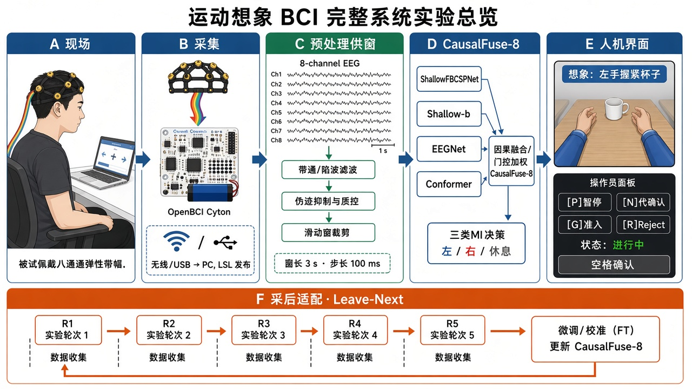

**图 1　运动想象 BCI 完整系统实验总览**。左起五栏为实时主链路（A 实验现场 → B 信号采集 → C 预处理与供窗 → D CausalFuse-8 解码 → E 人机交互界面），底栏 F 为实时路径外的采后适配（落盘 → Leave-Next 微调 → 门控晋升）。图面为按实物硬件与界面绘制的示意图（不嵌实拍缩略图）；操作台为示意，实拍波形/概率界面见演示视频；硬件特写、佩戴与游戏界面局部见图 2–图 4。

系统采集硬件实物如图 2 所示：电极帽与 OpenBCI Cyton 放大器构成采集前端，脑电信号经 BrainFlow 驱动与 LSL 因果推流进入采集主机，主机完成采集质检、滑窗推理与采后微调，判定结果经 WebSocket 网关推送游戏前端与操作台，形成"采集—解码—反馈—采后适配"闭环。

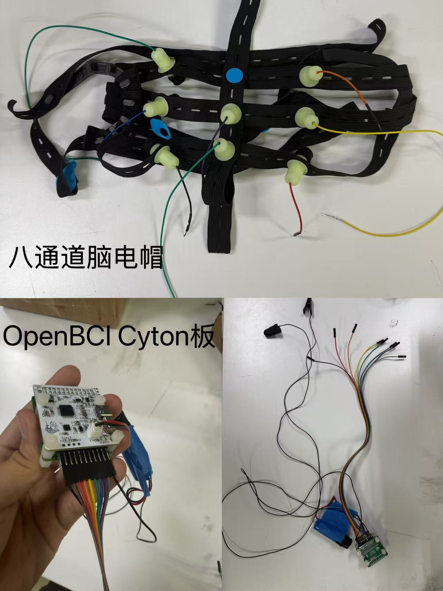

**图 2　系统采集硬件实物**。上：八通道干电极脑电帽（10–20 系统运动皮层位点）；下左：手持 OpenBCI Cyton 板；下右：Cyton 与电池组及跳线组装。信号链路为电极帽 → Cyton（250 Hz 采样；**板载带通/陷波关闭，输出原始采样**）→ 采集主机（BrainFlow / LSL）→ WebSocket 网关 → 游戏前端/操作台；频带滤波在主机软件预处理完成（见 2.3 节），分层软件架构见图 5。

三条设计原则贯穿全系统：通道集合与轴序全链路冻结（附录 B）；范式时序与微调策略冻结于配置文件，文档与代码冲突时以配置为准；每会话原始脑电、事件、清单与模型快照全部落盘，任何评测可从原始数据重放。

与上述主线对应，本章按"**模型结构**（2.4：在线底座 CausalFuse-8 与并行提交模型 QuadFold-59）→ **在线模型**（2.5：采后逐场次增量微调与适配态）→ **在线交互系统**（2.6：异步交互机制与实时架构）"的顺序展开；数据采集（2.2）与预处理（2.3）为其共用输入端（含指定集评测线的口径分叉说明）。

### 2.2 数据采集规范

自采被试均为健康成年人，实验前签署知情同意书，脑电数据脱敏编号后仅用于本赛题研究。采集设备为 OpenBCI Cyton 8 通道放大器[13]，信号经 BrainFlow 驱动[11]与 Lab Streaming Layer 因果推流[12]进入采集主机。电极覆盖运动皮层（FC3, C3, CP3, CZ, CPZ, FC4, C4, CP4），采样率 250 Hz；**Cyton 板载带通与 50 Hz 陷波已关闭**，主机侧按 2.3 节统一做 CAR 与 8–30 Hz 带通等预处理。受试者佩戴与采集现场如图 3 所示。

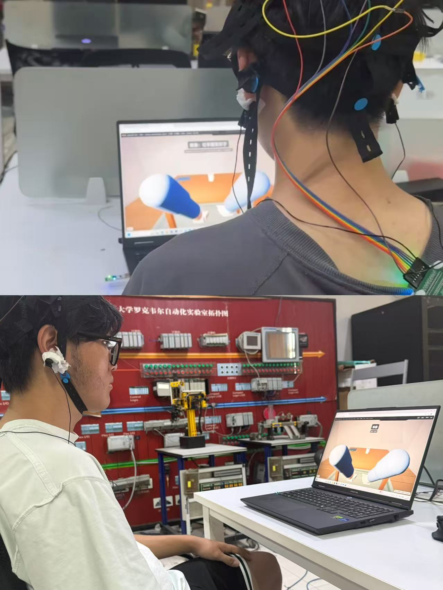

**图 3　受试者佩戴电极帽的采集现场（实拍）**。两名被试佩戴八导干电极帽，背侧可见多色跳线汇入 Cyton 侧接线；面对笔记本屏幕完成 OpenBMI-Align 游戏化范式（画面为目标物够取场景）。采样 250 Hz，电极按 10–20 系统覆盖运动皮层。

实验范式（OpenBMI-Align v1，冻结口径）单试次时序为：专用 Rest 4 s（Cue 前空闲监督样本，非独立静息试次）、准备 2 s、Cue 1 s、运动想象 4 s、试次间隔 3 s，块间休息 30 s。正式 v3 探针默认 2 块 × 18 次左右手想象（共 36 次）。在线判定采用 3 s / 750 点滑窗、步长 100 ms（即每 100 ms 对最新窗输出一次判定），与离线训练同口径，窗尾相对 Cue 覆盖 3.0–4.0 s；段级基线取 Cue 前 0.5 s。

质量控制分三层：信号链健康监测（缓冲龄、信号质量、通道完整性）；脑电断流看门狗（缓冲停滞 2 s 告警、5 s 中止会话）；会话结束自动标记与脑电对齐校验，不合格会话不入库。

使用的数据集：OpenBMI（54 人 × 2 会话，预训练与主验证）[4]；BCI Competition IV 2a（A01–A09，留一被试仿真与跨场次微调对比）[3]；Stieger2021（公开集 62 人；本报告跨库验证取会话齐全、可复现切窗的 24 人子集，跨库伪在线验证）[5]；主办方指定标准数据集（6 被试，留一被试六折，指定集评测）；自采数据（截至 2026-09-06 共 20 名被试，见 3.6 节）。

### 2.3 预处理与特征

所有数据集与在线流共用同一预处理：固定 8 导、共平均参考（CAR）、8–30 Hz 带通、250 Hz 重采样、逐窗 z-score。带通范围覆盖 μ 节律（8–13 Hz）与 β 节律（13–30 Hz）的运动相关成分[2]。窗长经消融确定（见 3.1 节）。训练锚点若包含想象期之后的窗会带来约 1.1 个百分点的下降，因此切窗严格限定于有效想象期。训练标签同时维护空闲/任务二分类与空闲/左手/右手三分类两套，双头独立训练：二分类头用于状态监测，三分类头为正式读出。

对单窗原始脑电 $X\in\mathbb{R}^{8\times 750}$（8 通道 × 750 点的矩阵），预处理按"共平均参考 → 带通与重采样 → 逐窗标准化"三步执行：共平均参考将每个时刻各通道的值减去该时刻 8 通道的均值；带通保留 8–30 Hz（覆盖 μ 与 β 节律的运动相关成分）后重采样至 250 Hz；标准化对每个窗的每个通道做零均值、单位方差处理。在线端以 100 ms 步长对数据流做因果滑窗切片，每个窗仅包含截至当前时刻的历史数据，不回看未来。三步的公式化定义、滑窗切片记号与完整符号推导见附录 D，另见《算法公式与算法详细介绍》成稿。

**口径分叉说明**：以上为主线的 8 导 3 s / 100 ms 滑窗口径。指定集评测线的指定集为 59 导、每试次一窗（无滑窗步长），仅通道集合与切窗方式不同（见 3.4 节）；两套口径的数据不混用。

### 2.4 模型结构：四成员温度校准融合（在线底座 CausalFuse-8 · 提交模型 QuadFold-59）

在线底座 CausalFuse-8 由四个成员构成：ShallowFBCSPNet[7,14]、其 Task 头增强变体（Shallow-b）、EEGNet[6]、Conformer[8]。记成员 $m$ 的 logits 为 $z_{m}\in\mathbb{R}^3$（矢量）。融合分两步。

**温度校准。** 各成员的 logits 先经验证集上拟合的温度参数 $\tau_{m}$（标量）缩放，再做 softmax 得到校准概率 $\tilde{p}_{m,k}$；$\tau_{m}$ 以验证集负对数似然最小化选定后冻结，上线后不随会话重拟合（公式见附录 D.2）。

**固定权重融合（核心公式一）。**

$$
p_{k} = \sum_{m=1}^{4} w_{m}\,\tilde{p}_{m,k}, \qquad w=[0.2,\ 0.2,\ 0.3,\ 0.3],\quad \sum_{m} w_{m}=1
\qquad\text{(2.1)}
$$

式中 $w$ 为四成员固定融合权重矢量（上线后不随会话重拟合），由验证集网格加权选定后冻结；$p_{k}$ 为融合后的第 $k$ 类概率。

**在线读出为因果滑窗。** 对融合概率序列做回看 $L=2$ 窗的均值平滑后取最大概率类，得到窗级判定；试次内 11 档判定点（窗尾相对 Cue 3.0–4.0 s）多数票得到试次结果（平滑与判定的记号定义见附录 D.3）。读出在两个粒度上的分工论证见 2.6 节。

指定集评测线模型 QuadFold-59 与 CausalFuse-8 同构（同为四成员温度校准融合），但为 59 通道、在指定集上从零训练，融合参数按留一被试六折逐折拟合；其数据口径（59 导、每试次一窗）与主线 8 导滑窗不同，属指定集评测线专用（见 3.4 节；留一被试评测的公式化定义见附录 D.4）。

本文保留公式的符号约定如下（矩阵用粗体、矢量标注、标量用斜体）：

| 符号 | 类型 | 含义 |
|---|---|---|
| $X$ | 矩阵（粗体） | 单窗原始脑电，$8\times 750$（8 通道 × 750 点） |
| $z_{m}$ | 矢量 | 成员 $m$ 输出的 logits（3 类） |
| $\tau_{m}$ | 标量 | 成员 $m$ 的温度校准参数，验证集拟合后冻结 |
| $\tilde{p}_{m,k}$ | 标量 | 成员 $m$ 校准后的第 $k$ 类概率 |
| $w$ | 矢量 | 四成员固定融合权重，$\sum_{m} w_{m}=1$ |
| $p_{k}$ | 标量 | 融合后的第 $k$ 类概率 |
| $\theta_{m}$ | 参数集 | 成员 $m$ 的可训练参数 |
| $\eta$ | 标量 | 增量微调学习率 |

选型理由（为何在二分类领先时仍不用 Deep4Net）在 3.1 节完整论述。

### 2.5 在线模型：采后逐场次增量微调与适配态

离线底座对新用户只是起点：被试每完成一个采集会话后，由操作台启动采后增量微调——以全部已完成会话为训练集、对四成员更新一轮，得到适配态模型 **CausalFuse-8FT**。适配过程**仅更新成员权重 $\theta_{m}$，融合温度与权重保持冻结**（与 2.4 的离线融合参数同源；"冻结而非再标定"的量化依据见 3.4 节：小样本折内拟合融合参数会产生 +4.7 个百分点的乐观伪影；方案必要性与闭环验证见 3.5–3.6 节）。

**增量微调目标（核心公式二）。** 第 $r$ 轮训练批 $\mathcal{B}$ 由自采历史与源域按约 $9:1$ 混合，损失为批上交叉熵期望，并对 $m=1,\dots,4$ 做梯度更新：

$$
\mathcal{L}(\theta)=\frac{1}{|\mathcal{B}|}\sum_{(x,y)\in\mathcal{B}}-\log p_{\theta}(y\mid x),\quad
\theta_{m}^{(r+1)}=\theta_{m}^{(r)}-\eta\nabla_{\theta_{m}}\mathcal{L}
\qquad\text{(2.2)}
$$

式中 $\mathcal{L}$ 为交叉熵损失，$\theta_{m}$ 为成员 $m$ 的可训练参数集，$\eta$ 为学习率（标量）；融合温度 $\tau_{m}$ 与权重矢量 $w$ 不进入优化变量（符号约定表见 2.4 节）。

冻结配方为：全成员增量微调，混入 10% 源域数据，以会话为界批量更新；个体模型落盘并保留历史快照。**场次门控与安全网**：以保留评测的窗级**原始**准确率 $a_{r+1}$（未经因果平滑）判定 PASS/FAIL；每轮微调前自动存档权重，质量门控连续不通过先回滚上一权重并降低学习率，再次触发则冻结在线更新；门控不通过时告警并**默认强制晋升**（采集期效率优先：避免因门控卡住逐场晋升流程，异常仍显式落盘；部署态可切换为「阻止晋升 + 人工确认」，见附录 B）。PASS 判定同时满足：保留评测**原始**窗级准确率 $a_{r+1}\ge \max(0.40,\pi_{\max}+0.05)$（$\pi_{\max}$ 为保留集最大类先验）、预测最大类占比 $<0.60$、训练−保留差距 $<0.35$，且三类均有预测；3.6 节被试表的窗级列为因果平滑口径末档，与门控所用原始窗级不必逐人相等（故可出现平滑读数相近但 PASS/FAIL 不同）。完整伪代码与门控定义见算法公式成稿式 (3.10)–(3.12)。该方案的两种实现方式（前半/后半切分与逐场次 Leave-Next，即采后逐场微调、留出紧邻下一场做保留评测）孰优、以及个体适配的必要性证据，见 3.5 节；真实用户闭环验证见 3.6 节。

### 2.6 在线交互系统：异步交互机制与实时架构

离线模型（2.4）与在线模型（2.5）解决分类准确率与个体适配；本节说明如何把模型做成可用交互：先给出异步判别方案，再写四层架构、实时链路与延迟构成。

本系统的异步判别不依赖任何决策级门控信号，由三层机制构成。

**意图起止如何确定。** 系统不另设「用户何时开始/结束一次意图」的检测器，而由实验范式的时间表规定：Cue 提示出现后，判定固定落在运动想象段后段（窗尾相对 Cue 约 3.0–4.0 s，共 11 档判定点），试次结果由这些窗的多数票给出；用户不自行触发意图起止。每一滑窗仍输出空闲/左手/右手三类之一——空闲是显式类别，静息时持续输出空闲，形成空闲态监视。这种「结构化试次 + 显式空闲类」与康复训练逐试次练习相匹配：用户按提示想象，系统在固定时刻反馈。

**读出层抑制瞬时误判。** 因果滑窗平滑（回看两窗，附录 D.3）压制单窗抖动，试次内多数票进一步容忍约半数窗级错误：只有当多数判定点一致指向某一类时才产生控制输出。单窗偶发误判不会形成错误指令。

**窗级为什么用因果平滑而非多数票。** 窗级是每 100 ms 的流式判定（只有当前与过去），试次级是 11 档到齐后的集合判定；多数票适合后者，窗级用概率均值平滑可保留证据强度、避免短回看平票振荡，并服务操作台连续概率监视。OpenBMI 上试次级多数票 61.25%、窗级因果平滑 61.88%（粒度不同，详见 3.3 节验证）。因此：**窗级因果平滑提供连续判定流，试次级多数票产生控制输出**。

**场次级安全机制兜底。** 保留会话以窗级原始准确率判定通过与否，不通过时告警落盘；默认策略为告警后强制晋升（理由与部署态切换见 2.5 节与附录 B），3.6 节队列的"12/20 通过门控"即该机制的逐轮落盘结果。游戏侧设无效试次计分判定与连续无效熔断降级。这些机制作用于模型管理与会话安全层面，不在实时判定路径上增加任何延迟或弃权分支。

**为何不做决策级弃权门控。** 此处「门控」指置信不足或生理指标不达标时弃权不输出。在线交互未采用，主要有三点。其一，弃权率过高：Stieger 跨库伪在线上叠加生理门控虽把准确率从 65.90% 提到 70.03%，但弃权率达 59.3%，过半试次无结果，实时交互不可用（来源见 §3.5）。其二，延迟不确定：门控要等证据积累或另算生理指标（逐窗 ERD 偏侧化），判定时刻会漂移；固定判定窗加多数票则给出确定的约 3.5 s 延迟。其三，与免专门标定目标冲突：门控阈值常需按被试校准，会抵消少样本适配收益。误触发已由读出层与会话层约束（见 3.1、3.6）。置信度早停与生理门控仅作离线分析或可选部署，不进入正式在线方案。需区分：本节拒绝的是**决策级弃权门控**；2.5 节的场次质量门控（采后微调安全网）仍在使用。

在交互设计与工程实现上：游戏前端以第一人称虚拟手与桌面目标物呈现 Cue 引导（"想象：左手/右手握紧杯子"）。正式路径为 OpenBMI-Align v3 探针会话：默认 2×18=36 次左右手想象，每试次含 Cue 前专用 Rest 4 s；计分规则为想象判对 +1、Cue 前静息判对 +0.5（在线场满分 54；Leave-Next/队列汇报常按 Rest 截断后满分 45）。权重优先加载被试个人模型，否则回退通用底座。会话落盘后由操作台启动采后 Leave-Next 微调；完成后个人模型可按策略晋升，并在下一会话加载。另有 v3test 约 20 试次连击快验，仅用于权重检验，非正式采集口径。操作台承担被试登录、会话管理、实时波形与三分类概率监测、准入确认与热键控制；关键范式与会话事件落盘。工程上，前后端 WebSocket 通信带鉴权，会话收尾具备崩溃安全落盘，核心流水线有回归测试覆盖。游戏前端的实时交互界面如图 4 所示（操作台波形/概率监视见演示视频与现场采集）。演示视频（MP4，≤10 分钟）按"实时采集 → 三类实时分类 → 视觉反馈 → 状态切换响应"四要素录制，脚本与分镜见随附《演示视频脚本》。

**图 4　游戏前端实时交互界面（截图）**。第一人称桌面够取场景；Cue 阶段叠加动觉引导语（图示为"想象：左手握紧杯子"及勿真动提示）；顶栏/底栏为会话相位与操作快捷键（暂停、确认、入组、拒绝、中止）。试次判定以手臂够取目标物的反馈动画呈现；操作台实时波形与三分类概率流监视与本界面并行，见演示视频。

#### 2.6.1 分层架构与实时链路

在线系统采用四层架构：客户端层（游戏前端、操作台、采集硬件）、通信接入层（WebSocket 网关与 LSL 因果推流通道）、服务层（会话管理、采集质检、实时推理、状态分发、模型管理、安全审计）与数据存储层（会话原始数据、模型仓库、配置权威与质检产物），整体结构与数据流如图 5 所示。高频脑电流（250 Hz）经 LSL 单向因果推流进入采集服务，交互消息经 WebSocket 双向 JSON 通道流转，两条通道物理分离、互不阻塞。

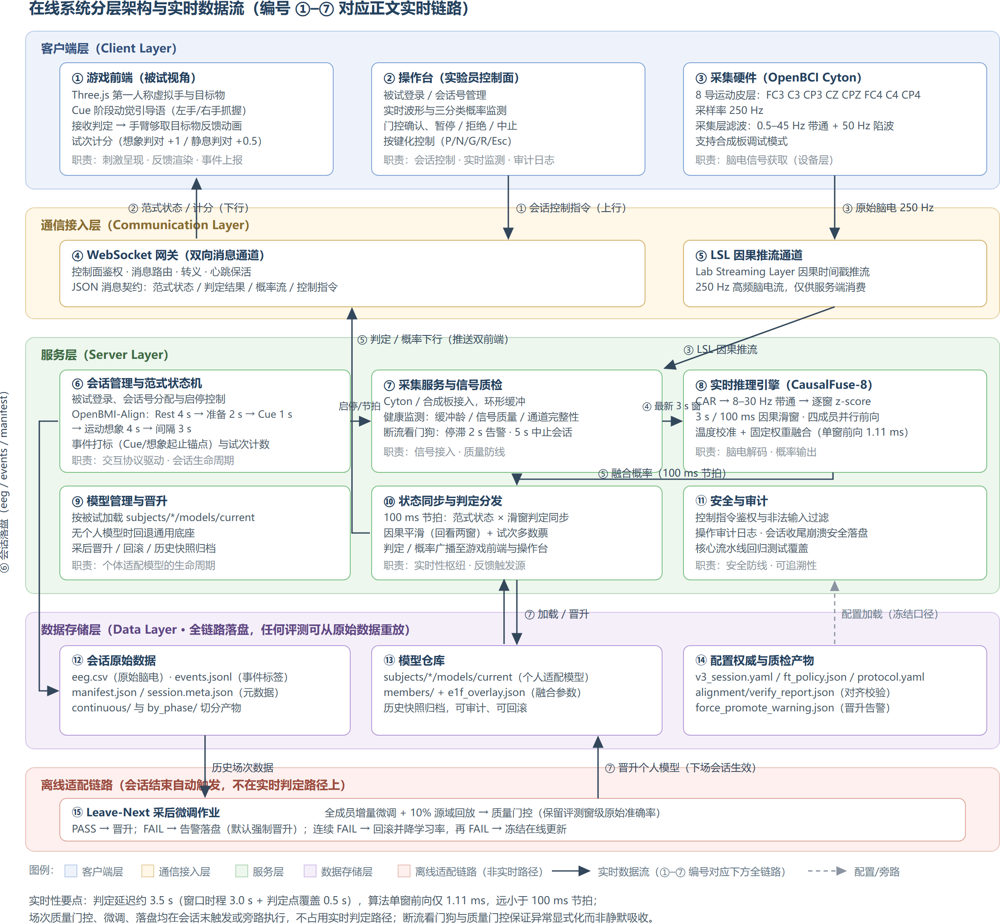

**图 5　在线系统分层架构与实时数据流**。客户端层（游戏前端/操作台/采集硬件）经 WebSocket 网关与 LSL 通道接入服务层；服务层以 100 ms 节拍完成"供窗—推理—分发"闭环；会话数据全量落盘；操作台启动采后微调后，晋升的个人模型可在下一会话加载。编号 ①–⑦ 对应正文实时链路；硬件实物连接见图 2。

分层设计主要服务两件事：判定延迟确定、异常可追溯。高频脑电流（250 Hz）走 LSL 单向因果推流，交互消息走带鉴权的 WebSocket，避免共用通道时推理节拍被交互抖动拖累。范式状态机单独提供试次锚点（判定窗锚定 Cue 后 3.0–4.0 s 的 11 档点），滑窗判定与该锚点对齐后才有交互语义，避免多处各自判时造成口径漂移。全量落盘、对齐校验与采后微调均在实时判定路径之外：会话结束后由操作台启动微调与质量门控，晋升后的个人模型在下一会话加载，因而在线延迟不因适配作业波动（图 5 下方独立色带）。

实时交互链路如图 6 所示，按编号走查如下：被试就位后由操作台完成登录与会话号分配（步骤 1），会话管理启动 OpenBMI-Align 范式状态机（Rest 4 s → 准备 2 s → Cue 1 s → 运动想象 4 s → 间隔 3 s），并经网关向游戏前端广播范式状态（步骤 2）；采集硬件经 LSL 因果推流 250 Hz 脑电，采集服务完成缓冲与健康监测，断流看门狗在缓冲停滞 2 s 时告警、5 s 时中止会话（步骤 3）；采集服务按 100 ms 步长向推理引擎供给最新 3 s 窗，推理引擎完成预处理（CAR → 8–30 Hz 带通 → 逐窗 z-score）与四成员并行前向，经温度校准与固定权重融合输出三类概率，单窗增量耗时 1.11 ms（步骤 4）；状态分发层执行因果平滑（回看两窗）与 argmax 得到窗级判定，按节拍将概率流推送操作台、判定推送游戏前端触发手臂够取目标物的反馈动画（步骤 5）；试次内 11 档判定点多数票产生试次结果并计分（步骤 6）；会话结束时全量落盘并完成标记—脑电对齐校验（步骤 7）；落盘后由操作台启动采后全成员增量微调与质量门控，完成后个人模型可晋升并在下一会话加载（步骤 8）。

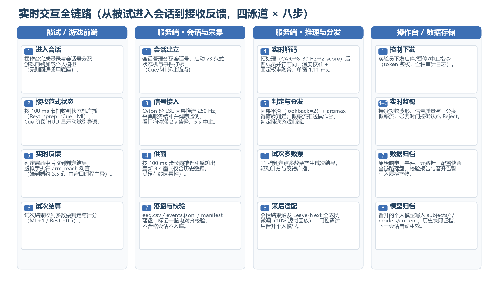

**图 6　实时交互全链路时序**（四泳道 × 八步）。泳道划分为被试/游戏前端、服务端会话与采集、服务端推理与分发、操作台/数据存储；步骤编号与正文走查一一对应，并与随附演示视频的录制步骤对应。

实时性设计的关键在于延迟的确定性而非单步速度。判定延迟的构成如图 7 与表 1 所示：端到端判定延迟约 3.5 s，其中窗口时程占 3.0 s、判定点覆盖占 0.5 s，算法单窗前向增量仅 1.11 ms，远小于 100 ms 节拍；全窗多数票读出为 4.00 s。该延迟由口径冻结的窗口时程决定，现场不可变，因而可预期、可复现；由于空闲类为显式输出、控制输出仅由试次内多数票产生，判定路径不含弃权分支。异常处理遵循显式化原则：断流看门狗与场次质量门控的每次触发均告警落盘，连续无效试次触发会话熔断降级，保证任何异常可追溯而非静默吸收。

**图 7　在线判定延迟构成**。窗口时程与判定点覆盖占 3.5 s，算法前向增量 1.11 ms 在该尺度下不可见；判定延迟为确定性上界，不受负载波动影响。

**表 1　在线判定延迟构成**

| 环节 | 耗时 | 说明 |
|---|---|---|
| 窗口时程 | 3.0 s | 因果滑窗积累，口径冻结值 |
| 判定点覆盖 | 0.5 s | 窗尾相对 Cue 的 11 档判定点（3.0–4.0 s） |
| 预处理 + 四成员前向 + 融合 | 1.11 ms | RTX 5070 实测，单窗增量 |
| 因果平滑 + 多数票 | 可忽略 | 概率级运算，随前向同步完成 |
| **端到端判定延迟** | **约 3.5 s**（多数票读出 4.00 s） | 由窗口时程主导，确定性上界 |

## 3 实验研究

### 3.0 统一评测方案与判定纪律

全部实验按两条线组织：模型训练与离线评测线（选型、机制探查、集成、指定集），伪在线回放线（跨库迁移与个体适配）。每个实验有独立的方案文档、结果登记表与落盘产物，主题总览见附录 A。

统一评测方案：OpenBMI 评测采用被试独立五折、固定随机种子、验证集准确率早停、类均衡批训练（下文各表中的 Acc_paper 即指统一评测方案下的测试集精度，报告为均值±标准差）；显著性检验用被试级配对 Wilcoxon 或 McNemar 检验。判定纪律贯穿全部实验：所有超参、融合权重与阈值仅在验证集上选定；测试集单次评估；每个探索实验立项时预先登记采纳阈值。例如集成实验立项时登记"测试集提升不低于 0.5 个百分点才采纳、提升不足 0.2 个百分点则维持现状"，避免事后解释。训练硬件为 RTX 5060 / 5070 / 5090 三机，跨机结果经一致性核对（同配置锚点差小于 0.1 个百分点）。

### 3.1 切窗口径与主干选型

**研究问题**：伪在线解码采用何种窗长与步长，何种主干网络。

**切窗口径「N s / 100 ms」**：把连续脑电按长度 N 秒切成一段输入模型，每隔 100 ms 向前滑一次，即大约每 100 ms 给出一次窗级判定；**不是**通信协议，也**不是**实验伦理协议。选型阶段曾用 2 s 窗，现行冻结为 3 s 窗。窗长消融在 OpenBMI 统一评测方案下进行（三分类窗级）：1 s 窗 56.20%，2 s 窗 57.60%，3 s 窗 58.80%；3 s 窗较 2 s 窗在二分类上提升 4.7 个百分点，据此冻结 3 s / 100 ms。

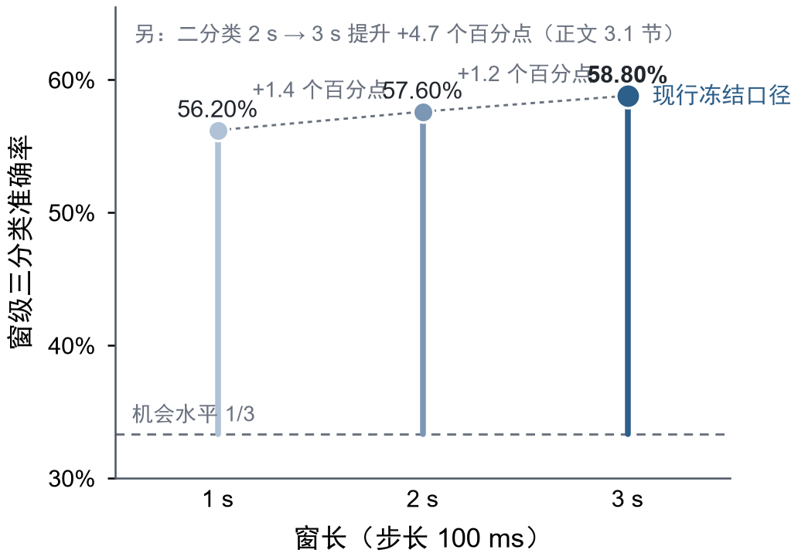

**图 8　窗长消融（OpenBMI，统一评测方案）。** 窗级三分类准确率随窗长变化，3 s 窗最优并冻结为现行口径（步长 100 ms）；虚线为机会水平。点估计，折间波动见正文；纵轴自 0.30 起。注意：十一模型对比在另线 2 s 口径下完成，与本图窗长消融正交。

**十一模型统一对比**（OpenBMI 54 人、2 s / hop 100 ms、RTX 5060 正式汇总口径；表按三分类 Acc_paper 降序，与该 2 s 口径选型的正式汇总表一致）：

| 排名 | 模型 | 三分类 Acc_paper（%） | 二分类 Acc_paper（%） |
| -: | --- | --- | --- |
| 1 | **ShallowFBCSPNet** | **54.04±2.56** | 69.41±3.49 |
| 2 | Deep4Net | 54.00±2.96 | **71.69±3.35** |
| 3 | Conformer | 53.75±2.49 | 70.71±3.55 |
| 4 | EEGNet | 53.22±2.91 | 68.69±3.34 |

其余 7 个模型三分类 Acc_paper 均低于 52%，未进入后续选型。

三分类最高为 **ShallowFBCSPNet（54.04%）**，二分类最高为 **Deep4Net（71.69%）**，两者三分类差距仅 0.04 个百分点，落在折间噪声内。

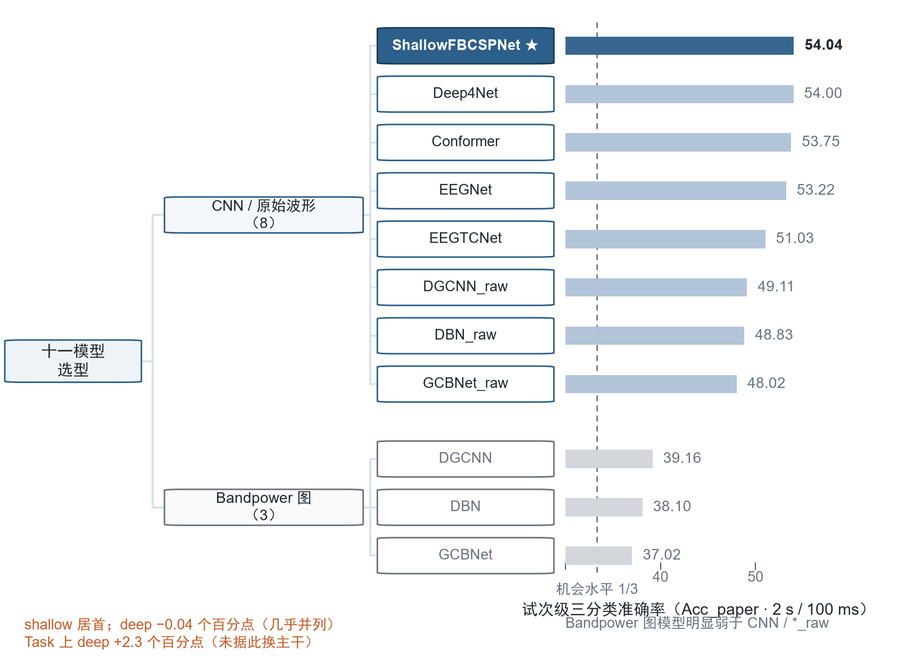

**图 9　OpenBMI 统一评测方案下十一模型选型树（2 s / 100 ms · Acc_paper）。** 左为分层树：CNN/原始波形（8）与 Bandpower 图模型（3）；右为试次级三分类准确率条（数字标在条外，避免与标记重叠）。深蓝条 + ★ = 采纳主干 ShallowFBCSPNet（54.04%）；Deep4Net（54.00%）几乎并列。虚线为机会水平 1/3。数据锁自 5060 正式汇总表（与正文表前四行一致）。

**为何在二分类领先时仍不选 Deep4Net。** 若只看二分类，Deep4Net 以 71.69% 对 69.41% 高出约 2.3 个百分点；但正式读出是**三分类含空闲**，该指标上浅层已居首且与深层几乎持平（差 0.04 个百分点，落在折间噪声内）。选型取 ShallowFBCSPNet，依据两点：（1）三分类上浅层已不劣于深层，不宜用二分类优势覆盖部署任务定义；（2）部署与微调代价——浅层约 17 k 参数，深层层数与参数量高一个量级，四成员集成下前向/显存开销成倍放大，在线节拍 100 ms 下浅层链路单窗前向仅 1.11 ms 余量充足；且少样本逐场微调下浅层更稳、深层易过拟合[9]。综合以上，选型确定为 ShallowFBCSPNet；Conformer 与 EEGNet 以其异构性保留为集成成员。随后将口径升至 3 s 窗，浅层单模型三分类窗级 58.76%±2.96%（二分类 74.15%±3.06%），与窗长消融 3 s 锚点 58.80% 同口径。

### 3.2 增益来源的机制探查

**研究问题**：单模型停在 59% 附近，结构模块、未来信息、测试时统计对齐能否带来稳定增益。

**结论先行。** 本阶段以十余个对照实验系统排查特征与预处理、结构模块、自监督表征、信息上界与测试时适配四个方向，结论为：四方向均无稳定增益，全部排除；唯一确认的增益来自朴素的三成员概率均匀融合（+1.18 个百分点）。阴性结果直接决定了后续资源投向——关闭结构增强方向，集中于推理侧聚合（校准与集成）与训练侧配方。以下按方向给出排除依据。

**特征与预处理方向。** 偏侧通道等特征工程（含空间滤波类思路[10]）无稳定增益，结案阴性。

**结构模块方向。** SE[15]/ECA[16] 等结构增强最大增益仅 0.06/0.25 个百分点（噪声量级），CIACNet[18] 为少数正向对照但未改主线。

**自监督表征方向。** JEPA / LeJEPA[17] 线性探测低于随机或监督基线，该路线在本数据规模下不成立。

**信息上界与测试时适配方向。** 未来信息增益在 ±0.2 个百分点内；EA 约为零、微调后叠加统计对齐最多 −11 个百分点，域间隙须靠权重级适配而非测试时统计对齐。四方向全部实验登记见附录 A。

### 3.3 集成底座定型与读出因果化

**研究问题**：朴素融合的空间能否系统性做满；离线最优读出能否因果化用于在线。

集成实验分两步。第一步零训练回放：在已落盘的成员概率上依次叠加温度校准（验证集负对数似然拟合）、验证集网格加权、时间邻域平滑、第四成员扩池（加入 Task 头增强变体），并按立项时预注册的阈值判定采纳。第二步训练配方升级。最终冻结配置在 OpenBMI 上取得三分类 61.73%（四成员满配集成加双向平滑的离线重放口径；正式路径废除置信早停后，独立复核得同值，与试次级多数票 61.25% 粒度不同）。

读出因果化对比：上述离线双向平滑重放 61.73%，在线可行的因果平滑读出（窗级）61.88%，多数票读出（试次级）61.25%。因果化不损失精度，因果平滑读出定为主结果，多数票为线上读出；窗级平滑与试次级投票的粒度分工及机制论证见 2.6 节。OpenBMI 被试独立五折主结果如下（测试集共 16,200 试次、每类 5,400；窗级读出按每试次 11 档判定窗计，每类 59,400 窗；类均衡下准确率与 macro 召回同值；**融合三行官方主要结果为全测试池合并点估计，五折均值±标准差见注**）：

| 方法                | 粒度  | 准确率（主要读数，%） | macro 召回（%） | macro 特异性（%） | macro-F1（%） |
| ----------------- | --- | --------- | -------- | --------- | -------- |
| 四成员融合 + 因果平滑（**官方主结果**） | 窗级  | **61.88** | **61.88** | **80.94** | **61.96** |
| 四成员融合 + 多数票（线上读出） | 试次级 | **61.25** | **61.25** | **80.62** | **61.32** |
| 四成员融合 窗级 argmax   | 窗级  | **59.25** | **59.25** | **79.62** | **59.30** |
| 浅层 3 s 单模型        | 窗级  | 58.08±2.88 | 58.08±2.88 | 79.04±1.44 | 58.02±2.97 |

注：**官方主结果**为全测试池合并点估计（与 Excel 对账锚点 0.6188/0.6125 一致）。五折均值±标准差（折均等权重，附报）：因果平滑 61.86%±3.51%，多数票 61.25%±3.31%，窗级 argmax 59.24%±2.98%。离线双向平滑重放口径 61.73% 仅作因果化对照，不作头条。浅层单模型行为五折均值±标准差；同口径选型试次级冻结头条 **58.76%±2.96%**，与本表窗级粒度不同，不宜直接对照。

因果平滑读出的混淆矩阵（行=真实，列=预测；窗计数）：

|    | 空闲     | 左手     | 右手     |
| -- | ------ | ------ | ------ |
| 空闲 | 36,476 | 12,408 | 10,516 |
| 左手 | 8,129  | 38,148 | 13,123 |
| 右手 | 7,986  | 15,774 | 35,640 |

每类召回：空闲 61.41%、左手 64.22%、右手 60.00%；每类特异性：空闲 86.44%、左手 76.28%、右手 80.10%。左与右之间的混淆大于空闲与任务边界之间的混淆，符合运动想象解码中侧别判别难于状态判别的一般规律，也说明专用静息段的空闲监督设计有效。

窗级空闲误报（真实空闲被判为左手或右手）约 38.6%，经试次内多数票后，真人队列中高表现被试的静息试次判对率达 94% 以上（见 3.6 节），说明该误报在试次粒度被有效抑制。

**与文献的可比性说明。** OpenBMI 公开任务的文献基准多为左右手**二分类**；本报告主要读数 61.88% 为「专用静息段监督下的三分类」，机会水平 1/3，**不可与二分类 SOTA 直接比较**。同口径、同骨干的浅层 3 s **二分类**窗级为 74.15%±3.06%（见 3.1 节末），可作为与 OpenBMI 原文/常见基线对话的锚点：三分类含空闲更难，主要结果数字看起来不高，反映的是设定更接近异步部署，而非二分类能力不足。

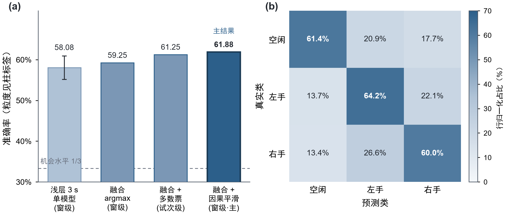

**图 10　CausalFuse-8 在 OpenBMI 被试独立五折上的主结果。** 左：读出对比柱——浅层单模型 / 窗级 argmax / 试次级多数票 / 窗级因果平滑（主结果 61.88%）；纵轴为准确率，**柱间粒度不同，不宜直接对照**（见柱标签与上表）。右：因果平滑读出窗级混淆矩阵（行归一化）。测试集约 16,200 试次；左–右混淆高于空闲–任务边界混淆。

**结论。** 底座与读出冻结：四成员温度校准融合加因果滑窗多数票。系统主线的离线部分至此完成，增益来源收敛为三要素：3 s 窗、概率校准集成、权重级适配。前两者已定，第三要素（权重级适配）是主线下一阶段（3.5 节）的主题。在此之前，3.4 节先报告与主线**并行**的指定集评测线：它在从零训练的 59 通道集成上独立完成对外提交，不使用本节底座的权重。

### 3.4 指定集评测与提交决策

本阶段为与系统主线（3.1–3.3 → 3.5–3.6）**并行**的指定集评测线，不是主线因果链的下一环。指定数据集口径与主线分叉：59 通道、每试次一窗（无滑窗步长；与主线 8 通道滑窗的差异见 2.3 节末口径分叉说明）；提交模型 QuadFold-59 在该数据集上**从零训练**，不加载 3.3 节的 CausalFuse-8 权重。与主线底座相关的唯一旁支是"OpenBMI→8ch 微调栈"备选（留一被试 54.00%），即底座向指定集的迁移尝试，最终因验证支撑风险被否决（见本节末提交决策）。

**研究问题**：在主办方指定标准数据集（6 被试、留一被试六折、每试次一窗、每折约 150 试次）上，如何给出可信准确率并完成提交决策。

本阶段七个实验构成一条完整的决策链，每步均有预注册判定与统计检验。

指定集评测从两条路线起步：59 通道从零训练的四成员集成（QuadFold-59）与 OpenBMI 8 通道预训练微调栈（备选）。首轮折内读数：QuadFold-59 为 55.80%，备选栈为 57.30%。融合重标定与候选终选后，QuadFold-59 定为主候选。随后的扩池与跨轨融合实验中，折内读数一度达到 60.40% 与 62.60%，但未通过 Wilcoxon 显著性线。

留一被试验证显示：同一 QuadFold-59，折内读数 55.80%，留一被试读数（融合参数在保留折外拟合、对保留折预测）仅 51.11%±6.57%，两者相差 4.7 个百分点；此前折内 60.40% 的高分在留一被试复核下基本消失。原因是每折约 150 试次的小样本条件下，任何在折内拟合的自由参数（哪怕是几个融合权重）都会产生乐观伪影。形式化地，第 $f$ 折的融合权仅用其余五折的折外预测拟合（在权重单纯形上最大化验证折准确率），测试读数为六折概率平均；折内口径则在全部折外预测上拟合一次融合权后同批评估。两种口径的完整公式见附录 D.4。

扩池变体的留一被试读数 52.30% 与主候选 51.11% 经 McNemar 检验无显著差异（p=0.81），维持主候选。误差去相关选池实验为阴性（最优 52.80%）。

提交决策发生在程序终态之后。工程选卷环节曾按点估计选中备选栈（留一被试 54.00%±14.60%，与主候选差异不显著），但加固检验发现其验证集六折的折外预测中，空闲类占比最高仅约 33%，而测试集预测空闲类约 51%，落在验证集支撑范围之外；且该栈历史上有验证折崩溃至 30.00% 的记录，主候选验证最差折 42.70%、无崩溃记录，设计均衡下边际上限更高（90.8% 对 82.5%）。据此执行风险否决：提交 QuadFold-59，备选栈结果归档。该决策未使用测试标签调参，未改动验证过线门槛。加固阶段本身的蒙特卡洛边际校正与测试时增强均为阴性。

| 验证方案 | 候选模型 | 分类准确率（均值±标准差，%） | 决策结论 |
| ---- | ---- | ------------ | ---- |
| 留一被试（正式读数） | QuadFold-59 | 51.11±6.57 | 正式提交 |
| 折内验证（附报） | QuadFold-59 | 55.80±6.90 | 乐观偏置（+4.7 个百分点） |
| 留一被试（归档） | OpenBMI 8 通道微调 | 54.00±14.60 | 外推风险否决 |
| 留一被试（附报） | 浅层单骨干变体 | 52.80±13.00 | 选池消融对照 |

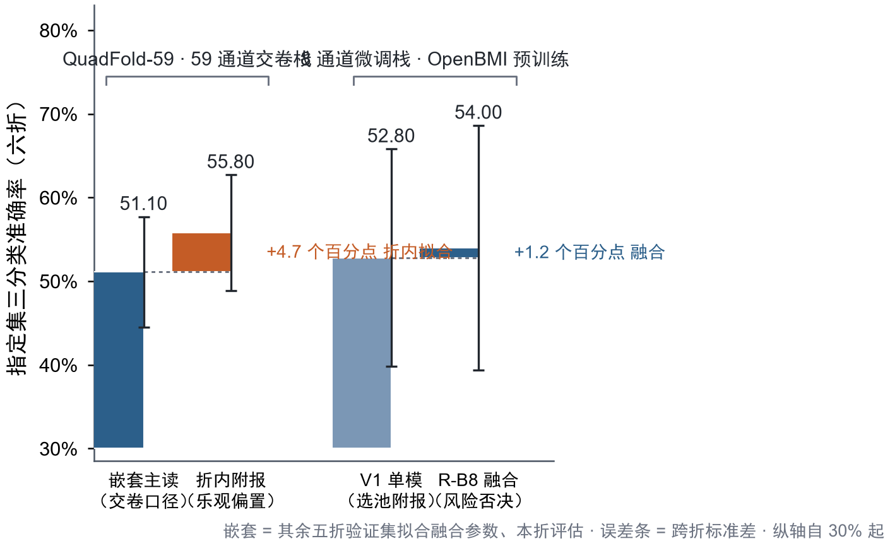

**图 11　主办方指定集（6 受试留一被试六折）的桥形图：基线 → 增量 → 终值。** 两组桥：左 QuadFold-59 提交栈，留一被试读数基线 51.11% → 折内拟合 +4.7 个百分点（标识乐观偏置）→ 折内附报 55.80%；右 8 通道微调栈，V1 单模 52.80% → 四成员融合 +1.2 个百分点 → 54.00%。误差条 = 跨折标准差；纵轴自 0.30 起；留一被试读数 = 其余五折验证集拟合融合参数、本折评估；备选栈因验证支撑外推风险否决（见正文）。

**结论。** 小样本折下留一被试验证是唯一可信结果；提交决策依据验证集支撑范围而非点估计。指定集算法线就此冻结。

### 3.5 少样本个体适配方法学

**研究问题**：零样本底座对新用户是否足够；若不足，哪一类适配方法有效；微调方案应当如何设计、在两个公开库上采用的两种微调方式孰优。

**数据集选择与范式差异。** 两个公开库在适配实验中角色不同。**BCI2a**（A01–A09 Training 集）为纯 Cue 运动想象、想象窗固定 4 s，与本研究范式及 OpenBMI 底座一致，因此是**微调方案对比与适配演化分析的主载体**；本项目在其上只采用逐场次（Leave-Next）方案，未做前半/后半切分，同库头对头对照留作后续（见 4 讨论）。**Stieger2021** 为闭环光标反馈范式：受试者以左右手运动想象控制光标左右移动、双手想象控制光标上移、主动静息对应光标下移，反馈/想象段时长可变（约 0.04–6.04 s，分类窗取该段末 2 s、不足 2 s 丢弃），与主线的 Cue 固定范式不同。因此 Stieger 只承担两项任务：跨库微调必要性的机制验证与生理门控的否决证据，不用于方案对比。

**适配必要性（两库零样本均不足）。** OpenBMI 底座跨库直接使用时：BCI2a 上零样本仅 33.80%（见下文 Leave-Next 曲线 R0）；Stieger（24 人子集）上零样本 41.98%±5.85%，前半会话微调后升至 65.90%±9.29%（24 名被试全部提升 3 个百分点以上），叠加生理门控后达 70.03%±8.69%，但弃权率 59.3%（门控不进入在线方案的理由见 2.6 节）。两库一致表明：跨库部署零样本不可用，个体化微调是必要环节。

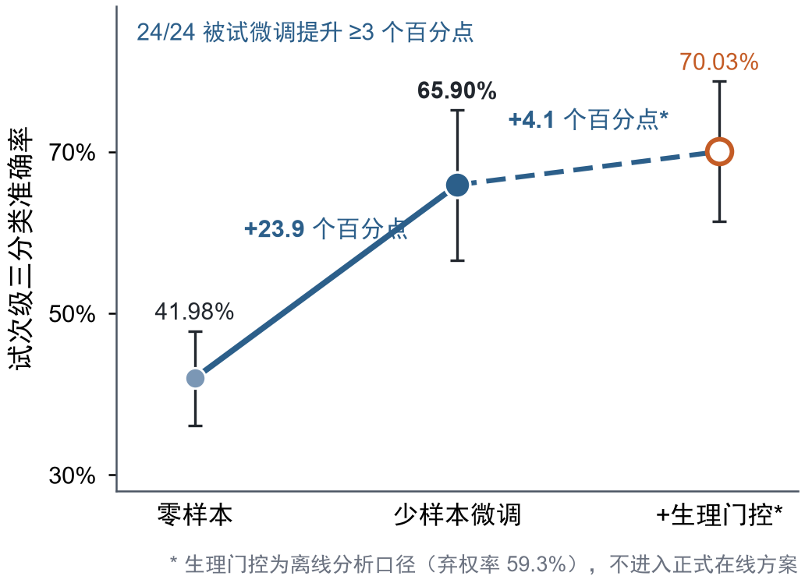

**图 12　Stieger 跨库伪在线（24 人子集）。** 前半会话训练、后半评测。生理门控为离线旁路（弃权 59.3%），不进入正式在线方案。

**微调方式对比。** 部署采用逐场次采后微调（Leave-Next）：每完成一场即以该场训练、下一场保留评测；跨库机制验证保留前半/后半切分。Leave-Next 能跟踪场间漂移、给出完整适配曲线并与真实逐场晋升一致，故作部署主口径；前半/后半仅用于跨库机制检查。BCI2a 仿真末档四成员微调 **66.30%**±6.70%，较仅微调浅层单成员 45.20% 高 **21.1** 个百分点。

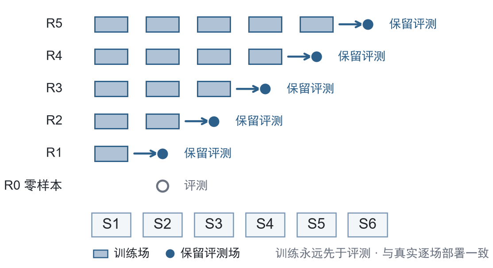

**图 13　Leave-Next（逐场次采后微调）方案示意。** 第 r 轮以已完成场次为训练集、紧邻下一场为保留评测；R0（第 0 轮）为零样本底座直接推断。训练永远先于评测，与真实部署的逐场晋升一致，并可得到完整适配曲线（相对前半/后半单点切分）。

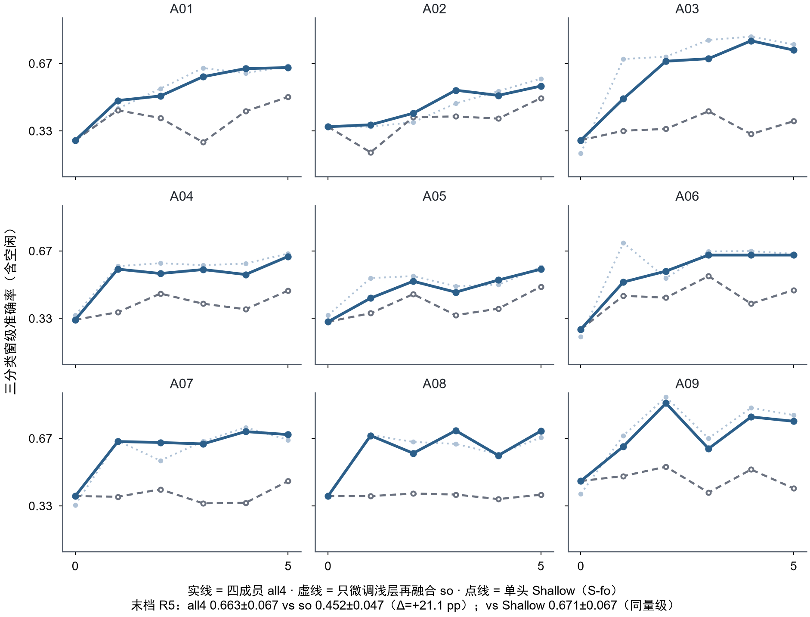

**图 14　BCI2a（A01–A09）Leave-Next 仿真的逐被试适配轨迹（源域回放 10%）。** 实线 = 四成员全量微调（CausalFuse-8FT）；虚线 = 仅微调浅层成员、其余成员冻结后再融合；点线 = 浅层单模型直接微调基线。末轮（第 6 轮）：四成员全量微调 66.30%±6.70%，对仅微调浅层单成员 45.20%±4.70%（Δ=+21.1 个百分点，配对显著）；浅层单模型基线 67.10%±6.70%（与四成员同量级）。曲线随轮次上升支撑 Leave-Next 方案；四成员全量微调相对仅微调浅层单成员的大幅提升支撑全成员微调范围。

**四成员集成相对「浅层单模型直接微调」的定位。** 图 14 末轮浅层单模型直接微调基线 67.10%±6.70% 与四成员全量微调 66.30%±6.70% 同量级，说明在 BCI2a 仿真末档上，单模型直接微调已能达到接近的点估计。摘要所称「四成员较单成员 +21.1 个百分点」对照的是「仅微调浅层成员、其余冻结再融合」的 45.20%，而非上述单模型基线——二者不宜对照混淆。保留四成员复杂度的理由主要在部署侧而非该仿真末档：（1）零样本/早期轮次与公开库主要读数上，集成底座提供更高起点（OpenBMI 窗级主要读数 61.88% 对浅层单模约 58%）；（2）真人队列强受益个体的大幅增益来自全历史增量链（3.7 节），当前未完成「单模型逐场次链」的同口径真人重放，故不声称集成在真人末档上必然优于单模型直接微调，将该对照列为局限与后续实验位。

**BCI2a 仿真与真人队列的形态对照。** 同一方案下，BCI2a 九人末档全部落入 55.60%–75.60% 窄带（均值 66.30%，7/9 ≥ 62.00%），逐轮曲线以单调爬坡为主；真人 20 人末档窗级散布于 33.30%–92.40%（均值 47.60%，12/20 过门控）。两者的反差本身是信息：仿真无疲劳、无电极阻抗漂移、电极位置理想，而真人队列的方差主要来自会话状态与数据质量——增益分布对照见图 16，定量分解见 3.7 节。

| 队列 | 人数 | 末档均值 | 范围 | 形态 |
| --- | --- | --- | --- | --- |
| BCI2a 仿真（同范式，无疲劳/漂移） | 9 | 66.30% | 55.60%–75.60% | 单调爬坡为主（7/9 ≥ 62.00%） |
| 真人（逐场次采后微调，三分类窗级） | 20 | 47.60% | 33.30%–92.40% | 显著分化（12/20 过门控） |

**微调配方与安全网。** 冻结配方、损失形式（式 (2.2)）、PASS 阈值与「FAIL 默认强制晋升」策略见 2.5 节；本节只给两种方案下的实验证据。实验中每轮微调前自动存档权重；门控结果落盘，FAIL 时按默认策略告警并强制晋升。

**结论。** 在本文测试的适配方法族内（统计量对齐类已证阴性），权重级增量微调是唯一产生稳定增益的个体适配来源，逐场次采后微调为最优方案，前半/后半切分保留用于跨库机制验证。

### 3.6 真人被试全队列验证

**研究问题**：采后逐场次微调闭环在全部真实被试上的整体表现与个体差异。

真人被试全队列验证（2026-09-06 更新）将落盘的全部 20 名被试的会话结构、逐场次微调爬坡记录与最新的四成员全量微调加冻结读出的回放结果统一为同一套账（较 09-05 登记新增 djy0906、wyf0906、zyn0906）。纳入规则：排除旧范式会话；电极中线两通道饱和不排除（按最新规则强制纳入）；仍排除无脑电记录的会话；个别被试存在合并场次或跳过缺失场次的结构特例，均已登记（lmy0904 跳过了两个无脑电记录的早期会话；zyn0906 含完整 w01–w07 六档爬坡）。

末档（每人最后一轮保留评测）结果，按微调后三分类窗级（因果平滑）降序；「各轮最高」为同一 Leave-Next 爬坡中各保留场窗级的最大值（多数 5 轮，个别 6 轮）；零样本列为同口径 CausalFuse-8 底座窗级：

| 被试      | 微调三分类窗级（%） | 各轮最高窗级（%） | 零样本三分类窗级（%） | 场次门控 |
| ------- | -------- | -------- | --------- | ---- |
| syj0828 | 92.40     | 92.40     | 41.40       | PASS |
| lsy0903 | 58.80     | 58.80     | 30.00       | PASS |
| npl0831 | 54.20     | 56.10     | 40.90       | PASS |
| lsm0903 | 53.60     | 60.00     | 42.40       | FAIL |
| lmh0904 | 52.90     | 58.60     | 37.30       | PASS |
| xj0830  | 48.30     | 48.30     | 46.50       | PASS |
| zyn0906 | 48.30     | 57.20     | 46.10       | PASS |
| cjf0831 | 46.80     | 49.20     | 43.90       | PASS |
| ytl0901 | 46.10     | 53.50     | 44.40       | PASS |
| zyj0902 | 45.80     | 49.80     | 40.10       | FAIL |
| xjh0828 | 45.30     | 56.90     | 35.40       | PASS |
| djh0902 | 43.40     | 43.40     | 31.30       | PASS |
| wyf0906 | 42.50     | 45.80     | 26.10       | PASS |
| wzr0830 | 42.50     | 55.90     | 29.10       | FAIL |
| ycx0831 | 41.80     | 41.90     | 39.90       | FAIL |
| cyy0830 | 40.90     | 40.90     | 33.30       | PASS |
| zcy0902 | 40.30     | 61.20     | 34.80       | FAIL |
| lmy0904 | 38.20     | 46.70     | 37.90       | FAIL |
| fnz0830 | 35.70     | 58.40     | 35.70       | FAIL |
| djy0906 | 33.30     | 48.80     | 33.20       | FAIL |

队列统计：末档微调三分类窗级均值 **47.60%**，中位数 45.60%，范围 33.30% 至 92.40%；各轮最高窗级均值 **54.20%**（中位数 54.70%，范围 40.90% 至 92.40%）；零样本三分类窗级均值 **37.50%**（中位数 37.60%）；**12/20** 通过场次门控；多数被试微调后不低于零样本底座。为检验「微调是否整体高于零样本」，对每名被试的一对读数（末档微调窗级 − 同口径零样本窗级）做配对 Wilcoxon 符号秩检验（单侧：微调更高；n=20）：统计量 $W=190$，$p=6.6\times 10^{-5}$。含义是：在「微调并不更高」的零假设下，出现当前这种成对优势的概率约为 $6.6\times 10^{-5}$（即 0.0066%），故拒绝零假设，认定队列级增益显著（不是靠个别极值被试撑起来的）。门控阈值见 2.5 节；表列窗级为因果平滑末档，与门控原始窗级口径不同，故 cjf0831（平滑 46.80%，PASS）与 zyj0902（平滑 45.80%，FAIL）等邻近读数可因原始窗级/类占比/训练−保留差距触发不同判定。逐轮爬坡见**图 15**（橙柱为各轮最高，叠色时优先于 PASS/末档色）。个体最优 syj0828 窗级 92.40%、试次计分 41.5/45（想象类 33/36、静息 17/18），静息试次判对率 94.40%，为 2.6 节"多数票抑制空闲误报"提供了真人证据；该极值在 3.7 节链复现中种子差约 ±3.9 个百分点，解读为高表现个体而非单次偶然尖峰。

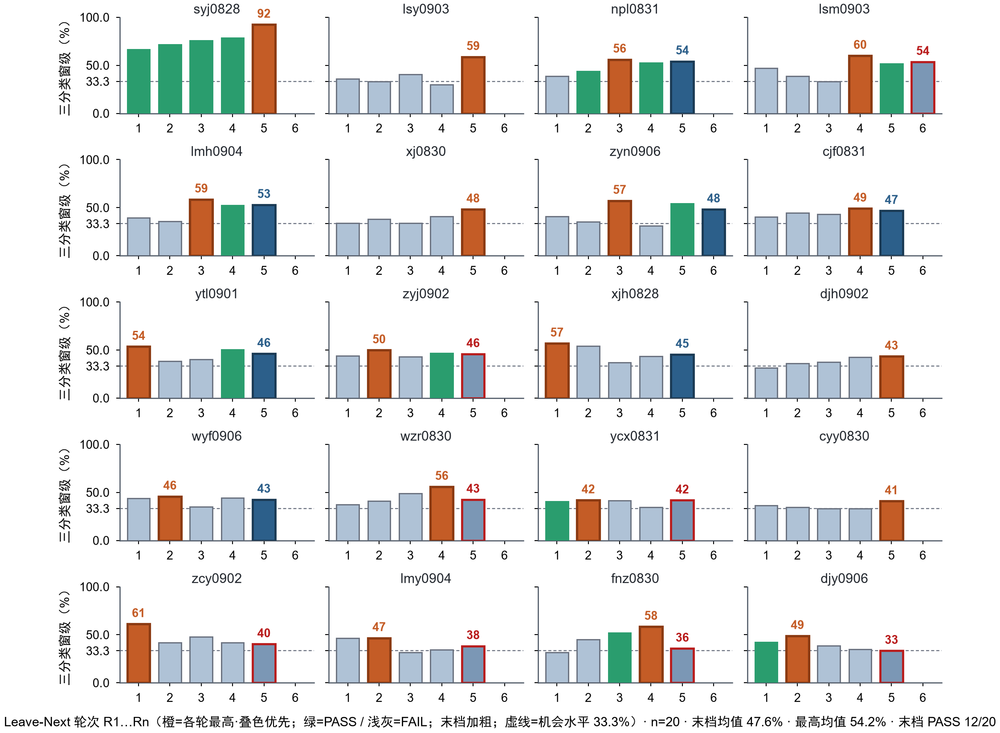

**图 15　真人被试 Leave-Next 逐轮微调三分类窗级（小倍数柱状）。** 每面板一名被试，横轴为 Leave-Next 轮次 R1…Rn，纵轴为保留评测三分类窗级准确率（因果平滑，%）；**橙色=该被试各轮最高**（与 PASS 绿/末档主色重叠时优先用橙），绿=该轮门控 PASS，浅灰=FAIL，末档另加粗（非最高时）；虚线为三分类机会水平 33.3%。面板按末档窗级降序；含新增被试 djy0906 / wyf0906 / zyn0906。n=20，末档均值 47.60%，各轮最高均值 54.20%，末档 PASS 12/20。

这组数据给出两点结论。其一，闭环成立但分化显著：约六成被试末档过门控，个体差异（窗级 33.30% 至 92.40%）本身即个性化适配必要性的直接证据。其二，微调不能弥补信号质量短板：djy0906 末档窗级 33.30%（零样本 33.20%）与 xjh0828 微调后 45.30% 仍处低位，提示部分被试的信号质量或范式执行问题是适配无法弥补的，BCI 盲现象[4]在少样本闭环设定下依然存在。

### 3.7 适配增益的混杂分解与坍塌普查

**研究问题**：3.5–3.6 确立逐场次采后微调方案后，末档读数中"数据量增长、会话间质量漂移、会话内疲劳"各自贡献多少；类坍塌在保留评测读数中是否普遍。

**口径与前提。** 本节与 3.6 节统一为 **20** 人登记账（2026-09-06；含 djy0906、wyf0906、zyn0906）。类坍塌普查、增益对照、会话内疲劳与质量关联、以及底座全链重放混杂分解均在该队列上报告。特征与预测分布均从既有落盘重放，重训仅使用线上已用的历史场次，保留评测场次永不进训练。

**特征对表校验。** 线上同一构建器重算确认特征管线无错位；手工带功率特征对左右判别接近机会水平，个体判别信息可由卷积网络从原始波形提取但不进入手工特征族——细节从略，信号层证据以下方类坍塌普查为准。

**类坍塌普查。** 对全部 20 人 × 每轮 Leave-Next 重放落盘的保留评测试次级读出（因果平滑多数票）统计坍塌指标。发生率定义（预注册）：试次级预测分布熵 <0.5，或保留评测最大类占比 ≥0.8，或 MI 试次异侧率 ≥0.7，任一成立记"坍塌轮"。结果：**末轮坍塌仅 1/20**（fnz0830，精确二项 95% CI [0.1%, 24.9%]）；全轮口径下稳定坍塌 2 人、偶发 5 人、无坍塌 13 人。BCI2a 仿真同口径坍塌占比 33.3%，与真人 35.0%（7/20 曾出现坍塌轮）同量级，指向共性的任务难度/配方因素而非个体异常。因此，3.6 节中多数被试停在 40–55% 窄带的现象应表述为"**弱而稳**"，类坍塌本身是个案（cyy0830、lmy0904、fnz0830）而非普遍机制。

**疲劳与质量关联。** 会话内疲劳的唯一预注册主要检验（Rest 段 μ 功率随试次序号上升）仅在 **50.0%** 的个体成立（n=20，无一致性方向），即本范式单场约 8 分钟的时长内**未见会话内疲劳信号**；末档增益与采集质量指标（饱和率）的被试级相关弱且不显著（Spearman r=0.040，p=0.87），既有信号质量门控未覆盖"会话贡献"维度。

**训练集构造的混杂分解（底座全链重放）。** 以冻结预训练底座为唯一起点，对每人独立重放整条 Leave-Next 微调链，比较五种训练集构造（A1 全历史 / A2 仅最近一场 / A3 同量时间均匀抽样 / A4 场次顺序打乱 / A5 源域回放比例 5–20%），5 个随机种子、同种子配对、末轮保留评测：

| 读数 | 队列结果 | 判读 |
| --- | --- | --- |
| 数据量效应（全历史 − 仅最近一场） | **+3.5 个百分点**（同号比例 60.0%） | 数据量为**部分贡献**：均值过 +3 个百分点线，但个体同号率不足 2/3，"随数据变强"并非普遍规律 |
| 近因效应（均匀抽样 − 仅最近一场） | **−4.0 个百分点** | 同数据量下"时间均匀抽历史"反而劣于"仅最近一场"，说明近因状态匹配的价值高于历史采样 |
| 顺序效应（正常顺序 − 打乱顺序） | ≈0（−0.4 个百分点） | 场次顺序本身不携带信息 |
| 回放比例效应（源域回放 5–20% 扫描） | 回放比例每提高 1%，保留评测约降 0.044 个百分点 | 真人队列上提高源域回放比例反而降低保留评测精度（与仿真防遗忘作用方向相反，附报） |

个体分布呈明确二态：强受益组 syj0828 +37.2 个百分点（全历史链 95.60% 对仅最近一场链 58.30%）、wzr0830 +21.1、lsy0903 +20.0、zyj0902 +13.3；**反受害组** fnz0830 −20.0（全历史链仅 9.10%，劣于仅最近一场链的 29.10%）、cyy0830 −13.3、cjf0831 −8.3。fnz0830 即类坍塌普查中末轮坍塌的个案，构成"低质量会话进入历史链主动污染模型"的直接证据。链复现方面，全历史链重放与线上在用权重的一致性在多数个体 ±1.5 个百分点内，个别（syj0828 +3.9 个百分点）超出，提示逐场次链的种子级非确定性约 ±3 个百分点，配对比较不受影响。

**与 BCI2a 仿真的增益对照。** 在同一指标族下（三分类窗级增益 = 末档 − 零样本），BCI2a 九人增益全部为正且集中（+20.5 至 +45.4 个百分点，均值 +32.5），真人二十人增益全员非负但幅度小且分散（0 至 +51.0 个百分点，均值 +10.1、中位数 +6.7）；仿真最差个体（+20.5）高于真人中位数。该对照与上方坍塌普查共同说明：逐场次方案在理想条件（同范式、无疲劳、无阻抗漂移）下有效且增益稳定，真人队列的折损来自状态与数据质量，而非方案本身（图 16；各轮最高口径见图 17）。

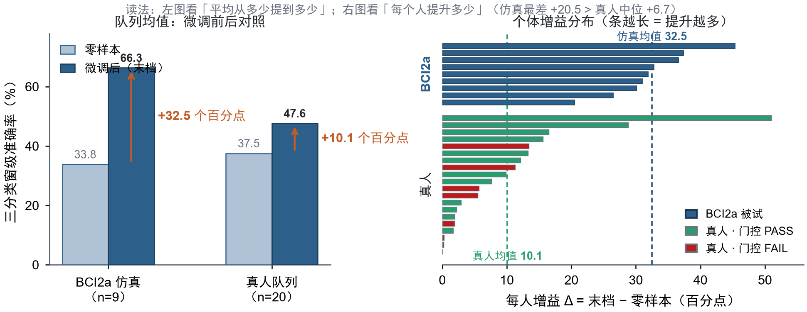

**图 16　BCI2a 仿真与真人队列的适配增益对照（n=9 对 n=20，三分类窗级，末档口径）。** 左为队列均值抬升（仿真 +32.5、真人 +10.1 个百分点）；右为每人增益 Δ（蓝=BCI2a，绿/红=真人 PASS/FAIL）。仿真最差个体（+20.5）仍高于真人中位数（+6.7）。

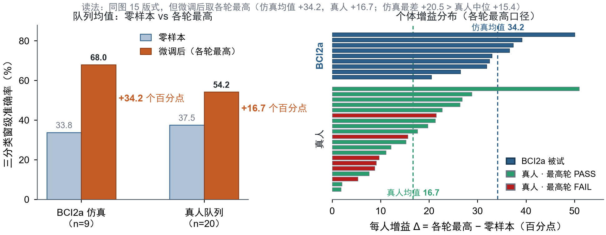

**图 17　同图 16 版式，改为各轮最高口径。** 仿真 33.8%→68.0%（+34.2 个百分点），真人 37.5%→54.2%（+16.7 个百分点）；相对末档，真人抬升更明显，部分被试峰值在中段轮次。

**结论。** 末档读数 = 模型能力 × 会话状态的乘积：数据量是**部分且异质**的贡献源（约 1/3 个体强受益、1/3 反受害），会话质量漂移可经历史链反向传播（负增益），会话内疲劳在本范式时长下可排除，类坍塌为个案。由此产生两条工程推论：其一，增量微调前应做**会话级贡献审计**（候选会话进链与仅用上一轮权重的保留评测对比，增益 ≤0 则拒绝吸收，可自动拦截 fnz0830 型污染）；其二，"随数据积累而增强"的表述在对外口径中限定为"数据量贡献个体二态"。

## 4 讨论

**增益来源。** 在已测方法族内，结构增强、自监督表征、未来信息与测试时统计对齐均未形成稳定增益。瓶颈不在继续叠加通用解码模块，而在个体分布差距需由概率校准融合与权重级微调吸收（见第 3 章）。

**Leave-Next 的适用边界。** 逐场次采后微调是部署与主评测口径：能跟踪场间漂移并给出适配曲线；前半/后半切分只回答「微调是否必要」，保留用于跨库机制验证。两方案尚无同库头对头对照，属后续实验位。工程上，3.7 节表明「数据越多越强」并非普遍规律，宜将场次门控升级为**会话贡献审计**（候选会话进链前对照上一权重，增益非正则拒收）。

**评测纪律。** 小样本折内拟合融合权易产生乐观偏置，故对外准确率以留一被试或被试独立测试折为准，折内仅作附报。预注册管住算法采纳阈值；程序终态后的提交决策另依验证支撑与崩溃风险准则，二者互补。

**无门控异步的边界。** 本报告「异步」指：试次内部每 100 ms 因果滑窗连续判定，但试次之间的起止由 Cue/时间表规定（非用户任意时刻发起意图）。在此范围内，显式空闲类 + 试次内多数票给出确定延迟，结构化试次内误触发可控。若扩展到自由异步，试次结构先验与延迟确定性不再成立，可另评置信策略，但不改正式口径。

**局限性。** 在线评测以实验室链路为主，电磁干扰、佩戴稳定性与长期漂移覆盖不足；指定集提交依据验证支撑外推，而非测试集证据。

## 5 结论与展望

对照赛题任务，本文在离线评测、跨库/仿真适配与真人闭环上给出主要结果如下。OpenBMI 被试独立五折三分类窗级准确率 61.88%（macro 特异性 80.94%；试次级多数票 61.25%）。主办方指定集留一被试准确率 51.11%±6.57%，折内乐观偏置 +4.7 个百分点已量化。Stieger 跨库由零样本 41.98% 提升至采后微调 65.90%；BCI2a Leave-Next 仿真末档 66.30%，较仅微调浅层单成员高 21.1 个百分点。20 人真人队列末档微调窗级均值 47.60%、最优 92.40%（零样本均值 37.50%），12/20 通过场次质量门控。在线单窗前向 1.11 ms，判定延迟约 3.5 s。增益主要来自更长窗口、概率校准集成与权重级适配；贡献在于全链路系统整合与评测纪律，而非新的单一网络结构。

后续可加强自采数据对底座的支撑，把场次门控升级为会话贡献审计，并面向康复训练与辅具场景做更长期验证。

## 参考文献

[1] Pfurtscheller G, Neuper C. Motor imagery and direct brain-computer communication[J]. Proceedings of the IEEE, 2001, 89(7): 1123-1134.

[2] Pfurtscheller G, Lopes da Silva F H. Event-related EEG/MEG synchronization and desynchronization: basic principles[J]. Clinical Neurophysiology, 1999, 110(11): 1842-1857.

[3] Tangermann M, Müller K-R, Aertsen A, et al. Review of the BCI Competition IV[J]. Frontiers in Neuroscience, 2012, 6: 55.

[4] Lee M-H, Kwon O-Y, Kim Y-J, et al. EEG dataset and OpenBMI toolbox for three BCI paradigms: an investigation into BCI illiteracy[J]. GigaScience, 2019, 8(5): giz002.

[5] Stieger J R, Engel S A, He B. Continuous sensorimotor rhythm based brain computer interface learning in a large population[J]. Scientific Data, 2021, 8: 98.

[6] Lawhern V J, Solon A J, Waytowich N R, et al. EEGNet: a compact convolutional neural network for EEG-based brain-computer interfaces[J]. Journal of Neural Engineering, 2018, 15(5): 056013.

[7] Schirrmeister R T, Springenberg J T, Fiederer L D J, et al. Deep learning with convolutional neural networks for EEG decoding and visualization[J]. Human Brain Mapping, 2017, 38(11): 5391-5420.

[8] Song Y, Zheng Q, Liu B, et al. EEG Conformer: convolutional transformer for EEG decoding and visualization[J]. IEEE Transactions on Neural Systems and Rehabilitation Engineering, 2023, 31: 206-219.

[9] Wimpff M, Aristimunha B, Chevallier S, et al. Fine-tuning strategies for continual online EEG motor imagery decoding: insights from a large-scale longitudinal study[C]//2025 47th Annual International Conference of the IEEE Engineering in Medicine and Biology Society (EMBC). Copenhagen: IEEE, 2025: 1-7.

[10] Rahman M K M, Joadder M A M. A space-frequency localized approach of spatial filtering for motor imagery classification[J]. Health Information Science and Systems, 2020, 8: 15.

[11] BrainFlow Development Team. BrainFlow: a library for acquiring EEG/EMG data[CP/OL]. <https://github.com/brainflow-dev/brainflow>.

[12] Kothe C. Lab Streaming Layer (LSL)[CP/OL]. <https://github.com/sccn/labstreaminglayer>.

[13] OpenBCI. Cyton biosensing board documentation[CP/OL]. <https://docs.openbci.com>.

[14] Ang K K, Chin Z Y, Zhang H, et al. Filter bank common spatial pattern (FBCSP) in brain-computer interface[C]//2008 International Joint Conference on Neural Networks. Hong Kong: IEEE, 2008: 2390-2397.

[15] Hu J, Shen L, Sun G. Squeeze-and-excitation networks[C]//Proceedings of the IEEE Conference on Computer Vision and Pattern Recognition. Salt Lake City: IEEE, 2018: 7132-7141.

[16] Wang Q, Wu B, Zhu P, et al. ECA-Net: efficient channel attention for deep convolutional neural networks[C]//Proceedings of the IEEE/CVF Conference on Computer Vision and Pattern Recognition. Seattle: IEEE, 2020: 11531-11539.

[17] Balestriero R, LeCun Y. LeJEPA: provable and scalable self-supervised learning without the heuristics[EB/OL]. (2025-11-14). <https://arxiv.org/abs/2511.08544>.

[18] Liao W, Miao Z, Liang S, et al. A composite improved attention convolutional network for motor imagery EEG classification[J]. Frontiers in Neuroscience, 2025, 19: 1543508.

---

## 附录 A · 实验总览

下表按研究阶段汇总本研究完成的全部实验主题与结论。各实验的方案、结果登记表与落盘产物在代码包与原始数据索引中按主题归档，可复核。

| 研究阶段 | 实验主题                                     | 主要结果与结论                            |
| ---- | ---------------------------------------- | ---------------------------------- |
| 口径演进 | 1 s / 40 ms 旧伪在线主线（Stieger 主库）           | 废止归档；复现性不足，数字不与现行口径混比              |
| 口径演进 | 2 s / 100 ms 口径冻结与 BCI2a 十一模型窗级选型        | 阶段性选型基础                            |
| 口径演进 | 试次多数票与验证集准确率选模口径                         | 选模口径确立                             |
| 口径演进 | OpenBMI 双机接入复现                           | 跨机一致性确认                            |
| 口径演进 | 3 s 窗升级与窗长消融                             | 3 s 窗显著优于 2 s；冻结现行口径               |
| 机制探查 | 运动想象特征工程（偏侧通道等）                          | 阴性，结案                              |
| 机制探查 | 可教试次子集评估与去标准化变体                          | 未进入正式表                             |
| 机制探查 | 浅层网络结构增强系列（SE/ECA、CBAM、复合损失、双专家门控、双带通分塔） | 全部阴性；SE/ECA 增益为噪声量级                |
| 机制探查 | JEPA / LeJEPA 自监督表征探测                    | 阴性；探测精度低于监督基线                      |
| 机制探查 | CIACNet 复合注意力复现                          | 少数正向对照，未改变主线                       |
| 机制探查 | 未来信息上界与基线复核                              | 全阴性；可见窗内信息完备                       |
| 机制探查 | 测试时适配（EA / AdaBN）                        | 阴性；域间隙不在二阶统计量层                     |
| 机制探查 | 域增广训练                                    | 发现验证集泄漏缺陷后修复，数字冻结只读                |
| 集成定型 | 概率校准、加权融合、时间平滑与四成员扩池（零训练回放）              | 冻结配置 61.73%                        |
| 集成定型 | 读出因果化对比                                  | 因果平滑 61.88% 不损失精度；主结果确立            |
| 指定集评测线| 59 通道双路线训练（从零集成与预训练微调）                   | 折内 55.80% / 57.30%                 |
| 指定集评测线| 融合重标定、扩池与跨轨融合                            | 折内高分未过显著性线；留一被试复核证伪                  |
| 指定集评测线| 留一被试验证与乐观偏置量化                              | 留一被试 51.11%±6.57%；折内乐观 +4.7 个百分点      |
| 指定集评测线| 误差去相关选池                                  | 阴性                                 |
| 指定集评测线| 加固检验与提交风险否决                              | 备选栈验证支撑不足，否决归档；提交 QuadFold-59；算法冻结 |
| — | — | （以下为系统主线在线部分） |
| 个体适配 | 零样本对照与前半会话微调（BCI2a、自采游戏会话）               | 微调必要性确立；OpenBMI 权重为部署主权重           |
| 个体适配 | 质量门控（生理指标与可教试次）                          | 门控叠加有收益但弃权率高；不进入在线方案               |
| 个体适配 | Stieger 3 s 跨库伪在线复现与测试时适配                | 零样本 41.98% → 微调 65.90%；统计对齐阴性      |
| 个体适配 | 采后微调回放方案对比与成员经济性消融                       | 源域回放 10% 与全成员微调定型                  |
| 个体适配 | BCI2a 逐场次采后微调仿真（9 人 × 6 轮）               | 末档四成员 66.30% 对单成员 45.20%；方案最优性证据     |
| 个体适配 | 真实被试逐场次微调复验                              | BCI2a 三分类末档：全成员微调较「仅微调浅层单成员」+21.1 个百分点；真人队列见 3.6–3.7          |
| 个体适配 | 真人被试全队列统一总账（20 人）                        | 末档微调窗级均值 47.60%（零样本 37.50%）；12/20 过门控；个体分化完整登记   |
| 个体适配 | 真人队列混杂分解与坍塌普查（20 人统一账） | 数据量贡献个体二态（+3.5 个百分点、60% 为正）；末轮坍塌 1/20；无会话内疲劳；近因匹配优于历史采样（−4.0 个百分点） |
| 延迟评测 | 在线前向与判定延迟测量                              | 单窗前向 1.11 ms；判定延迟约 3.5 s           |

## 附录 B · 系统常量与冻结口径

| 常量        | 取值                                                                                      |
| --------- | --------------------------------------------------------------------------------------- |
| 通道集合（8 导） | FC3, C3, CP3, CZ, CPZ, FC4, C4, CP4（运动皮层覆盖；轴序索引 0–7 于采集、微调与在线推理统一冻结，2026-08-29 口径，禁止重排） |
| 采样率       | 250 Hz                                                                                  |
| Cyton 板载滤波 | **关闭**（不启用板载带通/陷波；原始采样入主机；软件侧 CAR + 8–30 Hz 带通等见 2.3 节）                                      |
| 范式时序      | Rest 4 s → 准备 2 s → Cue 1 s → 运动想象 4 s → 试次间隔 3 s（块间 30 s）                              |
| 在线窗       | 3 s / 750 点，步长 100 ms，段级基线取 Cue 前 0.5 s                                                 |
| 读出        | 四成员融合、因果滑窗回看两窗、取最大概率类；试次级多数票                                                            |
| 微调策略      | 采后逐场次增量微调，全成员范围，源域回放 10%，场次门控不通过告警晋升                                                    |
| 计分        | 想象判对 +1，Cue 前静息判对 +0.5；v3 探针 36 次 L/R（每试次含 Cue 前 Rest），在线满分 54；Leave-Next/队列汇报常 Rest 截断后满分 45（v3test 约 20 试次连击，非正式口径） |
| 场次门控      | 保留会话窗级：展示用因果平滑，判定用原始读数，通过与否落盘告警                                                         |
| 脑电看门狗     | 缓冲停滞告警 2.0 s，会话中止 5.0 s                                                                  |
| 指定集口径（指定集评测线） | 59 通道；每试次一窗（无滑窗步长）；训练 S01–S06，盲测 S07–S08 无标签；不与主线 8 导滑窗数据混用                                                                 |

## 附录 C · 与赛题要求对照

| 官方要求         | 对应章节                      |
| ------------ | ------------------------- |
| 三类认知信号特征提取方法 | §2.3                      |
| 分类模型架构       | §2.4–2.5、§3.1、§3.3–3.4            |
| 异步交互协议设计原理   | §2.6                      |
| 脑电数据采集标准规范   | §2.2                      |
| 实验验证流程与评价指标  | §3.0、§3.1–§3.6 + Excel 报告 |
| 实验数据与分析结论    | §3、§4 + Excel 报告          |
| 参考文献列表       | 参考文献                      |
| 自采被试规模（赛题目标 ≥20 人） | 当前登记 **20** 人（§2.3 / §3.6）；已满足「不少于 20 人」采集目标；伦理知情同意已签署（§2.2） |

## 附录 D · 算法公式详述

正文仅保留两条核心公式（式 (2.1) 固定权重融合、式 (2.2) 增量微调目标）；预处理、温度校准、因果读出与留一被试评测的公式化定义集中在本附录，供复现核查，完整推导另见随附《算法公式与算法详细介绍》成稿。符号约定见 2.4 节符号表。

**D.1 预处理与滑窗切片（对应 2.3 节）**

对单窗原始脑电 $X\in\mathbb{R}^{8\times 750}$（矩阵），共平均参考为各时刻减 8 通道均值：

$$
\tilde{x}_{c,t} = X_{c,t} - \frac{1}{8}\sum_{c'=1}^{8} X_{c',t}
\qquad\text{(D.1)}
$$

带通与重采样算子 $\mathcal{B}_{8\text{-}30}$（8–30 Hz 带通后接 250 Hz 重采样）之后逐窗标准化，$\mu_{c},\sigma_{c}$ 为该窗该通道的均值与标准差：

$$
z_{c,t} = \frac{\mathcal{B}_{8\text{-}30}(\tilde{x})_{c,t} - \mu_{c}}{\sigma_{c}}
\qquad\text{(D.2)}
$$

在线以步长 $\Delta=25$ 点（100 ms）对数据流做因果滑窗切片，窗 $W_{i}$ 仅含截至时刻 $i\Delta+750$ 的历史数据：

$$
W_{i}\in\mathbb{R}^{8\times 750},\quad
(W_{i})_{c,j}=z_{c,\,i\Delta+j},\quad j=1,\ldots,750,\quad i=0,1,2,\ldots
\qquad\text{(D.3)}
$$

**D.2 温度校准（对应 2.4 节）**

成员 $m$ 的校准概率由带温度的 softmax 给出：

$$
\tilde{p}_{m,k}=\frac{\exp(z_{m,k}/\tau_{m})}{\sum_{k'=1}^{3}\exp(z_{m,k'}/\tau_{m})}
\qquad\text{(D.4)}
$$

温度参数在验证集上以负对数似然最小化选定后冻结，$N_{\mathrm{val}}$ 为验证集样本数，$y_{i}$ 为第 $i$ 个样本的真实标签：

$$
\tau_{m}^{*}=\arg\min_{\tau>0}\left(-\frac{1}{N_{\mathrm{val}}}\sum_{i}\log\tilde{p}_{m,y_{i}}^{(i)}\right)
\qquad\text{(D.5)}
$$

**D.3 因果滑窗读出（对应 2.4 与 2.6 节）**

对融合概率序列（式 (2.1)）做回看 $L=2$ 窗的均值平滑后取最大概率类得到窗级判定，试次内多数票得到试次结果：

$$
s_{t}=\frac{1}{L+1}\sum_{\ell=0}^{L}p_{t-\ell},\quad
\hat{y}_{t}=\arg\max_{k} s_{t,k},\quad
\hat{y}=\mathrm{mode}\{\hat{y}_{t}:t\in\mathcal{J}\}
\qquad\text{(D.6)}
$$

其中判定窗集合 $\mathcal{J}$ 为窗尾相对 Cue 3.0–4.0 s 的 11 档判定点。

**D.4 指定集留一被试评测口径（对应 3.4 节）**

第 $f$ 折的融合权仅用其余五折的折外（OOF）预测拟合，$\Delta^{3}$ 为三类权重单纯形，$\mathrm{val}^{(-f)}$ 为除第 $f$ 折外的验证集；测试读数为六折概率平均：

$$
w_{f}^{*}=\arg\max_{w\in\Delta^{3}}\mathrm{Acc}_{\mathrm{val}^{(-f)}}(w),\qquad
p_{\mathrm{test}}=\frac{1}{6}\sum_{f=1}^{6}\sum_{m=1}^{4}w_{f,m}^{*}\,\tilde{p}_{m}^{(f)}
\qquad\text{(D.7)}
$$

折内口径在全部 OOF 上拟合一次再同批评估（$w^{*}_{\mathrm{all}}$）；留一被试口径对每折用 $w_{f}^{*}$ 评估后取均值：

$$
\mathrm{Acc}_{\mathrm{in}}=\mathrm{Acc}\bigl(w^{*}_{\mathrm{all}};\mathrm{all\,OOF}\bigr),\qquad
\mathrm{Acc}_{\mathrm{nest}}=\frac{1}{6}\sum_{f=1}^{6}\mathrm{Acc}\bigl(w_{f}^{*};f\bigr)
\qquad\text{(D.8)}
$$

两者之差即折内融合的乐观偏置，3.4 节量化为 +4.7 个百分点（55.80% 对 51.11%）。

## 文献核查说明

参考文献核查说明：[1]–[4]、[6]–[8]、[11]–[16] 为领域经典与工具文档；[5] Stieger 2021 经 DOI 10.1038/s41597-021-00883-1 核实（Scientific Data 8:98；公开描述 62 人，本报告跨库实验使用其中 24 人可复现子集）；[9]、[17]、[18] 分别经 PubMed/arXiv 核实；[10] 已在 §3.2 引用。无虚假文献。

**数字表示法对账说明**：本报告正文、表格与结果图中的准确率类指标统一以百分数表示（如 61.88%）；随附 Excel 离线验证报告与代码包登记表中的同一数字以小数表示（0.6188），两者等值、仅为表示法差异（61.88% = 0.6188，51.11%±6.57% = 0.5111±0.0657），数值口径与对账锚点完全一致；图 14（BCI2a 适配曲线）纵轴刻度与脚注沿用小数表示，数值等值。

