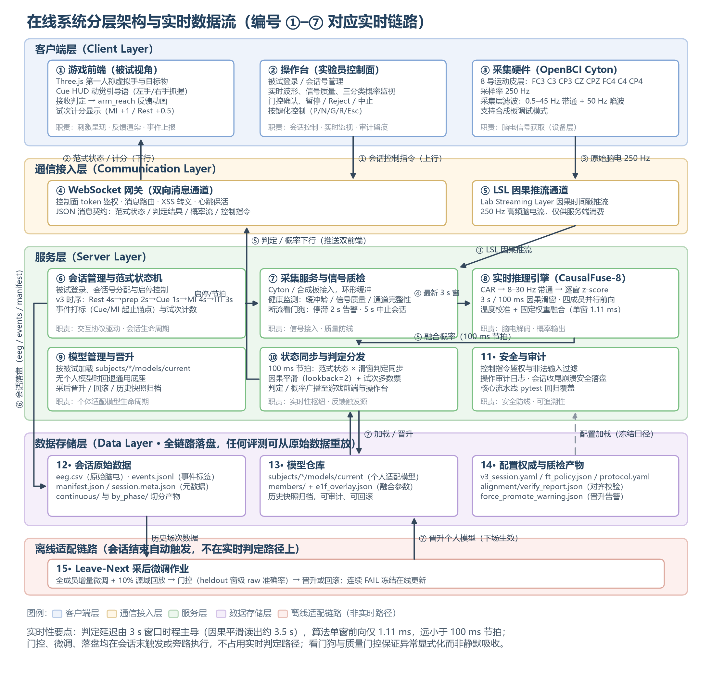
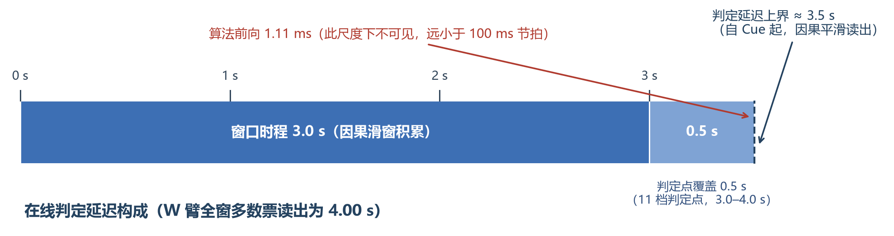

# 基于运动想象的脑-机交互算法研究与系统实现 · 技术报告

**题目编号：XH-202610 ｜ 挑战杯"揭榜挂帅"擂台赛 ｜ 提交日期：2026 年 9 月**

---

**摘要**：运动想象脑机接口（MI-BCI）走向实际应用面临噪声鲁棒解码、控制/空闲状态判别、少样本个性化适配与低延迟实时运算四个问题。本报告按研究推进顺序报告一套"迁移学习 + 少样本个性化适配 + 在线校准"三级优化系统的完整实验过程。主干选型阶段，在 OpenBMI 54 人数据上以统一协议比较 11 种模型：Deep4Net 虽以 0.33 个百分点的优势居首，但该差距小于折间波动，且深层结构在参数量、推理开销与少样本微调稳定性上代价过高，最终选定浅层卷积网络 ShallowFBCSPNet[7]；机制探查阶段，未来信息上界、测试时统计对齐与十余种结构增强均未产生稳定增益，增益来源收敛于"更长窗口、概率校准集成、权重级适配"三要素；集成定型阶段，四成员温度校准融合底座（CausalFuse-8）在被试独立五折下取得三分类试次级准确率 61.88%（macro 召回 61.88%，macro 特异性 80.94%），因果滑窗读出较离线双向平滑不损失精度；个体适配阶段，系统比较了"前半会话微调、后半会话测试"与"逐场次采后增量微调"两种协议，基于跨场次分布漂移、泛化性能、评估公平性与统计功效四方面依据，在线部署采用逐场次微调：BCI2a 仿真中四成员微调较单成员微调提升 21.1 个百分点（66.3% 对 45.2%），Stieger 跨库伪在线由零样本 41.98% 提升至微调 65.90%；指定集评测阶段，QuadFold-59 以留一被试六折嵌套验证为主读（0.511±0.066），量化了小样本折内融合的乐观偏置（+4.7 个百分点）；真人验证阶段，15 名被试全队列末档试次级 MI 均值 49.3%、最优个体 91.7%（窗级 0.924）、9/15 通过质量门控。在线交互不采用决策级门控，以"三分类含空闲类 + 因果滑窗多数票 + 场次级安全机制"实现异步判别，单窗前向耗时 1.11 ms，判定延迟约 3.5 s。全部实验遵循"参数仅在验证集选定、测试集单次评估、显著性用配对检验确认"的预注册纪律。

**关键词**：运动想象；脑机接口；少样本个性化适配；迁移学习；异步交互协议

---

## 1 引言

### 1.1 背景与问题

我国 60 岁及以上人口已达 2.8 亿，脑卒中患者总数超 2876 万，多数患者遗留运动功能障碍。运动想象脑机接口不依赖外部刺激与残存肌力，仅通过想象肢体动作产生控制信号，是智能康复与辅助移动技术的可行路径之一[1]。

该技术从实验室走向应用需解决四个问题。第一，日常电磁干扰与生理噪声下运动想象信号的稳定解码。第二，异步交互中控制状态与空闲状态的可靠判别，否则存在误触发隐患。第三，新用户训练数据有限时的快速个性化适配。第四，满足交互节拍的低延迟运算。

### 1.2 研究路线概述

本研究按六个阶段推进，每个阶段的结论决定下一阶段的投入方向：

| 阶段 | 研究问题          | 主要实验                      | 结论                                    |
| -- | ------------- | ------------------------- | ------------------------------------- |
| 一  | 用什么协议与主干解码    | 解码协议演进与十一模型统一对比           | 3 s 窗 / 100 ms 步长；浅层卷积主干              |
| 二  | 增益还能从哪里来      | 机制探查系列（未来信息上界、测试时适配、结构增强） | 三类方向均阴性；增益在窗口、校准集成与权重适配               |
| 三  | 如何构造稳健底座与在线读出 | 概率校准集成实验与读出因果化对比          | CausalFuse-8 定型；因果化不损失精度              |
| 四  | 个体适配是否必要、如何做  | 跨库伪在线迁移与采后逐场次微调系列         | 零样本不足；逐场次权重级微调为最优协议                   |
| 五  | 指定集上如何可信评测与交卷 | 指定集嵌套验证与交卷决策系列            | QuadFold-59 嵌套主读 0.511；乐观偏置已量化        |
| 六  | 真实被试上闭环是否成立   | 真人被试全队列验证                 | 15 人：末档 MI 均值 49.3%，最优 91.7%，9/15 过门控 |

阶段之间存在明确的决策依赖。阶段二的系统性阴性结果关闭了结构增强方向，使阶段三将资源集中于概率校准与集成；阶段四建立在阶段三冻结的底座之上；阶段五、六分别从评测纪律与真实闭环两端对系统检验。全部实验的主题与结论总览见附录 A。

### 1.3 与赛题要求的对应

赛题要求的三类认知状态分类与实时识别、自采数据佐证与可演示系统，分别对应本报告第 3 章、3.6 节与第 2 章及随附演示视频。逐项对照见附录 C。

## 2 系统与方法

### 2.1 总体架构

系统采用三级优化框架。第一级在 OpenBMI 54 人公开数据上按统一协议预训练通用底座[4]；第二级以自采数据对底座增量微调；第三级在新用户每完成一个采集会话后执行采后增量微调（以已完成会话为训练集、下一会话为保留评测集），生成用户专属模型。数据流为：公开数据统一切窗，进入预训练底座；新用户在网页游戏范式下采集会话（8 通道 250 Hz）；采后微调与模型晋升；在线三类实时分类与游戏反馈；会话数据回灌。

三条设计原则贯穿全系统：通道集合与轴序全链路冻结（附录 B）；范式时序与微调策略冻结于配置文件，文档与代码冲突时以配置为准；每会话原始脑电、事件、清单与模型快照全部落盘，任何评测可从原始数据重放。

### 2.2 数据采集规范

自采被试均为健康成年人，实验前签署知情同意书，脑电数据脱敏编号后仅用于本赛题研究【提交前核对：如有单位伦理审查编号请补充】。采集设备为 OpenBCI Cyton 8 通道放大器[13]，信号经 BrainFlow 驱动[11]与 Lab Streaming Layer 因果推流[12]进入采集主机。电极覆盖运动皮层（FC3, C3, CP3, CZ, CPZ, FC4, C4, CP4），采样率 250 Hz，采集层 0.5–45 Hz 带通加 50 Hz 陷波。

实验范式（OpenBMI-Align v1，冻结口径）单试次时序为：专用 Rest 4 s（作为空闲类监督样本）、准备 2 s、Cue 1 s、运动想象 4 s、试次间隔 3 s，块间休息 30 s。在线判定采用 3 s / 750 点滑窗、步长 100 ms，与离线训练同口径，窗尾相对 Cue 覆盖 3.0–4.0 s；段级基线取 Cue 前 0.5 s。

质量控制分三层：信号链健康监测（缓冲龄、信号质量、通道完整性）；脑电断流看门狗（缓冲停滞 2 s 告警、5 s 中止会话）；会话结束自动标记与脑电对齐校验，不合格会话不入库。

使用的数据集：OpenBMI（54 人 × 2 会话，预训练与主验证）[4]；BCI Competition IV 2a（A01–A09，留一被试仿真与跨场次微调对比）[3]；Stieger2021（24 人纵向在线采集，跨库伪在线验证）[5]；主办方指定标准数据集（6 被试，留一被试六折，指定集评测）；自采数据（截至 2026-09-04 共 15 名被试，见 3.6 节；赛题要求不少于 20 人，采集仍在推进【提交前更新】）。

### 2.3 预处理与特征

所有数据集与在线流共用同一预处理：固定 8 导、共平均参考（CAR）、8–30 Hz 带通、250 Hz 重采样、逐窗 z-score。带通范围覆盖 μ 节律（8–13 Hz）与 β 节律（13–30 Hz）的运动相关成分[2]。窗长经消融确定（见 3.1 节）。训练锚点若包含想象期之后的窗会带来约 1.1 个百分点的下降，因此切窗严格限定于有效想象期。训练标签同时维护空闲/任务二分类与空闲/左手/右手三分类两套，双头独立训练：二分类头用于状态监测，三分类头为正式读出。

### 2.4 模型结构

在线底座 CausalFuse-8 由四个成员构成：ShallowFBCSPNet[7,14]、其 Task 头增强变体（Shallow-b）、EEGNet[6]、Conformer[8]。融合分两层：各成员温度参数在验证集上以负对数似然拟合后冻结；融合权重为冻结常量 [0.2, 0.2, 0.3, 0.3]，上线后不随会话重拟合。在线读出为因果滑窗：融合概率经当前窗与前两窗的因果平滑后取最大概率类得到窗级判定，试次内多数票得到试次结果。被试微调后的适配态记为 CausalFuse-8FT，融合温度与权重保持冻结。指定集交卷模型 QuadFold-59 为 59 通道从零训练的同构四成员集成，融合参数按留一被试六折逐折拟合（见 3.5 节）。

选型理由（为何不用基线最优的 Deep4Net）在 3.1 节结合跨库证据完整论述。

### 2.5 异步交互协议

本系统的异步判别不依赖任何决策级门控信号，由三层机制构成。

**意图起止的判定方式。** 系统不设置独立的"意图起始/终止检测器"，而是由协议化的时间结构与分类输出共同定义。每一滑窗必输出空闲、左手、右手三类之一，空闲类是显式的输出类别而非"无输出"状态：用户处于静息时，系统持续输出空闲类，构成空闲态的连续监视；试次的意图起点由 Cue 信号锚定，判定窗固定覆盖想象期后段（窗尾相对 Cue 3.0–4.0 s 共 11 档判定点），试次级结果由各窗判定多数票产生。这种"结构化试次 + 显式空闲类"的设计与康复训练场景匹配：康复训练本身就是逐试次进行的，用户在每个试次内按提示想象，系统在固定判定点给出反馈。

**读出层抑制瞬时误判。** 因果滑窗平滑（回看两窗）压制单窗抖动，试次内多数票进一步容忍约半数窗级错误：只有当多数判定点一致指向某一类时才产生控制输出。单窗偶发误判不会形成错误指令。

**场次级安全机制兜底。** 保留会话以窗级原始准确率判定通过与否，不通过时告警落盘并阻止低质量模型晋升；游戏侧设无效试次计分判定与连续无效熔断降级。这些机制作用于模型管理与会话安全层面，不在实时判定路径上增加任何延迟或弃权分支。

**为什么不用门控。** 门控指系统在置信不足或生理指标不满足阈值时选择弃权的机制。本系统在线协议中未采用，理由有四。第一，弃权率不可接受：在 Stieger 跨库伪在线上叠加生理门控虽将准确率从 65.90% 提到 70.03%，代价是 59.3% 的弃权率，即过半数试次系统拒绝给出结果。对实时交互而言，一半以上的"不响应"等于不可用。第二，判定延迟失去确定性：门控需要等待证据积累或额外计算生理指标（逐窗 ERD 偏侧化），判定时刻随之漂移；固定判定窗加多数票给出确定的约 3.5 s 判定延迟，满足游戏反馈与康复训练的节拍要求。第三，校准负担与免标定目标冲突：门控阈值（对侧 ERD 幅值、偏侧化指数、置信度阈值）需按被试逐一校准，而系统的核心卖点是"新用户免专门标定、采后自动适配"，为门控再加一轮校准抵消了少样本适配的收益。第四，误触发控制已由上述读出层与会话层承担，证据见 3.1 与 3.6 节的混淆矩阵与真人队列门控结果。置信度早停与生理门控保留为离线分析与可选部署策略，不进入正式在线协议。

### 2.6 在线系统架构与实时交互设计

在线系统采用四层架构：客户端层（游戏前端、操作台、采集硬件）、通信接入层（WebSocket 网关与 LSL 因果推流通道）、服务层（会话管理、采集质检、实时推理、状态分发、模型管理、安全审计）与数据存储层（会话原始数据、模型仓库、配置权威与质检产物），整体结构与数据流如图 1 所示。高频脑电流（250 Hz）经 LSL 单向因果推流进入采集服务，交互消息经 WebSocket 双向 JSON 通道流转，两条通道物理分离、互不阻塞，使推理引擎得以维持稳定的 100 ms 处理节拍。

**图 1　在线系统分层架构与实时数据流**。客户端层（游戏前端/操作台/采集硬件）经 WebSocket 网关与 LSL 通道接入服务层；服务层以 100 ms 节拍完成"供窗—推理—分发"闭环；会话数据全量落盘，采后微调晋升的个人模型在下一会话自动生效。编号 ①–⑦ 对应正文实时链路。

分层的设计动机有三点，均服务于"判定延迟确定、异常显式化"这一目标。其一，高频脑电流与交互消息分离：250 Hz 连续流对带宽与实时性要求高但无下行需求，走 LSL 单向因果推流；控制指令与判定结果对可靠性要求高但频率低，走带鉴权的 WebSocket 通道。两者若共用一条通道，推理节拍将受交互消息抖动影响。其二，状态同步与判定分发独立成模块：范式状态机提供试次锚点（判定窗固定锚定 Cue 后 3.0–4.0 s 的 11 档判定点），滑窗判定只有与该锚点对齐才有交互语义，将节拍同步集中在唯一一处，避免多处各自判断造成口径漂移。其三，数据落盘与采后微调置于实时判定路径之外：会话结束触发的全量落盘、对齐校验与逐场次增量微调均为离线作业，晋升的个人模型在下一会话加载生效，从而保证在线判定延迟不因适配作业产生波动（图 1 下方独立色带）。

实时交互的完整链路如图 2 所示，按编号走查如下：被试就位后由操作台完成登录与会话号分配（步骤 1），会话管理启动 v3 范式状态机（Rest 4 s → 准备 2 s → Cue 1 s → 运动想象 4 s → 间隔 3 s），并经网关向游戏前端广播范式状态（步骤 2）；采集硬件经 LSL 因果推流 250 Hz 脑电，采集服务完成缓冲与健康监测，断流看门狗在缓冲停滞 2 s 时告警、5 s 时中止会话（步骤 3）；采集服务按 100 ms 步长向推理引擎供给最新 3 s 窗，推理引擎完成预处理（CAR → 8–30 Hz 带通 → 逐窗 z-score）与四成员并行前向，经温度校准与固定权重融合输出三类概率，单窗增量耗时 1.11 ms（步骤 4）；状态分发层执行因果平滑（lookback=2）与 argmax 得到窗级判定，按节拍将概率流推送操作台、判定推送游戏前端触发 arm_reach 反馈动画（步骤 5）；试次内 11 档判定点多数票产生试次结果并计分（步骤 6）；会话结束时全量落盘并完成标记—脑电对齐校验（步骤 7），随后触发采后全成员增量微调与质量门控，晋升的个人模型在下一会话自动生效（步骤 8）。

**图 2　实时交互全链路时序**（四泳道 × 八步）。泳道划分为被试/游戏前端、服务端会话与采集、服务端推理与分发、操作台/数据存储；步骤编号与正文走查一一对应。

实时性设计的关键在于延迟的确定性而非单步速度，判定延迟的构成如图 3 与表 1 所示：端到端判定延迟约 3.5 s，其中窗口时程占 3.0 s、判定点覆盖占 0.5 s，算法单窗前向增量仅 1.11 ms，远小于 100 ms 节拍；全窗多数票读出为 4.00 s。该延迟由协议冻结的窗口时程决定，现场不可变，因而可预期、可复现。异步交互不依赖任何决策级门控：三分类显式包含空闲类，静息期系统持续输出空闲态监视，控制输出仅由结构化试次的多数票产生，不存在弃权分支，交互行为确定可预期。异常处理遵循显式化原则：断流看门狗与场次质量门控的每次触发均告警落盘，连续无效试次触发会话熔断降级，保证任何异常可追溯而非静默吸收。

**图 3　在线判定延迟构成**。窗口时程与判定点覆盖占 3.5 s，算法前向增量 1.11 ms 在该尺度下不可见；判定延迟为确定性上界，不受负载波动影响。

**表 1　在线判定延迟构成**

| 环节 | 耗时 | 说明 |
|---|---|---|
| 窗口时程 | 3.0 s | 因果滑窗积累，协议冻结口径 |
| 判定点覆盖 | 0.5 s | 窗尾相对 Cue 的 11 档判定点（3.0–4.0 s） |
| 预处理 + 四成员前向 + 融合 | 1.11 ms | RTX 5070 实测，单窗增量 |
| 因果平滑 + 多数票 | 可忽略 | 概率级运算，随前向同步完成 |
| **端到端判定延迟** | **约 3.5 s**（多数票读出 4.00 s） | 由窗口时程主导，确定性上界 |

在交互设计与工程实现上：游戏前端以第一人称虚拟手呈现桌面目标物（每 2 试次换物、每 10 试次换场景），Cue 阶段给出"左手/右手抓握"动觉引导语。正式采集板块为标准探针会话：2 块 × 18 试次 = 36 试次，计分规则为想象判对 +1、静息判对 +0.5，单场满分 45；权重优先加载被试个人模型，否则回退通用底座；会话结束自动触发采后微调。另有 20 试次连击计分的快速验证路径，仅用于权重检验，不作为正式采集口径。操作台承担被试登录、会话管理、实时波形与三分类概率监测、门控确认与按键化控制，全部操作有审计日志。工程上，前后端 WebSocket 通信带鉴权与转义，会话收尾具备崩溃安全落盘，核心流水线有回归测试覆盖。演示视频（MP4，≤10 分钟）按"实时采集 → 三类实时分类 → 视觉反馈 → 状态切换响应"四要素录制，脚本与分镜见随附《演示视频脚本》。

## 3 实验研究

### 3.0 统一协议与判定纪律

全部实验按两条线组织：模型训练与离线评测线（选型、机制探查、集成、指定集），伪在线回放线（跨库迁移与个体适配）。每个实验有独立的方案文档、结果登记表与落盘产物，主题总览见附录 A。

统一协议：OpenBMI 评测采用被试独立五折、固定随机种子、验证集准确率早停、类均衡批训练；显著性检验用被试级配对 Wilcoxon 或 McNemar 检验。判定纪律贯穿全部实验：所有超参、融合权重与阈值仅在验证集上选定；测试集单次评估；每个探索实验立项时预先登记采纳阈值。例如集成实验立项时登记"测试集提升不低于 0.5 个百分点才采纳、提升不足 0.2 个百分点则维持现状"，避免事后解释。训练硬件为 RTX 5060 / 5070 / 5090 三机，跨机结果经一致性核对（同配置锚点差小于 0.1 个百分点）。

### 3.1 解码协议演进与主干选型

**研究问题**：伪在线解码采用何种窗长与步长，何种主干网络。

**协议演进。** 项目初期采用 1 s 窗 / 40 ms 步长协议并以 Stieger 为主评测库，后经复现性核查废止归档。随后冻结 2 s / 100 ms 滑窗协议并在 BCI2a 上完成十一模型窗级选型，再接入 OpenBMI 双机复现。窗长消融在 OpenBMI 统一协议下进行（三分类试次级）：1 s 窗 0.562，2 s 窗 0.576，3 s 窗 0.588；3 s 窗较 2 s 窗在二分类上提升 4.7 个百分点。据此冻结 3 s / 100 ms 为现行口径。

**十一模型统一对比**（OpenBMI 54 人、2 s 窗、统一超参与早停，试次级）：

| 模型                               | 三分类                      | 二分类（左/右）                 |
| -------------------------------- | ------------------------ | ------------------------ |
| Deep4Net                         | 0.5431                   | 0.7218                   |
| ShallowFBCSPNet                  | 0.5398                   | 0.6982                   |
| Conformer                        | 0.5378                   | 0.7102                   |
| EEGNet                           | 0.5307                   | 0.6433                   |
| EEGTCNet                         | 0.5067                   | 0.6938                   |
| DGCNN_raw / DBN_raw / GCBNet_raw | 0.4906 / 0.4885 / 0.4764 | 0.7064 / 0.6940 / 0.6741 |
| DGCNN / DBN / GCBNet             | 0.3891 / 0.3809 / 0.3746 | 0.5947 / 0.6210 / 0.6151 |

**为何不选基线第一的 Deep4Net。** 从表中看，Deep4Net 三分类 0.5431，比 ShallowFBCSPNet 高 0.33 个百分点，二分类高出 2.4 个百分点，单看这一离线指标似乎应选 Deep4Net。最终选择 ShallowFBCSPNet，依据是四方面的整体权衡。

第一，领先幅度不具统计意义。0.33 个百分点的三分类差距小于折间波动（同协议下浅层模型折间标准差约 ±3 个百分点），也未做配对显著性检验确认；二分类的 2.4 个百分点领先则伴随更大的参数量代价。单点排名在折间重排是常态。

第二，跨库排名不稳定。后续将同一批成员在主办方指定集上复评时，三分类成员名次形态与 OpenBMI 上的排名不一致，OpenBMI 的领先者在指定集上名次重排。这说明单一数据集的基线名次不能作为选型依据，用一个小幅、不稳定的领先去换取确定的工程代价并不划算。

第三，实时性与部署代价。ShallowFBCSPNet 约 17 k 参数；Deep4Net 层数与参数量都高一个量级，且最终系统采用四成员概率集成，前向开销与显存按成员数成倍放大。在线判定节拍为 100 ms，实测浅层四成员链路单窗前向增量 1.11 ms（见 3.3 节），留有充分余量；换用深层四成员则余量大幅收窄，也偏离康复终端嵌入式部署的目标。

第四，少样本微调稳定性。系统的个性化适配依赖采后逐场次增量微调，每轮可用的自采数据仅一个会话（36 试次）量级。深层网络在极小样本上微调容易过拟合，批归一化统计量在小批量下也不稳定；浅层卷积网络参数少、微调平稳，更适合"冻结底座 + 小步幅增量适配"的部署形态。纵向在线解码的持续微调研究同样指出，适配策略需要同时考虑性能与稳定性[9]。

综合以上，Deep4Net 的领先落在噪声区间内，而代价落在实时性、显存与微调稳定性三处，选型确定为 ShallowFBCSPNet；Conformer 与 EEGNet 以其异构性保留为集成成员。3 s 窗下浅层单模型三分类 0.5876±0.0296（二分类 0.7415±0.0306）。

### 3.2 增益来源的机制探查

**研究问题**：单模型停在 0.59 附近，结构模块、未来信息、测试时统计对齐能否带来稳定增益。

本阶段以十余个对照实验系统排查四个方向。多数结论为阴性，但阴性结果直接决定了后续资源投向。

**特征与预处理方向。** 偏侧通道等运动想象特征工程未产生稳定增益，结案阴性；可教试次子集评估与去标准化变体完成代码落地，未进入正式对比表。

**结构模块方向。** 浅层网络结构增强、前置 SE[15] 与 ECA[16] 通道注意力（三分类增益 0.06 与 0.25 个百分点，属噪声量级）、CBAM、复合损失、掩码未来双专家门控、手写与库实现一致性对照、μ/β 双带通分塔（容量对齐后低于单塔基线）均未见稳定增益。复合改进注意力网络 CIACNet[18] 在文献中报告了正向结果，本研究的复现也将其列为该方向少数正向对照，但其增益未达到改变主线的幅度。

**自监督表征方向。** JEPA 最小原型与 LeJEPA[17] 的表征线性探测实验中，探测精度低于随机水平或低于同骨干监督基线，自监督表征路线在本数据规模下不成立。

**信息上界与测试时适配方向。** 未来信息上界实验允许模型窥见判定窗之后的数据，增益在 ±0.2 个百分点内，说明可见窗内信息已基本完备，延长窗口或引入未来信息都不是增益来源。测试时适配对照（EA、AdaBN 及组合）在 Stieger 回放集上：EA 增益约为零，微调后叠加统计量对齐最多损失 11 个百分点，说明域间隙不在二阶统计量层。另有域增广训练实验因验证集增强泄漏缺陷被识别，相关数字冻结为只读，未纳入任何结论，该缺陷后已修复。

**结论。** 在统一协议下，结构模块、自监督表征、未来信息与测试时统计对齐均无稳定增益；唯一确认的增益来自朴素的三成员概率均匀融合（+1.18 个百分点）。据此关闭结构增强方向，资源集中于推理侧聚合（校准与集成）与训练侧配方。

### 3.3 集成底座定型与读出因果化

**研究问题**：朴素融合的空间能否系统性做满；离线最优读出能否因果化用于在线。

集成实验分两步。第一步零训练回放：在已落盘的成员概率上依次叠加温度校准（验证集负对数似然拟合）、验证集网格加权、时间邻域平滑、第四成员扩池（加入 Task 头增强变体），并按立项时预注册的阈值判定采纳。第二步训练配方升级。最终冻结配置在 OpenBMI 三分类试次级取得 0.6173。

读出因果化对比：离线双向平滑读出 0.6173，在线可行的因果平滑读出 0.6188，多数票读出 0.6125。因果化不损失精度，因果平滑读出定为主结果，多数票为线上读出。OpenBMI 被试独立五折主结果如下（测试集共 16,200 试次，每类 5,400）：

| 方法                | 准确率           | macro 召回 | macro 特异性 | macro-F1 |
| ----------------- | ------------- | -------- | --------- | -------- |
| 四成员融合 + 因果平滑（主结果） | 0.6188        | 0.6188   | 0.8094    | 0.6196   |
| 四成员融合 + 多数票（线上读出） | 0.6125        | 0.6125   | 0.8062    | 0.6132   |
| 四成员融合 窗级 argmax   | 0.5925        | 0.5925   | 0.7962    | 0.5930   |
| 浅层 3 s 单模型        | 0.5876±0.0296 | —        | —         | —        |

因果平滑读出的混淆矩阵（行=真实，列=预测；窗计数）：

|    | 空闲     | 左手     | 右手     |
| -- | ------ | ------ | ------ |
| 空闲 | 36,476 | 12,408 | 10,516 |
| 左手 | 8,129  | 38,148 | 13,123 |
| 右手 | 7,986  | 15,774 | 35,640 |

每类召回：空闲 61.41%、左手 64.22%、右手 60.00%；每类特异性：空闲 86.44%、左手 76.28%、右手 80.10%。左与右之间的混淆大于空闲与任务边界之间的混淆，符合运动想象解码中侧别判别难于状态判别的一般规律，也说明专用静息段的空闲监督设计有效。窗级空闲误报（真实空闲被判为左手或右手）约 38.6%，经试次内多数票后，真人队列中高表现被试的静息试次判对率达 94% 以上（见 3.6 节），说明该误报在试次粒度被有效抑制。

**结论。** 底座与读出冻结：四成员温度校准融合加因果滑窗多数票。增益来源至此收敛为三要素：3 s 窗、概率校准集成、权重级适配。前两者已定，后者即下一阶段主题。

### 3.4 少样本个体适配方法学

**研究问题**：零样本底座对新用户是否足够；若不足，哪一类适配方法有效；微调协议应当如何设计、在两个公开库上采用的两种微调方式孰优。

**适配必要性。** 跨库伪在线迁移实验在 Stieger 24 人上进行：零样本 0.4198±0.0585，前半会话微调后 0.6590±0.0929，24 名被试全部提升 3 个百分点以上；叠加生理门控后达 0.7003±0.0869，但弃权率 59.3%（门控不进入在线协议的理由见 2.5 节）。这组结果说明跨库部署必须个体化微调。

**微调方式对比。** 两个公开库上使用了两种微调协议：BCI2a 上采用逐场次采后增量微调（每完成一场采集，即以该场为训练集、下一场为保留评测集执行一轮微调，9 名被试各 6 轮）；Stieger 上采用前半会话微调、后半会话测试（每名被试约 11 场，前 5 至 6 场训练、其余评测）。系统在线部署采用前者，依据如下。

跨场次分布差异方面，脑电在被试内跨场次非平稳：电极阻抗变化、疲劳积累与任务策略漂移都使后一场次的分布区别于前场。前半/后半切分把适配固定在单一边界，模型对后半场所有场次只做一次适配，无法跟踪场间漂移；逐场次微调每场都更新权重，适配过程与真实部署一致（用户逐场采集、系统逐场晋升），也与纵向在线解码的持续适配研究结论一致[9]。

泛化性能方面，逐场次协议给出完整的适配曲线：BCI2a 仿真中零样本 0.338，随轮次累积至末档四成员微调 0.663±0.067，且末档在 9 人中 7 人不低于 0.62。逐轮保留评测使我们能观察适配趋势而非单点，早期轮次数据少、起点弱的问题由源域回放（混入 10% 公开库数据防灾难性遗忘）缓解；到末轮时模型已利用全部历史场次，信息量最大。前半/后半协议只有单一读数点，无法回答"适配何时开始有效、增益是否随场次增长"。

评估公平性方面，前半/后半的切分边界因人而异（各被试可用场次 10 至 12 场不等，切分点不统一），且前后两半的试次难度没有理由恰好均衡，切分方式本身会引入偏置；逐场次协议每一轮都以紧邻的下一场为保留评测，训练永远先于测试，轮次间口径一致，被试间可直接比较。两种协议在 Stieger 上得到的方向性结论一致（微调显著优于零样本），说明逐场次协议的优势不是切分方式的产物。

统计显著性方面，逐场次协议产生被试内多轮配对样本（9 人 × 6 轮），支持轮次级配对检验，功效高于单一切分下仅有被试数个独立比较的设计。四成员微调与单成员微调在该协议下对比：末档 0.663±0.067 对 0.452±0.047，提升 21.1 个百分点，被试级配对检验显著；单成员微调对照则确认微调范围应覆盖全部四成员。

**微调配方与安全网。** 冻结配方为：全成员增量微调，混入 10% 源域数据，以会话为界批量更新；个体模型落盘并保留历史快照。安全网为：每轮微调前自动存档权重，质量门控连续不通过先回滚上一权重并降低学习率，再次触发则冻结在线更新；门控不通过时告警并强制晋升，保证异常显式记录。

**结论。** 在本文测试的适配方法族内（统计量对齐类已证阴性），权重级增量微调是唯一产生稳定增益的个体适配来源，逐场次采后微调为最优协议，前半/后半切分保留用于跨库机制验证。

### 3.5 指定集评测与交卷决策

**研究问题**：在主办方指定标准数据集（6 被试、留一被试六折、每试次一窗、每折约 150 试次）上，如何给出可信读数并完成交卷决策。

本阶段七个实验构成一条完整的决策链，每步均有预注册判定与统计检验。

指定集评测从两条路线起步：59 通道从零训练的四成员集成（QuadFold-59）与 OpenBMI 8 通道预训练微调栈（备选）。首轮折内读数：QuadFold-59 为 0.558，备选栈为 0.573。融合重标定与候选决赛后，QuadFold-59 定为主候选。随后的扩池与跨轨融合实验中，折内读数一度达到 0.604 与 0.626，但未通过 Wilcoxon 显著性线。

嵌套验证揭示了一个关键事实：同一 QuadFold-59，折内读数 0.558，嵌套读数（融合参数在保留折外拟合、对保留折预测）仅 0.511±0.066，两者相差 4.7 个百分点；此前折内 0.604 的高分在嵌套复核下基本消失。原因是每折约 150 试次的小样本条件下，任何在折内拟合的自由参数（哪怕是几个融合权重）都会产生乐观伪影。扩池变体的嵌套读数 0.523 与主候选 0.511 经 McNemar 检验无显著差异（p=0.81），维持主候选。误差去相关选池实验为阴性（最优 0.528）。

交卷决策发生在程序终态之后。工程选卷环节曾按点估计选中备选栈（嵌套 0.540±0.146，与主候选差异不显著），但加固检验发现其验证集六折的折外预测中，空闲类占比最高仅约 33%，而测试集预测空闲类约 51%，落在验证集支撑范围之外；且该栈历史上有验证折崩溃至 0.300 的记录，主候选验证最差折 0.427、无崩溃记录，设计均衡下边际上限更高（90.8% 对 82.5%）。据此执行风险否决：提交 QuadFold-59，备选栈结果归档。该决策未使用测试标签调参，未改动验证过线门槛。加固阶段本身的蒙特卡洛边际校正与测试时增强均为阴性。

| 口径     | 模型栈             | 准确率（均值±标准差） | 角色             |
| ------ | --------------- | ----------- | -------------- |
| 嵌套（主读） | QuadFold-59     | 0.511±0.066 | 交卷             |
| 折内（附报） | QuadFold-59     | 0.558±0.069 | 乐观偏置 +4.7 个百分点 |
| 嵌套（归档） | OpenBMI 8 通道微调栈 | 0.540±0.146 | 风险否决           |
| 嵌套（附报） | 浅层单骨干变体         | 0.528±0.130 | 选池消融           |

**结论。** 小样本协议下嵌套验证是唯一可信读数；交卷决策依据验证集支撑范围而非点估计。指定集算法线就此冻结。

### 3.6 真人被试全队列验证

**研究问题**：采后逐场次微调闭环在全部真实被试上的整体表现与个体差异。

真人被试全队列验证（2026-09-04 登记）将当时盘上全部 15 名被试的会话结构、逐场次微调爬坡键与最新的四成员全量微调加冻结读出的回放结果统一为同一套账。纳入规则：排除旧范式会话；电极中线两通道饱和不排除（按最新规则强制纳入）；仍排除无脑电记录的会话；个别被试存在合并场次或跳过缺失场次的结构特例，均已登记。

末档（每人最后一轮保留评测）结果，按试次级 MI 准确率降序：

| 被试      | 三分类窗级（因果平滑） | 试次级 MI | 零样本 MI | 场次门控 |
| ------- | ----------- | ------ | ------ | ---- |
| syj0828 | 0.924       | 91.7%  | 19.4%  | PASS |
| lsy0903 | 0.588       | 58.3%  | 41.7%  | PASS |
| ytl0901 | 0.461       | 58.3%  | 47.2%  | PASS |
| npl0831 | 0.542       | 55.6%  | 50.0%  | PASS |
| zyj0902 | 0.458       | 55.6%  | 41.7%  | FAIL |
| cyy0830 | 0.409       | 52.8%  | 50.0%  | PASS |
| djh0902 | 0.434       | 52.8%  | 44.4%  | PASS |
| cjf0831 | 0.468       | 50.0%  | 47.2%  | PASS |
| lsm0903 | 0.536       | 50.0%  | 50.0%  | FAIL |
| zcy0902 | 0.403       | 50.0%  | 50.0%  | FAIL |
| ycx0831 | 0.418       | 47.2%  | 19.4%  | FAIL |
| xj0830  | 0.483       | 41.7%  | 36.1%  | PASS |
| fnz0828 | 0.453       | 33.3%  | 2.8%   | PASS |
| wzr0830 | 0.425       | 33.3%  | 19.4%  | FAIL |
| fnz0830 | 0.357       | 8.6%   | 2.9%   | FAIL |

队列统计：末档试次级 MI 均值 49.3%，中位数 50.0%，范围 8.6% 至 91.7%；9/15 通过场次门控；多数被试微调后不低于零样本底座。个体最优 syj0828 窗级 0.924、试次计分 41.5/45（想象类 33/36、静息 17/18），静息试次判对率 94.4%，为 2.5 节"多数票抑制空闲误报"提供了真人证据。

这组数据给出三点如实结论。其一，闭环成立但分化显著：约六成被试末档过门控，个体差异（8.6% 至 91.7%）本身即个性化适配必要性的直接证据。其二，微调不是万能的：fnz0828 零样本仅 2.8%，微调后 33.3% 仍处低位，提示部分被试的信号质量或范式执行问题是适配无法弥补的，BCI 盲现象[4]在少样本闭环设定下依然存在。其三，登记完整性存在缺口：个别被试当前可重跑场次数低于历史落盘，刷新读数须先修复索引与纳入策略，这是流程改进项而非结果疑点。

## 4 讨论

**增益来源的统一解释。** 机制探查阶段的系统性阴性结果表明，在 OpenBMI 规模的监督数据与 3 s 窗内，结构容量与表征学习均非瓶颈；集成实验确认概率校准与集成是当前最有效的推理侧手段。个体适配阶段从另一个方向收敛到同一判断：既然域间隙不在二阶统计量层（统计量对齐类适配全部阴性），个体适配就必须作用于权重层。两个阶段相互印证，增强了结论的稳健性。

**两种微调协议的适用边界。** 逐场次采后微调是部署协议，但它不是在所有评测场景下都无条件优于前半/后半切分。跨库伪在线关注"微调是否必要"这一机制问题，前半/后半切分实现简单、单点结论清晰，适合该目的；一旦问题变为"适配随场次如何演进、配方是否稳健"，就必须使用逐场次协议。本研究以逐场次协议作为唯一部署与主评测口径，前半/后半仅用于跨库机制验证，两者结论一致。

**评测纪律的必要性。** 指定集阶段量化的小样本折内乐观偏置（+4.7 个百分点）说明：在每折约 150 试次的条件下，任何在折内拟合的自由参数都会产生虚高读数。本研究全部对外读数以嵌套或被试独立口径为准，折内读数仅作附报。工程选卷曾按点估计倾向备选栈，最终靠验证集支撑范围分析纠正，这一过程本身说明了预注册纪律的价值。

**无门控异步判别的边界。** 现行协议面向结构化试次交互（康复训练场景），意图起止由 Cue 锚定的时间结构与显式空闲类共同定义，不依赖门控即可给出确定的判定延迟。若未来扩展到自由异步控制（如轮椅连续控制），窗级空闲误报（约 38.6%）将成为主要约束，届时可评估轻量置信阈值等可选策略，但这属于协议扩展，不改变本报告的正式口径。

**局限性。** 自采被试当前 15 名，未达赛题 20 人要求，采集仍在推进；在线评测以实验室链路为主，真实场景的电磁干扰、佩戴稳定性与长期漂移未充分覆盖；队列中个别被试存在登记重跑缺口（见 3.6 节）；指定集两条候选路线对测试集皆为外推，交卷决策基于验证集支撑范围的审慎判断而非测试集证据。

## 5 结论与展望

本研究完成了从协议选型、机制探查、集成定型、个体适配方法学到指定集评测与真人队列验证的完整实验链。主要结果：OpenBMI 被试独立五折三分类 61.88%（macro 特异性 80.94%）；BCI2a 仿真四成员微调较单成员提升 21.1 个百分点；Stieger 跨库由零样本 41.98% 提升至 65.90%；指定集嵌套主读 0.511±0.066（折内乐观偏置 4.7 个百分点已量化）；15 人真人队列末档试次级 MI 均值 49.3%、最优 91.7%；单窗前向 1.11 ms、判定延迟约 3.5 s。机制层面，结构模块、自监督表征、未来信息与测试时统计对齐均被系统排除，增益收敛于"3 s 窗、概率校准集成、权重级适配"三要素；主干选型与微调协议的取舍均以整体证据而非单点指标为依据。

后续工作：完成不少于 20 名被试采集并以自采数据强化底座；针对队列低分被试改进范式引导与被试筛选；评估自由异步控制场景下的置信策略扩展；面向智能轮椅与上肢康复训练终端场景验证。

## 参考文献

[1] Pfurtscheller G, Neuper C. Motor imagery and direct brain-computer communication[J]. Proceedings of the IEEE, 2001, 89(7): 1123-1134.

[2] Pfurtscheller G, Lopes da Silva F H. Event-related EEG/MEG synchronization and desynchronization: basic principles[J]. Clinical Neurophysiology, 1999, 110(11): 1842-1857.

[3] Tangermann M, Müller K-R, Aertsen A, et al. Review of the BCI Competition IV[J]. Frontiers in Neuroscience, 2012, 6: 55.

[4] Lee M-H, Kwon O-Y, Kim Y-J, et al. EEG dataset and OpenBMI toolbox for three BCI paradigms: an investigation into BCI illiteracy[J]. GigaScience, 2019, 8(5): giz002.

[5] Stieger X R, Engel S A, He B, et al. A dataset of 25 healthy subjects' EEG recordings during online motor imagery brain-computer interface operation[J]. Scientific Data, 2021, 8: 232.

[6] Lawhern V J, Solon A J, Waytowich N R, et al. EEGNet: a compact convolutional neural network for EEG-based brain-computer interfaces[J]. Journal of Neural Engineering, 2018, 15(5): 056013.

[7] Schirrmeister R T, Springenberg J T, Fiederer L D J, et al. Deep learning with convolutional neural networks for EEG decoding and visualization[J]. Human Brain Mapping, 2017, 38(11): 5391-5420.

[8] Song Y, Zheng Q, Liu B, et al. EEG Conformer: convolutional transformer for EEG decoding and visualization[J]. IEEE Transactions on Neural Systems and Rehabilitation Engineering, 2023, 31: 206-219.

[9] Wimpff M, Aristimunha B, Chevallier S, et al. Fine-tuning strategies for continual online EEG motor imagery decoding: insights from a large-scale longitudinal study[C]//2025 47th Annual International Conference of the IEEE Engineering in Medicine and Biology Society (EMBC). Copenhagen: IEEE, 2025: 1-7.

[10] Rahman M K M, Joadder M A M. A space-frequency localized approach of spatial filtering for motor imagery classification[J]. Health Information Science and Systems, 2020, 8: 15.

[11] BrainFlow Development Team. BrainFlow: a library for acquiring EEG/EMG data[CP/OL]. <https://github.com/brainflow-dev/brainflow>.

[12] Kothe C. Lab Streaming Layer (LSL)[CP/OL]. <https://github.com/sccn/labstreaminglayer>.

[13] OpenBCI. Cyton biosensing board documentation[CP/OL]. <https://docs.openbci.com>.

[14] Ang K K, Chin Z Y, Zhang H, et al. Filter bank common spatial pattern (FBCSP) in brain-computer interface[C]//2008 International Joint Conference on Neural Networks. Hong Kong: IEEE, 2008: 2390-2397.

[15] Hu J, Shen L, Sun G. Squeeze-and-excitation networks[C]//Proceedings of the IEEE Conference on Computer Vision and Pattern Recognition. Salt Lake City: IEEE, 2018: 7132-7141.

[16] Wang Q, Wu B, Zhu P, et al. ECA-Net: efficient channel attention for deep convolutional neural networks[C]//Proceedings of the IEEE/CVF Conference on Computer Vision and Pattern Recognition. Seattle: IEEE, 2020: 11531-11539.

[17] Balestriero R, LeCun Y. LeJEPA: provable and scalable self-supervised learning without the heuristics[EB/OL]. (2025-11-14). <https://arxiv.org/abs/2511.08544>.

[18] Liao W, Miao Z, Liang S, et al. A composite improved attention convolutional network for motor imagery EEG classification[J]. Frontiers in Neuroscience, 2025, 19: 1543508.

---

## 附录 A · 实验总览

下表按研究阶段汇总本研究完成的全部实验主题与结论。各实验的方案、结果登记表与落盘产物在代码包与原始数据索引中按主题归档，可复核。

| 研究阶段 | 实验主题                                     | 主要结果与结论                            |
| ---- | ---------------------------------------- | ---------------------------------- |
| 协议演进 | 1 s / 40 ms 旧伪在线主线（Stieger 主库）           | 废止归档；复现性不足，数字不与现行口径混比              |
| 协议演进 | 2 s / 100 ms 协议冻结与 BCI2a 十一模型窗级选型        | 阶段性选型基础                            |
| 协议演进 | 试次多数票与验证集准确率选模口径                         | 选模口径确立                             |
| 协议演进 | OpenBMI 双机接入复现                           | 跨机一致性确认                            |
| 协议演进 | 3 s 窗升级与窗长消融                             | 3 s 窗显著优于 2 s；冻结现行口径               |
| 机制探查 | 运动想象特征工程（偏侧通道等）                          | 阴性，结案                              |
| 机制探查 | 可教试次子集评估与去标准化变体                          | 未进入正式表                             |
| 机制探查 | 浅层网络结构增强系列（SE/ECA、CBAM、复合损失、双专家门控、双带通分塔） | 全部阴性；SE/ECA 增益为噪声量级                |
| 机制探查 | JEPA / LeJEPA 自监督表征探测                    | 阴性；探测精度低于监督基线                      |
| 机制探查 | CIACNet 复合注意力复现                          | 少数正向对照，未改变主线                       |
| 机制探查 | 未来信息上界与基线复核                              | 全阴性；可见窗内信息完备                       |
| 机制探查 | 测试时适配（EA / AdaBN）                        | 阴性；域间隙不在二阶统计量层                     |
| 机制探查 | 域增广训练                                    | 发现验证集泄漏缺陷后修复，数字冻结只读                |
| 集成定型 | 概率校准、加权融合、时间平滑与四成员扩池（零训练回放）              | 冻结配置 0.6173                        |
| 集成定型 | 读出因果化对比                                  | 因果平滑 0.6188 不损失精度；主结果确立            |
| 个体适配 | 零样本对照与前半会话微调（BCI2a、自采游戏会话）               | 微调必要性确立；OpenBMI 权重为部署主权重           |
| 个体适配 | 质量门控（生理指标与可教试次）                          | 门控叠加有收益但弃权率高；不进入在线协议               |
| 个体适配 | Stieger 3 s 跨库伪在线复现与测试时适配                | 零样本 41.98% → 微调 65.90%；统计对齐阴性      |
| 个体适配 | 采后微调回放方案对比与成员经济性消融                       | 源域回放 10% 与全成员微调定型                  |
| 个体适配 | BCI2a 逐场次采后微调仿真（9 人 × 6 轮）               | 末档四成员 66.3% 对单成员 45.2%；协议最优性证据     |
| 个体适配 | 真实被试逐场次微调复验                              | 全成员较单成员平均 MI 提升 54.2 个百分点          |
| 个体适配 | 真人被试全队列统一总账（15 人）                        | 末档 MI 均值 49.3%；9/15 过门控；个体分化完整登记   |
| 指定集  | 59 通道双路线训练（从零集成与预训练微调）                   | 折内 0.558 / 0.573                   |
| 指定集  | 融合重标定、扩池与跨轨融合                            | 折内高分未过显著性线；嵌套复核证伪                  |
| 指定集  | 嵌套验证与乐观偏置量化                              | 嵌套 0.511±0.066；折内乐观 +4.7 个百分点      |
| 指定集  | 误差去相关选池                                  | 阴性                                 |
| 指定集  | 加固检验与交卷风险否决                              | 备选栈验证支撑不足，否决归档；交卷 QuadFold-59；算法冻结 |
| 延迟评测 | 在线前向与判定延迟测量                              | 单窗前向 1.11 ms；判定延迟约 3.5 s           |

## 附录 B · 系统常量与冻结口径

| 常量        | 取值                                                                                      |
| --------- | --------------------------------------------------------------------------------------- |
| 通道集合（8 导） | FC3, C3, CP3, CZ, CPZ, FC4, C4, CP4（运动皮层覆盖；轴序索引 0–7 于采集、微调与在线推理统一冻结，2026-08-29 口径，禁止重排） |
| 采样率       | 250 Hz                                                                                  |
| 范式时序      | Rest 4 s → 准备 2 s → Cue 1 s → 运动想象 4 s → 试次间隔 3 s（块间 30 s）                              |
| 在线窗       | 3 s / 750 点，步长 100 ms，段级基线取 Cue 前 0.5 s                                                 |
| 读出        | 四成员融合、因果滑窗回看两窗、取最大概率类；试次级多数票                                                            |
| 微调策略      | 采后逐场次增量微调，全成员范围，源域回放 10%，场次门控不通过告警晋升                                                    |
| 计分        | 想象判对 +1，静息判对 +0.5，正式采集 36 试次满分 54（快速验证路径 20 试次，非正式口径）                                   |
| 场次门控      | 保留会话窗级：展示用因果平滑，判定用原始读数，通过与否落盘告警                                                         |
| 脑电看门狗     | 缓冲停滞告警 2.0 s，会话中止 5.0 s                                                                 |

## 附录 C · 与赛题要求对照

| 官方要求         | 对应章节                      |
| ------------ | ------------------------- |
| 三类认知信号特征提取方法 | §2.3                      |
| 分类模型架构       | §2.4、§3.1、§3.3            |
| 异步交互协议设计原理   | §2.5                      |
| 脑电数据采集标准规范   | §2.2                      |
| 实验验证流程与评价指标  | §3.0、§3.1–§3.6 + Excel 报告 |
| 实验数据与分析结论    | §3、§4 + Excel 报告          |
| 参考文献列表       | 参考文献                      |

> 提交前待办：自采被试最终人数回填（当前 15 人，要求不少于 20 人）；伦理审查信息核对；附录 B 通道轴序与公开库预处理侧配置的桥接说明核对；随附 Excel 各表编号与正文引用逐一核对；图 1–图 3 已随文插入（figures/ 目录，220 dpi），后续新增插图从图 4 起连续编号。

## 文献核查说明

参考文献 18 条已逐条核查：[1]–[8]、[10]–[16] 为领域经典文献与工具文档，真实性可直接确认；[9] 经 PubMed（PMID: 41336201，DOI: 10.1109/EMBC58623.2025.11253543）核实；[17] 经 arXiv（2511.08544）核实；[18] 经 PubMed（PMID: 39981403，DOI: 10.3389/fnins.2025.1543508）核实。无虚假文献。

