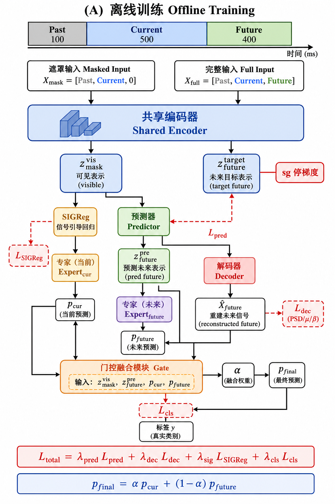

# 基于掩码未来表征预测与双专家门控融合的在线 MI-EEG 分类定稿方案

> 版本：v1.14（新增数据切片文档；训练定稿含 Decoder / P2 主结果；仅 Three；Adam）  
> 日期：2026-08-17  
> 定位：面向在线流式推理的窗级运动想象分类；训练可访问未来真值，推理严格无未来泄漏。  
> **主数据：OpenBMI**（`openbmi_2s_hop100`，sess01+02；250 Hz / 8 导 / 当前窗 2 s / hop 100 ms），在此基础上扩展 past/future 切片。  
> 排版说明：独立公式一律使用双美元定界符；行内符号尽量用代码记号（如 `X_mask`）。  
> **配置立场**：方法默认已冻结（见 §3 / §10）；对照、消融、扫描**全部必做**，见 `实验方案/`；选模口径见 [`协议_滑窗投票与Acc_paper.md`](./实验方案/协议_滑窗投票与Acc_paper.md)。

---

## 0. 方案摘要

本方案采用**等长双路输入 + 共享编码器 + 停梯度未来目标 + 隐空间未来预测 + μ/β 生理约束 + 双专家概率门控融合**：

1. 构造 1000 点完整样本 `X_full = [X_past, X_cur, X_future]`；
2. 构造等长掩码输入 `X_mask = [X_past, X_cur, 0_future]`（训练与推理统一）；
3. 共享 Encoder 分别编码两路；`X_full` 路 **no_grad** 截取未来段作目标，监督 Predictor 输出 `z_pre^future`；
4. Decoder + PSD/μ/β 约束预测表征的生理有效性（**训练定稿必有**，对齐 `flowchart_A_train.png`；实验上记为 **P2 主结果**）；
5. `Expert_cur` / `Expert_future` + Gate 融合得到 `p_final`；
6. SIGReg 约束 `z_mask` 可见段表征，抑制多任务坍塌。

**明确不采用**：独立 Target-Encoder 吃 400 点短序列；同窗随机块掩码 JEPA（可作为远期对照，非主线）。

---

## 1. 问题设定与设计目标

### 1.1 任务

- 数据集：**OpenBMI**（`openbmi_2s_hop100`，sess01+02；与仓库 OpenBMI Acc_paper 臂一致）。
- 通道：8 导（与 OpenBMI 预处理通道序一致）。
- 采样率：250 Hz。
- 类别：按现有 OpenBMI `label_map` / Rest 设定（实现时与 `openbmi_2s_hop100` 标签体系统一）。
- 评估主指标：试次 **Acc_paper**（见协议）；论文宣称“在线”时补充流式推理延迟说明。

### 1.2 要解决的痛点

| 痛点 | 对策 |
|------|------|
| 单 2 s 窗时序上下文不足 | past 0.4 s 缓存 + 隐空间外推 future 1.6 s |
| 在线不可见未来 | 训练用 `X_full` 当老师；推理只跑 `X_mask` |
| 多任务表征坍塌 | stop-grad 目标 + SIGReg |
| 隐表征缺乏生理意义 | Decoder + PSD/μ/β（训练定稿 / P2） |
| 噪声/漂移下单路不稳 | 双专家 + 可学习 Gate |

### 1.3 训练–推理契约（硬约束）

| 项目 | 训练 | 在线推理 |
|------|------|----------|
| `X_mask` | ✅ | ✅（唯一输入） |
| `X_full` | ✅（仅 target 支路） | ❌ |
| Decoder / `L_dec` | ✅ **定稿训练有**（P2；P1 阶梯关） | ❌ |
| 全部损失 / SIGReg 损失 | ✅（按方案开关） | ❌ |
| Predictor / 双专家 / Gate | ✅（P1/P2；P0/A2 无双专家） | ✅（同左，无损失） |
| 未来真实波形 | 可读 | 不可读 |

---

## 2. 时序数据构造规范

### 2.1 三段划分（相对当前窗起点 t = 0）

| 区间 | 符号 | 点数 | 时间 | 维度 | 可见性 |
|------|------|------|------|------|--------|
| 历史缓存 | `X_past` | 100 | [-0.4, 0] s | R^{8×100} | 训练+推理 |
| 当前观测 | `X_cur` | 500 | [0, 2] s | R^{8×500} | 训练+推理 |
| 未来未知 | `X_future` | 400 | [2, 3.6] s | R^{8×400} | **仅训练** |

总跨度：从 t−0.4 到 t+3.6，共 **4.0 s / 1000 点**。  
（注：时间轴以当前窗为锚点，写作 [-0.4, 3.6] s，避免与“0～4 s”混淆。）

### 2.2 双路等长输入（核心数据结构）

$$
X_{\mathrm{full}}=[X_{\mathrm{past}},X_{\mathrm{cur}},X_{\mathrm{future}}]\in\mathbb{R}^{8\times 1000}
$$

$$
X_{\mathrm{mask}}=[X_{\mathrm{past}},X_{\mathrm{cur}},M_{\mathrm{future}}]\in\mathbb{R}^{8\times 1000}
$$

**掩码填充（定稿默认）**：

- `M_future = 0`（全零，形状 8×400）。
- 消融对照：可学习 mask token 广播填充。
- 不采用高斯噪声填充（训练/推理分布更难点对齐）。

**可见上下文**（概念量，用于叙述）：

$$
X_{\mathrm{vis}}=[X_{\mathrm{past}},X_{\mathrm{cur}}]\in\mathbb{R}^{8\times 600}
$$

实现上主路径统一喂 1000 点 `X_mask`，由编码后的时间维池化区分可见段。  
**A1 例外（对照）**：主表对比仍用 1000pt 零填 future；另附报一条真 `(B,8,600)` 短输入，仅用于检查「零填 future 维」是否有害（见 [`实验方案/A1_可见上下文单专家.md`](./实验方案/A1_可见上下文单专家.md)）。

### 2.3 与现有 `openbmi_2s_hop100` 对齐规则

现有协议：窗长 2.0 s，步长 100 ms，样本核心为 `X_cur`（500 点）；数据为 OpenBMI sess01+02。

本方案每个样本索引 t（当前窗起点）需额外读取：

- past：`[t − 0.4 s, t)`
- future：`(t + 2.0 s, t + 3.6 s]`

**边界与滑窗策略（冻结）**：

- **锚点**：与 `openbmi_2s_hop100` 相同——以当前窗 `X_cur`（500 点）为锚、**hop=100 ms** 滑窗；**不是**按 future 400 当步长去跳步。
- **训练 / 评估均要有真 future（数据处理思路）**：在预处理阶段，于每个 MI trial 的**有效段之后额外保留至少 1.6 s（400 点）连续 EEG**（用户设想「MI 结束后再记一段」；长度须 ≥ future，故定为 **1.6 s 而非仅 1 s**，否则末尾 hop 仍缺 future）。这样在「当前窗仍落在原 MI 评分区间」的每个锚点上，都能取满 past100+cur500+future400；**训练与 Acc_paper 共用同一套齐全窗**，不再出现「无 future 尾窗进评估」。
- **缺 past**：trial 开头取不满 past 100 的锚点 → **裁掉**（不进训练、不进 Acc_paper）。
- **禁止**用零填 future 冒充 `X_full`。
- 标签 y：**绑定当前窗** `X_cur`，与现有 2 s 窗标签一致。

**实现文档（新臂，不改旧代码）**：完整切段 / 过滤 / 落盘约定见  
[`数据切片与边界过滤说明.md`](./数据切片与边界过滤说明.md)。  
A0 继续用旧 `openbmi_2s_hop100`；A1+ / P* 用新臂 `openbmi_2s_hop100_pf1000`（名称以实现为准）。

**`p_future` 与标签（同 trial 弱监督，冻结表述）**：

- Expert_future 的 CE 使用**当前窗标签 y**，依据是：future 段与当前窗同属**同一 trial** 内的连续片段（弱监督），**不是**声称「未来整段 1.6 s 的运动想象意图 ≡ 当前 2 s 窗」。
- 若将 future 物理长度改为 0.8 s 等，属改协议，须另开修订；本臂仍用 future=400 点 / 1.6 s 做表征预测目标。

### 2.4 张量约定（实现，冻结）

DataLoader / 模型输入与仓库 Shallow 一致，**不用** `(B,1,8,T)`：

| 字段 | 形状 | 说明 |
|------|------|------|
| `X_mask` | **(B, 8, 1000)** | 后 400 点已置零 |
| `X_full` | **(B, 8, 1000)** | 仅训练需要 |
| `y` | (B,) | 当前窗标签 |
| meta | — | subject / fold / trial_id / t0 等 |

- **A0**：`n_times=500`，输入 `(B, 8, 500)`。  
- **A1+ / P\***：上下文 `n_times=1000`；A0 与新方法 **分建模型**（`final_conv_length` 依赖 `n_times`），禁止共用按 500 初始化的分类头去跑 1000。  
- 推理只构造 `X_mask`。

---

## 3. 网络模块定稿

### 3.0 实现源与工程冻结（相对仓库代码）

| # | 项 | 冻结约定 |
|---|----|----------|
| 1 | 输入布局 | **`(B, 8, T)`**（见 §2.4） |
| 2 | Encoder 对齐 | **先**用自写 `shallowfbcsp` + 协议超参跑 OpenBMI **Three** Acc_paper，与 braindecode 正式臂对照；对齐可接受后，**A0 与 P0+ 均用自写**。禁止混载 braindecode 权重 |
| 3 | 分类头 | **弃用** Shallow 自带 `FinalClassifier`；只用 `forward_features` → Expert / Gate |
| 4 | 特征时间索引 | §3.2.1 硬规格；单测失败则**停训**（阈值：\(\|\Delta Z_{fut}\|/\|\Delta Z_{vis}\|\ge 3\)） |
| 5 | 表征维 D | **固定 D=40**；**不做** `40→128` |
| 6 | batch | **train=256 / eval=512**；OOM 再降并记 meta |
| 7 | patience / 优化器 | patience=**20**；**Adam**（lr=1e-4，wd=1e-4） |
| 8 | L1 骨干 | EEGNet / Deep4 须带 T′；**仅 Three** |
| 9 | SIGReg | §3.7；`num_slices=1024`；B=256 足够 |
| 10 | 双前向显存 | §3.0.1 |
| 11 | 训练/评估窗 | post-MI **≥1.6 s** 补上下文后齐全窗一致；缺 past **裁掉** |
| 12 | 在线冷启动 | 仅可见&lt;600 不预测 |
| 13 | 头任务 | **仅 Three**（不做 Task 五折） |
| 14 | Expert / Gate | A2/P0 起 Expert **`D→64→C`**；Gate **`Linear(2D→64→1)+Sigmoid`** |
| 15 | Val 划分 | 复用 `iter_subject_kfold`：**折内 Val 按被试**从剩余人中抽（`val_ratio=0.2`），不是按窗抽 |
| 16 | P2 PSD | **通道均值**波形再估 PSD / μβ 能量（开跑）；逐通道为 L1/附报 |

#### 3.0.1 双路前向与显存（#10 冻结）

- mask 路：`Z_mask = Encoder(X_mask)`，**保留梯度**（分类 / `L_pred` / SIGReg 反传进 Encoder）。  
- full 路：`with torch.no_grad(): Z_full = Encoder(X_full)`，再 `Pool` 得 `z_target^future`（与对 target **sg** 等价，且省激活显存）。  
- 开跑 batch 仍 **256/512**；OOM 时按 **128/256 → 64/128** 降，并在 meta 写明；优先开 AMP（与 OpenBMI 正式臂一致）。  
- **禁止**为省事把 `X_full` 误接到可反传的分类 CE 上。

### 3.1 模块清单与启停

> **#16 冻结**：离线训练以 [`flowchart_A_train.png`](./flowchart_A_train.png) 为准 → **训练有 Decoder**（+ `L_dec`）。  
> **P2** = 对齐该图的**唯一主结果**；**P1** = 同结构但关 Decoder 的阶梯/对照（仍必做）。推理始终无 Decoder。

| 模块 | P1 训练 | P2 训练（定稿） | 推理 | 参数更新 | 功能 |
|------|---------|-----------------|------|----------|------|
| Shared Encoder | ✅ | ✅ | ✅ | ✅（仅经 mask 路径及分类/预测反传） | 时空特征 → **时间维**表征序列 |
| Future Predictor | ✅ | ✅ | ✅ | ✅ | `z_mask^vis` → `z_pre^future` |
| Decoder | ❌ | ✅ | ❌ | ✅（仅 P2） | `z_pre^future` → `X̂_future` |
| SIGReg | ✅（损失） | ✅ | ❌ | 无参 | 约束可见表征分布 |
| `Expert_cur` | ✅ | ✅ | ✅ | ✅ | `z_mask^vis` → `p_cur` |
| `Expert_future` | ✅ | ✅ | ✅ | ✅ | `z_pre^future` → `p_future` |
| Gate | ✅ | ✅ | ✅ | ✅ | 输出 α ∈ (0, 1) |
| Target 支路（`X_full` 前向） | ✅ | ✅ | ❌ | **no_grad / sg，不经此路更新** | 提供 `z_target^future` |

### 3.2 Shared Encoder（必须保留时间维）

**实现源（冻结）**：

| 方案 | Encoder 代码源 | 说明 |
|------|----------------|------|
| **A0（对齐跑）** | braindecode `ShallowFBCSPNet` | 仅作 Acc_paper 量级对照 |
| **A0（主表）/ A1+ / P0+** | [`self_model/shallowfbcsp.py`](../../../../self_model/shallowfbcsp.py) | 自写；对齐可接受后作为唯一骨干；**禁止**混载 braindecode 权重 |

**硬性要求（凡含 `L_pred`）**：必须经 `forward_features` 得到时间维特征，再 segment mean；**禁止** Encoder 只输出单一全局向量后做预测；**禁止**再接 Shallow 原 `final_layer` 当本方案分类头。

记（实现上先 `squeeze` 掉末维 1）：

$$
Z=\mathrm{forward\_features}(X)\in\mathbb{R}^{B\times D\times T'},\quad D=40
$$

#### 3.2.1 特征时间索引 `I_vis` / `I_future`（#4 冻结硬规格）

**问题**：输入上 past/cur/future = 100/500/400，但 Shallow 有 `ConvTime(k=25)` + `AvgPool(75, stride=15)`，**原始点数比例 ≠ 特征 T′ 下标**。

**禁止（硬禁令）**：

```text
cut = int(0.6 * T_prime)   # 或任何「按 600:400 比例切 T′」
I_vis, I_future = range(cut), range(cut, T_prime)
```

即使在默认超参下 `i(600)` 可能碰巧等于 `int(0.6*T')`，也**必须**走下方 `i(t)` 公式，不得用比例切作为实现依据（换 `n_times` / pool 后二者会分叉）。

**开跑冻结（默认 Shallow：`n_times=1000`，`filter_time_length=25`，`pool=75/15`）**：

1. 长度（实现时用 dummy `forward_features` 断言一致）：

$$
T_1=n_{\mathrm{times}}-(25-1)=976,\quad
T'=\Big\lfloor\frac{T_1-75}{15}\Big\rfloor+1=61
$$

2. **唯一开跑映射**（线性；全仓只许这一种，直至 L1 换感受野表）：

$$
i(t)=\mathrm{round}\Big(\frac{t}{n_{\mathrm{times}}-1}\cdot(T'-1)\Big)=\mathrm{round}\Big(\frac{t}{999}\cdot 60\Big),\quad t\in\{0,1,\ldots,999\}
$$

边界表（写死进代码 / 单测）：

| raw 边界 \(t\) | \(i(t)\) |
|----------------|----------|
| 0 | 0 |
| 100 | 6 |
| **600** | **36** |
| 999 | 60 |

3. **切段（边界格划给 future）**：

```text
i_split = i(600)           # = 36
I_vis    = {0, 1, …, i_split - 1}   # 0 … 35
I_future = {i_split, …, T' - 1}     # 36 … 60
```

等价伪代码：

```python
def feat_index(t: int, n_times: int = 1000, t_prime: int = 61) -> int:
    return int(round(t / (n_times - 1) * (t_prime - 1)))

def segment_indices(n_times: int = 1000, t_prime: int = 61):
    # 禁止: cut = int(0.6 * t_prime)
    i_split = feat_index(600, n_times, t_prime)  # 36
    I_vis = list(range(0, i_split))               # 0..35
    I_future = list(range(i_split, t_prime))      # 36..60
    return I_vis, I_future
```

4. **必做单测**（失败则**立即停训**，先修映射再开正式五折；禁止“先训着再说”）：
   - `forward_features` 输出 `shape[2] == 61`；
   - `feat_index(600) == 36`，`I_vis[-1] == 35`，`I_future[0] == 36`；
   - 只扰动 `X_full` 的 future 400 点：须 \(\|\Delta Z[I_{\mathrm{future}}]\|/\|\Delta Z[I_{\mathrm{vis}}]\|\ge 3\)（硬门控；不满足即判定索引错）；
   - 只扰动 past+cur → 主要动 `I_vis`（对称检查，附报即可）。

L1 可将 `feat_index` 换成「感受野表精标定」，但 **接口与单测不变**；主表须注明映射版本。

池化读出：

$$
z_{\mathrm{mask}}^{\mathrm{vis}}=\mathrm{mean}\big(Z_{\mathrm{mask}}[I_{\mathrm{vis}}]\big)\in\mathbb{R}^{B\times D}
$$

$$
z_{\mathrm{target}}^{\mathrm{future}}=\mathrm{mean}\big(Z_{\mathrm{full}}[I_{\mathrm{future}}]\big)\in\mathbb{R}^{B\times D}
$$

$$
z_{\mathrm{pre}}^{\mathrm{future}}=\mathrm{Predictor}\big(z_{\mathrm{mask}}^{\mathrm{vis}}\big)
$$

骨干：**P0 起**落地自写 Shallow；EEGNet / Deep4 为 **L1 必做**对照（同样要 feature 时间维，见 §3.0 #8）。

### 3.3 Target 策略（冻结默认）

**冻结：共享权重 + stop-gradient**

$$
L_{\mathrm{pred}}=\big\|z_{\mathrm{pre}}^{\mathrm{future}}-\mathrm{sg}\big(z_{\mathrm{target}}^{\mathrm{future}}\big)\big\|_{2}^{2}
$$

- `X_full` 与 `X_mask` 共用同一 Encoder 权重；
- target 路径只前向，对 `z_target^future` 施加停梯度算子 sg(·)；
- **不**使用随机初始化后永久冻结的第二套 Encoder。

**必做消融**：无 sg（B2）；EMA target（B10）。

### 3.4 Future Predictor

- 输入：`z_mask^vis`，形状 (B, D)
- 输出：`z_pre^future`，形状 (B, D)（与 target 同维）
- 结构：2～3 层 MLP（开跑锚点见 P1）；保持参数量远小于 Encoder。

### 3.5 Decoder（训练定稿必有；对齐训练图；P1 阶梯关闭）

$$
\hat{X}_{\mathrm{future}}=\mathrm{Decoder}\big(z_{\mathrm{pre}}^{\mathrm{future}}\big)\in\mathbb{R}^{B\times 8\times 400}
$$

仅训练使用（推理关闭）；用于 PSD/μ/β（**必做含**轻量时域 MSE，权重见 §4.2；C 系列再拆子项）。开跑：`Linear(D → 8*400)` 再 `view(B,8,400)`。

### 3.6 双专家与 Gate

$$
p_{\mathrm{cur}}=\mathrm{Softmax}\big(\mathrm{Expert}_{\mathrm{cur}}(z_{\mathrm{mask}}^{\mathrm{vis}})\big)
$$

$$
p_{\mathrm{future}}=\mathrm{Softmax}\big(\mathrm{Expert}_{\mathrm{future}}(z_{\mathrm{pre}}^{\mathrm{future}})\big)
$$

**冻结默认（P1/P2）**：Gate **仅吃两个表征**（不含概率）：

$$
\alpha=\sigma\Big(\mathrm{Gate}\big([z_{\mathrm{mask}}^{\mathrm{vis}},\,z_{\mathrm{pre}}^{\mathrm{future}}]\big)\Big)
$$

**必做变体（L1）**：Gate 输入改为 `[z_{\mathrm{mask}}^{\mathrm{vis}}, z_{\mathrm{pre}}^{\mathrm{future}}, p_{\mathrm{cur}}, p_{\mathrm{future}}]`。

$$
p_{\mathrm{final}}=\alpha\,p_{\mathrm{cur}}+(1-\alpha)\,p_{\mathrm{future}}
$$

- 两专家结构对称，**`D→64→C`**，**不共享**权重；输入维 **D=40**。
- Gate 开跑：**`Linear(2D → 64 → 1) + Sigmoid`** → 标量 α。

### 3.7 SIGReg（#9，对齐论文实现）

**文献与代码（必须引用，禁止按名字自创）**：

- 论文：Balestriero & LeCun, *LeJEPA: Provable and Scalable Self-Supervised Learning Without the Heuristics*, **arXiv:2511.08544**
- 官方实现：[`rbalestr-lab/lejepa`](https://github.com/rbalestr-lab/lejepa)（包名 `lejepa`）

**本方案用法（冻结开跑）**：

$$
L_{\mathrm{SIGReg}}=\mathrm{SIGReg}\big(z_{\mathrm{mask}}^{\mathrm{vis}}\big),\quad z_{\mathrm{mask}}^{\mathrm{vis}}\in\mathbb{R}^{B\times D}
$$

| 项 | 取值 |
|----|------|
| 调用形态 | `SlicingUnivariateTest(univariate_test=EppsPulley(...), num_slices=…)` 或官方等价 API |
| `num_slices` | **1024**（论文常用量级；若显存/耗时过大可在 meta 改为 512 并记录） |
| Epps–Pulley `num_points` | 跟官方默认（常见 17） |
| 作用对象 | 仅 `z_mask^vis`（batch 维当样本） |
| 可学习参数 | 无 |

**与 LeJEPA 全文的差异（写进论文 Methods）**：本方法**保留**共享 Encoder + **stop-grad / no_grad 未来目标**；只借用 **SIGReg 实现与超参习惯**，**不**宣称复现 LeJEPA（LeJEPA 主张去掉 stop-grad 等启发式）。

仅训练计算。

---

## 4. 多任务损失（完整公式）

### 4.1 隐表征预测损失

$$
L_{\mathrm{pred}}=\frac{1}{BD}\sum_{b=1}^{B}\sum_{d=1}^{D}\Big(z_{\mathrm{pre}}^{\mathrm{future}}-\mathrm{sg}\big(z_{\mathrm{target}}^{\mathrm{future}}\big)\Big)_{b,d}^{2}
$$

### 4.2 生理重构损失（P2）

对 `X̂_future` 与 `X_future`：

1. **开跑**：先对 8 通道做**通道均值**得 1 路波形，再估 PSD / 频带能量（μ 8–13 Hz，β 13–30 Hz）；建议 `rfft`/`welch` 固定 `n_fft`（如 256）与窗，训练与验证同一实现。
2. L1/附报可改逐通道再平均。

$$
L_{\mathrm{psd}}=\big\|\mathrm{PSD}(\hat{X}_{\mathrm{future}})-\mathrm{PSD}(X_{\mathrm{future}})\big\|_{1}
$$

$$
L_{\mu}=\big\|\hat{P}_{\mu}-P_{\mu}\big\|_{1}
$$

$$
L_{\beta}=\big\|\hat{P}_{\beta}-P_{\beta}\big\|_{1}
$$

$$
L_{\mathrm{time}}=\big\|\hat{X}_{\mathrm{future}}-X_{\mathrm{future}}\big\|_{2}^{2}
$$

（`L_time` **必做纳入** P2，小权重；是否去掉由 C2c 必做消融。）

$$
L_{\mathrm{dec}}=\lambda_{\mathrm{psd}}L_{\mathrm{psd}}+\lambda_{\mu}L_{\mu}+\lambda_{\beta}L_{\beta}+\lambda_{\mathrm{time}}L_{\mathrm{time}}
$$

**`L_dec` 内冻结比例（P2）**：

$$
\lambda_{\mathrm{psd}}:\lambda_{\mu}:\lambda_{\beta}:\lambda_{\mathrm{time}}=1:1:1:0.1
$$

### 4.3 分类损失

**P1/P2 冻结默认**（两项）：

$$
L_{\mathrm{cls}}=L_{\mathrm{CE}}(p_{\mathrm{cur}},y)+L_{\mathrm{CE}}(p_{\mathrm{final}},y)
$$

**完整三项形式**（必做变体 B6 / L1）：

$$
L_{\mathrm{cls}}^{\mathrm{(3)}}=L_{\mathrm{CE}}(p_{\mathrm{cur}},y)+L_{\mathrm{CE}}(p_{\mathrm{future}},y)+L_{\mathrm{CE}}(p_{\mathrm{final}},y)
$$

说明：`p_future` 使用**同 trial 当前窗标签 y**（弱监督：未来段与当前窗同属一 trial 的连续片段），**不是**声称「未来 1.6 s 意图 ≡ 当前窗」；**不得**把三项误写成 P1 默认。

### 4.4 总损失

$$
L_{\mathrm{total}}=\lambda_{\mathrm{pred}}L_{\mathrm{pred}}+\lambda_{\mathrm{dec}}L_{\mathrm{dec}}+\lambda_{\mathrm{sig}}L_{\mathrm{SIGReg}}+\lambda_{\mathrm{cls}}L_{\mathrm{cls}}
$$

**冻结起步权重**：

| 权重 | P1（无 Dec） | P2（定稿/主结果） | 备注 |
|------|--------------|-------------------|------|
| `λ_cls` | 1.0 | 1.0 | 主任务 |
| `λ_pred` | 1.0 | 1.0 | 与分类同量级起步 |
| `λ_sig` | 0.05 | 0.05 | 过强会伤判别；L1 必扫 |
| `λ_dec` | **0** | **0.2** | 定稿训练跟图 → P2 开 |

P0/A2：`λ_dec=0`，无 Gate / `Expert_future`（见第 6 节与实验方案）。

---

## 5. 训练与推理流程

### 5.1 离线训练（一个 iteration）

1. 取一个 batch：掩码输入 `X_mask`、完整输入 `X_full`、标签 y。
2. 编码掩码支路：

$$
Z_{\mathrm{mask}}=\mathrm{Encoder}(X_{\mathrm{mask}})
$$

$$
z_{\mathrm{mask}}^{\mathrm{vis}}=\mathrm{Pool}\big(Z_{\mathrm{mask}}[I_{\mathrm{vis}}]\big)
$$

并计算 `L_SIGReg`。

3. 编码目标支路（**整段 no_grad**，等价 sg）：

$$
Z_{\mathrm{full}}=\mathrm{Encoder}(X_{\mathrm{full}})\quad(\texttt{torch.no\_grad})
$$

$$
z_{\mathrm{target}}^{\mathrm{future}}=\mathrm{mean}\big(Z_{\mathrm{full}}[I_{\mathrm{future}}]\big)
$$

4. 未来表征预测：

$$
z_{\mathrm{pre}}^{\mathrm{future}}=\mathrm{Predictor}\big(z_{\mathrm{mask}}^{\mathrm{vis}}\big)
$$

$$
L_{\mathrm{pred}}=\big\|z_{\mathrm{pre}}^{\mathrm{future}}-z_{\mathrm{target}}^{\mathrm{future}}\big\|_{2}^{2}
$$

5. （P2）解码并计算生理损失：

$$
\hat{X}_{\mathrm{future}}=\mathrm{Decoder}\big(z_{\mathrm{pre}}^{\mathrm{future}}\big)
$$

随后计算 `L_dec`。

6. 双专家与门控：由 `p_cur`、`p_future` 经 Gate 得到 α，再得到 `p_final`，并计算 `L_cls`。
7. 由 `L_total` 反向传播，更新 Encoder、Predictor、Decoder（P2）、双专家与 Gate。  
   **注意**：第 3 步不得让梯度流入 target 路径。

### 5.2 在线推理

1. 实时缓冲拼出 `X_past`、`X_cur`，未来段填零，得到 `X_mask`。
2. Encoder 提取 `z_mask^vis`。
3. `Expert_cur` 得到 `p_cur`；Predictor → `Expert_future` 得到 `p_future`。
4. Gate 融合得到 `p_final`，预测类别为

$$
\hat{y}=\arg\max_{c}\,p_{\mathrm{final}}^{(c)}
$$

5. 不使用 `X_full`、Decoder，也不计算任何损失。

### 5.3 流程图（定稿可视化）

预览中直接显示下方图片（不再使用 Mermaid 源码）。浏览器可交互版本见同目录 [`framework_flowchart_train_infer.html`](./framework_flowchart_train_infer.html)。

> **#16**：下图 (A) 即**离线训练定稿**——**含 Decoder**（与 [`flowchart_A_train.png`](./flowchart_A_train.png) 一致；同源亦见 `资料/Lejepa_shallow模型方案/.../flowchart_A_train.png`）。  
> 图注：图 X 掩码未来表征预测与双专家门控框架。(A) 离线训练：等长 `X_mask` / `X_full` 共享编码；`z_target^future` 停梯度监督 Predictor；**Decoder** 提供 PSD/μ/β（`L_dec`）；双专家经 Gate 融合得 `p_final`；`L_total = λ_pred L_pred + λ_dec L_dec + λ_sig L_SIGReg + λ_cls L_cls`。(B) 在线推理：仅 `X_mask`；**无** `X_full`、**无 Decoder**、无损失；`ŷ = argmax(p_final)`。  
> 实验映射：**P2 = 本图训练**（主结果）；**P1 = 同图但关 Decoder**（阶梯/对照）。

#### (A) 离线训练



#### (B) 在线推理


---

## 6. 分阶段实现计划（按此顺序落地，阶段内方案均必做）

### P0 — 最小可验证闭环

**目标**：证明“掩码可见表征能预测 future 隐变量，且当前专家可分类”。

包含：

- 数据：post-MI ≥1.6 s；齐全窗；缺 past 裁掉；`X_mask`/`X_full`；
- Shared Encoder = **自写** `shallowfbcsp` + §3.2.1 + Predictor + `L_pred`；
- full 路 **no_grad**；Expert_cur **`D→64→C`** + CE；**D=40**（无 128 投影）；
- `λ_dec = 0`，无 Gate / `Expert_future` / Decoder / SIGReg；**仅 Three**；**Adam**。

验收：

- `L_pred` 下降且验证集不崩；
- **Val Acc_paper** 不低于 A1 过多。

### P1 — 双专家 + 门控 + SIGReg（阶梯 / 无 Decoder 对照）

在 P0 上增加：

- `Expert_future`、Gate（**仅两 z**）、**`L_cls = CE(cur)+CE(final)`**（非三项）；
- SIGReg；
- **仍关 Decoder**（相对训练定稿图的对照）。

验收：相对 P0 与 A1 有增益；观察 α；为 P2 / B 系列提供锚点。

### P2 — 训练定稿（**唯一主结果**；对齐 `flowchart_A_train.png`）

在 P1 上打开 Decoder + `L_dec`（PSD/μ/β + 时域 MSE）→ **与训练流程图一致**。

验收：相对 P1 的 Acc_paper Δ；C 系列拆 `L_dec` 子项。

---

## 7. 对照与消融实验设计

### 7.1 公平基线（全部必做）

| 编号 | 设置 | 目的 |
|------|------|------|
| A0 | 现有 2 s / 500 点单专家（`openbmi_2s_hop100` Shallow） | OpenBMI 对照锚点 |
| A1 | 主对比：`(B,8,1000)` `X_mask` + 单 `Expert_cur`；附报：真 600pt | 分离「多看 0.4 s」；附报查零填副作用 |
| A2 / P0 | + Predictor / `L_pred`，推理仍单专家 | 分离预测辅助 |
| P1 | 双专家 + Gate + SIGReg（关 Decoder） | 阶梯 / 无 Dec 对照 |
| P2 | P1 + Decoder（**对齐训练图**） | **唯一主结果** |

### 7.2 结构/损失消融（全部必做，见 B/C）

1. w/o mask（在线支路误用 `X_full`）→ 泄漏上限（B9，分析进表备注，不夺冠）
2. w/o `L_pred`（B1）
3. w/o no_grad / 误开 full 路梯度（B2）
4. w/o SIGReg（B3）
5. w/o `Expert_future` / Gate（B4）
6. 固定 α（B5）
7. **加上** 对 `p_future` 的交叉熵（B6；相对 P1 默认两项）
8. w/o CE(final)（B7）
9. learnable mask token（B8）
10. EMA target（B10）
11. P2 上拆 `L_dec`（C1–C2）

### 7.3 协议与训练超参（冻结）

继承 `*_baselines_openbmi_2s_hop100_accpaper`，并固定本臂：

- 五折（`iter_subject_kfold`）、`val_ratio=0.2`、`seed=42`（**Val/Test 均按被试**）
- `max_epochs=300`、`patience=20`
- early stop：**Val Acc_paper**
- train sampler：balbatch
- batch：**256 / 512**
- lr / wd / drop：`1e-4` / `1e-4` / `0.5`
- 优化器：**Adam**
- **仅 Three**（不做 Task 五折）

新增日志：`L_pred`、`L_cls` 各分项、`L_SIGReg`、`L_dec`，以及 α 的均值与标准差。

**窗集口径**：post-MI≥1.6 s 后，训练与 Acc_paper **同一套** past+cur+future 齐全窗；缺 past 裁掉；冷启动可见&lt;600 不预测。

---

## 8. 实现注意事项（防踩坑）

1. **Target 路径梯度**：必须对 `z_target^future` 停梯度；勿让 `X_full` 支路未截断地参与反向传播。
2. **时间索引 I_future**：必须与卷积下采样对齐；写单元测试：仅扰动未来段输入时，应主要改变 future 切片表征。
3. **Batch 内相关性**：同一 trial 相邻 hop 高度重叠，属协议固有现象；对比实验保持同一 hop，除非明确改协议。
4. **推理延迟**：Encoder（1000 点）+ Predictor + 两专家 + Gate；相对 500 点基线略增，需在结果中报告单窗前向耗时。
5. **不要**在论文中把窗级 Acc 直接写成“异步 BCI 闭环性能”；异步策略另文。

---

## 9. 论文表述建议（可直接改写进 Methods）

> 本文提出面向在线运动想象分类的掩码未来表征预测框架。对每个以当前 2 s 观测窗为锚点的样本，拼接其前 0.4 s 历史与后 1.6 s 未来，构成 4 s / 1000 点序列。训练阶段同时构造完整输入 `X_full` 与未来置零的掩码输入 `X_mask`，二者共享编码器（实现上为对齐 braindecode 默认的自写 ShallowFBCSP，经 `forward_features` 做分段读出）。由 `X_full` 编码并截取的未来表征在 no_grad 下提供目标，监督由 `X_mask` 可见表征预测得到的未来隐变量；辅以 Sketched Isotropic Gaussian Regularization（SIGReg；实现遵循 Balestriero & LeCun, arXiv:2511.08544 / LeJEPA 官方代码）与 μ/β 频域重构约束（P2）。分类采用当前专家与未来专家双分支，并由门控在概率空间自适应融合（Gate 默认仅融合两路表征）。在线推理仅使用 `X_mask`，不访问真实未来数据。本方法保留 stop-grad/no_grad 未来目标，故不宣称复现 LeJEPA 全文训练范式。

图注可采用：

> 图 X 整体框架。(A) **离线训练定稿**（对齐 `flowchart_A_train.png`）：含 Decoder / `L_dec`；停梯度未来目标监督 Predictor；双专家 + Gate → `p_final`。(B) 推理：仅 `X_mask`，无 `X_full`、无 Decoder、无损失。

---

## 10. 冻结默认 + 必做变体

| 决策项 | **冻结默认（开跑/主表）** | **必做变体** |
|--------|---------------------------|--------------|
| Encoder 实现 | **主表自写** shallowfbcsp；braindecode 仅对齐对照 | L1：EEGNet/Deep4 |
| 输入 | `(B,8,T)`；P* 用 T=1000 | A0：T=500 |
| 读出 | §3.2.1；**D=40**（无 128 投影） | 禁 `0.6×T'`；L1 可换 RF 表 |
| 掩码填充 | 全零 | learnable token（B8） |
| Target | 共享 Encoder + **no_grad full 路** | B2 / B10 |
| 分类损失 | **CE(cur)+CE(final)** | +CE(future)（B6）；w/o CE(final)（B7） |
| Gate | **仅两 z**；`Linear(2D→64→1)` | z+概率（L1） |
| Expert | **`D→64→C`**（A2 起） | — |
| SIGReg | LeJEPA，`num_slices=1024` | B3 |
| Decoder | **训练定稿开（P2）**；P1 关 | C 系列 |
| 数据尾段 | post-MI **≥1.6 s**；训评窗一致 | — |
| 头任务 | **仅 Three** | — |
| 优化 | **Adam**；batch **256/512**；patience **20** | OOM 降 batch |
| 主对照 | A0 + A1 + A2/P0 + P1 + **P2（主结果）** | B/C/L1 |

细节见 `实验方案/`。

> **#16（已冻结）**：训练有 Decoder，以 [`flowchart_A_train.png`](./flowchart_A_train.png) 为准；该图即定稿，不是「仅 P2 示意」。P1=关 Decoder 的阶梯/对照；推理无 Decoder。

---

## 11. 目录与后续产出

| 路径 | 内容 |
|------|------|
| 本文第 13–15 节 | **全部必做**实验清单、必做扫描空间、统一协议 |
| [`实验方案/`](./实验方案/) | **每个实验方案的独立说明** |
| `flowchart_*.png` / `framework_flowchart_train_infer.html` | 流程图（**(A)=训练定稿，含 Decoder**） |
| [`数据切片与边界过滤说明.md`](./数据切片与边界过滤说明.md) | **新预处理臂**（1000 点 / post-MI≥1.6s；**不改**旧 `openbmi_2s_hop100` 代码） |
| `伪代码_训练推理.py` | 待补 |

---

## 12. 修订记录

| 版本 | 日期 | 说明 |
|------|------|------|
| v1.0–v1.4 | 2026-08-16 | 框架、公式、流程图 |
| v1.5 | 2026-08-16 | 曾写入单一默认配置（该立场已废弃） |
| v1.6 | 2026-08-16 | 方案清单 + 可选配置/优先级 |
| v1.7 | 2026-08-16 | 消矛盾（Gate/`L_cls`/Decoder/时间维）；**全部可选→必做**；OpenBMI |
| v1.8 | 2026-08-16 | 实现源：A0=braindecode，P0+=自写 Shallow；SIGReg←LeJEPA；工程 #1–10 |
| v1.9 | 2026-08-16 | #4 采纳；#5 D 消融；#12 仅冷启动 |
| v1.10 | 2026-08-16 | **训练仅 past+cur+future 齐全窗**；Acc_paper 可含无 future 尾窗 |
| v1.11 | 2026-08-17 | §3.2.1 钉死索引硬规格 |
| v1.12 | 2026-08-17 | post-MI≥1.6s；仅 Three；Adam；无128；自写A0对齐；Expert/Gate/PSD/Val按被试钉死 |
| v1.13 | 2026-08-17 | **#16**：训练定稿含 Decoder（以 `flowchart_A_train.png` 为准）；**P2=唯一主结果**；P1=无 Dec 阶梯 |
| v1.14 | 2026-08-17 | 新增 [`数据切片与边界过滤说明.md`](./数据切片与边界过滤说明.md)（新预处理臂文档；不改旧代码） |

---

## 13. 需要进行的实验方案清单（总表）

> 原则：先对照、再主模型、再消融、再扫描。详细写法见 `实验方案/`。  
> **优先级：全部必做**（无「建议/可选」档）。

### 13.1 总览

| 方案 ID | 名称 | 优先级 | 详述文件 | 一句话目的 |
|---------|------|--------|----------|------------|
| 协议 | 滑窗投票 + Acc_paper | **必读** | [`实验方案/协议_滑窗投票与Acc_paper.md`](./实验方案/协议_滑窗投票与Acc_paper.md) | 早停/主报/超参/性能锚点 |
| A0 | 旧 2s 单专家基线 | **必做** | [`实验方案/A0_旧2s单专家基线.md`](./实验方案/A0_旧2s单专家基线.md) | 对齐 OpenBMI Shallow Acc_paper |
| A1 | 可见上下文单专家 | **必做** | [`实验方案/A1_可见上下文单专家.md`](./实验方案/A1_可见上下文单专家.md) | 分离多 0.4s cache |
| A2 | 预测辅助 + 单专家推理 | **必做** | [`实验方案/A2_预测辅助_单专家推理.md`](./实验方案/A2_预测辅助_单专家推理.md) | 分离 L_pred 辅助 |
| P0 | 最小可验证闭环 | **必做** | [`实验方案/P0_最小可验证闭环.md`](./实验方案/P0_最小可验证闭环.md) | 打通 raw→预测→分类 |
| P1 | 双专家 + Gate + SIGReg | **必做（阶梯/无 Dec）** | [`实验方案/P1_双专家门控与SIGReg.md`](./实验方案/P1_双专家门控与SIGReg.md) | 关 Decoder 对照 |
| P2 | + Decoder（对齐训练图） | **必做（唯一主结果）** | [`实验方案/P2_生理解码约束.md`](./实验方案/P2_生理解码约束.md) | 定稿训练 = 流程图 (A) |
| B1–B10 | 相对 P1 消融 | **全部必做** | [`实验方案/消融B系列_相对P1.md`](./实验方案/消融B系列_相对P1.md) | 分解模块贡献 |
| C1–C2 | 相对 P2 消融 | **全部必做** | [`实验方案/消融C系列_相对P2.md`](./实验方案/消融C系列_相对P2.md) | 分解 L_dec |
| L1 | 超参/结构扫描 | **必做** | [`实验方案/L1_超参与结构扫描.md`](./实验方案/L1_超参与结构扫描.md) | 选优回填 **P2** |

索引：[`实验方案/00_索引.md`](./实验方案/00_索引.md)

### 13.2 推荐执行顺序

```text
A0 → A1 → P0/A2 → P1 → B1–B10 → P2 → L1 → C1–C2
```

### 13.3 论文用法

| 用途 | 方案 |
|------|------|
| **方法主列** | **P2**（=训练图，含 Decoder） |
| 主表对照 | A0, A1, P1（无 Dec）, **P2** |
| 消融表 | B1–B10（相对 P1）；C1–C2（相对 P2） |
| 非仅更长窗 | P1 − A1（或 P2 − A1） |
| 预测有用 | A2/P0 vs A1；B1 |
| 双专家/门控 | B4, B5 |
| +CE(future) | B6 |
| Decoder 贡献 | P2 − P1；C 系列 |

---

## 14. 必做扫描空间与调参顺序

### 14.1 顺序（均必做，一次动一类）

| 序 | 类别 | 说明 |
|----|------|------|
| 1 | 数据边界、mask、sg、模块开关 | 公平性与可复现（B 系列） |
| 2 | λ_pred、分类是否 +CE(future)、Gate 输入、分段读出 | L1 高优先 |
| 3 | λ_sig、头宽度、Adam/AdamW、骨干 | L1 中低优先 |
| 4 | λ_dec、Decoder 子项 | P2 + C |
| 冻结 | seed、折、val、hop、通道、早停=Acc_paper、batch=256/512 | 跨方案一致 |

### 14.2 必做网格摘要

**数据**：past/cur/future=100/500/400；post-MI≥1.6s；缺 past 裁掉；A0 仅 500；mask=`zero`|`learnable_token`(B8)。

**Encoder**：自写 Shallow（主）+ EEGNet/Deep4（L1）；D=**40**（无128投影）；`share+no_grad`。

**头**：Predictor MLP；Expert **`D→64→C`**；Gate **`2D→64→1`**（仅 z）；L1 可扫 z+p。

**损失**：cur+final；B6 三项；`λ_pred∈{0.25,0.5,1,2}`；`λ_sig∈{0,0.01,0.05,0.1}`；P2 `λ_dec∈{0.05,0.1,0.2,0.5}`。

**优化**：**Adam**；lr=`1e-4`；batch **256/512**；patience **20**；**仅 Three**。

各方案开跑锚点跑完后，将 L1 选定组合回填 **P2**「当前采用」（主结果）。

---

## 15. 跨方案统一协议（OpenBMI Acc_paper）

> **完整条文**见：  
> [`实验方案/协议_滑窗投票与Acc_paper.md`](./实验方案/协议_滑窗投票与Acc_paper.md)

| 项 | 冻结约定 |
|----|----------|
| 滑窗 | \(T_w=2\,\mathrm{s}\)，hop=\(100\,\mathrm{ms}\)，OpenBMI；post-MI≥1.6s |
| 头任务 | **仅 Three** |
| 划分 | `iter_subject_kfold`（Test/Val **按被试**） |
| 训练 | 窗级 CE（+方案内损失）+ balbatch；**Adam** |
| 早停 | **Val Acc_paper**；patience=**20** |
| 主报 | **Test Acc_paper** 五折 mean±std |
| 超参 | lr=`1e-4`，wd=`1e-4`，drop=`0.5`，batch=`256/512` |
| 性能对照 | A0=自写 shallow（先与 braindecode 对齐） |

仅当方案目标就是改协议时（如 A0 仅 500 点）才偏离，并在该方案文件写明。

---

> 方法默认见 §3/§10；**全部实验必做**见 `实验方案/`；选模口径以 Acc_paper 协议为准。
