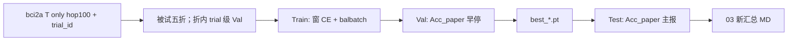

# 方案：2s/hop100 · Acc_paper 选模重训（仅 BCI2a T）

> 状态：**方案已改版；训练代码已落地** · 2026-08-04  
> 定位：以试次级 **Acc_paper** 为 **Val 早停 / 选模** 标准，对滑窗模型 **重新训练**（不是复评旧权重）。  
> 数据：**仅 BCI2a Training 会话 `A0xT`**；**不使用 E**（当前 E 无类别标签）。  
> 代码：`code/train_lab/src/step/baselines_2s_hop100_accpaper/`（与历史 `*_trialmaj` 复评包隔离）  
>  
> **与 [`../00_当前主线_2s滑窗100ms/`](../00_当前主线_2s滑窗100ms/) 的关系**：窗长/步长/切窗几何可共用；**训练配方与选模标准不同**——00 / 01 为 **Val BalAcc + batch balance** 窗级选型；**本目录不再沿用该早停与夺冠口径**。  
> **历史结果**：[`实验结果汇总_baselines_2s_hop100_trialmaj_bci2a.md`](./实验结果汇总_baselines_2s_hop100_trialmaj_bci2a.md) 为旧版 **`no_retrain` 复评**，**不得**当作本版重训结论。

论文规则（Acc_paper）：*a trial is successful if more than 50% of all windows of that trial are correctly classified*（恰 50% 计错）。

---

## 0. 目标与结论性变更

| 问 | 旧 03（已作废为主结论） | **本版 03** |
|----|-------------------------|-------------|
| 做什么？ | 复用 01 窗级权重，试次级复评 | **按 Acc_paper 重训并选模** |
| 早停？ | 无（沿用 Val BalAcc 训出的 ckpt） | **Val Acc_paper** |
| 主报？ | Test Acc_paper / BalAcc_maj（附） | **Test Acc_paper（主）**；附报 BalAcc_maj、窗级 BalAcc |
| 数据 | 仅 T（`bci2a_2s_hop100`） | **仍仅 T**；明确 **不用 E** |
| 是否改 01 权重？ | 只读 | **不改 01**；权重写入本臂新目录 |

---

## 1. 数据冻结（仅 T）

| 项 | 取值 |
|----|------|
| 原始 | `DATA/bci2a/A0*T.mat`（有标签） |
| **不用** | `A0*E.gdf`（无 769–772 类别标签，本臂禁用） |
| 预处理产物 | 现有 `preprocess_lab/out/bci2a_2s_hop100`（或等价仅 T 重切） |
| 必需字段 | `X`、`y_task` / `y_three`、`subjects`、**`trial_id`**（或可还原的 `(subject, trial_id)`） |
| 切窗 | Task=Cue 后 0–4 s；Rest=Cue 前 4 s；\(T_w=2\,\mathrm{s}\)，hop=\(100\,\mathrm{ms}\) → `(N,1,8,500)` |
| 库 | **仅 BCI2a T**；无 Stieger / merged / E |

---

## 2. 与 00 主线参数的刻意差异

| 项 | 00 / 01 窗级选型 | **本臂（Acc_paper 选模）** |
|----|------------------|---------------------------|
| 早停监控 | Val **BalAcc**（窗级） | Val **Acc_paper**（试次级） |
| 选模 / 夺冠 | 窗级 Test BalAcc | **试次级 Test Acc_paper** |
| batch balance | 配方写死开启 | **开启**（与 01 同采样；**差异在早停=Acc_paper，不在 balbatch**） |
| 训练 loss | 窗级 CE | 窗级 CE（梯度仍在窗上；**选模不在窗 BalAcc**） |
| RAP / OTTA | 选型关 | **关** |
| 读数后缀 | `balbatch_balacc` | **`balbatch_accpaper`**（例：`*_2s_hop100_balbatch_accpaper`） |

共用（允许相同、不叫「沿用 00 选模参数」）：

- \(T_w=2\,\mathrm{s}\)，hop=\(100\,\mathrm{ms}\)，\(f_s=250\)，8 通道  
- 普通 CE；lr / wd / drop / max_epochs / patience **本臂自管一张表**（见 §5），数值可与 00 接近但 **版本独立**，改动只记本臂  

---

## 3. Acc_paper 与划分（重训硬约束）

### 3.1 指标定义

聚合键：`(subject, trial_id)`（Task / Three 各自一套头，独立训练）。

| 指标 | 定义 | 本臂用途 |
|------|------|----------|
| **Acc_paper** | 试次内正确窗占比 **> 0.5** → 该试次计对；再对试次算 Acc | **Val 早停 + Test 主报 + 选模** |
| BalAcc_maj | 窗预测众数 → `trial_pred`；并列最高票 → 该试次计错；再 BalAcc | **附报** |
| 窗级 BalAcc / F1 / Acc | 与 01 同字段 | **附报**（对照，不夺冠） |

Task：试次标签为 Rest vs Task（由该试次窗标签一致得到）。  
Three：试次标签为 0/1/2。

### 3.2 Train / Val / Test 与 shuffle

| 集合 | 划分单位 | 窗顺序 | 说明 |
|------|----------|--------|------|
| **Train** | 整 trial 只进 train | **batch balance 采样**（窗级；非顺序纯 shuffle） | 优化窗级 CE；禁止 RAP 缓存 |
| **Val** | 整 trial 只进 val | **按 trial 聚合评估**；DataLoader **不 shuffle**，保留 trial_id | 早停只看 **Acc_paper** |
| **Test** | 五折被试独立：整被试进 test | 同 Val | 主报 **Acc_paper** |

硬约束：

1. **同一 `(subject, trial_id)` 的窗不得拆到 train 与 val/test。**  
2. 折仍为 **被试独立五折**（与 01 折受试者列表对齐，便于对照；但 **权重与指标不可混比夺冠**）。  
3. 折内 Val：从该折训练被试中按 **trial**（或整被试）划分 `val_ratio`，**禁止**窗级随机抽 val。

```text
【Train】窗 CE + batch balance（Task 1:1 / Three inverse-freq）
【Val】每 epoch 末：窗前向 → 按 trial 聚 Acc_paper → 早停 / 存 best
【Test】加载 best → Acc_paper（主）+ BalAcc_maj + 窗级 BalAcc（附）
```

---

## 4. 模型范围（全部十一模型）

本臂 **默认跑全量**，与 01 / 旧 trialmaj 同一模型列表（结构对齐 `baselines_2s_hop100`，**无 RAP**）：

| 组别 | 模型 |
|------|------|
| 时域 CNN | `eegnet` · `shallow` · `deep` · `eegtcnet` · `conformer` |
| bandpower 图 | `dbn` · `gcbnet` · `dgcnn` |
| raw + 图 | `dbn_raw` · `gcbnet_raw` · `dgcnn_raw` |

共 **11** 个；`run_all` 默认串跑上述全部。  
`deep`：与 01 一致用 hop100 **compat**（`pool_time_length/stride=1`），并在 meta 注明。  
选模在 **全部模型** 的 Test Acc_paper 上比较；深研解读时可再聚焦 shallow / eegnet / conformer，但不缩小训练矩阵。

---

## 5. 本臂超参表（独立于 00）

| 项 | 本臂默认 | 备注 |
|----|----------|------|
| loss | 普通 CE（窗级） | |
| 早停 | **Val Acc_paper**；patience=18；max_epochs=300 | **禁止**改回 Val BalAcc 夺冠 |
| 采样 | **train batch balance**（Task 二类 1:1；Three 三类 inverse-freq） | 与 01 同；口径含 `balbatch` |
| lr | 1e-4 | 可调，记入 meta |
| weight_decay | 1e-4 | |
| drop_prob | 0.5 | |
| batch_train / eval | 32 / 64 | |
| 头 | Task → Three **独立重训** | |
| seed | 42 | |
| n_folds | 5 | 被试独立 |

读数口径字符串：

```text
Tw=2s hop=100ms bci2a_T_only
early_stop=val_acc_paper
select=test_acc_paper
balbatch no_rap no_otta no_E
retrain=true
```

---

## 6. 代码与产物落点

| 模块 | 路径 |
|------|------|
| **Acc_paper 重训包（现行）** | `code/train_lab/src/step/baselines_2s_hop100_accpaper/` |
| **历史复评包（只读）** | `code/train_lab/src/step/baselines_2s_hop100_trialmaj/`（**no_retrain**；勿混入训练） |
| **禁止改坏** | `baselines_2s_hop100/`（01 窗级 BalAcc 臂） |
| 权重 | `train_lab/out/baseline_2s_hop100_accpaper/<model>_2s_hop100_balbatch_accpaper/bci2a_2s_hop100/run_<stamp>/` |
| MD | `资料/模型训练/runs/<stamp>_<model>_2s_hop100_balbatch_accpaper/` |
| 本目录新汇总 | `实验结果汇总_baselines_2s_hop100_accpaper_bci2a.md`（跑完后写） |

```bash
cd code/train_lab/src/step/baselines_2s_hop100_accpaper
python trial_metrics.py
python train_one.py --model eegnet
python run_all.py --continue-on-error
```



---

## 7. 实验矩阵与主表

```text
模型 {eegnet, shallow, deep, eegtcnet, conformer,
      dbn, gcbnet, dgcnn, dbn_raw, gcbnet_raw, dgcnn_raw}   # 全部 11
  × 头 {Task, Three}
  × 折 {0..4}
→ 每折 Test Acc_paper；汇总 mean±std 选模
```

**选模规则（冻结）**：同一头下，**全部十一模型**比 **Test Acc_paper 五折均值**；最高者为该头冠军。  
并列时看 Acc_paper 的 std（更稳者优先），再看附报 BalAcc_maj。

主表最小列：

| 模型 | Acc_paper | BalAcc_maj | 窗级 BalAcc | Val Acc_paper（参考） |
|------|-----------|------------|-------------|----------------------|

---

## 8. 与旧文档 / 其它目录

| 文档 | 地位 |
|------|------|
| 本文件 | **现行 03 方案** |
| `实验结果汇总_…trialmaj…md` | **历史 no_retrain**，文首应标【非本版结论】 |
| [`../01_旁路_2s滑窗100ms/`](../01_旁路_2s滑窗100ms/) | 窗级 BalAcc 选型；**对照不夺本臂冠** |
| [`../00_当前主线_2s滑窗100ms/`](../00_当前主线_2s滑窗100ms/) | 主线叙事仍含 BalAcc 选型；**本臂为 Acc_paper 选模平行协议** |
| E 会话 | **本臂不用** |

---

## 9. 禁止事项

1. 用 01 / 旧 trialmaj 的 `no_retrain` 数字冒充本版重训结论  
2. Val / Test **窗级随机划分**导致同一 trial 跨集合  
3. 用 Val **BalAcc** 早停却声称 Acc_paper 选模  
4. 启用 E 或 Stieger / merged 进本臂主表  
5. 改写 `baselines_2s_hop100` 正式权重  
6. 训练开启 RAP 缓存或 OTTA  
7. padding；把试次级指标算成「打乱后无法按 trial_id 归组」的实现  

---

## 10. 实施阶段

| 阶段 | 内容 |
|------|------|
| **P0** | 确认 `trial_id`；实现 trial 级 Val 划分与 Acc_paper 计算 | **已完成** |
| **P1** | 新包 `*_accpaper`：单模型单折冒烟（早停键=Acc_paper） | **代码已就绪** |
| **P2** | **十一模型全量** × Task→Three × 五折 | **待跑** |
| **P3** | 写新汇总 MD；旧 trialmaj 汇总保留并标历史 | **待跑完** |

---

## 11. 一句话

**只用 BCI2a T；2s/100ms 滑窗对十一模型全量重训；train batch balance；Val/Test 按完整 trial 聚合；用 Acc_paper 早停与选模；不做 E、不复用旧 no_retrain 权重当主结论。**
