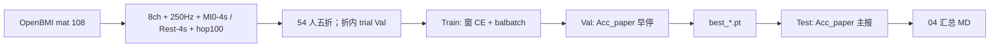

# 方案：OpenBMI · 2s/hop100 · Acc_paper 选模重训（十一模型）

> 状态：**方案已改为十一模型** · 2026-08-05  
> 文档位置：`资料/模型训练/04_旁路_2s滑窗100ms_openbmi_accpaper/`  
> **协议对齐**：[`../03_旁路_2s滑窗100ms_试次多数票/方案.md`](../03_旁路_2s滑窗100ms_试次多数票/方案.md)（Val/Test **Acc_paper** 早停与选模 · balbatch · 无 RAP · 被试独立五折）  
> **模型名单**：与 03 / hop100 **全部十一模型**同表（见 §3）；**含** `dbn_raw` / `gcbnet_raw` / `dgcnn_raw`。  
> **数据**：已重跑 `preprocess_lab/out/openbmi_2s_hop100`，**仅 EEG_MI_train**（sess01+02），`X=(340200,1,8,500)`，54 被试；三类窗 1:1:1。  
> **训练工程**：源 `X` **mmap**；折内 train/val **float16 打包**；`*_raw` 另写 `*_X_raw8_f16.npy` mmap；默认 `batch_train=128` · `num_workers=2` · AMP。  
> **日志**：`code/train_lab/out/openbmi_accpaper_runall.log`  
> **已确认**：被试键=**方案 A**（sess01+sess02 同人）；patience=**20**；**Task + Three 都跑**。  
> **禁止**：用 BCI2a 数字冒充本臂结论；与 Stieger / merged 混比夺冠。

论文规则（Acc_paper）：*a trial is successful if more than 50% of all windows of that trial are correctly classified*（恰 50% 计错）。

---

## 0. 一句话目标

在 **OpenBMI / Lee2019-MI** 上，按与现行 03 **相同的 Acc_paper 选模协议**，对 **全部十一模型** 从零重训并五折汇报；切窗几何与 BCI2a hop100 对齐（\(T_w=2\,\mathrm{s}\)，hop=\(100\,\mathrm{ms}\)，`(N,1,8,500)`），验证协议在大样本外库上是否可迁移。

| 问 | 本臂约定 |
|----|----------|
| 做什么？ | OpenBMI **Acc_paper 重训选模**（不是复评 BCI2a 权重） |
| 早停？ | **Val Acc_paper**（试次级） |
| 主报？ | **Test Acc_paper**；附报 BalAcc_maj、窗级 BalAcc |
| 名单？ | **全部 11**（§3）；与 03 同；**含** `*_raw` |
| 与 03 | 配方同形；**数据与权重目录独立** |

---

## 1. 数据盘点（已浏览 `DATA/openbmi`）

### 1.1 文件布局

```text
DATA/openbmi/openbmi/
  sess01_subj01_EEG_MI.mat … sess01_subj54_EEG_MI.mat   # 54
  sess02_subj01_EEG_MI.mat … sess02_subj54_EEG_MI.mat   # 54
→ 共 108 个 `.mat`
```

每个文件含两个已标注块（冒烟 subj01）：

| 字段块 | 作用 | 冒烟观察 |
|--------|------|----------|
| `EEG_MI_train` / `EEG_MI_test` | 官方会话内划分；**均有 left/right 标签** | 各 100 trial；left/right 各 50 |
| `fs` | 采样率 | **1000 Hz** |
| `chan` | 62 导名 | **含本项目 8 导**（见 §1.3） |
| `smt` | 试次张量 `(4000, n_trial, 62)` | **4.0 s @ 1000 Hz** MI epoch |
| `x` | 连续 EEG `(T, 62)` | 与 `smt` 在 `t[i]:t[i]+4000` **逐点一致** |
| `t` | cue/试次起点（相对 `x` 的样本下标） | trial 间隔约 10–11 s |
| `y_class` / `y_dec` | 类别 | `1=right`，`2=left`（与 BCI2a 编码相反，须重映射） |
| `pre_rest` / `post_rest` | 会话级 60 s 静息块 | **本臂主路径不用**（仅附录可选） |

### 1.2 本臂数据冻结

| 项 | 取值 |
|----|------|
| 原始根 | `DATA/openbmi/openbmi/*.mat` |
| 会话文件 | sess01 + sess02 **全部纳入** |
| 被试键 | **方案 A（已确认）**：`openbmi:subj{NN}`（`NN=01..54`）；两场录音 **算同一个人** |
| 块用法 | **仅 `EEG_MI_train`**（**不含**官方 `EEG_MI_test`）；**不做**官方会话内 train/test 夺冠 |
| 类别 | 仅 left / right；无脚舌 |
| 预处理产物（建议） | `preprocess_lab/out/openbmi_2s_hop100` |
| 必需字段 | `X`、`y_task` / `y_three`、`subjects`、**`trial_id`**（全局唯一） |
| 输出形状 | `(N, 1, 8, 500)` @ **250 Hz** |

#### 被试键方案 A（已冻结）

同人两场示例：`sess01_subj07_…` 与 `sess02_subj07_…` → `subjects` 均为 `openbmi:subj07`。  
五折时此人进 Test，则 **两场数据都进 Test**；进 Train 则两场都进 Train。  
**禁止**把两场写成不同伪被试（方案 B）或丢弃 sess02（方案 C）。

trial 仍按场次分开切窗；`trial_id` 跨会话唯一（如 `session*10000 + local_index`）。不把两场 EEG 拼成一条连续波形。


### 1.3 通道（已核验齐全）

与 hop100 训练配置对齐（`bci2a_2s_hop100.yaml` 的 `target_chans`）：

```text
Cz, C3, C4, CP3, FC4, FC3, CP4, CPz
```

OpenBMI 62 导中下标（subj01 冒烟）：C3=12, Cz=13, C4=14, FC3=32, FC4=33, CP3=38, CPz=39, CP4=40。

### 1.4 标签映射（冻结）

| OpenBMI | `y_task` | `y_three` | 说明 |
|---------|----------|-----------|------|
| left | 1 | **1** | 对齐 BCI2a「1=Left」 |
| right | 1 | **2** | 对齐 BCI2a「2=Right」 |
| Rest（构造） | 0 | 0 | |

注意：原始 `y_dec` 中 **1=right、2=left**，实现时必须经上表映射，禁止直接把 `y_dec` 当 `y_three`。

### 1.5 切窗几何（与 BCI2a hop100 / 03 同形）

| 段类型 | 时间定义（相对 cue `t`） | 源长 | 滑窗 |
|--------|-------------------------|------|------|
| **Task / MI** | Cue 后 **0–4 s** | 4 s | \(T_w=2\,\mathrm{s}\)，hop=\(100\,\mathrm{ms}\) → 约 **21** 窗/段 |
| **Rest** | Cue 前 **4 s**（`iter_rest_sources_cue_before`，可缩短避让） | ≤4 s | 同上 |

硬约束：不足 2 s 丢弃、禁止 padding；同一 `(subject, trial_id)` 窗不得跨 train/val/test。

窗数：\(N_w = 1 + (T-2)/0.1\)（\(T\ge 2\)）。

---

## 1.6 数据预处理步骤（已落地 · 写死）

代码：`code/preprocess_lab/src/datasets/openbmi/`  
配置：`code/preprocess_lab/config/openbmi_2s_hop100.yaml`  
入口：`python -m src.datasets.openbmi.batch_2s_hop100`

对每个 `sess*_subj*_EEG_MI.mat` **按文件**执行（大文件用 shard，最后合并）：

```text
【0. 读取】
  loadmat → **仅 EEG_MI_train** → ContinuousEEG
  subject = openbmi:subjNN   # 方案 A，与 sess 无关
  events  = [cue_sample, y_three]；y_three 已映射 left=1 / right=2
  （不含 EEG_MI_test；不做官方 train/test 夺冠）

【1. 选通道】
  62 导 → 固定 8 导序：
  Cz, C3, C4, CP3, FC4, FC3, CP4, CPz

【2. 连续滤波（原始 fs，通常 1000 Hz）】
  CAR（共平均参考）
  → 50 Hz notch
  → 8–30 Hz bandpass
  （与 BCI2a hop100 同 `filter_car`）

【3. Task 段】
  对每个 left/right cue：
    Cue 前 0.5 s 基线校正 → 取 Cue 后 0–4 s（4000 点 @1000Hz）
    → 段内 2 s / 100 ms 滑窗
    → 每窗重采样到 250 Hz（500 点）+ 窗内 z-score
    → 写入 X；y_task=1；y_three=1|2；同一 trial 共用 trial_id

【4. Rest 段】
  按 BCI2a 同逻辑：Cue 前 4 s 源（避让上一 Task 尾）
  → 基线校正 + 同上滑窗
  → y_task=0；y_three=0
  → Rest 条数默认 = min(n_left, n_right)（rest_balance）

【5. 落盘】
  每文件 → out/openbmi_2s_hop100/shards/<stem>/{X,y_task,y_three,subjects,trial_id}.npy
  合并 → openbmi_*.npy + train_*/val_*（窗级 split 仅辅助；五折训练仍按 subjects+trial_id）
  + preprocess_meta.json
```

输出形状：`(N, 1, 8, 500)`，`fs_out=250`。

```bash
cd code/preprocess_lab
# 冒烟 1 文件
python -m src.datasets.openbmi.batch_2s_hop100 --limit 1 --reset
# 指定被试
python -m src.datasets.openbmi.batch_2s_hop100 --subjects 01,02
# 全量 108（耗时长、占盘大）
python -m src.datasets.openbmi.batch_2s_hop100
```

---

## 2. 与 03 对齐的训练协议

| 项 | 03（BCI2a） | **本臂（OpenBMI）** |
|----|-------------|---------------------|
| 早停 | Val **Acc_paper** | **相同** |
| 选模 / 夺冠 | Test **Acc_paper** | **相同** |
| batch balance | 开 | **开** |
| loss | 窗级 CE | **相同** |
| RAP / OTTA | 关 | **关** |
| 划分 | 被试独立五折；折内 trial 级 Val | **相同**（54 人，折更稳） |
| 读数后缀 | `balbatch_accpaper` | **`openbmi_2s_hop100_balbatch_accpaper`** |
| 模型数 | **11** | **11（同名单）** |
| 权重 init | 从零（BCI2a） | **从零（OpenBMI）**；**不**加载 BCI2a ckpt 当主表 |

### 2.1 Acc_paper 与集合

聚合键：`(subject, trial_id)`。

| 指标 | 用途 |
|------|------|
| **Acc_paper** | Val 早停 + Test 主报 + **十一模型**选模 |
| BalAcc_maj | 附报（众数；并列计错） |
| 窗级 BalAcc / F1 / Acc | 附报 |

| 集合 | 划分 | 说明 |
|------|------|------|
| Train | 整 trial | balbatch 窗级 CE |
| Val | 折内训练被试中按 trial 划 `val_ratio=0.2` | DataLoader **不 shuffle**；早停只看 Acc_paper |
| Test | 整被试进 test（五折） | 主报 Acc_paper |

Task / Three **两套头都跑、且独立训练**（已确认；与 03 同）。  
**十一模型对 Task、Three 各训一套**；两套头各自出 Acc_paper 主表与选模（不混用 ckpt）。

### 2.2 超参表（独立版本，数值对齐 03）

| 项 | 默认 |
|----|------|
| max_epochs | 300 |
| patience | **20**（已确认） |
| lr / wd / drop | 1e-4 / 1e-4 / 0.5 |
| batch_train / eval | **128 / 256**（本机 8GB；可 CLI 覆盖） |
| num_workers | **2**（Windows + 大 pack；可 `--num-workers 4`） |
| use_amp | True |
| seed | 42 |
| n_folds | 5 |
| val_ratio | 0.2 |
| deep | **compat pool=1/1** |

读数口径：

```text
Tw=2s hop=100ms openbmi_sess01+02
subject_key=openbmi:subjNN  # A: same person across sessions
early_stop=val_acc_paper patience=20
select=test_acc_paper
balbatch no_rap no_otta
models=all11
heads=task+three
retrain=true from_scratch
```

---

## 3. 模型范围（全部十一模型 · 冻结）

与 03 Acc_paper / `baselines_2s_hop100` **同一名单**（结构对齐；**无 RAP**）：

| 组别 | 模型 |
|------|------|
| 时域 CNN | `shallow` · `deep` · `conformer` · `eegnet` · `eegtcnet` |
| bandpower 图 | `gcbnet` · `dgcnn` · `dbn` |
| raw + 图 | `dbn_raw` · `gcbnet_raw` · `dgcnn_raw` |

共 **11** 个；`run_all` 默认串跑上述全部。  
`deep`：compat（`pool_time_length/stride=1`），meta 注明。  
选模在 **全部十一模型** 的 Test Acc_paper 上比较；深研解读可再聚焦浅层 CNN，但不缩小训练矩阵。

`*_raw`：TemporalEncoder + 图网络，输入 `(B,8,500)`；OpenBMI 大表经 `raw_time_openbmi.squeeze_raw_2s_openbmi` 落盘为 float16 mmap，禁止整表 float32 常驻。

---

## 4. 代码与产物落点（已落地骨架）

| 模块 | 路径 |
|------|------|
| 预处理配置 | `code/preprocess_lab/config/openbmi_2s_hop100.yaml` |
| 预处理包 | `code/preprocess_lab/src/datasets/openbmi/`（`load_mat` / `pipeline` / `batch_2s_hop100`） |
| 训练包 | `code/train_lab/src/step/baselines_openbmi_2s_hop100_accpaper/`（**11 模型**；patience=20） |
| 权重 | `train_lab/out/baseline_openbmi_2s_hop100_accpaper/<model>_openbmi_2s_hop100_balbatch_accpaper/...` |
| 本目录汇总 | `实验结果汇总_baselines_openbmi_2s_hop100_accpaper.md`（跑完后写） |

```bash
cd code/preprocess_lab
python -m src.datasets.openbmi.batch_2s_hop100

cd code/train_lab/src/step/baselines_openbmi_2s_hop100_accpaper
python baseline_eegnet.py
python run_all.py --continue-on-error
```



---

## 5. 实验矩阵与主表

```text
模型 ×11（§3）
  × 头 {Task, Three}
  × 折 {0..4}
→ 每折 Test Acc_paper；mean±std
```

选模（冻结）：同一头下，**十一模型**比 **Test Acc_paper 五折均值**；并列先看 std，再看 BalAcc_maj。

主表最小列：

| 模型 | Acc_paper | BalAcc_maj | 窗级 BalAcc | Val Acc_paper（参考） |
|------|-----------|------------|-------------|----------------------|

附录：与 BCI2a 03/trialmaj **同模型** 对照列（只读落差，**禁止**跨库夺同一冠军杯）。

---

## 6. 规模与算力提示（实施前知情）

量级（train-only 已落地）：`N=340200` 窗；54 人 × 两会话合并键。

建议：P1 先 **单模型冒烟** → P2 十一模型串跑；图网络注意 bandpower / raw-f16 缓存；本机 16GB RAM 勿盲目抬 `num_workers`。

---

## 7. 与其它目录的关系

| 目录 | 关系 |
|------|------|
| [`../03_…试次多数票/`](../03_旁路_2s滑窗100ms_试次多数票/) | **协议模板**；十一模型名单同源；BCI2a 结论不迁入本臂 |
| [`../00_当前主线_2s滑窗100ms/`](../00_当前主线_2s滑窗100ms/) | 主线阶段 **D · OpenBMI**；本臂落实 Acc_paper 版 |
| [`../01_旁路_2s滑窗100ms/`](../01_旁路_2s滑窗100ms/) | 窗级 BalAcc 选型；本臂不用其权重 |
| Stieger | **放弃**，不进本臂 |

---

## 8. 禁止事项

1. 把 OpenBMI `y_dec` 未映射直接当 BCI2a `y_three`  
2. 只用官方 `EEG_MI_train/test` 会话内划分冒充「被试独立五折」  
3. Val/Test **窗级随机切分**导致同 trial 跨集合  
4. Val **BalAcc** 早停却声称 Acc_paper 选模  
5. 加载 BCI2a 权重微调却写 `retrain=true from_scratch` 主表（若做迁移须另立子目录）  
6. 只跑子集模型却仍写「全部十一 / all11」主表（子集实验须改标题与口径）  
7. RAP / OTTA / padding  
8. 与 BCI2a 分数混比夺冠  

---

## 9. 实施阶段

| 阶段 | 内容 | 状态 |
|------|------|------|
| **S0** | 方案三点确认（A + patience=20 + Task/Three） | **已确认** |
| **S1** | OpenBMI loader + `openbmi_2s_hop100` 预处理 | **已落地**（train-only 全量） |
| **S2** | 训练包（**11 模型**） | **已扩至 11**；含 `*_raw` + raw-f16 缓存 |
| **S3** | 十一模型 × Task→Three × 五折正式 | 待开工 |
| **S4** | 写汇总 MD + 与 BCI2a 对照表 | 待开工 |

---

## 10. 已确认事项（2026-08-05）

| # | 项 | 结论 |
|---|----|------|
| 1 | 会话 / 被试键 | **A**：sess01+sess02 **算同一个人** → `openbmi:subj{NN}`；五折按人切 |
| 2 | patience | **20** |
| 3 | 头 | **Task 与 Three 都跑**（十一模型 × 两头独立训） |
| 4 | 模型数 | **11**（与 03 对齐；含 `*_raw`） |

下一步：`baselines_openbmi_2s_hop100_accpaper` 冒烟后 `run_all.py --continue-on-error`。

---

## 11. 一句话

**OpenBMI 54 人 × 两会话（同人合并）；仅官方 `EEG_MI_train`；2s/100ms；Rest=Cue 前 4s、MI=Cue 后 0–4s；十一模型从零重训；Task+Three；patience=20；Acc_paper 早停与选模；协议对齐 03。**
