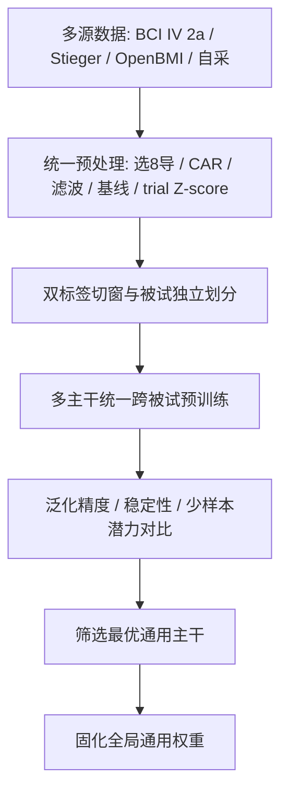

# 面向少样本个体适配的运动想象脑机接口系统设计

## 一、项目研究目标（Project Goal）

本研究不聚焦于设计新型卷积网络、Transformer 结构或分类头模块，核心研究定位为**面向少样本个体适配（Few-shot Personalized Adaptation）的个体化运动想象脑机接口（Personalized MI-BCI）系统构建**。针对现有运动想象脑机接口对新用户标定成本高、泛化性能差的行业痛点，旨在实现全新受试者的快速个性化适配：新受试者仅需几分钟采集少量标定试次（Trial），即可通过少样本微调快速生成专属个体解码模型，无需长时间全量数据训练，最终实现稳定的在线运动意图解码与人机交互控制。

本研究核心科学问题为：如何依托跨被试通用预训练模型，结合少量个体标定数据，平衡模型泛化性与个体特异性，实现低成本、高效率的个体化 MI-BCI 快速适配。

---

## 二、研究背景与研究意义

当前运动想象脑机接口的落地应用存在两大核心瓶颈，两种主流方案均存在明显短板，难以兼顾实用性与解码精度：

**第一种为全量个体训练方案**：针对每一位受试者单独采集大量数据、从零训练专属模型。该方案可实现较高的个体解码精度，但存在标定耗时久、训练成本高、复用性差的问题，每位受试者均需数小时数据采集与训练，严重限制 BCI 系统的落地普及。

**第二种为纯跨被试通用模型方案**：依托公开数据集训练全局通用模型，直接应用于全新受试者，无需个体标定。该方案彻底免除个体标定成本，但由于脑电信号存在极强的个体差异性，不同受试者的运动想象节律、信号分布差异显著，通用模型无法适配个体特征，最终导致在线解码精度大幅下降。

基于上述痛点，本研究融合两类方案的核心优势，构建**通用预训练模型 + 少样本个体微调**的适配范式，既规避全量训练的高成本问题，又弥补纯通用模型个体适配能力不足的缺陷，实现「低成本标定、高精度适配、快速落地」的个体化运动想象 BCI 系统，具备工程应用价值与学术研究意义。

---

## 三、总体技术路线

本研究整体技术流程分为**离线通用模型训练与优选**与**在线少样本个体适配**两大核心阶段，层层递进、紧密耦合。明确不做增量持续学习、样本回放缓存等非核心模块，聚焦少样本快速适配。

当前推进节奏（与工程实现一致）：

```text
阶段 A（已开展）：统一预处理 → 双头 EEGNet 跨被试基线 → 被试独立五折
阶段 A′（已开展）：自采底座 collect_data + 诱导/操作台 experiment_game（Phase0–4）
阶段 B（下一步）：更大样本库（Stieger 等）→ 多主干公平对比 → 固化通用权重
阶段 C（核心创新）：少样本微调消融（层级 / 样本量 / 超参 / 分类头）
阶段 D（部分就绪）：在线滑动窗推理 + 诱导页闭环反馈（experiment_game Phase5 待做）
```

### 3.1 第一阶段：离线跨被试通用模型训练与优选

优秀的泛化通用模型是少样本微调适配的核心基础，直接决定后续个体微调的性能上限。本阶段目标：在统一实验条件下，对比多种主流主干网络（Backbone）的跨被试泛化能力，筛选适配少样本微调任务的最优通用基线，为第二阶段提供固定模型基础。

本阶段严格统一实验变量：共享主干后的线性双分类头、交叉熵损失、Adam、统一训练与预处理流水线。流程如下：



#### 3.1.1 统一数据标准（现行）

| 项 | 约定 |
|----|------|
| 采样率 | **250 Hz** |
| 通道（固定序，禁止重排） | Cz, C3, C4, CP3, FC4, FC3, CP4, CPz |
| 索引 | 0=Cz … 7=CPz |
| 标签 | 双标签三状态：静息 / 左 / 右（见 3.1.3） |
| **BCI IV 2a 切窗** | 任务：**Cue 后 2~4 s**；静息：**下一 Cue 前 2 s** |
| **2a 张量** | `(N, 1, 8, 500)`，输出 `out/bci2a_2s/` |
| **Stieger 切窗** | 反馈段**最后 2 s** → `(N, 1, 8, 500)`，`out/stieger_2s/` |

> 说明：范式上 2a 的 MI 段仍可为 Cue 后 0~4 s；本项目分类**只用后半段 2~4 s**。旧方案 4 s / 1000 点仅作历史对照，不再作为正式标准。

工程目录：`code/preprocess_lab/`（`common/` + `datasets/{bci2a,stieger}/`）、`code/train_lab/`。

#### 3.1.2 对比主干模型体系

为系统探究不同架构对少样本适配任务的泛化性能，计划在统一条件下对比：

- 轻量化 CNN：EEGNet、ShallowConvNet、DeepConvNet  
- 时序增强：EEGNet + TCN  
- 时空融合：EEG-Conformer  

评估维度：跨被试测试精度、泛化稳定性、少样本微调潜力。  
**现状**：多主干对比**尚未开跑**；阶段 A 固定 **EEGNet** 作双头基线，**不提前认定** Conformer（或其它）为最优。少样本阶段将固定阶段 B 选出的骨干，不再改结构。

#### 3.1.3 共享主干双分类头与双标签设计

模型采用**一个共享特征提取主干 + 两个并行分类头**。共享主干只做一次特征提取；头1输出静息/任务，头2输出空闲/左手/右手。每个 EEG 样本只存一份，同时带两套标签：

| 样本 | `label_task` | `label_three` |
|------|--------------|---------------|
| 静息 | 0 | 0 |
| 左手 | 1 | 1 |
| 右手 | 1 | 2 |

**训练（现行实现）**：先训头1；再迁移主干权重训头2（可冻/不冻主干）。联合损失形式可写为  
`L = lambda_task * L_task + lambda_three * L_three`（后续联合训练时可调 lambda）。

**正式评估协议（已落地）**：被试独立五折；折内按人划 val；**只用 Val 早停与调参**，Test 仅终评。过夜顺序：头1网格/基线 → 头1调参 → 选优 → 头2 基线 → 头2 调参。

**在线推理规则（规划）**：头1任务概率未达阈值 → 直接空闲；达阈值后再看头2 左右概率。不得在头2仍判空闲时强制输出方向；两头冲突或左右差距不足 → 空闲/不确定，避免误触发。

结构：`EEG → 共享主干（当前 EEGNet）→ 头1 ‖ 头2`。

### 3.2 第二阶段：少样本个体化微调适配（核心创新）

固定阶段 B 选出的最优通用主干后，不再改网络基础架构，聚焦少样本微调的关键超参与策略，建立标准化个体快速适配流程：

```text
少量标定试次采集 → 预处理 → 通用权重初始化 → 少样本微调
→ 个体专属模型 → 在线解码 + 网页/操作台交互（experiment_game）
```

围绕少样本适配开展五项消融：

#### 3.2.1 微调层级策略消融

- 方案1：仅微调末端分类头（Head）  
- 方案2：分类头 + BN  
- 方案3：最后一个特征 Block + 分类头  
- 方案4：全网微调  

从精度、耗时、更新参数量综合选型。

#### 3.2.2 标定样本量阈值实验

设置 10 / 20 / 40 / 60 Trial 梯度，绘制样本量–精度曲线，确定高性价比最小标定试次数。

#### 3.2.3 微调学习率优选

对比 1e-3、1e-4、5e-5 等，兼顾适配精度与收敛速度。

#### 3.2.4 微调迭代轮次优选

对比 5 / 10 / 20 / 50 轮，检验「轮次越多越好」是否成立，确定少样本场景最优轮次。

#### 3.2.5 轻量分类头消融

固定其它微调设定，对比 Linear Head、MLP Head、Prototype Head，择优作为系统末端模块。

---

## 四、完整系统落地流程

### 4.1 离线通用模型固化

多源数据清洗 → 统一预处理 → 双标签切窗与划分验证 → 多主干跨被试预训练 → 泛化对比优选 → 固化最优通用权重。

### 4.2 自采与标定数据通路（已落地主体）

```text
OpenBCI Cyton → collect_data(lsl_connect) → LSL / CSV
       ↓
experiment_game 操作台控场 + 诱导页呈现
       ↓
会话落盘（continuous / events / by_phase）→ Phase4 切窗
       ↓
(N,1,8,T) + y_task / y_three → 对接 train_lab / 少样本标定
```

- **采集底座** `collect_data/LSL_connect_model/`：BrainFlow 独占串口 → 滤波 → LSL 广播；CLI / tkinter UI；可插拔 `ModelWorker`；CSV 录制。  
- **诱导实验** `experiment_game/`：Three.js 第一人称左右手抓取诱导 + 操作台（Setup / Run / Summary）；复用 `AcquisitionFacade` 封装上述采集后端，不重写驱动。  
- **职责边界**：本通路负责**标准化诱导采数与时间对齐标签**；少样本微调与跨被试五折训练仍在 `train_lab`。

### 4.3 在线少样本标定适配

新受试者入驻 → 经 `experiment_game` 短时采集约 20～40 个 MI 标定试次 → Phase4 切窗对齐双标签 → 加载通用模型 → 最优层级 + 超参少样本微调 → 数分钟内生成个体模型。

### 4.4 在线实时控制

实时采集（LSL）→ 在线标准化预处理 → 个体模型解码（左 / 右 / 空闲）→ 驱动网页交互或外设控制。  
`experiment_game` Phase5（实时反馈 / 在线闭环）仍为后置项；采集与诱导前端已就绪。

---

## 五、已完成工作与实验结果

### 5.1 预处理与跨被试训练（公开库）

1. 统一预处理框架（`common` + `datasets/{bci2a,stieger}`）；BCI2a 整库批处理  
2. 2a 切窗定稿：Cue+2~4s / Cue前2s → `(N,1,8,500)`，`out/bci2a_2s/`  
3. Stieger：读 mat、范式过滤、反馈段最后 **2s→500 点**、单文件 debug；**整库 batch 待补**  
4. 训练：EEGNet 双头、被试独立五折、过夜自动调参；`n_times` 自适应  

### 5.2 采集底座 `collect_data`（已完成成果）

路径：`collect_data/LSL_connect_model/LSL_connect_model/`

| 成果 | 说明 |
|------|------|
| Cyton + BrainFlow + LSL | 单进程独占串口；合成板 / 真机；8ch @250Hz；LSL `OpenBCI_EEG` / Accel 广播 |
| 采集端预处理 | ADC→µV、带通 0.5–45Hz、50Hz 陷波后推流 |
| 服务架构 | `ServiceManager` 状态机 + 多线程；采集与模型/录制解耦 |
| 人机入口 | CLI（`eeg_control_panel`）+ 轻量 tkinter UI（`main` / `eeg_control_ui`） |
| 配置驱动 | `default.yaml`（串口/滤波/通道/录制）、`models.yaml`（模型登记） |
| 在线模型插件 | `ModelPlugin` + `ModelWorker`，多模型并行订阅同一 LSL；含 demo 插件 |
| CSV 录制 | `RecorderWorker`：LSL Inlet 落盘 + 录制质量 / meta |
| 通道标签 | 默认可配 MI 布局（含 C3/C4/Cz 等）；可选 GUI 旁路推流 |
| 文档 | 需求、框架、教学计划、UI/模型接入/CSV 方案齐全 |
| 下游复用 | 已被 `experiment_game.AcquisitionFacade` 作为正式实验采集后端 |

> 同目录 `MI_model` 为连续车辆想象 + CSP/SVM 离线脚手架（与左右手抓取主范式独立），Stage 验收清单尚未勾完，不计入主线指标。

### 5.3 诱导实验系统 `experiment_game`（已完成成果）

路径：`experiment_game/`（诱导页 `web/` + 操作台 + `offline/` Phase4）

| 成果 | 说明 |
|------|------|
| 双端系统 | Three.js 第一人称左右手抓取诱导 + 操作台 Setup/Run/Summary |
| 范式冻结 | Rest / Left / Right；会话流 `adapt → learn → gate → acquire`；正式 trial ≈17s（含 MI 4s / Rest 4s 等） |
| Phase 0–1 | 规格/Marker/时序冻结；无画面状态机 + EEG/events 时间对齐校验 |
| Phase 2 | 适应→学习(S1–3)→准入→正式采集；正式段静画 MI |
| Phase 3 | 换物/换景（家庭/医院/学校）；操作者暂停/代确认/准入/Reject/中止（实时 ERD 准入后置未做） |
| Phase 4 | 会话→epochs：`(N,1,8,500)` + `y_task`/`y_three` + train/val，对接 `train_lab` |
| 操作台 | 默认配置持久化；`phase_folders` 落盘（continuous / by_phase / alignment）；一键 Phase4 |
| 时钟 | 权威时钟 `pylsl.local_clock()`，非浏览器墙钟 |
| Phase 5 | 实时反馈 / 在线闭环等 — **后置未做** |

**仓库已保留自采会话**（2026-07-23；对齐校验均 `passed`）：

| 会话 | 板卡 | 正式 trial | Phase4 epochs |
|------|------|------------|---------------|
| `sub01_ses01_20260723_154749` | 合成板 | 8 | N=16（Rest8 / Task8） |
| `sub02_ses01_20260723_180607` | Cyton COM6 | 64 | N=127 |
| `sub03_ses01_20260723_185153` | Cyton COM6 | 64 | N=128（Rest64 / L32 / R32） |

> 自采 Phase4 与公开库统一为 **2s → 500 点**（在线仍可呈现 4s MI/Rest，离线取起点起 2s）。合成板准确率无参考价值，真机分类指标尚未在本目录报数。

### 5.4 BCI2a 过夜五折结果（2s 窗，EEGNet 双头）

详细记录：[`资料/模型训练/五折过夜实验记录_20260726_002246.md`](../模型训练/五折过夜实验记录_20260726_002246.md)  
数据：`code/preprocess_lab/out/bci2a_2s/`，`n_times=500`

| 头 | 选优 | Val（选型） | Test（仅报告） | 主要超参 |
|----|------|-------------|----------------|----------|
| 头1 静息/任务 | Grid1 / Run01 | F1 **0.830 ± 0.016** | F1 **0.805 ± 0.028**；Acc **0.708 ± 0.047** | lr=1e-3, drop=0.5, wd=1e-4, patience=15 |
| 头2 空闲/左/右 | Run03（迁头1） | F1-macro **0.545 ± 0.055** | F1-macro **0.541 ± 0.156** | lr=1e-3, drop=0.6；不冻主干 |

权重（本地，未入库）：

- 头1：`code/train_lab/out/overnight_20260726_002246/00_task_grid_1`
- 头2：`code/train_lab/out/overnight_20260726_002246/03_three_baseline`

局限：2a 仅 9 人，五折 val 常 1～2 人，调参噪声大；接入更大库后同一协议会更稳。  
（历史 4s/1000 点过夜见 `五折过夜实验记录_20260723_025955.md`，已非现行切窗。）

### 5.5 近期计划优先级

| 优先级 | 内容 |
|--------|------|
| P0 | 补全 Stieger `batch.py`，大样本预处理 + 五折基线 |
| P1 | 多主干公平对比，选定跨被试通用骨干 |
| P2 | 自采 epochs 接入少样本标定流程（与 2a 窗长策略对齐） |
| P3 | 少样本五项消融（§3.2） |
| P4 | `experiment_game` Phase5：在线滑动窗反馈 / 闭环联调 |

---

## 六、论文核心创新点

本文摒弃以新结构为主的研究路径，聚焦个体化少样本适配的系统性研究：

**创新点一：跨被试通用模型优选框架。** 在统一变量下对比多类主流 MI-BCI 主干的跨被试泛化能力，为少样本微调提供可靠骨干选型依据（实验进行中；当前基线为 EEGNet）。

**创新点二：少样本监督微调快速适配方法。** 建立「通用预训练 + 少量个体标定 + 精准微调」范式，以数十个标定试次生成个体解码模型，兼顾标定成本与解码精度。

**创新点三：系统性消融实验体系。** 围绕微调层级、标定样本量、学习率、迭代轮次、分类头五大变量，量化最优适配策略组合，形成可复用的个体化快速适配流程。

---

## 七、非研究内容界定

1. 不研究样本回放缓存、增量持续学习；聚焦「单次短时标定、快速生成个体模型」。  
2. 不设计新型 CNN / Transformer 主干或复杂新算法；结构对比使用现成模型，重心在适配范式与策略。  
3. 不使用测试集调参（Test 仅终评）。

---

## 八、完整对照实验体系

预处理、双标签、评估协议统一；状态随工程更新。

| 编号 | 实验 | 内容 | 状态 |
|------|------|------|------|
| 实验0 | 统一预处理与 2a 2s 切窗 | 双标签、`(N,1,8,500)` | **已完成** |
| 实验1 | EEGNet 双头 × 被试独立五折（2a） | 头1/头2 过夜基线 | **已完成**（§5.4） |
| 实验1b | Cyton+LSL 采集底座 | `collect_data` 广播/UI/录制/插件 | **已完成**（§5.2） |
| 实验1c | 诱导实验 Phase0–4 | 诱导页+操作台+切窗；3 场会话入库 | **已完成**（§5.3） |
| 实验2 | 更大库重复基线 | Stieger 等 | 待做 |
| 实验3 | 多主干泛化优选 | EEGNet / Shallow / Deep / +TCN / Conformer（统一 Linear Head） | 待做 |
| 实验4 | 微调层级消融 | 四档层级方案 | 待做 |
| 实验5 | 标定样本量梯度 | 10/20/40/60 Trial（可用自采+公开库） | 待做 |
| 实验6 | 微调超参优选 | 学习率、迭代轮次 | 待做 |
| 实验7 | 分类头消融 | Linear / MLP / Prototype | 待做 |
| 实验8 | 最优系统 + 在线验证 | 含 experiment_game Phase5 闭环 | 待做 |
